# 沃顿商学院《商务基础》课程 P150：数字时代的客户资产与营销执行 🎯

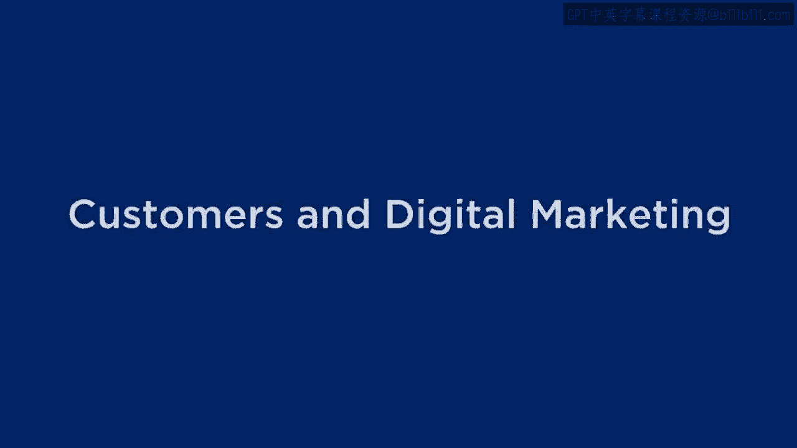

在本节课中，我们将深入探讨营销执行中的核心资产之一：客户资产。我们将学习在数字营销环境下，如何吸引、互动并保留客户，并理解客户终身价值与推荐价值的区别。

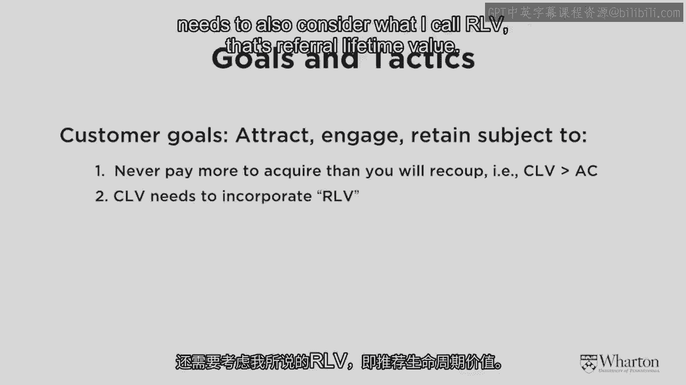

---

上一节我们讨论了品牌资产，本节中我们来看看客户资产。客户资产的核心目标，正如皮特所强调的，是吸引、互动并保留正确的客户。同时，需要认识到客户群体存在异质性，有些客户可能并不值得保留。

一个基本原则是：**获取客户的成本绝不能高于该客户能带来的预期回报**。用公式表示，即客户终身价值（CLV）必须大于客户获取成本（CAC）。

在数字营销环境中执行时，除了客户终身价值，还必须考虑**推荐终身价值（RLV）**。例如，一个客户自身消费不高，但如果他积极推荐朋友购买，其推荐价值可能非常高。

以下是关于推荐价值的一个具体案例研究：

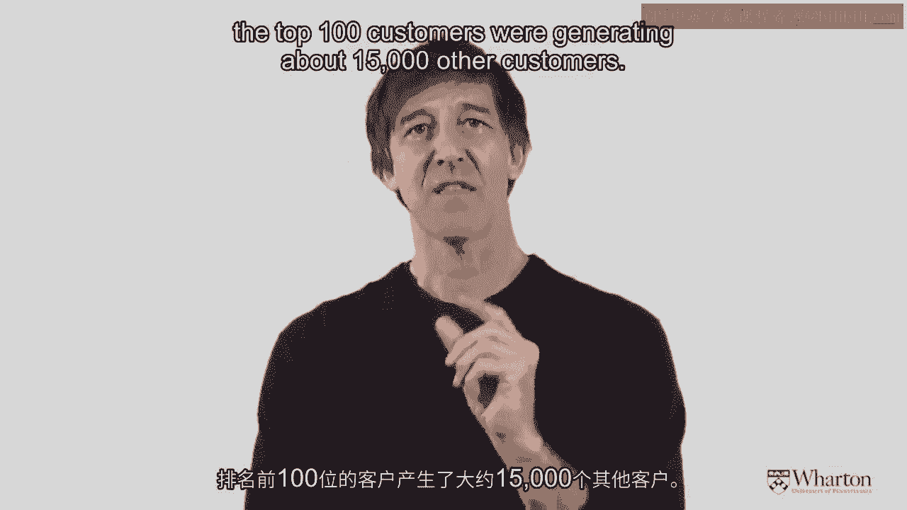

我们分析了Diapers.com的前10万名客户数据。当时，如果客户推荐朋友成功购买，推荐者可获得1美元信用。数据显示，约有8%的客户参与了这种基于客户的口碑推广。平均每位推荐者带来了约4位新客户。然而，互联网世界存在极端值：排名前100的推荐者，平均每人带来了约150位新客户。这凸显了鼓励现有客户推荐新客户的巨大潜力。

---

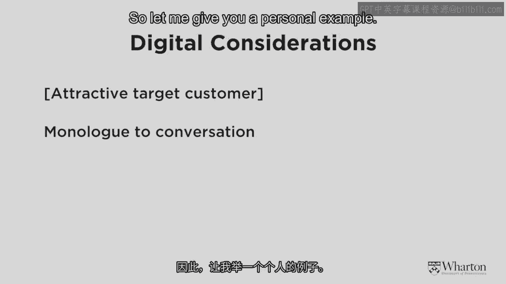

让我们总结一下数字时代的客户考量。

首要的、不可协商的原则依然是吸引正确的目标客户。然而，在数字环境下，出现了三个重要的细微差别：

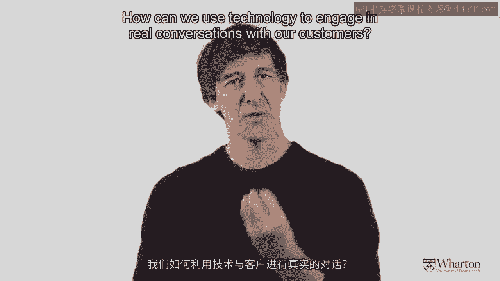

1.  **从独白到对话的互动转变**：与客户的互动从单向信息传递转变为双向对话。例如，当客户在社交媒体上提及品牌时，品牌可以实时回应并展开对话。
2.  **从现实世界到虚拟世界的活动放大**：可以利用技术将线下活动的影响力放大到线上。例如，一个在实体场所举办的品牌活动，可以通过社交媒体和新闻报道获得更广泛的传播。
3.  **利用长尾效应**：需要关注那些影响力远超平均水平的“极端”客户（如Diapers.com案例中的顶级推荐者），并思考如何利用技术识别并激励他们。

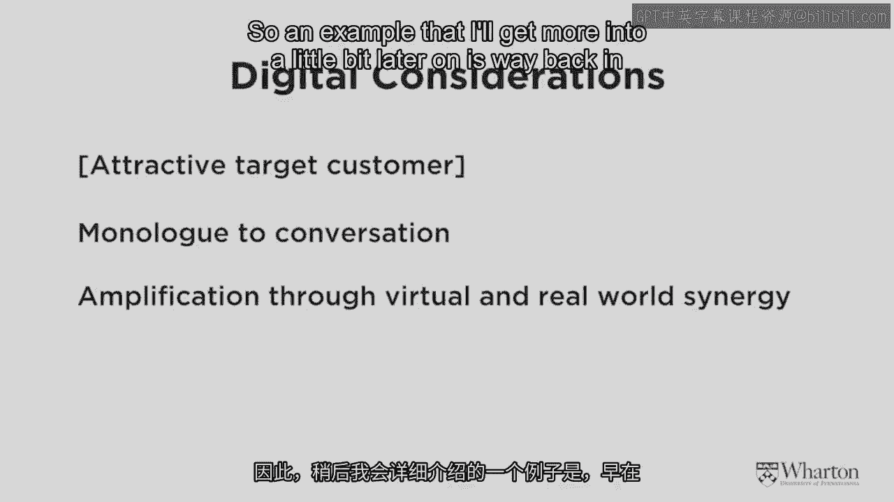

---

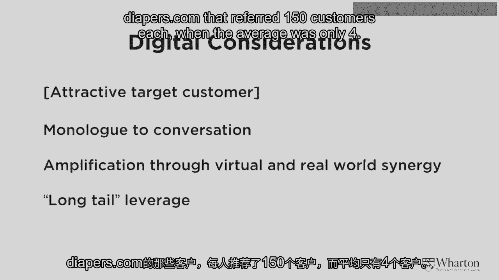

最后，我想区分两个对执行客户推荐和忠诚度计划非常重要的效应：**选择效应**和**处理效应**。

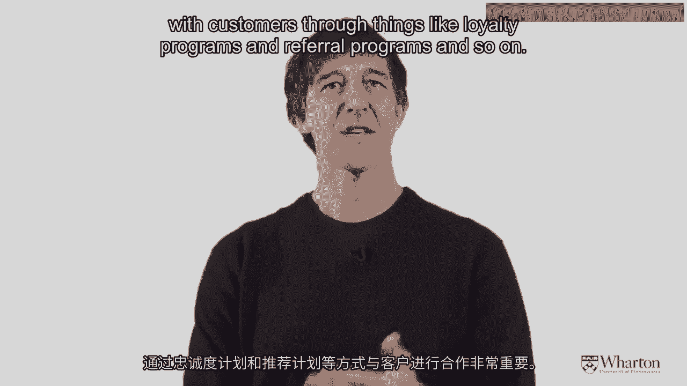

*   **选择效应**：指推荐者能够基于个人关系网络，更精准地识别出可能对产品或服务感兴趣的新客户。研究表明，通过口碑推荐获取的客户，其终身价值通常更高。
*   **处理效应**：指客户通过可信赖的朋友推荐（而非广告或搜索）了解到品牌后，他们自身也更有可能成为推荐者。数据显示，通过推荐获取的客户，其进行推荐的概率几乎是普通客户的两倍。

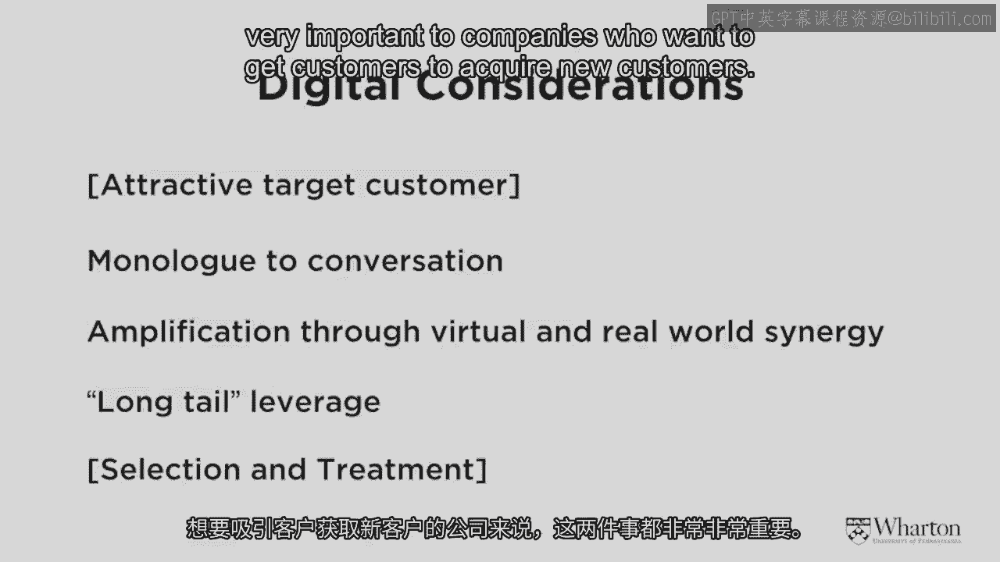

理解这两种效应对于设计有效的客户推荐计划至关重要。

---

现在，我们来总结营销执行的三大资产。第一是品牌资产，第二是客户资产，第三则是**营销支出本身也应被视为一种资产**。

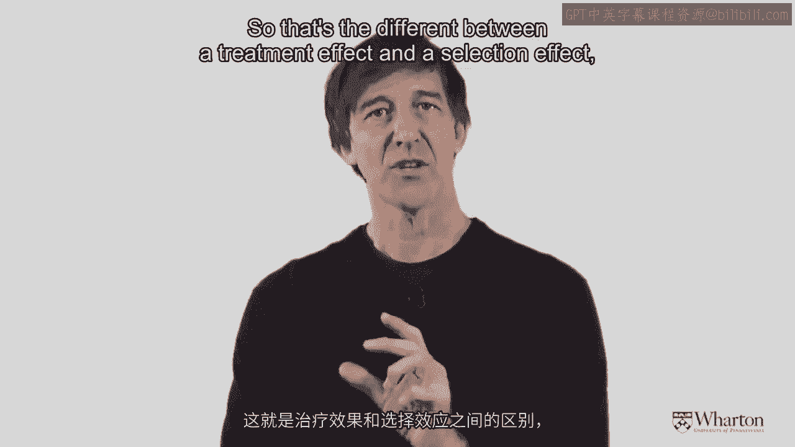

传统的简单看法是：销售额减去营销支出等于利润。然而，如果将营销支出降为零，利润并不会同比增加，因为营销支出本身对销售额和增长做出了贡献。我们将在后续课程中更详细地探讨这一点。

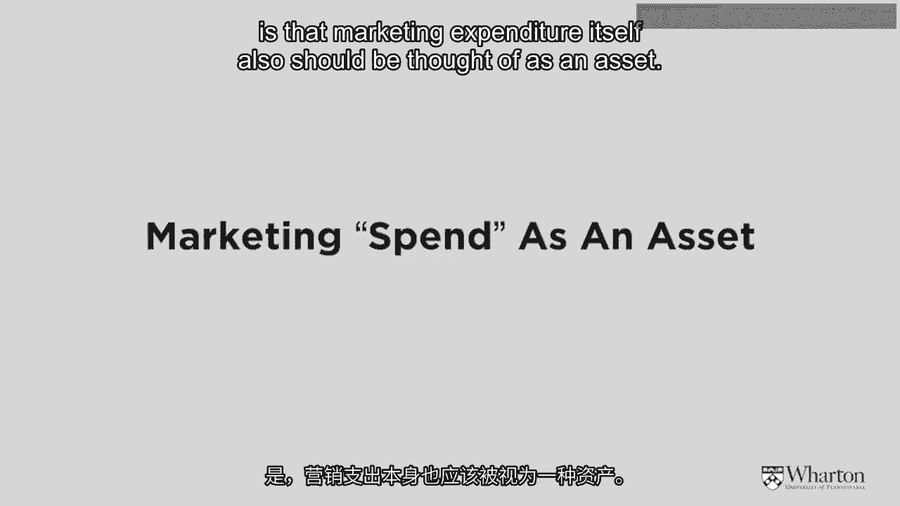

---

本节课的最后，我想给大家留一些思考练习，以巩固所学知识：

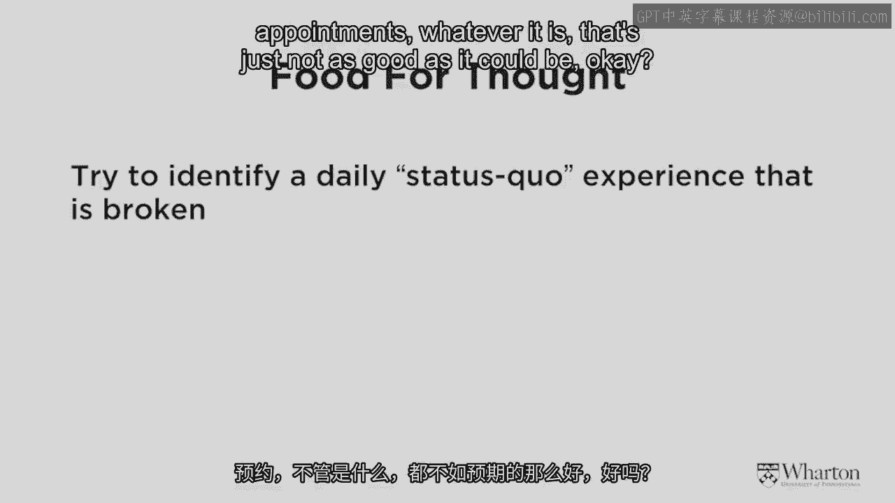

1.  **识别痛点**：请思考你在日常生活中遇到的任何不完美的体验（如购买咖啡、预订酒店、管理日程等）。尝试像霍华德·舒尔茨改造美国咖啡市场那样，构思一个解决方案。
2.  **分析案例**：请访问 WarbyParker.com 网站。结合芭芭拉关于品牌建设的观点以及我们今天关于数字时代品牌的讨论，尝试分析该网站在执行中如何体现品牌的**真实性、透明度和人性化**。

希望你能从这些练习中获得启发。我们将在后续课程中回顾这些例子。

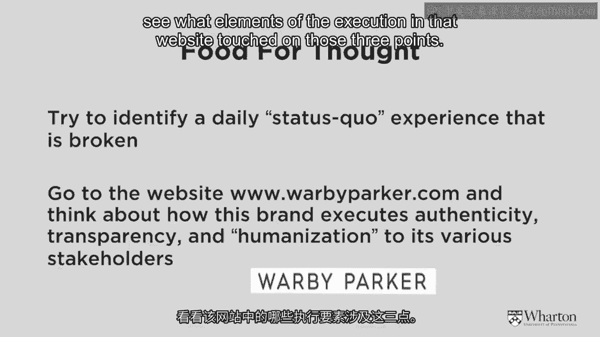

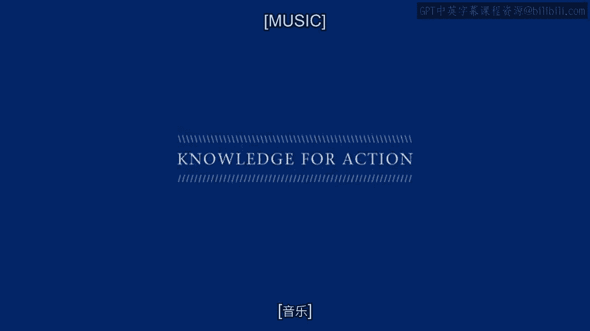

本节课中，我们一起学习了客户资产在数字时代的重要性，探讨了客户终身价值与推荐终身价值的区别，以及如何利用技术实现与客户的对话、放大活动影响力和利用长尾效应。我们还区分了选择效应和处理效应，并再次强调了营销支出作为资产的价值。