# 沃顿商学院《商务基础》课程｜第151讲：信誉与评论 📊

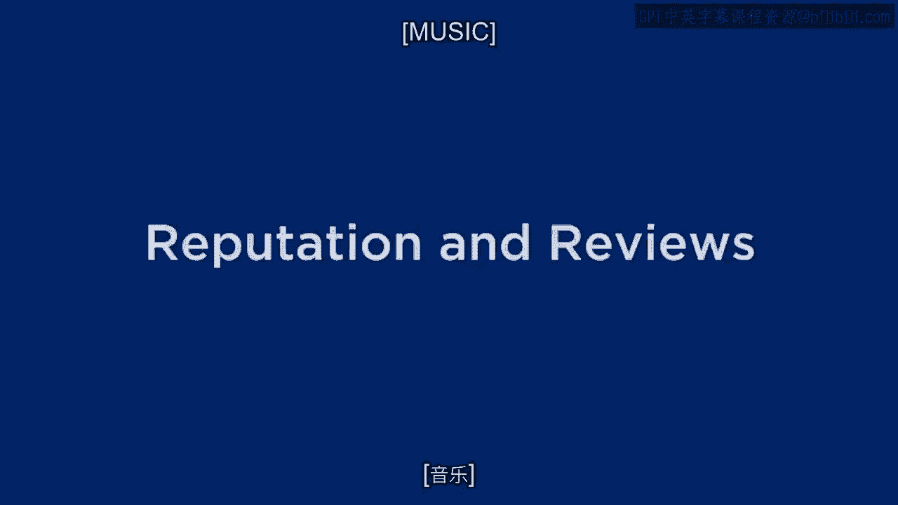

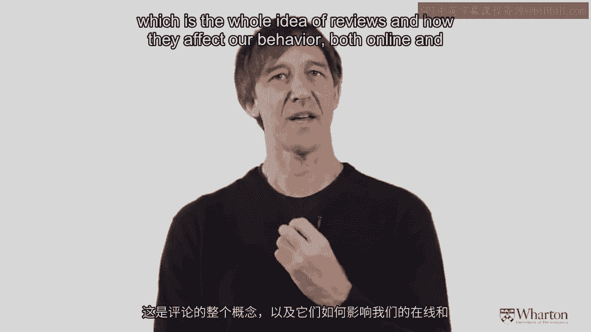

在本节课中，我们将要学习**信誉与评论**如何影响线上和线下的市场行为。评论信息是消除市场信息不对称的关键工具，它不仅能改变消费者的购买决策，也能激励商家提升产品与服务质量。我们将通过经济理论、实证研究和具体案例，深入探讨评论系统的运作机制及其重要性。

---

## 一、评论的重要性与影响

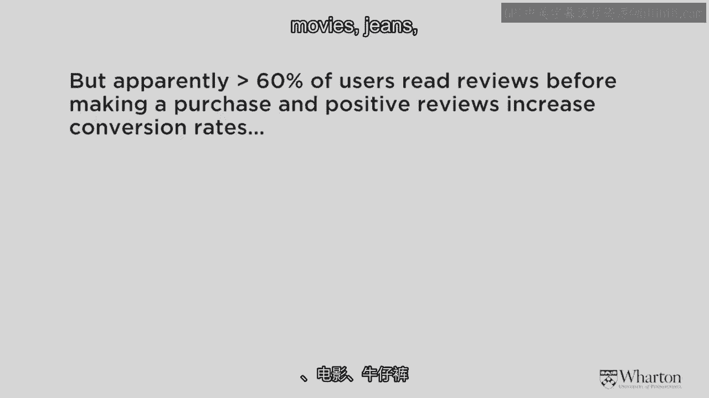

上一节我们介绍了课程概述，本节中我们来看看评论信息为何如此重要。

研究表明，在美国约有**60%**的消费者在做出购买决策前会阅读评论。这一比例在全球范围内可能更高。积极的评论——无论是针对书籍、餐厅、电影还是服装——都被证实能够显著影响人们的购买行为。

将评论信息引入市场，可以有效缓解我们之前讨论过的**信息不对称**问题。消费者通常无法直接了解餐厅、产品或电影的真实质量，而评论系统通过陌生人分享的体验，提供了宝贵的信息参考。

以下是两位名人对信誉的看法，它们同样适用于商业评论：

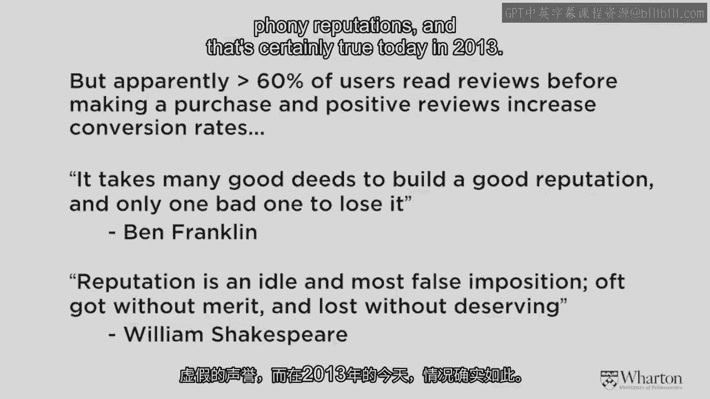

> 本杰明·富兰克林曾说：“建立信誉需要诸多善行，而毁掉它只需一件坏事。”
> 威廉·莎士比亚则更为犀利：“名誉乃是最无聊、最骗人的东西。它常常得来不费功夫，也常常名不副实。”

莎士比亚的观点提醒我们，有时人们可以建立虚假的信誉。这一点在当今的网络时代尤为突出，我们将在后续讨论中看到。

---

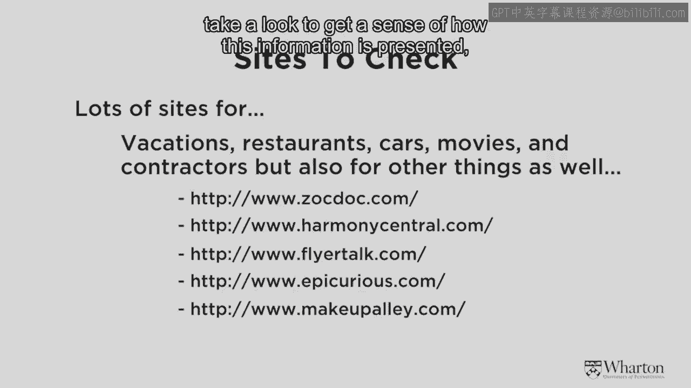

## 二、理论：信息如何改变市场行为

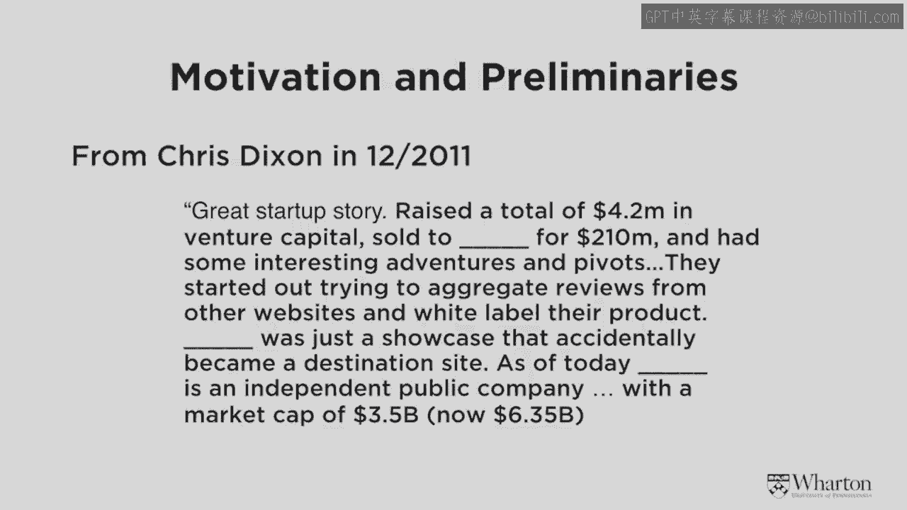

在了解了评论的普遍影响后，我们来看看支撑这些现象的经济理论。

经济理论认为，为消费者提供**更多信息**几乎总是有益的。更多的信息能照亮市场，让终端用户（即消费者）做出更优决策。此外，信息的引入不仅会改变**买家**的行为（选择向谁购买），也会改变**卖家**的行为（激励他们提供更优质的产品和服务）。

为了验证这一点，我们来看一项关于洛杉矶餐厅卫生评级的研究。

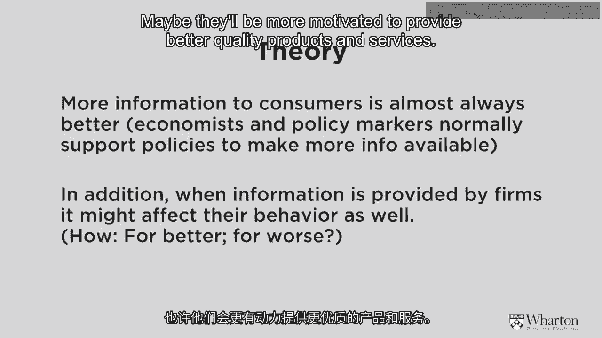

### 餐厅卫生评级研究

研究人员 Jin 和 Leslie 研究了洛杉矶餐厅在引入卫生评级制度后的市场变化。卫生检查员根据百分制评分，90分以上为**A级**，较低分数对应**B级**和**C级**，并将评级标识张贴在餐厅橱窗上。

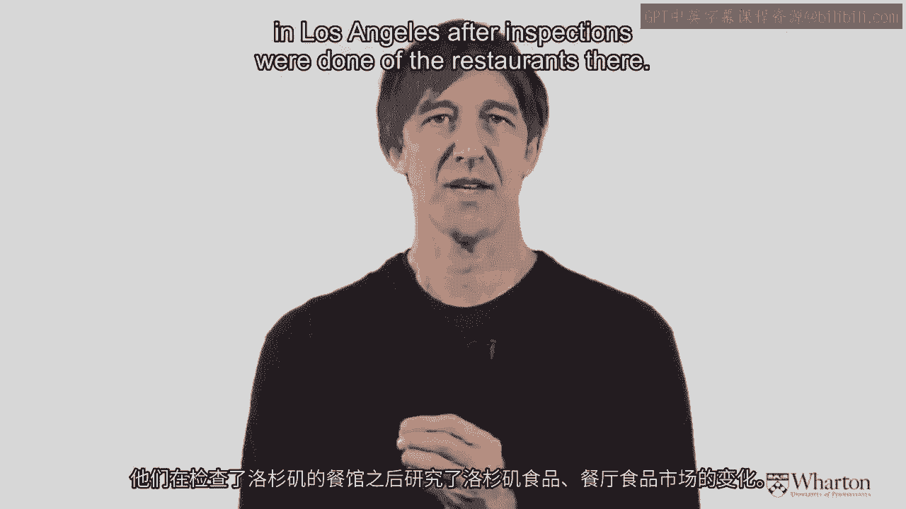

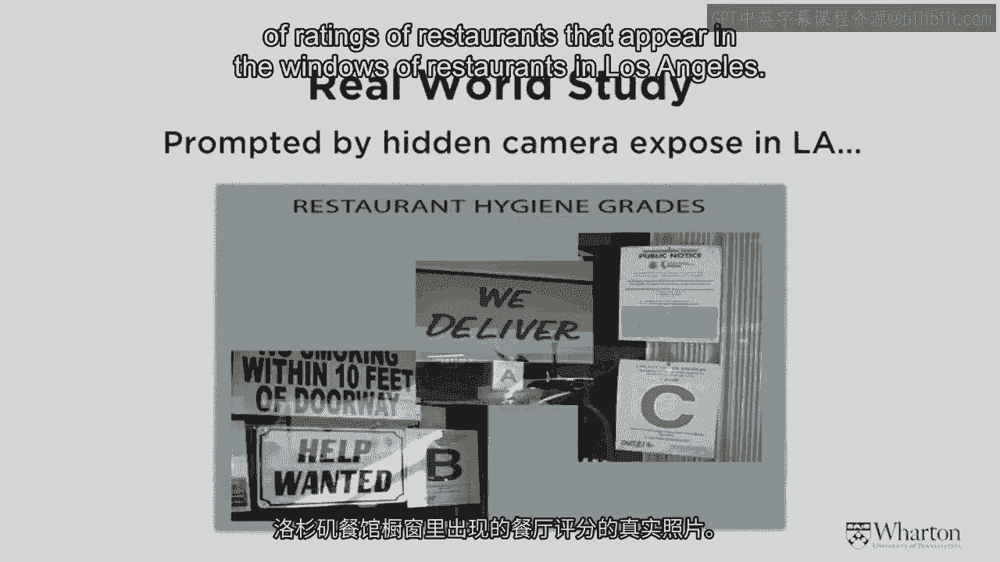

以下是他们的研究发现：

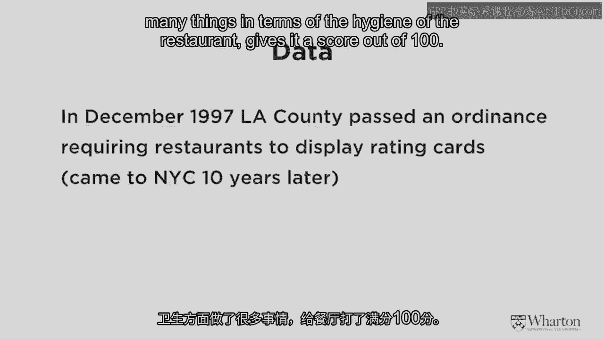

*   **对需求的影响**：获得A级的餐厅，客流量上升了约**5-6%**。获得B级的餐厅，客流量增长微乎其微（低于1%）。而获得C级的餐厅，客流量则出现下降。
*   **对供给的影响**：更引人深思的是信息对**供给方（餐厅）** 的影响。由于被评为A级能带来显著收益，餐厅有动力提升卫生和服务质量。研究人员通过观察因食物相关疾病入院的人数发现，在实施评级制度的地区，此类病例下降了约**13%**，而未实施该制度的加州其他地区，病例数却在上升。

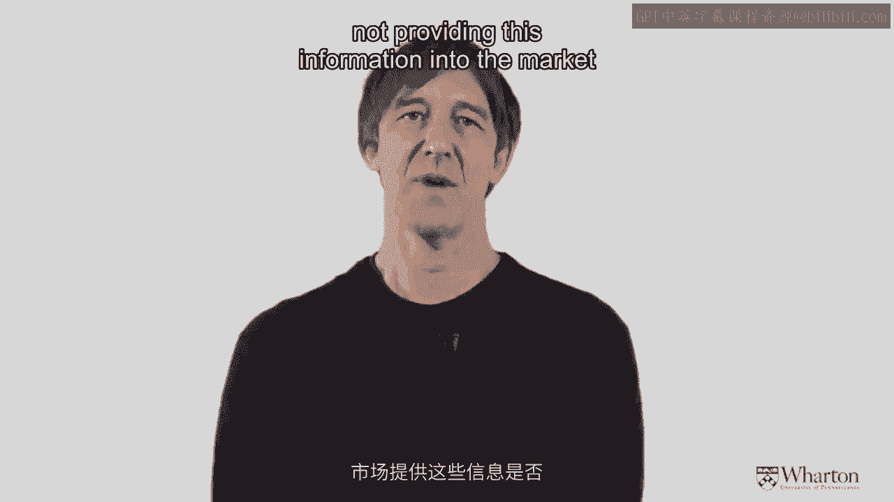

这项研究清晰地表明，客观、可验证的评论系统能够同时改变**买方和卖方**的行为。

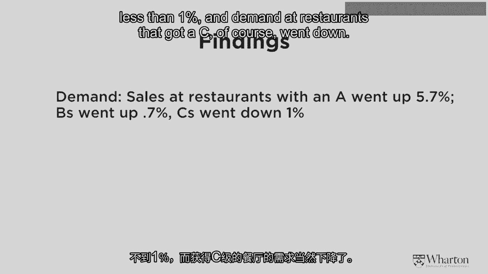

---

## 三、案例研究：在线评论的威力与挑战

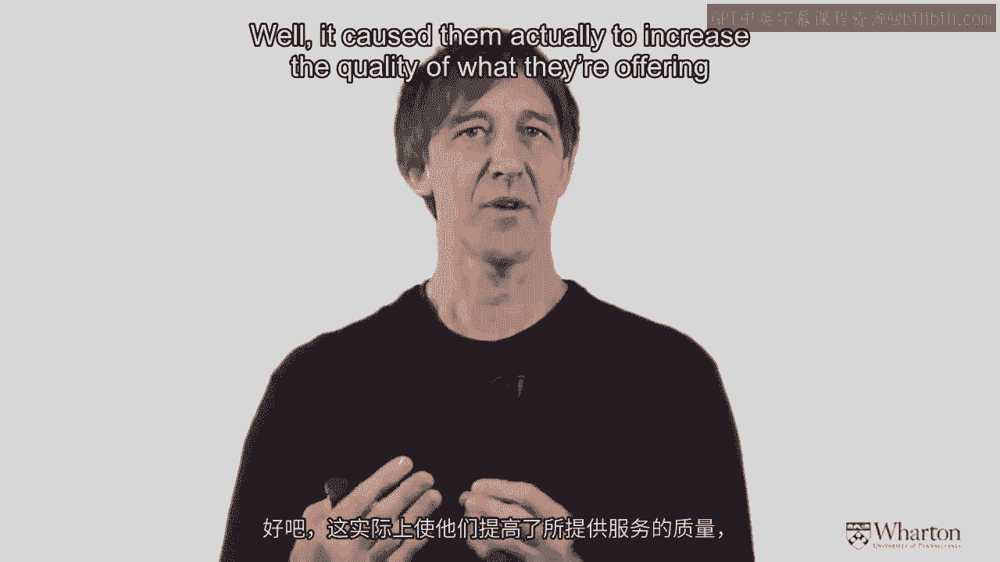

理论揭示了评论的潜力，但在实践中，尤其是在线评论，情况则更为复杂。本节我们将通过两个案例来探讨。

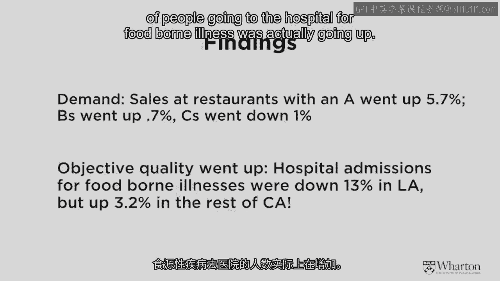

### 案例一：亚马逊 vs. 巴诺书店

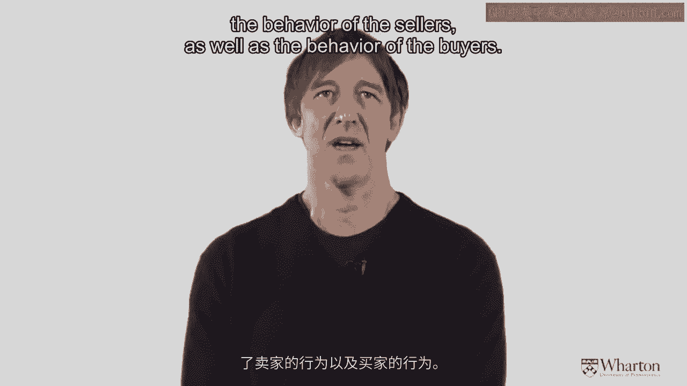

耶鲁大学的两位教授进行了一项研究，比较了亚马逊（Amazon.com）和巴诺书店（BarnesandNoble.com）上书评对销量的影响。

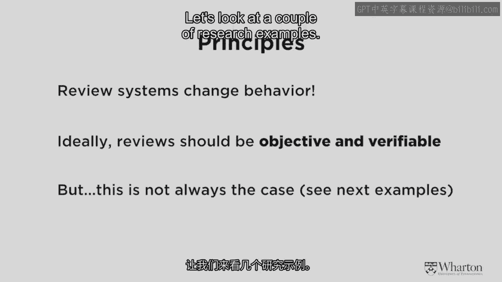

以下是该研究的一些关键发现：

*   在5星评分体系中，亚马逊上的平均评分约为**4.1星**，巴诺书店上的平均评分更高，约为**4.5星**。
*   1星差评在亚马逊上出现的概率约为**7%**，在巴诺书店上约为**3%**。
*   评论对销量有显著影响：**更多好评会提升销量，更多差评则会降低销量**。此外，差评的出现似乎还会减缓后续好评的增长速度。

这项研究证明了在线评论对销售的直接影响力。然而，这种影响力也催生了新的问题：商家可能试图操纵评论。

### 案例二：虚假评论的挑战

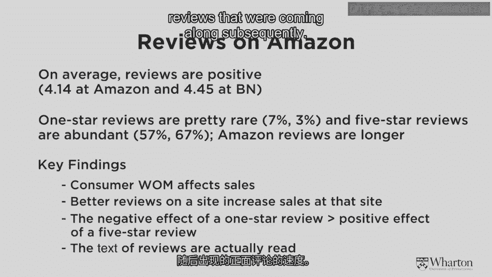

由于好评能带来商业利益，一些卖家开始撰写或购买虚假评论。例如，一位化名“Rutherford先生”的人提供有偿书评服务，每月收入高达**28,000美元**。这凸显了信息的力量以及卖家操纵信息的动机。

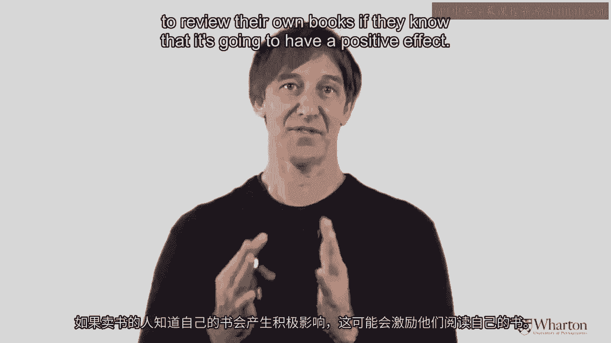

那么，如何应对虚假信息的问题呢？一种方法是利用数据挖掘技术分析评论文本，识别虚假评论。但语言中的讽刺、 nuance（细微差别）对计算机算法来说仍是巨大挑战。

---

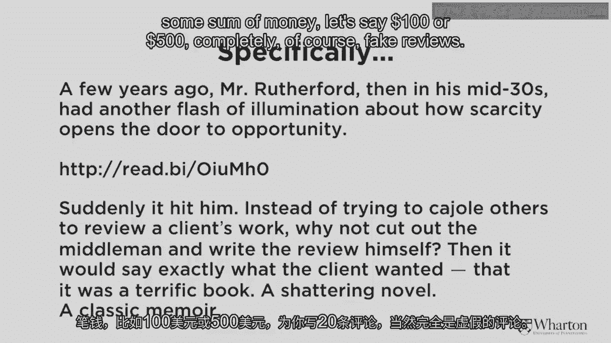

## 四、深入探究：评论的客观性比较

为了从另一个角度审视评论的客观性，南加州大学的教授 Deena Maislin 进行了一项巧妙的研究。她比较了同一家酒店在**TripAdvisor**和**Expedia**上的评分分布。

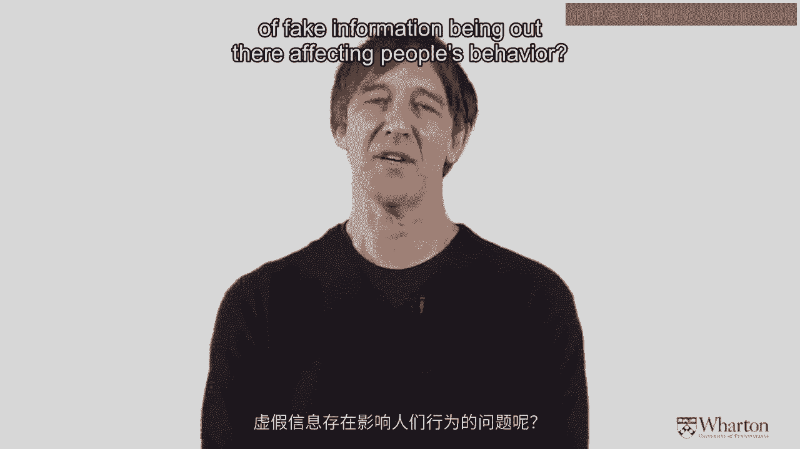

她的假设是：如果两个平台提供的是同样客观的信息，那么同一家酒店的评分**直方图**（即各星级评分的数量分布）应该大致相同。

然而，研究发现，对于某些酒店，TripAdvisor上的评分分布呈现出更多的**1星和5星极端评价**。进一步分析表明，这可能与竞争对手（尤其是独立运营的小型酒店）有关。这些竞争对手更有可能给同行打1星差评，同时给自己的酒店打5星好评。

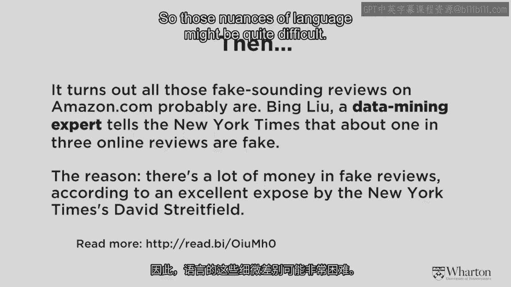

这项研究引出了一个关键结论：**理想的评论系统应确保评论的客观性与可验证性**。

那么，为什么Maislin教授认为Expedia的评论可能比TripAdvisor更客观呢？原因在于验证机制：

*   **Expedia**：要发表评论，用户必须在过去**6个月内**通过Expedia预订并实际入住该酒店。平台可以通过信用卡记录进行验证。
*   **TripAdvisor**：虽然也要求用户曾入住，但此要求**难以严格验证**。理论上，用户可以为自己从未入住过的酒店撰写评论。

这个区别对于评估在线评论的可信度至关重要。

---

## 五、总结与启示

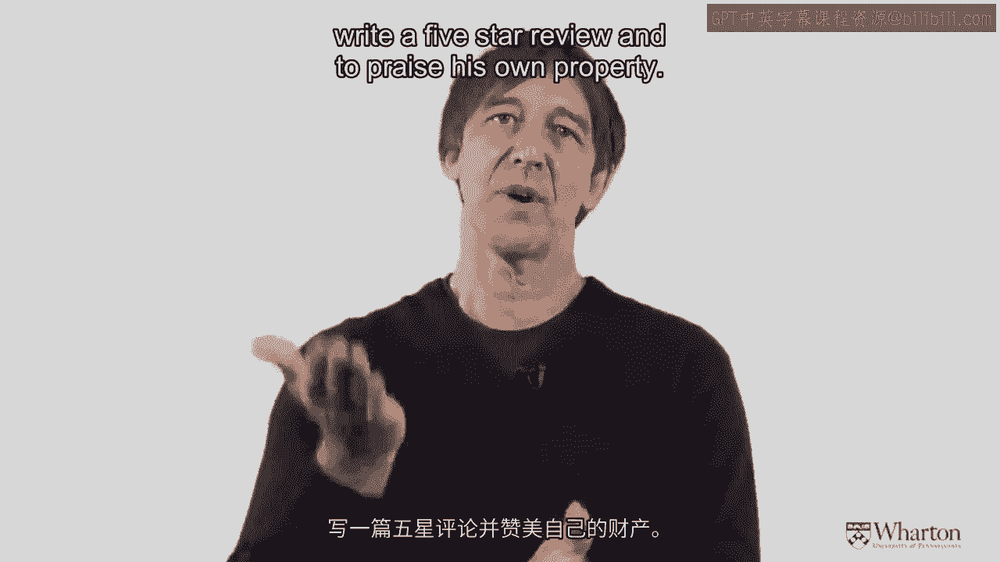

本节课中，我们一起学习了信誉与评论系统如何深刻影响市场。

我们首先了解了评论在消费者决策中的普遍重要性。接着，通过经济理论和洛杉矶餐厅的研究，我们看到了**客观、可验证的评论信息**如何同时提升市场需求（消费者选择更优）和市场供给（商家提升质量）。

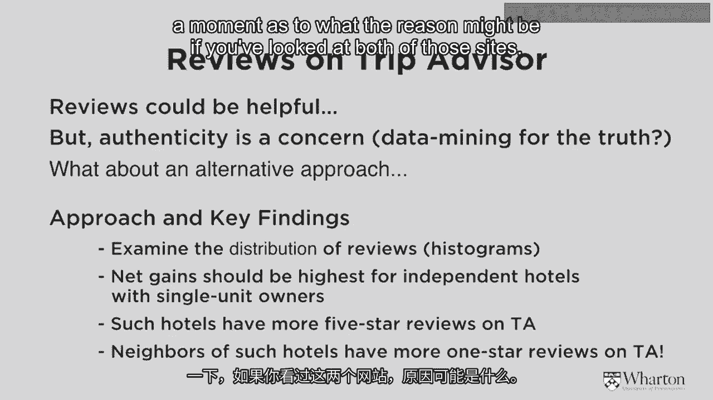

然后，我们探讨了在线评论的具体案例。书评研究证实了评论对销量的直接影响，但也揭示了**虚假评论**这一挑战。最后，通过比较TripAdvisor和Expedia，我们认识到**评论平台的验证机制**对于保障信息客观性至关重要。

对于有志创业的学习者，TripAdvisor从一个收集用户评论的初创公司成长为价值数十亿美元的上市公司，这个案例极具启发性。它表明，**构建一个能向市场引入高质量、可信信息的业务**，本身就可能创造巨大的价值。

**核心公式/概念回顾**：
*   **信息不对称**：买家与卖家之间的信息差异。
*   **评论影响**：`正面评论 → 提升销量`；`负面评论 → 降低销量`。
*   **验证机制**：`可验证的评论（如Expedia） > 难以验证的评论（如TripAdvisor）` 在客观性上可能更优。

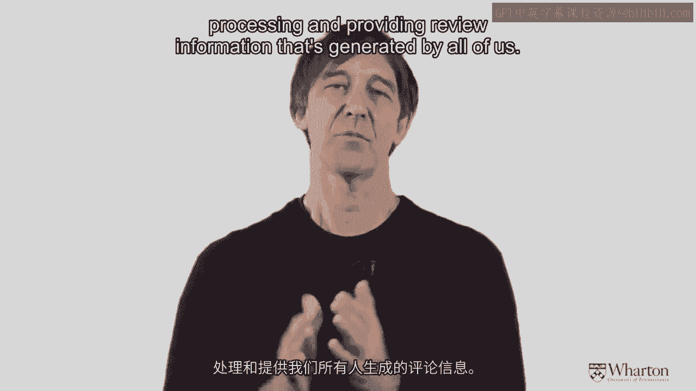

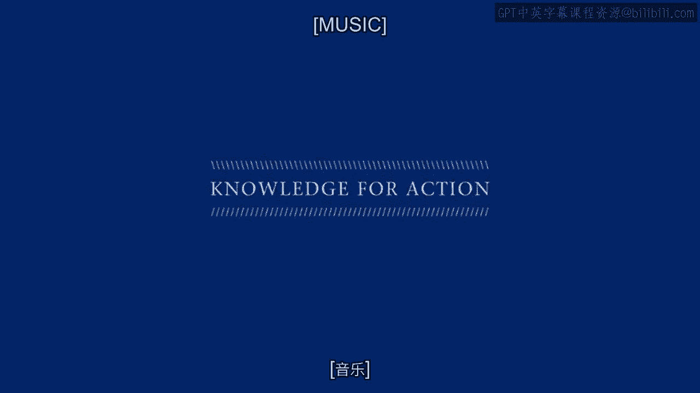

希望本讲能帮助你更理性地看待和使用各类评论，并在商业实践中思考如何建立更可信的信誉体系。