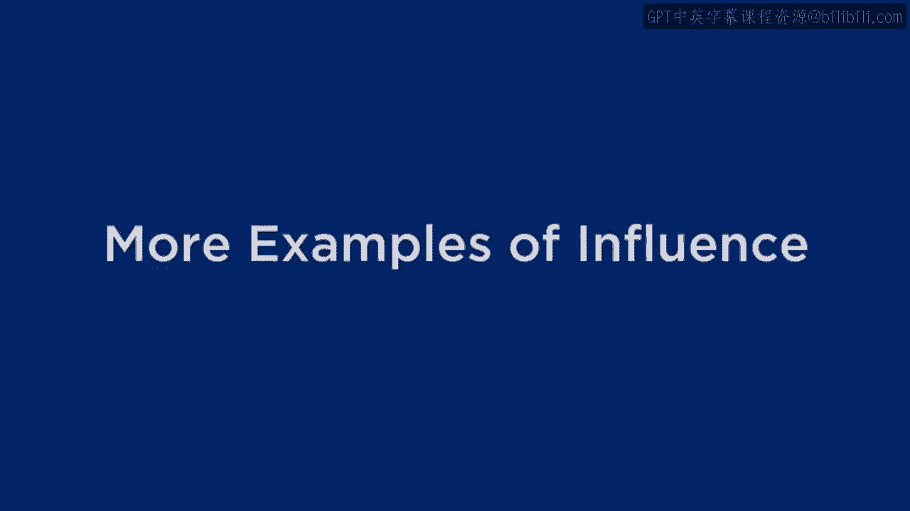
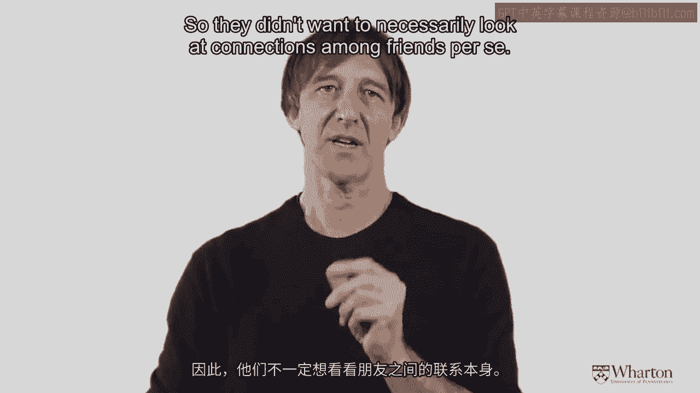
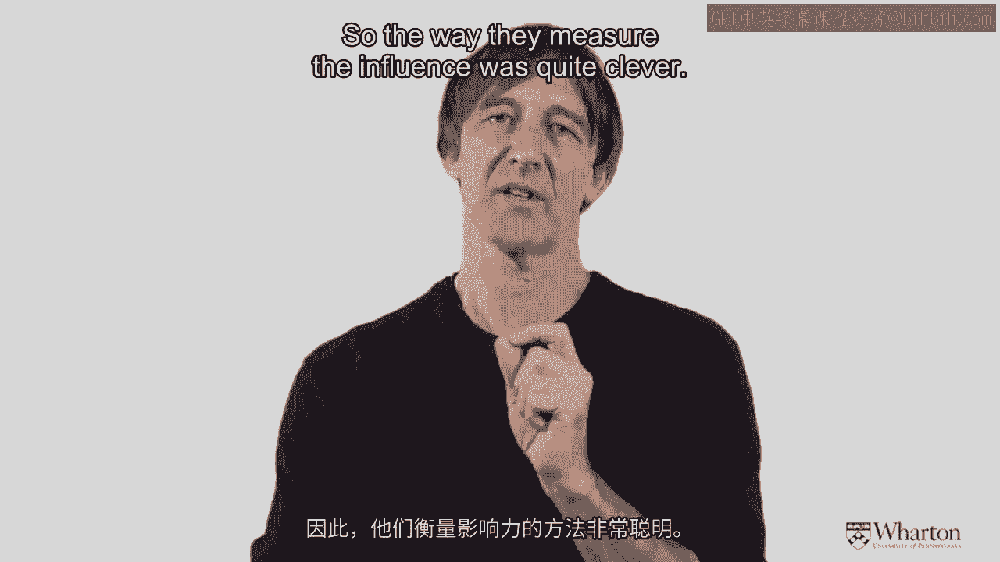
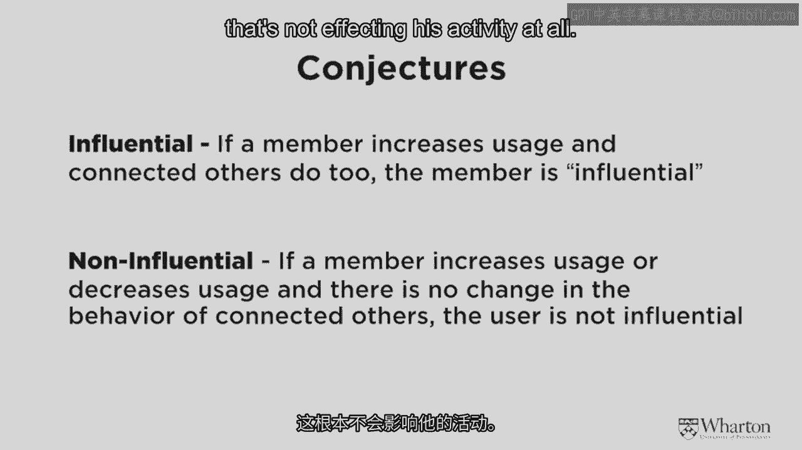
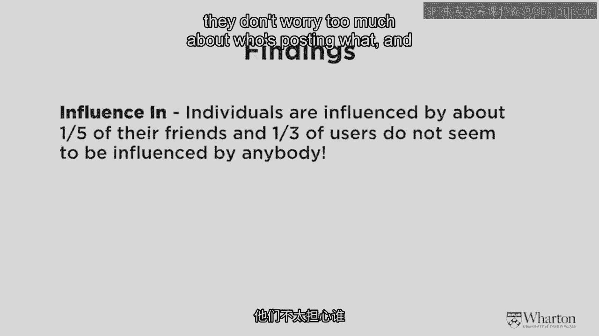
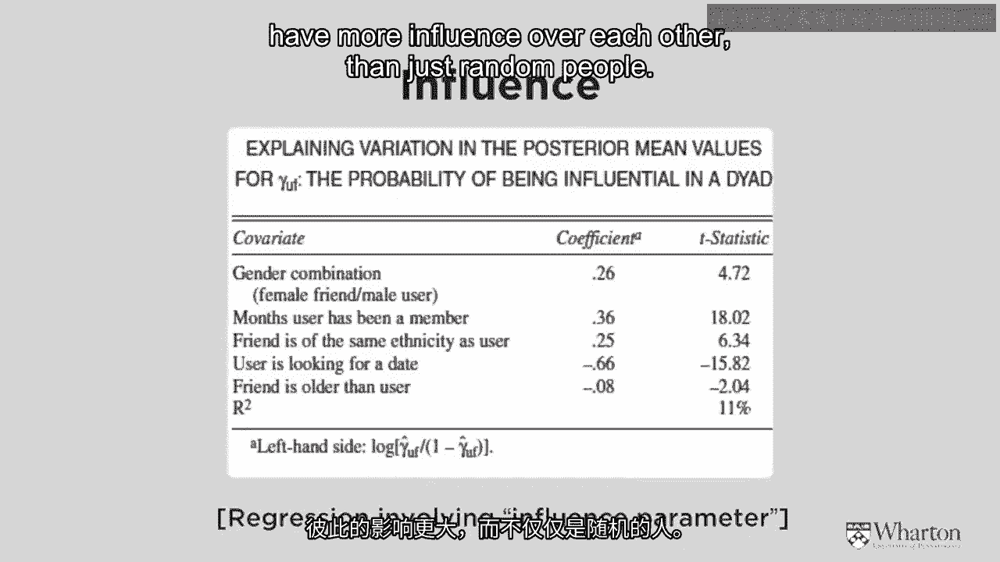
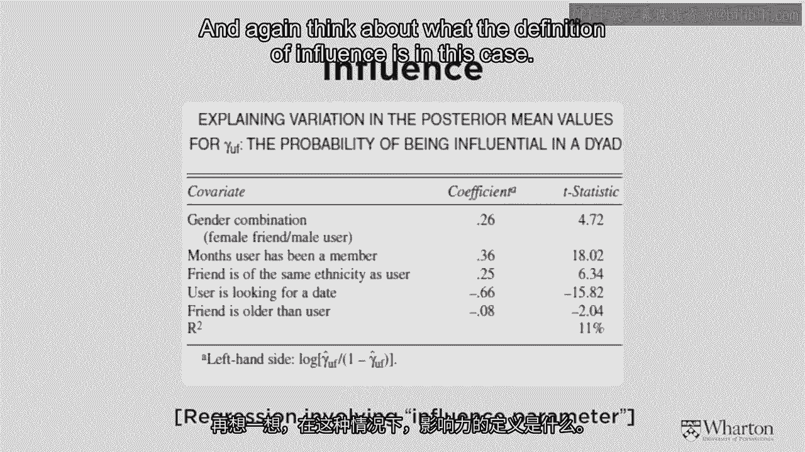
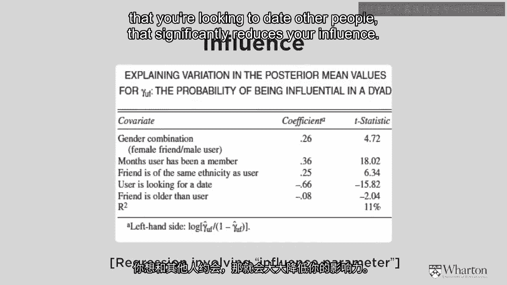
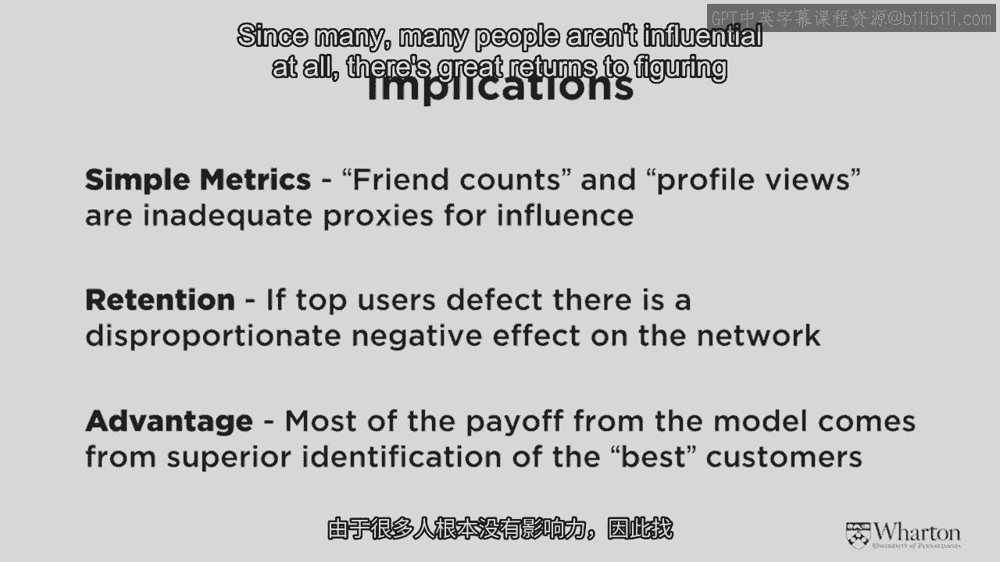
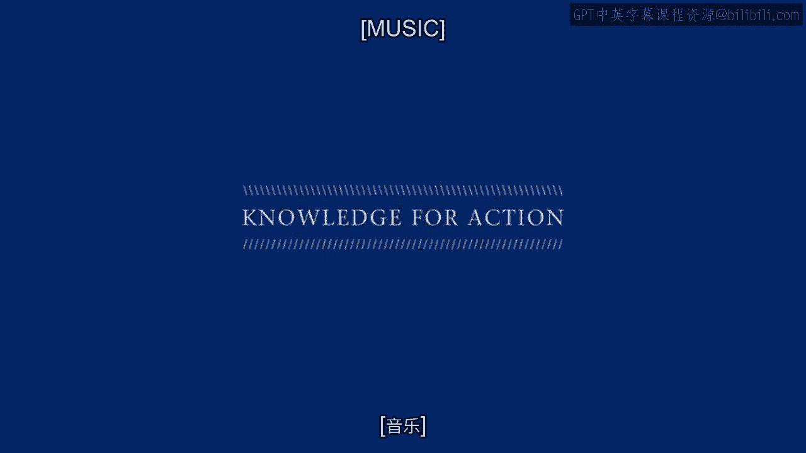

# 沃顿商学院《商务基础》课程 P153：社交媒体影响力研究案例 📊

在本节课中，我们将学习一项关于社交媒体上个体间影响力的研究。我们将探讨研究者如何定义和测量影响力，并分析影响社交媒体用户影响力的关键因素。

## 研究背景与挑战

上一节我们介绍了关于“领先用户”在邻里间传播的研究。本节中，我们来看看第二项研究，这项研究关注的不是邻里，而是社交网站中个体间的相互影响。

这项研究由加州大学洛杉矶分校和马里兰大学的学者共同完成。研究者们在尝试进行这项研究时，首先面临了几个挑战。

以下是研究者面临的主要挑战：

1.  **“朋友”关系的强度难以界定**：在社交网络中，“朋友”关系可能非常紧密，也可能非常薄弱。它可能是你从小一起长大的挚友，也可能只是在某个活动上交换了名片后，在Facebook上互加的联系人。
2.  **数据规模庞大**：这些社交网络数据库非常庞大，连接数量极多，因此研究者需要找到一种简单的统计方法来处理这些数据。
3.  **研究目标复杂**：该研究的目标是试图理解“谁对谁有影响力”。例如，如果克里斯和我在社交网站上建立了联系，是我影响他，还是他影响我？

## 研究方法：如何定义影响力

由于纯粹的“朋友”关系这一指标并不具备足够的诊断性，研究者们采用了一种巧妙的方法来测量影响力。

他们试图判断一个人在社交网络中的活动是否受到他人的影响。具体来说，就是看当某人开始发布内容后，其朋友是否会跟随并查看这些活动。

用公式化的语言来描述，即判断用户 **U** 的活动是否在朋友 **F** 活动之后发生显著变化。如果 **F** 的活动引发了 **U** 的后续行为，则认为 **F** 对 **U** 有影响力。

## 核心研究发现

那么，研究者们发现了什么呢？他们试图找出哪些人重要，哪些人不重要，以及社交网站中平均的影响力程度如何。

回想一下皮特在课程中提到的术语，他提得最多的可能就是“异质性”。在市场营销课程中，这是一个重要的流行词，它意味着人们是不同的，我们必须理解这些差异的程度。

研究者发现，影响力水平存在巨大的差异。

以下是关于影响力分布的关键数据：

*   **平均影响力范围**：研究发现，平均而言，你大约受到你Facebook或LinkedIn等社交网络中**20%**（即五分之一）的朋友的影响。其余约80%的朋友对你的行为没有太大影响。
*   **独立用户群体**：反过来看，研究发现社交网站中约有**三分之一**的人不受任何人影响。这些人特立独行，只做自己的事，不太关心别人发布了什么。

## 影响力差异的驱动因素

现在，让我们深入分析一下，看看影响力差异的程度以及社交网站中影响力的驱动因素。

屏幕上显示的是原文中的另一个图表，我将解释其中的关键结果。这些结果非常有趣，我认为它们不仅实用，也与我们的直觉相符。

以下是研究者发现的几个关键影响因素：

1.  **使用时长**：在社交网站上时间更长的人，平均比刚加入的人更有影响力。这是一个具有统计显著性的效应。
2.  **文化背景与种族**：来自相同种族或文化背景的人，平均而言彼此间的影响力大于随机配对的两个人。这部分原因可归因于“同质性”，即人们倾向于被与自己相似的人影响。
3.  **性别影响**：这一点尤其引人入胜。在四种可能的性别影响组合（男影响女、男影响男、女影响女、女影响男）中，只有一条路径具有统计显著性：**女性对男性有影响力，反之则不成立**。根据本研究的定义，这意味着当女性在社交网站上活动时，男性会关注并跟随，但反过来则不然。
4.  **个人呈现与话题**：最后一个发现与你的个人身份或使用时长无关，而是与你在网站上谈论的内容、发表的言论以及呈现自我的方式有关。这涉及到你的个人声誉。研究发现，如果你在社交网站上表明自己正在寻找约会对象，这会**显著降低**你的影响力。

## 研究启示与应用

那么，如果我们想在社交网络上做广告或运营社交网络，这项研究有什么启示呢？

以下是本研究带来的三点主要启示：

1.  **需要更精细的影响力测量方法**：简单地计算谁是谁的朋友，不足以理解影响力。因为“朋友”关系的强度差异太大。我们需要不同的方法来衡量社交网站上的影响力人物。
2.  **关键影响者的重要性**：作者通过模拟发现，如果将社交网站中最优秀（最具影响力）的人移除，会**急剧降低**该网络的价值。就像在现实世界中一样，存在一些对他人具有不成比例影响力的特殊人物，这一点非常重要。
3.  **精准定位的回报**：如果你想在社交网站上做广告，或利用社交网站推广你的产品或服务，**大部分回报**来自于识别出那些最优秀、最具影响力的人。由于许多人根本没有影响力，因此找出这个环境中最佳人选会带来巨大回报。

## 总结

本节课中，我们一起学习了一项关于社交媒体影响力的实证研究。我们了解了研究者如何通过追踪用户活动来定义影响力，并掌握了几个核心发现：平均每人受20%的朋友影响；约三分之一用户不受他人影响；影响力受到使用时长、文化背景、性别（尤其是女性对男性的影响）以及个人线上形象等因素的显著影响。最后，我们探讨了这些发现对社交媒体营销的启示，即需要超越简单的“朋友”计数，精准识别并利用关键影响者，以获得最大的传播效果和商业回报。