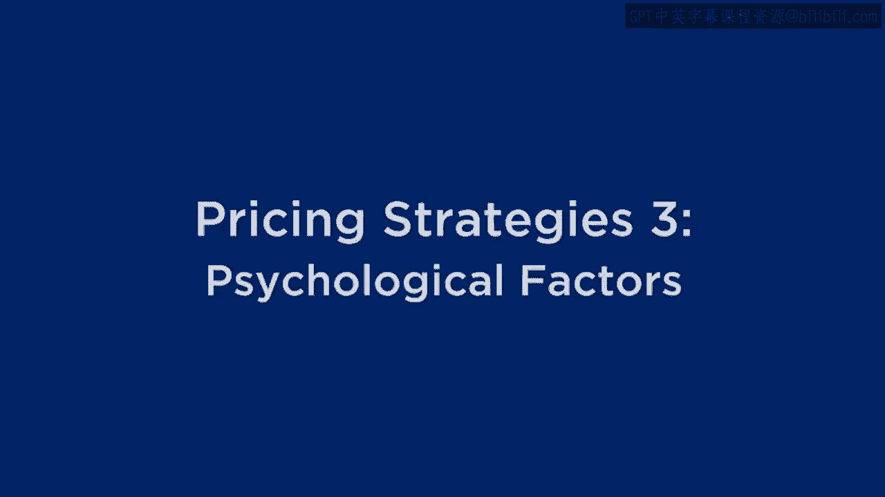
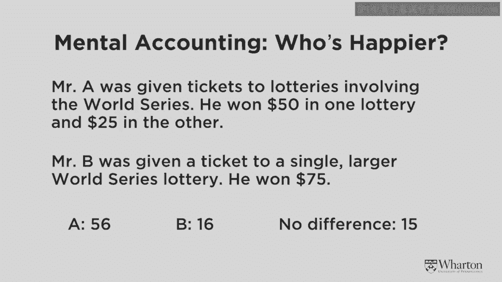
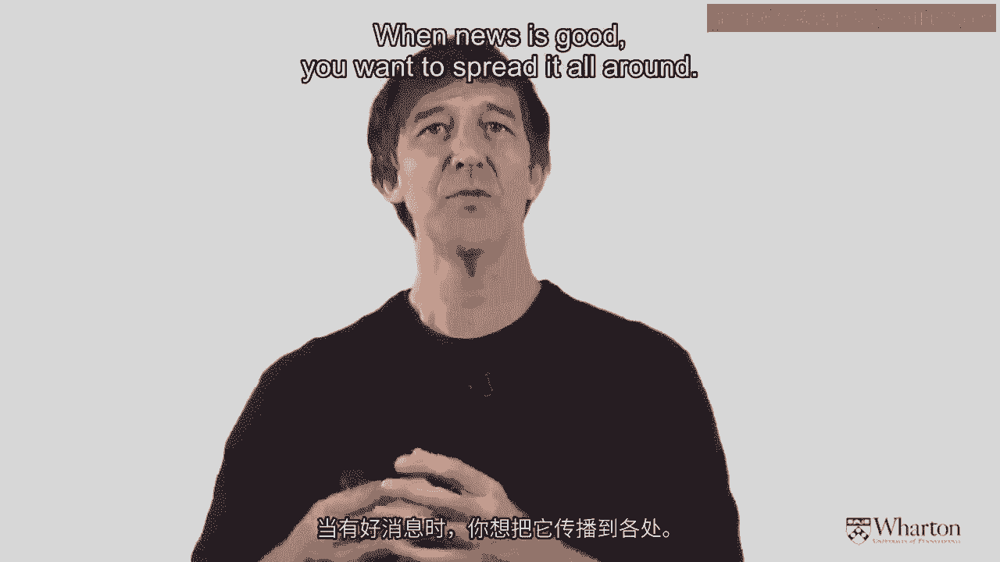
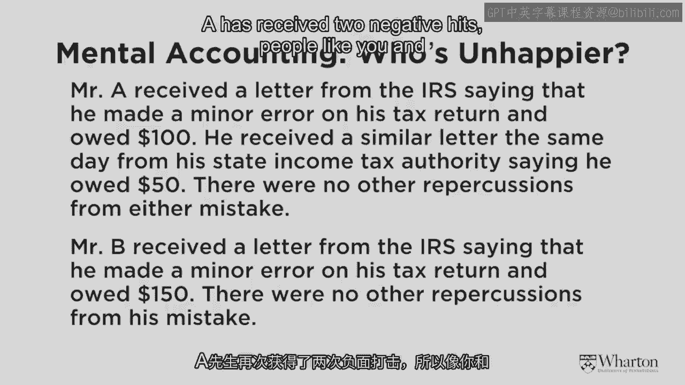
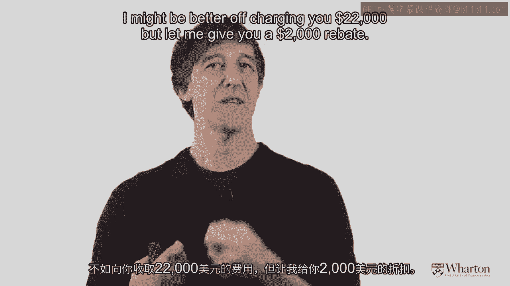
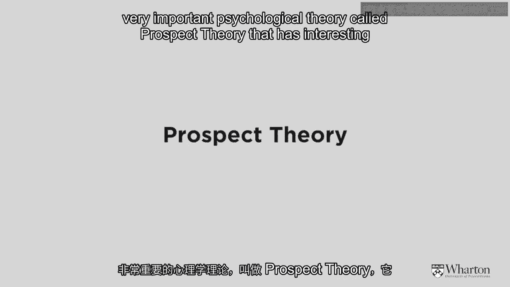
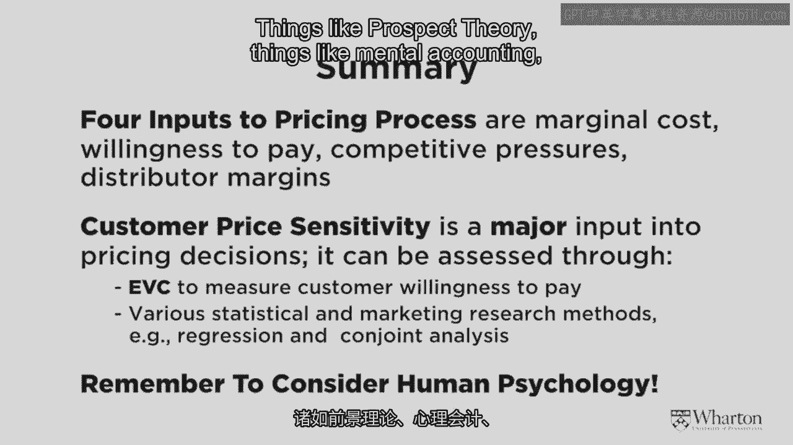
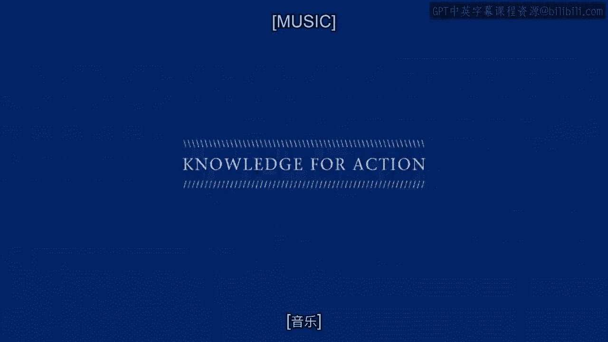

# 沃顿商学院《商务基础》课程｜第155讲：定价策略中的心理因素 🧠💰

在本节课中，我们将学习定价策略中一个至关重要的方面：心理因素。我们将探讨“心理账户”的概念，并介绍一个极具影响力的理论——前景理论。这些概念将帮助我们理解消费者如何感知价格变化，以及如何利用这些心理规律来制定更有效的定价策略。

---

## 心理账户：好消息与坏消息的呈现方式

上一节我们讨论了价格敏感性的测量，本节中我们来看看消费者的心理如何影响他们对价格的感知。首先，让我们引入“心理账户”这一概念，它在定价中非常有趣。

这个概念由芝加哥大学教授理查德·塞勒提出。他通过一个实验场景来说明这一点。

他描述道：“想象一个叫A先生的人，他刚刚赢了两张彩票。” 他运气不错，一张彩票价值50美元，另一张价值75美元。所以他总共赢得了价值125美元的两张独立彩票。另一位B先生也很幸运，他赢得了一张价值75美元的彩票。从纯粹的经济学角度来看，这两位先生的财富都增加了75美元。

如果我们认为人是完全理性的，那么这两位先生财富都增加了75美元，他们应该同样高兴。但当塞勒在实验中向普通人提出这个问题，询问“A先生和B先生，谁更高兴？”时，我们都认为A先生更高兴。

我们认为如此的原因是，当你得到好消息，比如意外之财时，最好将这些好消息分散开来。

试想，如果你要为你的配偶或家人购买圣诞礼物，你买了三件礼物。你会把它们都包在一个大盒子里，还是分开包装？至少在西方文化中，我们更倾向于分开包装。所以，当消息是好消息时，你希望将它们分散开来。

---

### 坏消息应整合

那么，如果是坏消息呢？在这个实验中，A先生收到了来自两个不同税务机构的两封不幸的信函。美国联邦政府说：“抱歉，A先生，你需要额外缴纳100美元的税款。”宾夕法尼亚州也发来一封信说：“先生，你需要缴纳50美元的税款。”所以这个可怜的家伙总共需要向税务机构支付150美元。而B先生也收到了一些坏消息，他需要缴纳150美元的税款，但只付给联邦政府。

同样，两个人都收到了相同的负面信息：他们都需要支付150美元。但因为A先生收到了两次负面打击，实验中的普通人认为A先生会更不高兴。这与之前的推论正好相反。当你收到坏消息时，你应该把它们整合在一起。好消息应该分开，坏消息应该合并。

这对定价意味着什么？想象一下，你的公司向客户收取很多不同的费用，可能是三、四项不同的费用。你可能最好将价格信息作为一个整体价格呈现，而不是逐项列出。回想金融危机，就有一个大规模的有趣例子。

你可能记得，美国联邦政府以大约7500亿美元的规模救助了各家银行。这是一个很大的负面信息，一个巨大的打击。但当人们看到500亿美元给了这家银行，1000亿美元给了那家银行时，他们变得特别恼火。逐项列出负面事项会产生不成比例的负面效应。所以，如果你有坏消息，你应该做的是将它们全部整合在一起。

---

### 混合消息与“一线希望”原则

那么，如果是好坏参半的消息呢？这对定价来说很有趣。再次想象我在沃顿商学院的朋友艾米。她喜欢骑自行车上学。为了讨论方便，假设费城发生了盗窃（尽管这很少发生），可怜的艾米的自行车被偷了。她需要花费180美元来更换它。

克里斯也有一辆自行车，一辆稍好一点的、价值200美元的自行车。他的自行车也被偷了。但克里斯在去亨茨曼大厅咖啡馆买午餐的路上，在地上发现了20美元。艾米损失了180美元。克里斯损失了200美元，但他找到了20美元，所以他净损失也是180美元。那么，谁更高兴呢？事实证明，克里斯实际上更高兴，这得益于所谓的“一线希望”原则。是的，他损失了200美元，但加上找到的20美元，这让他感觉好一些。

我们如何将其转化为定价策略？如果我想以20，000美元的价格卖给你一辆车，与其直接收取20，000美元，我可能更好的做法是收取22，000美元，但给你2，000美元的返利。我相信你能看出这个原则是如何运作的。

---

## 前景理论：理解消费者对得失的反应

现在，我将花几分钟介绍一个非常重要的心理学理论——前景理论，它对定价有有趣的启示。如果你对这个理论本身感兴趣，我鼓励你在谷歌上搜索更多信息。

前景理论由两位心理学家发展。第一位是丹尼尔·卡尼曼教授，他仍在普林斯顿大学任教，并在人类心理学和决策领域撰写了其他许多有影响力的著作。合著者是阿莫斯·特沃斯基教授，不幸已去世，他曾是斯坦福大学的教授。两人因这个想法获得了诺贝尔奖。所以这是一个相当好的理论。让我们看看它如何应用于定价。

在标准经济学中，你和我应该对具有相同期望值的结果持无所谓态度。这是什么意思？让我给你一个简单的例子。想象我的朋友艾米提出给我一张100美元的钞票。她说：“好吧大卫，你可以拿走这张100美元的钞票，或者你可以接受以下赌博。”这个赌博是：我将抛一枚公平的硬币。如果硬币正面朝上，我给你200美元。如果反面朝上，我什么都不给你。

如果我思考一下，确定得到100美元，那就是100美元。赌博的期望值也是100美元，因为0.5乘以200加上0.5乘以0，也等于100。所以从这两件事中我得到的期望收益是完全相同的。如果我是一个完全理性的、精于计算的人，那么我应该对这两个选项无所谓。但也许你有偏好。我肯定有偏好，我会选择确定得到100美元。

卡尼曼教授和特沃斯基教授发现，当选项以确定收益（例如收到钱）的形式呈现时，人们宁愿选择确定收益，而不是赌博，即使期望值相同。这与我们在传统经济学中学到的相反。

因此，他们发展了一个名为前景理论的新理论，该理论有三个非常重要的观点，是大多数其他标准理论所缺失的。

以下是该理论的三个核心要点：

1.  **参考点**：人们对像价格这样的刺激有一个内在的参考点，他们基于此产生期望。
2.  **损失厌恶**：人们对偏离参考点的反应不同，无论是正向偏离（收益）还是负向偏离（损失）。通常，对损失的厌恶感强于对同等规模收益的喜悦感。
3.  **敏感性递减**：随着收益或损失的规模增大，其带来的心理影响增量会减小。

让我举一个它在定价中如何运作的例子。想象我去当地的星巴克买一杯咖啡，我期望支付1美元。这是我的内在参考点。当我到达那里时，咖啡售价75美分。所以我刚刚遇到了一个收益，或者说从参考点的一个正向偏离。支付75美分比支付1美元要好。因此，由于这个75美分的收益（在横轴上），我的幸福感增加了一定的量。我为这75美分的收益感到高兴。

但因为这次交易发生了什么？我的参考点现在已经从1美元转移到了75美分。它受到了我刚经历的事情的影响。

然后我第二天又去星巴克，期望支付75美分。但看啊，价格涨到了1美元。那么现在，从我75美分的参考点来看，我遇到了25美分的损失。这个损失的规模与之前的收益相同。但这个损失让我感到非常、非常不高兴。

这里有一个叫做“损失厌恶”的现象：对于相同规模的偏离，比如两个方向都是25美分，损失带来的痛苦可能是收益带来的快乐的两倍。同样，我让你自己去更详细地了解这一点。

但这个观点是，如果你过于频繁地促销你的产品，然后试图将价格调回常规价格，你已经将某人的参考点降低了。然后当你将价格调回常规价格时，你是在给他们制造一种损失感，他们会对此产生负面反应。这是这个理论的一个重要启示。

---

## 课程总结

本节课中我们一起学习了定价策略中的心理因素。让我总结一下我们在“基于价值的定价”这个模块中所学的内容。

首先，最重要的是要记住定价过程的输入框架。以下是决定价格的四个关键因素：

1.  **边际成本**：这是定价的底线，价格不应低于此。
2.  **顾客支付意愿**：由价格敏感性决定，这是定价的天花板。
3.  **竞争压力导致的降价幅度**。
4.  **为分销商或合作伙伴留出的利润空间**所导致的最终价格上浮幅度。

其次，我们花了大量时间讨论顾客价格敏感性的概念及其测量方法。

最后，如果不考虑所有起作用的人类心理因素，定价就不会如此有趣、复杂和精细。这些因素包括前景理论、心理账户、禀赋效应等等。理解这些心理规律，是制定成功定价策略的关键。