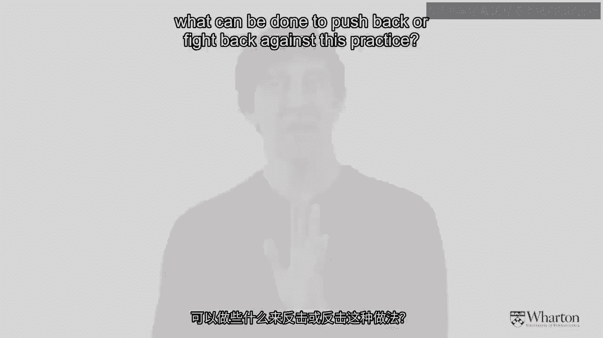
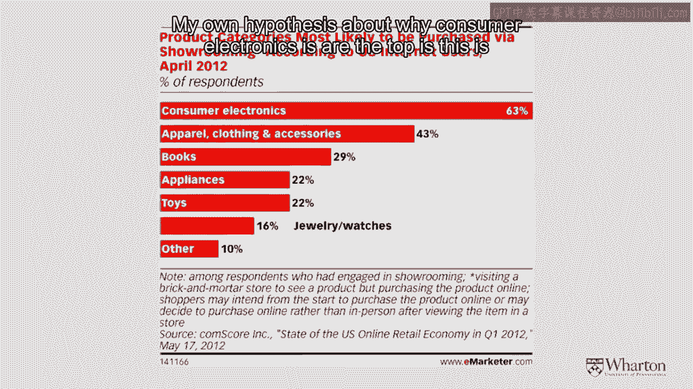
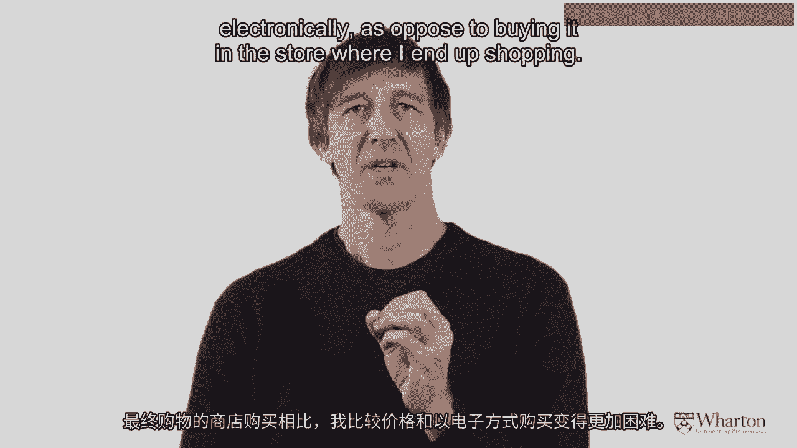
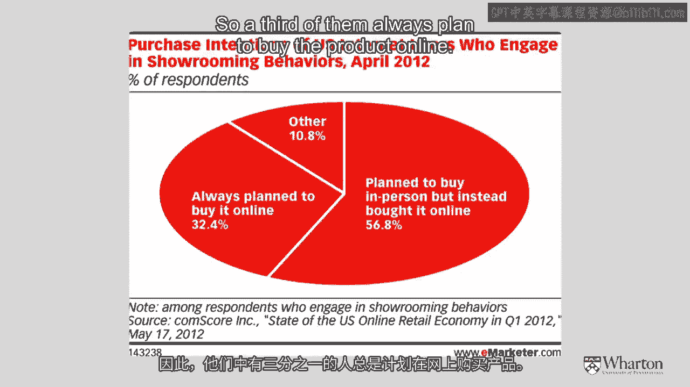
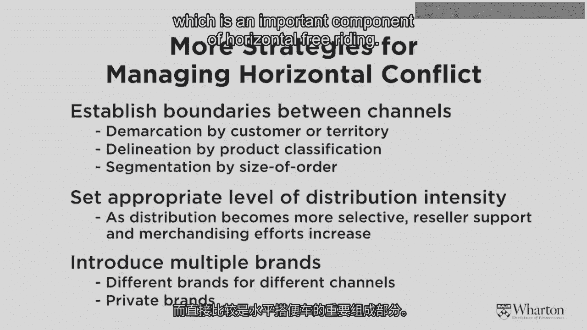
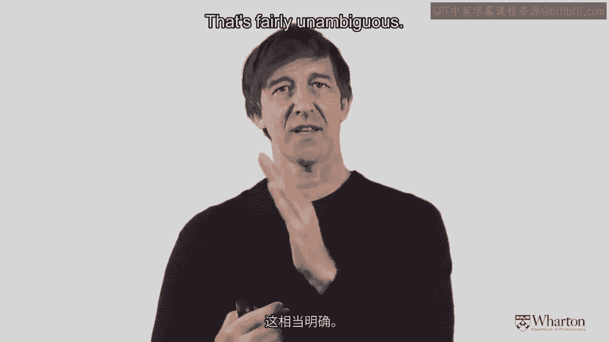
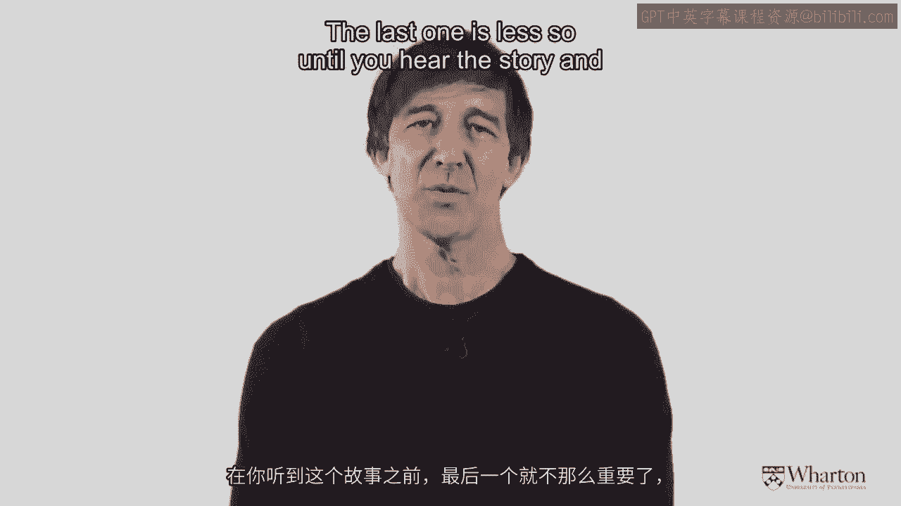
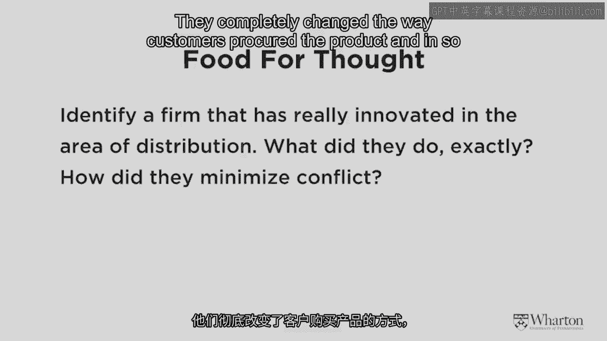

# 沃顿商学院《商务基础》课程 P158：渠道冲突与展厅现象 📊

在本节课中，我们将深入探讨渠道管理中的一个核心挑战：水平搭便车行为，特别是其极端形式——“展厅现象”。我们将分析其成因、影响，并学习制造商和零售商如何应对这一挑战。

---

## 深入理解“展厅现象” 🛋️

上一节我们介绍了水平搭便车行为，本节中我们来看看其一种极端形式——展厅现象。展厅现象是指消费者在实体店体验、获取产品信息后，转而到线上或其他渠道以更低价格购买的行为。

技术的发展，尤其是移动互联网技术，极大地助长了这一现象。数据显示，在2011年及之后，越来越多的消费者会在店内购物时使用移动设备查询更优价格。

---

## 展厅现象的数据洞察 📈

以下是关于展厅现象行为模式的一些关键数据：

*   部分进行展厅行为的消费者最终仍会从当前所在实体店的网站购买。
*   然而，约25%的此类消费者会转向亚马逊或其他竞争对手处购买。

这对传统零售商构成了挑战，因此，全渠道零售战略变得至关重要，即同时覆盖实体和虚拟世界以触达客户。

---

## 易受展厅现象影响的品类 📱

不同产品类别受展厅现象的影响程度不同。以下是易受影响的主要品类：

1.  **消费电子产品**：位居榜首。消费者在购买前通常希望充分了解信息，可能依赖店员讲解。但由于此类商品价格较高，消费者在实体店确定心仪产品后，很可能转向线上以更低价购买。
2.  **服装服饰**：受影响程度次之。
3.  其他品类影响相对较小。

---

## 制造商的反制策略 ⚙️

制造商如何对抗展厅现象？一个常见策略是**产品型号差异化**。例如，索尼等大制造商可能会为不同零售商供应型号名称略有不同的同一款电视。这使得消费者难以直接进行价格比较，从而降低了转向线上购买的动力。

公式表示：`为零售商A生产的产品型号 != 为零售商B生产的产品型号`

---

## 零售商的机会：从BOPS到ROPO 🛒

对于实体零售商而言，对抗展厅现象也并非没有机会。数据显示，约三分之一的展厅行为者是坚定的“搭便车者”，他们计划始终在线购买。但超过60%的人原本计划在店内购买，是某些原因导致他们最终转向线上。

这揭示了巨大的机会。我的同事托尼·莫雷诺和圣地亚哥·加拉诺研究了“线上下单，店内提货”（BOPS）模式。他们发现，在引入BOPS后：

*   网站销售额**下降**了。
*   但实体店销售额**上升**了。

原因在于，该零售商主要销售家居用品（如床单、咖啡机），这些商品需要消费者亲自触摸、感受才能做出购买决定。消费者利用网站确认商品库存和价格后，反而更倾向于到店亲自购买。因此，这个过程被称为 **“线上研究，线下购买”（ROPO）**。

这启示我们，理解消费者需求（先获取信息，再触摸体验），并通过全渠道策略满足他们，是应对展厅现象的有效方法。

---

## 应对水平搭便车的三大策略 🛡️

现在，让我们总结一下应对克里斯（高服务高价格）和艾米（低价格）之间水平搭便车问题的三大策略：

以下是三种可以实施的核心策略：

1.  **产品线区隔**：确保不同区域或零售商销售不同的产品，避免直接竞争。`分配给克里斯的产品线 ∩ 分配给艾米的产品线 = ∅`
2.  **调整分销密度**：如果水平搭便车严重，可以考虑降低分销强度，采用更独家或选择性的分销，让本地零售商拥有一定的区域垄断权。
3.  **采用不同品牌**：为不同零售商引入不同品牌或型号名称，使产品难以直接比较。`品牌_克里斯 != 品牌_艾米`

---

## 渠道冲突的三个经验法则 📝

最后，我们来总结本模块关于渠道冲突的核心发现。学术研究指出了影响分销渠道冲突水平的三个关键因素：

1.  **渠道长度**：渠道层级越多，冲突潜力越大。原因在于“双重边际化”，即每增加一个中间商，就增加一层加价。`冲突潜力 ∝ 渠道层级数`
2.  **渠道成员自主性**：从完全自营，到特许经营，再到完全独立的代理商，成员越独立，冲突往往越多。`冲突水平：独立代理商 > 特许经营者 > 公司直营`
3.  **渠道密度**：冲突水平与密度的关系呈倒U型曲线。
    *   当一个区域只有一家独家门店时，冲突较低。
    *   当有两家竞争者时，冲突上升。
    *   但当竞争者数量非常多时，冲突反而可能下降。因为市场份额下降时，很难归因于具体哪个竞争对手，这反而降低了直接对抗的动机。

---

## 思考任务 💡

在学习了渠道设计、冲突管理等内容后，请尝试思考以下问题，以融会贯通：

请思考一个在分销领域进行了重大创新的公司案例。例如：
*   它接管了某些现有职能。
*   它消除了某些环节。
*   它将实体商品转化为数字商品（软商品）。
*   它彻底改变了顾客获取产品的方式。

通过这样的创新，该公司建立了超越竞争对手的优势。在当今超过十亿人随身携带智能手机的时代，围绕产品与服务分销和获取方式的创新，将是未来市场创新的重要领域。

---

本节课中，我们一起学习了展厅现象的成因与影响，探讨了制造商和零售商应对水平搭便车行为的策略，并总结了影响渠道冲突的三个关键因素。理解这些原理，有助于我们更好地设计和管理高效、和谐的分销渠道。