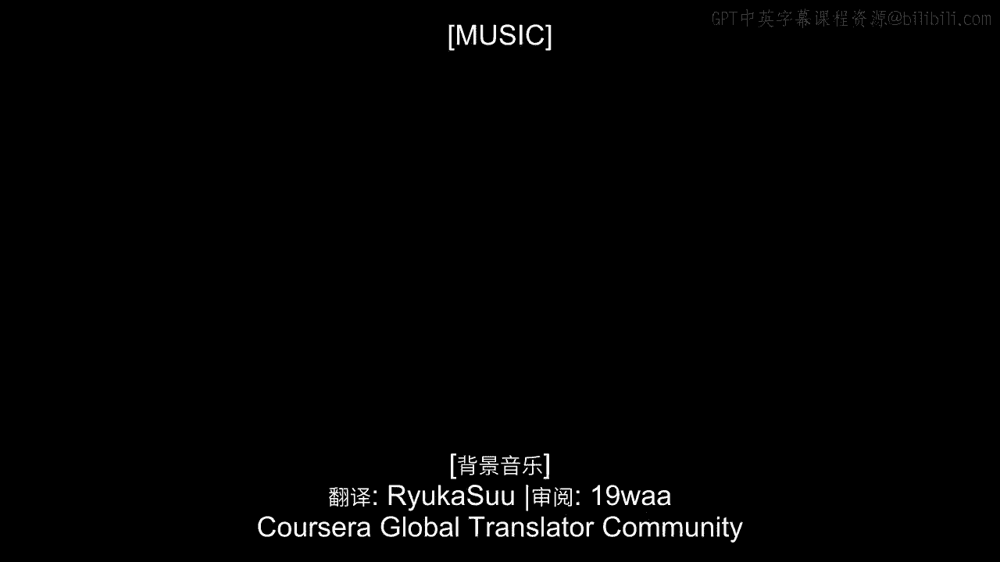
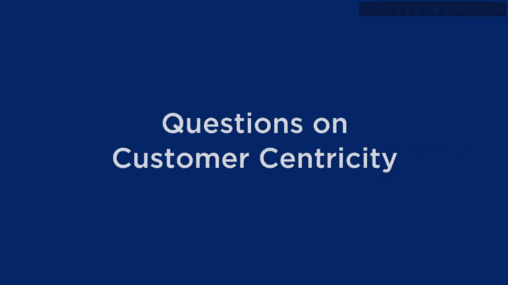
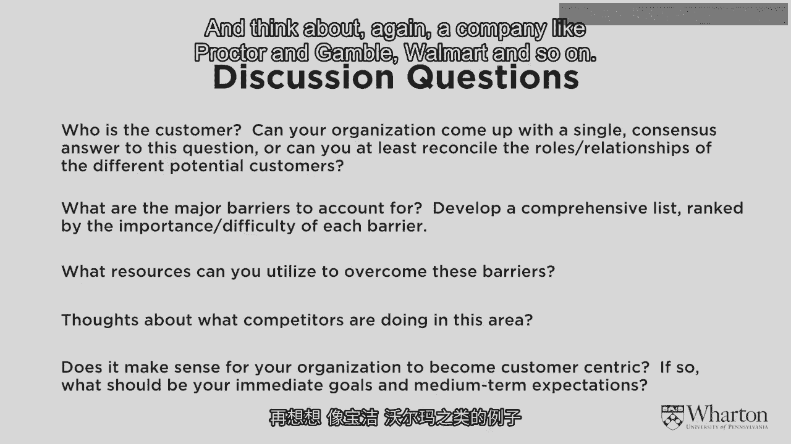
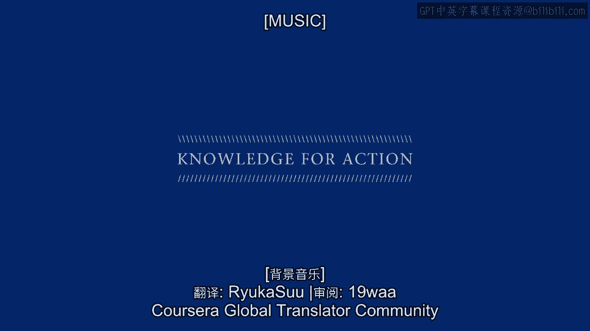
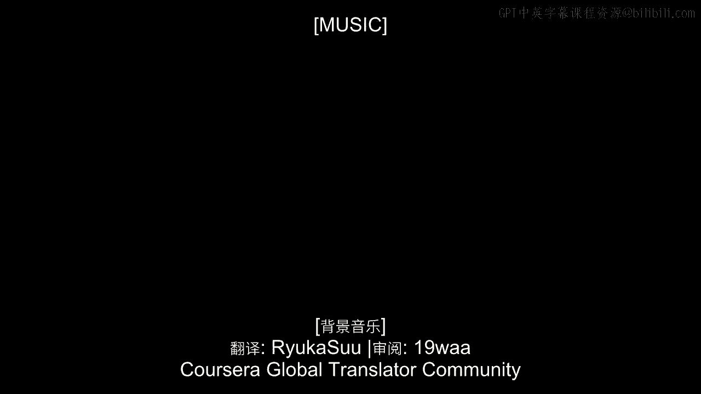

# 沃顿商学院《商务基础》课程 P16：有关客户本位的问题 🤔

在本节课中，我们将探讨在迈向客户本位过程中需要思考的几个关键问题，包括如何定义客户、识别障碍、评估竞争环境以及制定实施计划。

---

## 确定核心客户 👥

上一节我们介绍了客户本位的基本概念，本节中我们来看看实施客户本位的第一步：明确“客户是谁”。

在许多商业情境中，客户的定义并不清晰。以制药公司为例，当被问及“客户是谁”时，可能会得到四种不同的答案：患者、医生、医院或保险公司。每一方都可以被论证为是客户。因此，迈向客户本位的重要一步，就是在这个问题上达成共识。我们需要明确，在众多利益相关者中，哪一类是**我们最应关注的核心客户**。

以下是识别核心客户的步骤：
1.  列出所有可能被视为客户的利益相关方。
2.  组织一场深入的讨论，尝试就我们将重点关注哪一方达成共识。
3.  明确其他利益相关方虽然重要，但核心客户应享有最高优先级。

---

## 识别与克服障碍 🚧

明确了客户之后，我们需要审视实现客户本位的道路上可能存在的障碍。

这些障碍可能多种多样。例如，**数据障碍**——我们可能无法获取追踪个体客户长期行为的数据。也可能存在**监管限制**，使我们无法差异化对待客户。此外，**企业文化**也可能构成巨大挑战，一家长期专注于开发和分销“重磅产品”的公司，很难突然转向以客户为中心。

因此，在宣布要成为客户本位型企业之前，进行细致的障碍盘点至关重要。同时，我们也需要思考可以调动哪些资源来应对或预先防范这些障碍。

资源通常包括：
*   **财务资源**：投资建设信息技术系统、雇佣员工、开发数据基础设施。
*   **人力资源与文化**：雇佣具备“围绕客户的聚合思维”而非“围绕产品的发散思维”的合适人才。

提前规划如何克服这些障碍，能有效防止它们在日后阻碍我们的进展。

---

## 评估竞争环境 🏁

另一个重要的考虑因素是竞争环境。有趣的是，在某些情况下，看到竞争对手采取客户本位举措，会成为你效仿的强大动力。

然而，在许多情况下，迈向客户本位的最佳动机恰恰相反：因为**没有人这么做，所以我们要成为第一个**。哈里斯互动和乐购就是这样的例子。有时，成为唯一践行客户本位理念的企业，反而是取得成功的最佳途径。

因此，你需要思考所在行业的生态系统：
*   是所有人都变得客户本位更好？
*   还是只有你这样做更好？

这可能会影响你的最终决策。

---

## 制定决策与行动计划 📅

最终，核心问题是：你的公司是否应该、以及何时应该转向客户本位？

像宝洁、沃尔玛这样的公司，正在为未来几年才能实现的变革制定计划。在决定是否以及何时转向客户本位时，你应该开始为这一目标铺垫一些基础步骤。

这些初步行动可能包括：
*   **技术倡议**：例如沃尔玛的“Scan & Go”（扫码即走）项目。
*   **组织倡议**：例如宝洁的“MyBlackIsBeautiful”项目。
*   **实验性尝试**：划出组织的一部分或一组客户，用不同的方式对待他们，测试这种方式是否比通常以产品为中心的方式更有利可图。

我希望看到公司做出这类决策。我认为，所有公司至少都应该思考这个问题，以便就客户本位对自身的意义做出明智的决定。

---

本节课中，我们一起学习了实施客户本位战略前必须厘清的四个关键问题：**明确核心客户定义**、**系统识别并克服内外部障碍**、**理性分析竞争环境以寻找最佳时机**，以及**通过小步实验为全面转型制定切实可行的计划**。思考这些问题，是任何企业迈向真正以客户为中心的第一步。