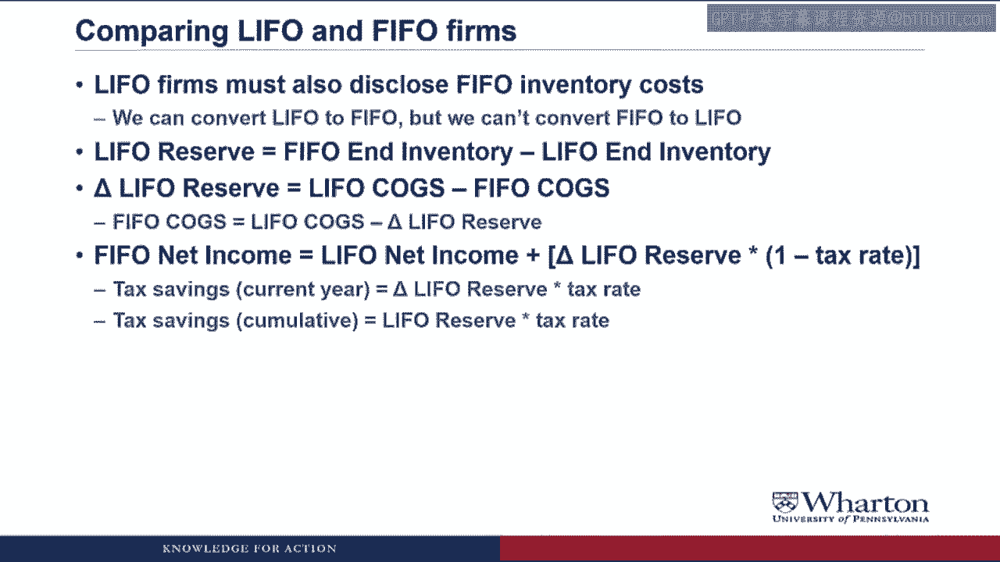
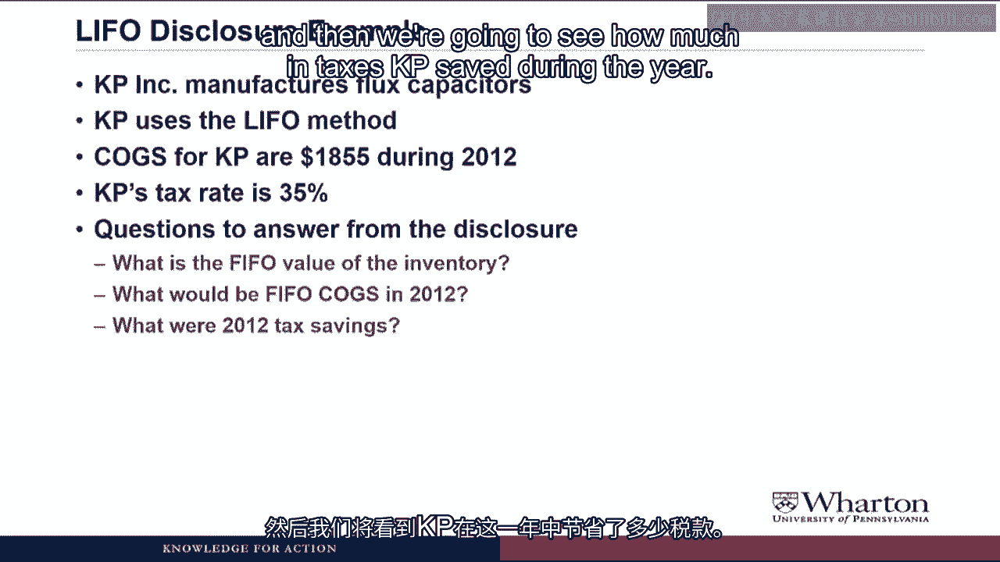
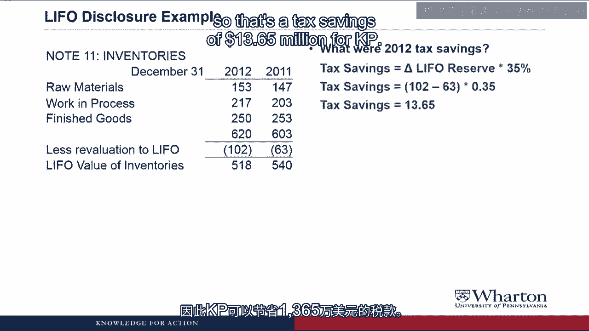

# 课程名称：沃顿商学院《商务基础》｜Business Foundations Specialization｜（中英字幕） - P164：存货披露示例

## 📊 课程概述

在本节课中，我们将学习如何解读一家使用后进先出法（LIFO）的公司的存货披露信息。核心目标是掌握如何将使用LIFO法的公司财务数据转换为先进先出法（FIFO）下的数据，以便与使用FIFO法的公司进行公平比较。我们将通过一个具体示例，学习LIFO储备、COGS调整以及相关税务影响的计算。

---

## 🔄 为何需要转换LIFO与FIFO数据

在比较一家使用LIFO法的公司和一家使用FIFO法的公司时，由于两种方法对期末存货和销售成本的计算存在显著差异，直接比较是不合理的。因此，我们需要将LIFO公司的数据调整到FIFO基础上。

为了便于LIFO和FIFO公司之间的比较，使用LIFO法的公司必须披露其在FIFO法下的存货成本。我们只能将LIFO公司的结果转换为FIFO基础，反之则不行。这是因为将一家一直使用FIFO法的公司转换为LIFO法，需要追溯其全部的存货采购历史，是一项艰巨的任务。

---

## 📈 核心概念：LIFO储备

LIFO储备是FIFO法下的期末存货价值与LIFO法下（即资产负债表上披露的）存货价值之间的差额。

其公式为：
**LIFO储备 = FIFO期末存货 - LIFO期末存货**

为了调整利润表，我们可以利用一个事实：LIFO储备的变化等于LIFO销售成本减去FIFO销售成本。

因此，我们试图为LIFO公司找出其在FIFO法下的销售成本。这意味着：
**FIFO销售成本 = LIFO销售成本 - LIFO储备的变化**

接着，将其转换为净利润：
**FIFO净利润 = LIFO净利润 + (LIFO储备的变化 × (1 - 税率))**

我们必须将LIFO储备的变化乘以（1 - 税率）以获得税后版本，因为净利润本身是税后数字。

请注意，在处理销售成本时，我们减去LIFO储备的变化；而在计算净利润时，我们加上它。这是因为销售成本是一项费用，而净利润是收入减去费用。

最后，本年度节省的税款等于LIFO储备的变化乘以税率。而自采用LIFO法以来累计节省的税款，则等于LIFO储备的余额乘以税率。

---

## 🧮 示例解析：KP公司

现在，让我们通过一个具体示例来应用这些概念。我们将查看KP公司的LIFO披露信息。KP公司生产通量电容器，并使用LIFO法。因此，如果我们想将KP的财务报表与使用FIFO法的公司进行比较，就必须将KP的数据从LIFO转换为FIFO。

已知KP公司在2012年的销售成本为1855（单位：百万，下同），公司税率为35%。

我们需要从披露信息中回答以下问题：
1.  FIFO法下的存货价值是多少？（以便比较资产负债表）
2.  2012年FIFO法下的销售成本是多少？（以便比较利润表）
3.  KP公司在2012年通过使用LIFO节省了多少税款？

以下是披露信息中的相关部分。在深入LIFO内容之前，需要指出的是，这部分披露展示了原材料、在产品和产成品存货的细分。对于制造企业来说，通常有这三类存货。在KP的情况下，其原材料和在产品均有所增加，产成品略有下降，这可能表明公司正在扩大生产，并预期有更多销售。

---

### 计算FIFO存货价值

公式是：**FIFO存货 = LIFO存货 + LIFO储备**

从披露中我们看到：
*   2012年LIFO存货价值为518。
*   LIFO储备（标注为“重估至LIFO”）为102。
*   2011年LIFO存货价值为540，LIFO储备为63。

因此：
*   2012年FIFO存货 = 518 + 102 = 620
*   2011年FIFO存货 = 540 + 63 = 603

请注意，LIFO储备在披露中用括号表示，代表它是一个贷方余额（在计算时我们将其视为正数）。尽管KP没有明确标注，但620和603就是FIFO法下的存货价值。

---

### 计算FIFO销售成本

公式是：**FIFO销售成本 = LIFO销售成本 - LIFO储备的变化**

已知：
*   LIFO销售成本 = 1855
*   LIFO储备的变化 = 102 - 63 = 39

计算：
**FIFO销售成本 = 1855 - 39 = 1816**

所以，FIFO销售成本比LIFO销售成本少39。

**重要提示**：不要从这个例子推断LIFO销售成本总是大于FIFO销售成本。这仅在存货价格持续上涨时成立。LIFO法对价格变动的方向非常敏感：价格上涨时，LIFO销售成本更高；价格下跌时，LIFO销售成本更低。

---

### 计算LIFO带来的节税金额

公式是：**节税额 = LIFO储备的变化 × 税率**

计算：
**节税额 = 39 × 35% = 13.65**

这意味着KP公司在2012年通过使用LIFO法，节省了1365万美元的税款。

---

## 💡 关于LIFO税务处理的讨论

如此显著的节税效果引出一个问题：为何美国政府允许公司使用LIFO法？这实质上是一种税收优惠。目前，美国政界正在积极讨论是否应取消这项税收减免。在最近的政府预算提案中，就有提议取消LIFO法以增加税收。当然，这遭到了强烈的游说反对。鉴于LIFO法未来可能被废除，相关讨论也需保持关注。

---

## 🎯 课程总结

本节课中，我们一起学习了如何解读和转换LIFO公司的存货披露信息。我们掌握了LIFO储备的概念及其在调整资产负债表（存货价值）和利润表（销售成本、净利润）中的应用。通过KP公司的示例，我们实践了将LIFO数据转换为FIFO数据的具体步骤，并计算了由此产生的税务影响。理解这些转换对于在不同存货计价方法之间进行公平的财务比较至关重要。