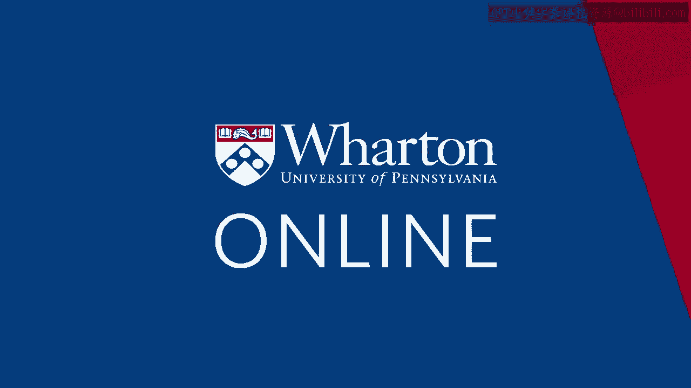

# 沃顿商学院《商务基础》｜第17课：设计传播活动 📢


在本节课中，我们将学习如何设计一个有效的传播活动。我们将探讨传播策略的核心组成部分，并通过实际案例来理解如何制定和执行一个成功的传播计划。

---

## 概述

传播活动是市场营销组合中“促销”环节的关键部分。它涉及通过大众或定向媒体与消费者沟通，以影响他们的认知、态度和行为。本节课将重点介绍设计传播活动时必须考虑的七个关键决策，即“7M”框架。

---

## 传播活动的作用

在上一模块中，我们了解了市场进入计划的组成部分，包括5C和4P分析。其中，“促销”是4P之一。促销决策包含多个方面，例如传播策略（广告、公关、植入）以及人际沟通（销售团队、口碑营销）。本节课，我们将聚焦于通过大众和定向媒体进行的传播策略。

---

## 传播活动的“7M”框架

设计一个传播活动，你需要做出以下七个关键决策，我们称之为“7M”：

1.  **市场**：你要对谁说话？（目标受众）
2.  **信息**：你要告诉他们什么？（核心信息）
3.  **使命**：你想实现什么目标？（例如，提升知名度、激发兴趣）
4.  **表达方式**：你如何有创意地表达信息？
5.  **媒体**：你通过什么渠道触达他们？
6.  **资金**：你打算花多少钱？
7.  **衡量**：如何评估活动是否有效？

许多教科书可能只列出5个M，这是因为前两个M（市场和信息）实际上源于更早的市场定位决策，应在设计具体传播活动前就已确定。

---

## 案例分析：牛奶营销活动

为了更好地理解这些决策，让我们看一个经典案例：1992年加州牛奶委员会的“Got Milk?”活动。

**背景**：当时，尽管消费者认为牛奶健康、酷炫，但牛奶消费量却在快速下降。研究发现，问题不在于人们不喜欢牛奶，而在于他们家里经常没有牛奶。消费量与家庭库存量直接相关（这一现象在其他品类如软饮料和洗发水中也存在）。

**活动决策**：
*   **市场**：针对当前已经喝牛奶的人群，目标是让他们喝得更多。
*   **信息**：确保家里有足够的牛奶。
*   **使命**：在一年内，将人均每周牛奶消费量增加一杯。
*   **表达方式**：创造了标志性的“Got Milk?”广告，通过不同场景和名人代言，反复强化同一信息。
*   **媒体**：主要采用电视和平面广告。
*   **资金**：设定了专门的广告预算。
*   **衡量**：设定了在三个月内达到特定广告回忆度的目标。

这个案例清晰地展示了如何将“7M”框架应用于实际，以解决具体的商业问题。

---

## 核心决策详解

接下来，我们将深入探讨“7M”框架中几个尤为关键的决策。

### 1. 使命：设定明确目标

传播活动的“使命”定义了活动的具体目标。它不仅仅是“提高销量”这样宽泛的表述，而应该是具体、可衡量的。目标通常沿着“认知-情感-行为”的链条设定：

*   **认知阶段**：建立品牌知名度与知识。
    *   *示例目标*：在目标市场中，将品牌知名度从30%提升至50%。
*   **情感阶段**：塑造品牌态度与偏好。
    *   *示例目标*：将消费者对产品“健康”属性的认同度提高20%。
*   **行为阶段**：促使消费者采取行动。
    *   *示例目标*：将产品试用率提升10%，或将重复购买率提高5%。

**公式示例**：`活动目标 = 提升 [具体指标] 从 [当前值] 到 [目标值] 于 [时间范围内]`

### 2. 表达方式：创意策略

确定了“说什么”之后，关键在于“怎么说”。创意策略决定了信息的表现形式，旨在吸引注意力并令人难忘。

**关键考虑因素**：
*   **信息诉求**：采用理性诉求（展示产品功能、性价比）还是感性诉求（激发情感、关联价值观）？
*   **代言人选择**：使用名人、专家、典型消费者还是动画角色？
*   **执行风格**：采用生活片段、奇幻场景、幽默还是直接比较？

**代码示例（比喻）**：创意策略就像编写一段吸引人的故事代码：
```plaintext
if (目标受众 == 年轻群体) {
    采用(幽默风格 + 社交媒体KOL);
} else if (目标受众 == 家庭主妇) {
    采用(生活片段 + 理性诉求);
}
```

### 3. 衡量：评估活动效果

最后，必须评估活动是否达成了既定“使命”。衡量方法应与目标紧密挂钩。

**常见衡量指标**：
*   **认知层面**：通过调研测量广告回忆度、品牌识别度。
*   **情感层面**：测量品牌态度、偏好度的变化。
*   **行为层面**：跟踪销售额、市场份额、网站流量、优惠券兑换率等数据。
*   **投资回报率**：计算传播投入带来的经济收益。

**公式示例**：`传播活动投资回报率(ROI) = (活动带来的增量利润 - 活动成本) / 活动成本`

---

## 总结




在本节课中，我们一起学习了设计传播活动的系统框架——“7M”。我们从明确活动的“使命”开始，探讨了如何通过“表达方式”将核心“信息”创意地传递给目标“市场”，并简要提及了“媒体”与“资金”的规划，最后强调了“衡量”效果的重要性。记住，一个成功的传播活动始于清晰的目标和深刻的市场洞察，并通过有创意且可衡量的执行来实现商业目的。