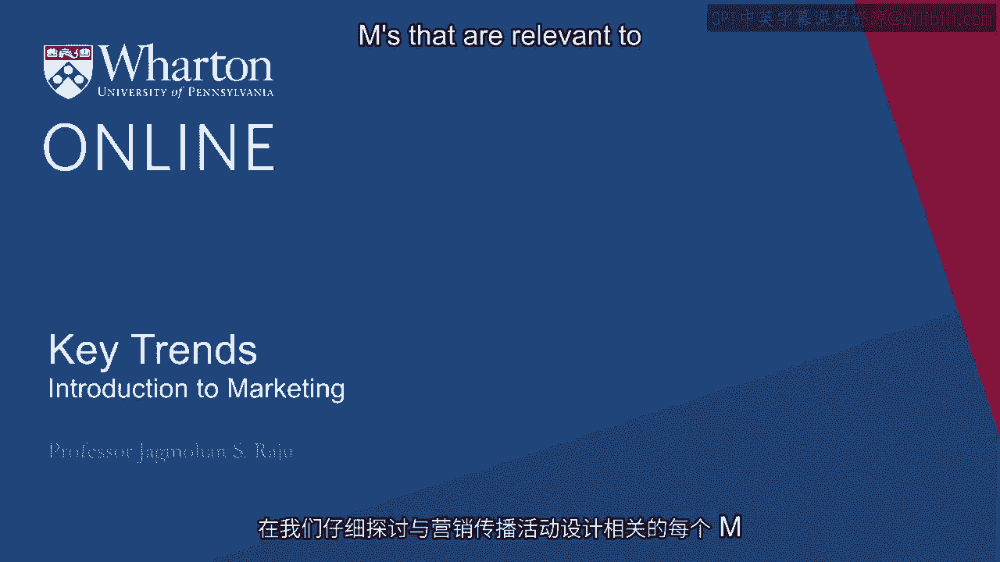
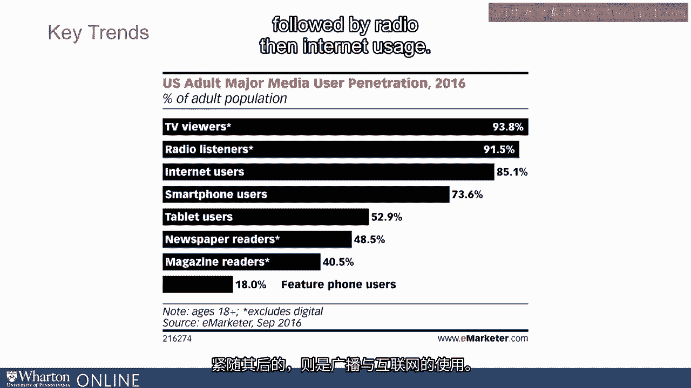
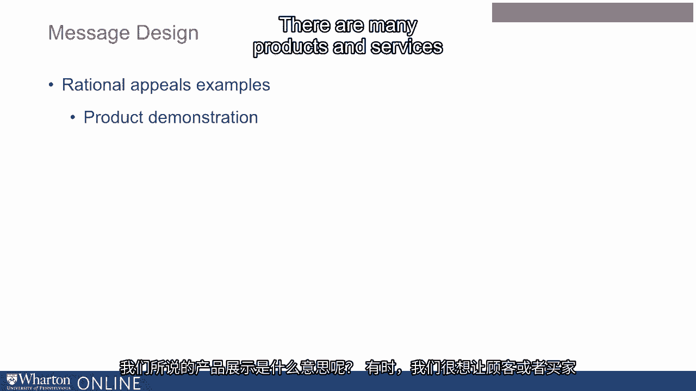
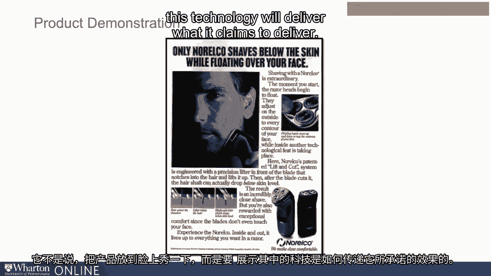
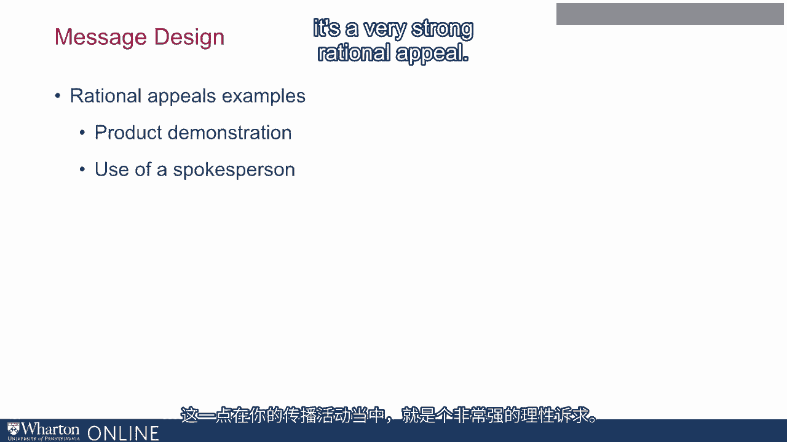
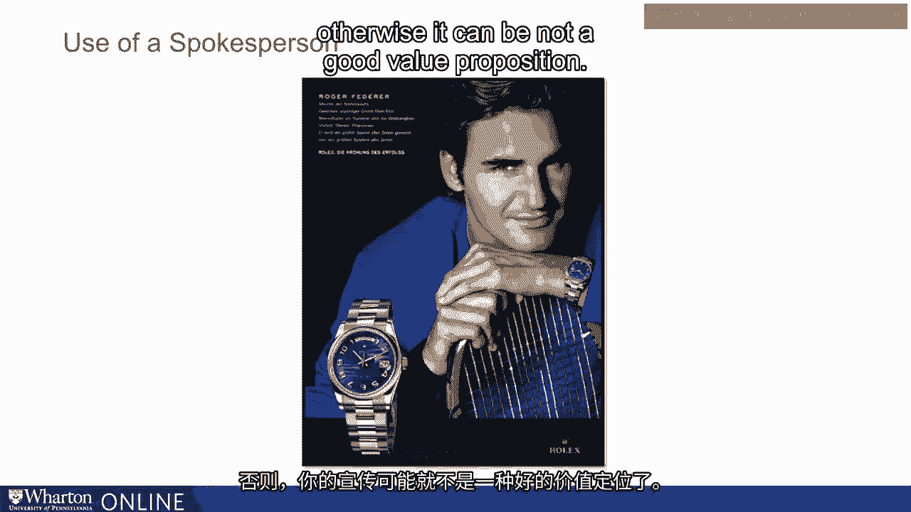
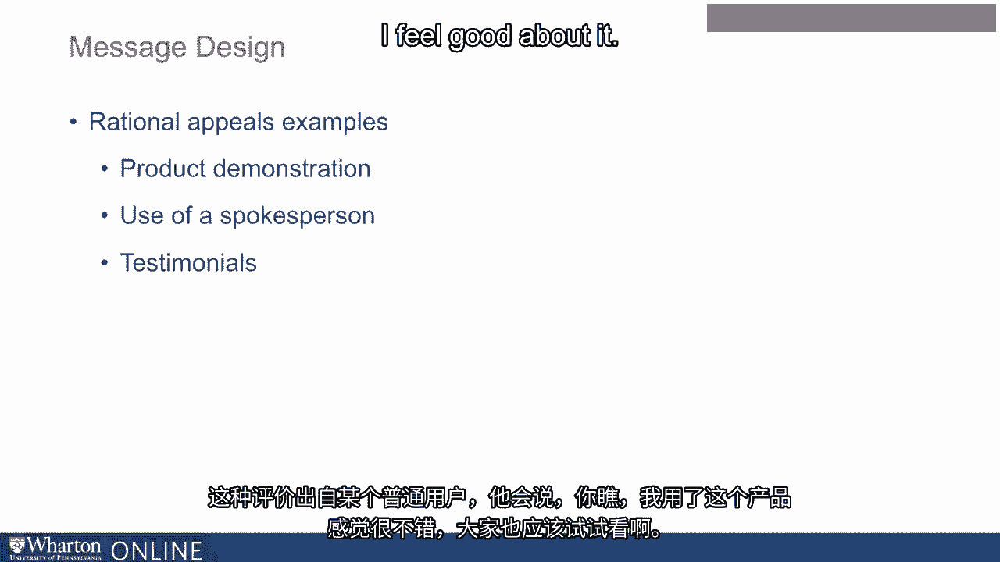
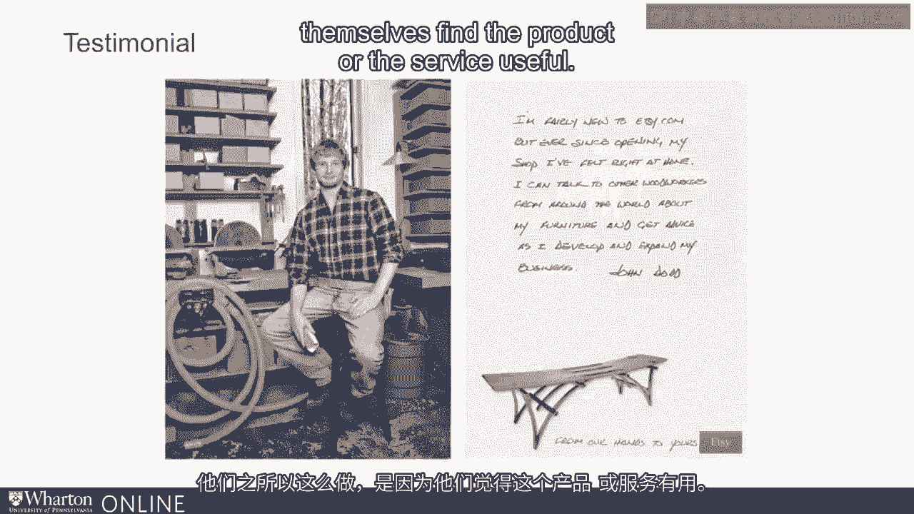
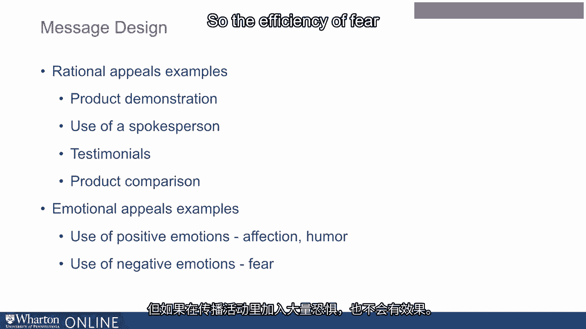
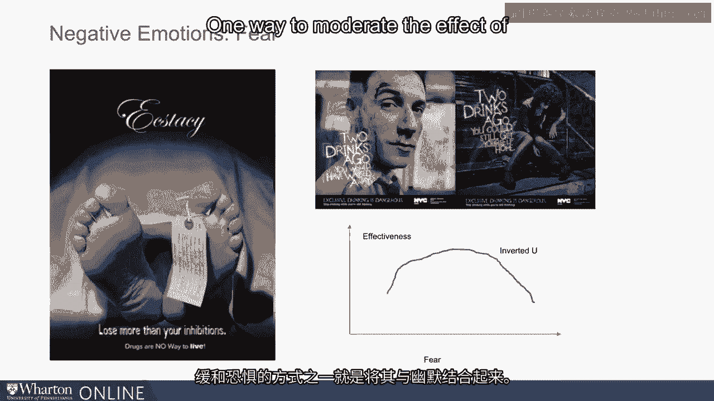

# 沃顿商学院《商务基础》课程｜第18讲：关键趋势与沟通策略 🎯

在本节课中，我们将学习设计有效沟通策略的关键要素，特别是如何理解媒体趋势、设定沟通目标、设计信息内容以及规划媒体渠道。我们将通过一系列核心概念和实际案例，帮助你掌握构建成功沟通活动的基础。

---

在深入探讨设计沟通活动相关的各个“M”要素之前，有必要先了解一些关键趋势，尤其是在媒体方面。

尽管行业在可用媒体形式上发生了诸多变化，但电视仍然覆盖着最大规模的受众，其次是广播，然后是互联网使用。

然而，从使用频率的数据来看，变化非常显著。人们在各类媒体上花费的总时间正在改变。电视的使用时间在下降，而一些数字媒体的使用时间在增加。这与我们的直觉相符。但电视并未崩溃，它仍然占据重要地位，预计至少三分之一的广告总支出仍将投向电视。大部分支出将转向数字媒体。报纸的份额已大幅下降。广播保持稳定但份额不大。户外广告（如广告牌等）依然相当强劲，不会消失。

观察整体趋势，你会发现数字媒体在上升。但这常常具有误导性。因为数字广告，尤其是其内容，正变得越来越像电视。许多数字广告和数字内容本质上是视频。改变的只是分发方式，内容本身与电视无异。例如，人们不再只看传统电视频道，也会观看YouTube。即使查看我们沃顿商学院的网站，大部分信息也是基于视频的。因此，理解这一点很重要：尽管数字媒体在增长，但视频内容占总内容的比例实际上可能在增加，只是其中一部分通过电视传输，其余部分通过数字方式传输。

人们常说媒体在变化，因此策略也应改变。但我们要强调的是，**沟通活动设计的关键原则并不受媒体选择或媒体可用性的影响**。实际情况恰恰相反：**媒体选择由活动设计决定，而非媒体影响活动设计**。因此，我们必须先妥善设计活动，然后再选择媒体。

---

## 沟通活动的第一个“M”：使命（Mission）

从买方行为和消费者心理学中我们得知，消费者从非购买者转变为购买者并非一蹴而就。他们会经历几个阶段：首先**知晓**产品或服务，然后对其产生**兴趣**，接着产生购买或消费的**欲望**，最后做出**购买决策**。

研究表明，不同沟通方式在不同阶段的效果不同。大众媒体（无论是数字还是传统形式）在**创造知晓度**方面非常有效，但在说服过程的后期阶段效果较差。相反，口碑传播、人际推荐或人员推销等方式，在决策过程的早期阶段效果较差，但在后期阶段则**有效得多**。

这对我们改进沟通活动有何启示？很简单，如果你有100美元的预算，你不会全部花在大众媒体上。你会将大部分用于提升知晓度和兴趣，但同时也会投入相当一部分在个人和人际渠道上，以创造更多口碑。这通常被称为说服的“**组合拳理论**”。

这个说法源自拳击。在此情境下，它意味着你使用大众媒体来“软化”消费者，让他们熟悉你的产品和服务，激发他们的兴趣；然后使用人员推销或人际口碑来真正将他们转化为你的用户。如果在最初阶段就尝试使用人员推销，效果不会很好。同样，如果在决策后期阶段使用大众媒体或数字媒体，效果也不会理想。

因此，设计和确定沟通活动的一个关键经验是，**确保这些信息来源（大众媒体与个人/人际沟通）的良好组合**。

---

## 沟通活动的第二个“M”：信息（Message）

信息设计是沟通策略的关键组成部分，即“如何表达你需要表达的内容”。心理学家和广告从业者多年来发现，我们主要关注两种类型的诉求：**理性诉求**和**感性诉求**。每种类型下又有许多不同的形式，我们将在本节中讨论其中几种。

### 理性诉求

首先来看理性诉求。一种非常流行且强大的理性诉求是**产品演示**。

对于许多产品和服务，我们希望让消费者或买家知道它们能提供某个独特的卖点或价值主张，但这种声称可能不容易让人相信。例如，人们可能不相信某个剃须系统能提供更好的剃须效果。沟通这一点的一种方式是展示产品背后的技术。

例如，在一则广告中，主图展示一个人正在使用剃须刀，其下方的三张图中，有一张专门演示技术原理，展示这种剃须方法如何实际提供更好的效果。这就是产品演示的含义——它并非直接在脸上演示产品，而是演示技术如何兑现其承诺。

另一个常见的例子是吸尘器或洗衣机广告，它们经常聚焦于机器内部的技术。戴森公司的吸尘器广告就是一个典型，它们经常谈论其技术为何优于其他产品。这就是在沟通活动中运用产品演示，它是一种非常强大的理性诉求。

另一种理性诉求是使用**代言人**。如果代言人使用某产品表现良好，你可能会相信你也能像他们一样。但使用代言人有时非常昂贵，因此必须谨慎选择，否则可能不是一项好的价值主张。

有些公司使用另一种类型的“代言人”——**卡通角色或无生命物体**，并将其作为代言人使用。

与代言人不同，另一种方式是使用**用户证言**。这来自普通用户，他们会说：“看，我用了这个产品，感觉很好，你也应该试试。”许多人认为证言更有效，因为它们来自普通用户，而这些用户并非受雇说好话，他们这样做是因为自己确实觉得产品或服务有用。

广告商使用的另一种强大的理性诉求是**产品比较**。他们可能会在多个特性上或整体上将自家产品与另一产品进行比较，例如声称“更多人喜欢我们的产品”。使用产品比较时，**必须遵循相关的法律准则**。大多数国家都有严格的规定，有些国家甚至不允许直接的产品比较。在允许的国家，也必须严格遵守法律要求。如果运用得当，这是一种非常强大的理性诉求。

### 感性诉求

感性诉求是传达信息的另一种流行方式，我们使用不同类型的感性诉求，大致可分为**积极情绪**和**消极情绪**。

积极情绪的例子很多。宝洁公司为奥运会制作的广告就是一个好例子：广告中孩子们在母亲的照顾下成长，长大后参加奥运会并表现出色，最后孩子拥抱母亲。这种广告能唤起强烈的情感共鸣。

有趣的是，当初开发这个广告时，宝洁的管理层并不十分看好，因为它并没有直接推销产品，只是在推广公司名称。这也是**企业形象广告**的一个例子。有研究表明，那些在许多产品上使用**统一品牌名称**的公司（即“品牌化屋”）更适合使用企业形象广告；而那些使用不同品牌名称的公司（即“多品牌组合”）则不太适合。宝洁公司实际上采用的是多品牌组合策略。

我们在制定沟通活动时使用的另一种强烈情绪是**恐惧**，这是一种消极情绪。关于恐惧有趣的是，研究发现，恐惧程度太低效果不大，恐惧程度太高效果也不好。恐惧的效力会因过度使用而下降。

那么，为什么活动中过多的恐惧不好呢？广告商发现，如果在广告中使用过多恐惧，人们会感到厌烦，甚至根本不记得看过。因此，如果在大众媒体环境中使用恐惧诉求，**保持适度的恐惧水平**非常重要，这是研究人员的建议。

缓和恐惧效应的一种方法是将其与**幽默**结合。例如，许多制药公司的广告中，细菌被描绘成可爱的卡通形象，这样既有恐惧元素，又通过幽默进行了调和。

---

## 沟通活动的第三个“M”：媒体（Media）

最后，我们简要谈谈媒体规划。媒体规划涉及选择在何时、何地、以何种频率投放你的信息。其核心目标是**以最有效的方式触达目标受众**。这需要综合考虑预算、目标受众的媒体习惯以及不同媒体的特点。

---

在本节课中，我们一起学习了设计沟通策略的关键框架。我们首先探讨了媒体环境的关键趋势，理解了内容形式（如视频）的重要性超越了分发渠道。接着，我们深入分析了沟通活动的三个核心“M”要素：**使命**（明确沟通目标与消费者决策阶段相匹配）、**信息**（运用理性诉求如产品演示、代言人、证言、比较，以及感性诉求如积极情感和适度恐惧）和**媒体**（根据活动设计进行选择）。记住，成功的沟通活动始于清晰的目标和精心设计的信息，媒体只是实现这些目标的工具。