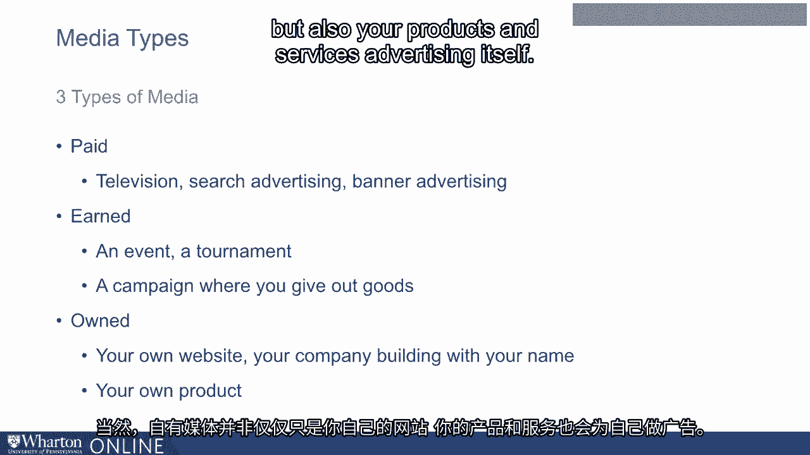
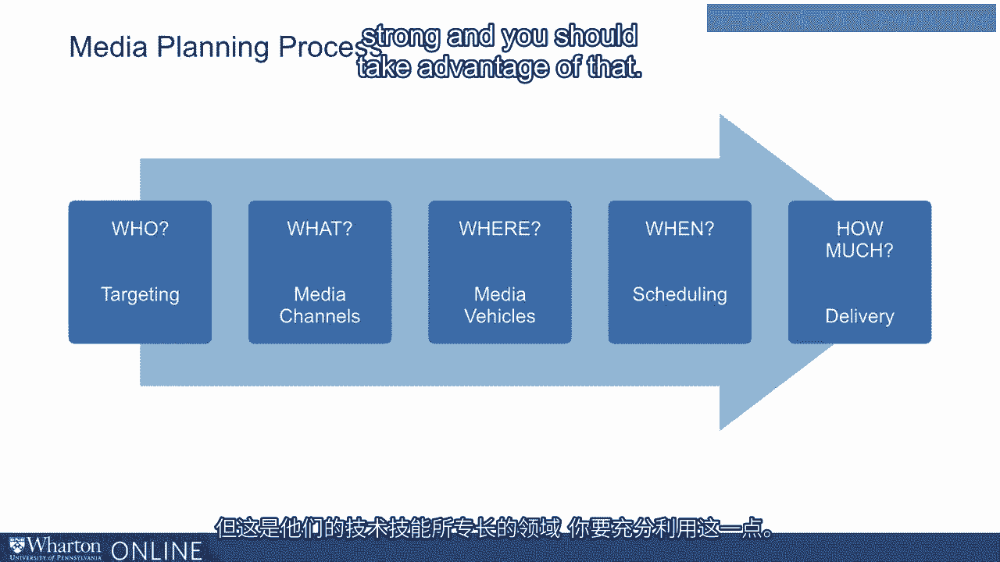
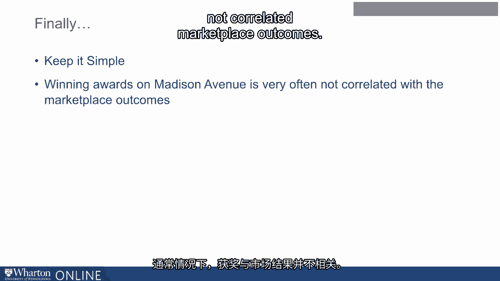
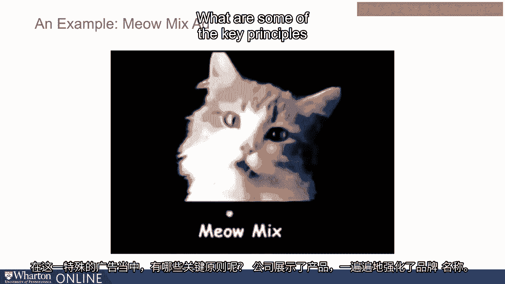
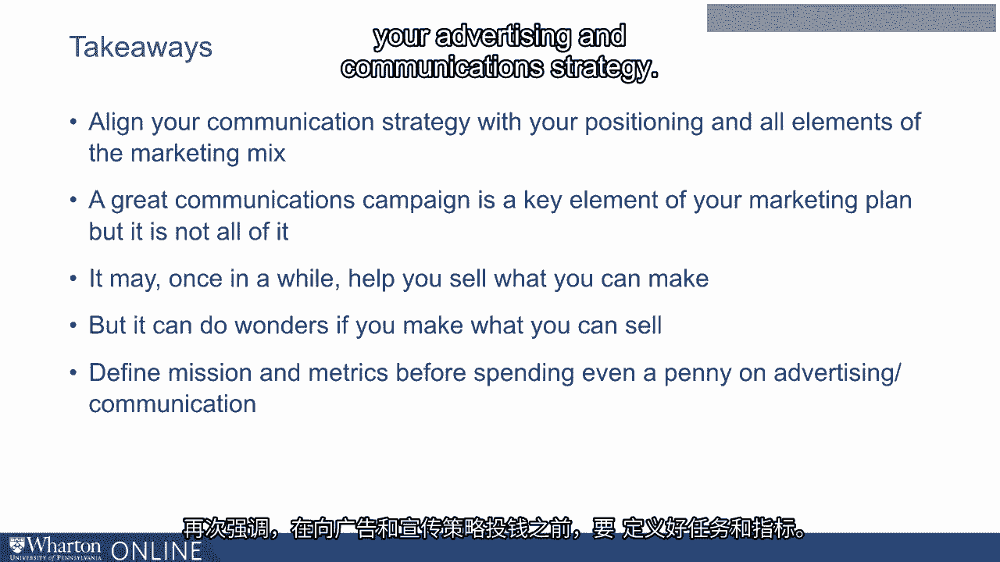
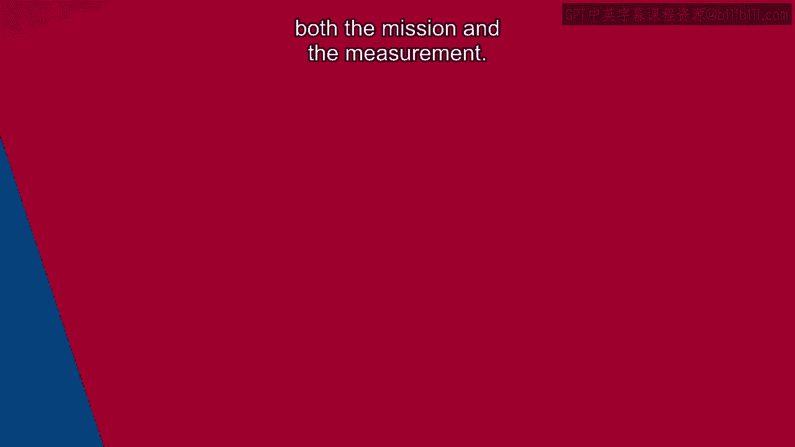

# 沃顿商学院《商务基础》课程 P19：媒体规划 📊

在本节课中，我们将学习营销沟通策略中的媒体规划环节。我们将了解媒体的战略分类、预算制定方法以及效果测量的重要性，并探讨如何制定一个简单而有效的沟通策略。

---

## 媒体类型的战略视角 🧠

上一节我们介绍了沟通策略的整体框架，本节中我们来看看媒体规划的具体内容。从战略视角出发，媒体可分为三种类型。

以下是三种主要的战略媒体类型：

*   **付费媒体**：指通过支付费用获得的媒体曝光。典型例子包括电视广告、搜索引擎广告、横幅广告以及网站或YouTube上的视频广告。
*   **赢得媒体**：指通过企业自身的活动（而非直接付费）赢得的媒体关注和用户讨论。例如，举办一场活动、赞助体育赛事，或开展公益项目（如为负担不起的人提供免费眼镜或鞋子）后，新闻媒体的报道和公众的口碑传播。
*   **自有媒体**：指企业完全拥有和控制的媒体资产。这包括企业官网、带有公司标识的建筑物，甚至产品本身。例如，汽车后部印有品牌名称，就是为了让后方车辆看到，这本身就是一种广告。

一个重要的战略决策在于，如何平衡在付费媒体、赢得媒体和自有媒体上的投入重点。

---

## 预算制定方法 💰

确定了媒体战略后，下一步是制定预算。虽然存在许多正式的预算制定方法，但这里我们提供一些关键见解。

许多公司在制定传播预算时会使用经验法则，例如：

*   将预算设定为销售额的一个固定百分比。
*   设定与竞争对手持平或略高的预算。

然而，这些方法缺乏明确的目标导向。更推荐的方法是采用**目标任务法**。

**目标任务法公式**：
`预算 = 为实现特定沟通目标所需各项任务成本的总和`

具体步骤是：首先明确沟通活动的最终目标（例如，在特定时间内让一定数量的人知晓产品），然后反向推导出实现这一目标需要完成哪些任务，以及完成这些任务需要多少资金。这种方法比基于销售额或竞争对手的预算方式更有目的性。

需要注意的是，广告代理商有时会鼓励采用销售额百分比法，因为这可能使他们的费用随预算增长而增加。因此，企业需要保持敏感，坚持使用目标任务法。

---

## 效果测量：先行而非后行 📏

现在让我们谈谈最后一个环节：效果测量。虽然它常被列在最后，但绝不应最后才考虑。

事实上，在投入任何传播费用之前，就应该决定使用何种测量方法。测量方法多种多样，涵盖创意测试、平面广告测试、电视广告测试，甚至包括皮肤电反应、眼动追踪等生理测量方法。

问题往往不在于测量成本过高（通常最复杂的方法成本也不超过传播费用的1%），而在于企业是否真正有决心和意愿进行测量。

核心原则是：**在花费第一分钱之前，就明确活动的使命并设定好测量指标**。测量应与使命一同设计，而不是在广告执行后才考虑。

---

## 保持沟通策略的简洁有效 🎯

在制定沟通策略时，一个重要的原则是保持简洁。广告代理商可能更热衷于赢得奖项，但企业的核心目标是提升产品与服务的销售，而获奖与市场表现常常并不直接相关。

一个值得借鉴的例子是“Meow Mix”猫粮广告。该广告非常简单：一只猫在30秒内叫了超过60次“Meow”（喵）。广告下方有一行字说明产品优点。

这个广告体现了几个关键原则：
1.  **高频展示品牌**：多次提及品牌名称。
2.  **清晰传达卖点**：陈述产品的所有优点。
3.  **展示产品使用**：展示产品（猫粮）被使用的场景。
4.  **避免负面联想**：避免任何与产品相关的不愉快联想。
5.  **提供购买信息**：告诉人们如何及在哪里购买。

这个广告从未获奖，但其“次日品牌回忆度”却一直是最高水平之一。它成功地将复杂策略转化为简单、难忘的执行。

---

## 本节总结 ✨

本节课中我们一起学习了媒体规划的核心内容：

1.  **媒体战略分类**：将媒体分为付费媒体、赢得媒体和自有媒体，并需战略性地分配资源。
2.  **预算制定**：推荐使用**目标任务法**来制定有目的性的预算，而非依赖经验法则。
3.  **效果测量**：测量方法应与活动使命**同步设计**，并在投入前确定，而非事后补救。
4.  **策略原则**：有效的沟通策略应**简洁明了**，紧密围绕展示产品、传达卖点、高频曝光品牌等核心目标，并与整体市场定位及营销组合保持一致。

请记住，出色的传播活动是营销计划的关键要素，但并非全部。最重要的是，先明确使命与衡量标准，再着手策划与执行。