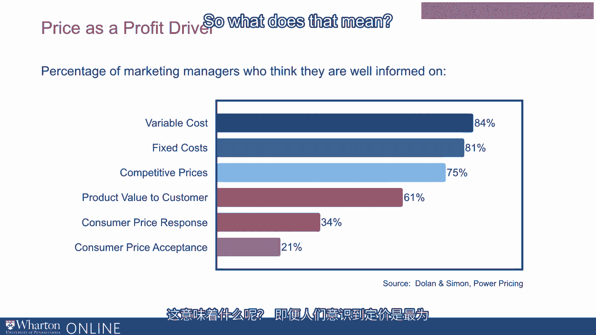
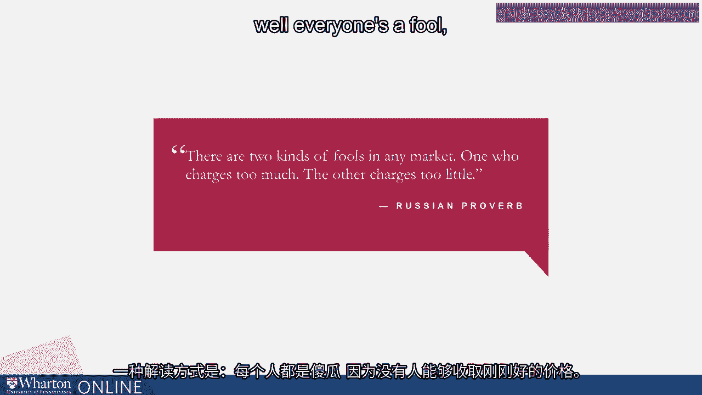
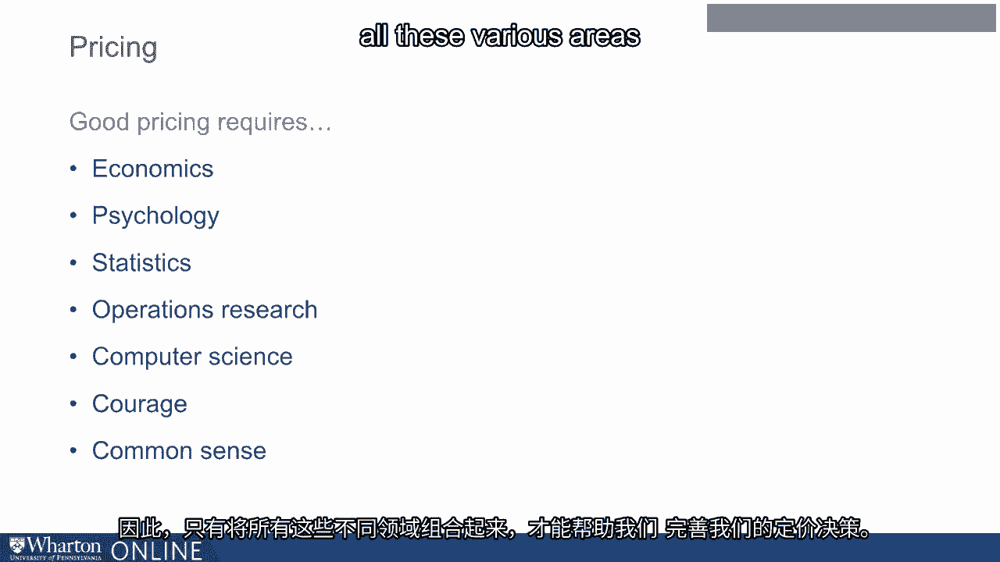

# 沃顿商学院《商务基础》课程笔记｜第20讲：定价策略 💰

在本节课中，我们将详细探讨定价这一核心商业决策。定价不仅是企业获取利润的关键杠杆，更是一门融合了经济学、心理学与数据分析的复杂艺术。我们将了解定价的重要性、常见误区以及制定有效定价策略所需的多维度知识。

---

## 定价的重要性与利润杠杆 📊

上一节我们回顾了营销组合的四个关键要素，本节中我们来看看其中至关重要的一环——定价。

所有公司、所有企业都必须做出定价决策。定价是利润的一个关键驱动因素。麦肯锡多年前进行的一项研究（我们近期在著作《智能定价》中使用现代数据服务商words的数据复现了该研究）揭示了这一点。

该研究旨在分析，如果你改变或改善固定成本、销售量、可变成本或价格中的任何一项，会对你的利润底线产生何种影响。具体思考方式如下：

假设我们审视美国所有标准普尔500指数成分公司，并汇总这500家公司的合并损益表。然后我们提出以下问题：

*   如果这些公司将其**固定成本降低1%**，其营业利润将如何变化？答案是：将**提升2.3%**。
*   如果这些公司能将其**销售量提高1%**，对利润底线的影响如何？答案是：**低于3%**。
*   如果这些公司能将其**可变成本降低1%**，对利润底线的影响如何？答案是：**接近8%**。
*   如果这些公司能将其**价格提高1%**，对利润底线的影响如何？答案是：**接近11%**。

由此可见，在管理者可用的所有杠杆或驱动因素中，**改善定价对利润底线的影响最大**。这一点已被认知许久，许多优秀的管理者也早已明了。

然而，当我们结合下一组数据来看时，会发现一个矛盾。

## 管理者的认知偏差与定价盲区 🤔

在管理者对于自身更了解哪些方面的认知上，他们的关注点分布如下：

以下是管理者对不同领域信息掌握程度的自评关注度排序（从高到低）：
1.  **可变成本**：这是人们关注度最高的领域。
2.  **固定成本**。
3.  **竞争性价格**。
4.  **定价**：其关注度数值远低于前几项。

这意味着什么？尽管人们意识到定价是最重要的驱动因素之一，但他们关于如何运用和执行定价的知识是有限的，并且有很大的提升空间。这凸显了我们所有人学习更多定价知识、成为更优秀定价者的重要性。

## 定价的平衡艺术：避免两种“傻瓜” ⚖️

有一个我常在课堂上与学生分享的俄罗斯谚语：“在任何市场中，都有两种傻瓜：一种要价太高，另一种要价太低。”

对这句谚语有多种解读方式。一种解读是：每个人都是傻瓜，因为没人能定出绝对正确的价格。但我认为另一种解读更为恰当：它真正想说的是，**良好的定价是一种平衡的艺术**。

为了达到正确的平衡，我们需要认识到多个不同的领域。以下是制定优秀定价决策所需的知识与能力构成：

优秀的定价决策是多种知识与能力的结合。以下是其核心组成部分：
*   **经济学**：定价关乎经济学。
*   **心理学**：包括消费者心理学，以及定价决策者自身的心理，因为是人制定定价决策，也是人对定价决策做出反应。
*   **统计学**：在任何时代，统计知识都至关重要。你需要能够管理和分析数据。
*   **运筹学**：这意味着你需要学习如何在给定数据下进行优化。
*   **计算机科学基础**：在当今时代，你需要一些计算机科学的基础知识。
*   **勇气**：更重要的是，你需要很大的勇气，因为优秀的定价决策并非通过改变价格做出，而是通过改变公司的定价策略来实现。
*   **常识**：优秀的定价同样需要常识。

正是所有这些不同领域的结合，帮助我们改进定价决策。

---

本节课中，我们一起学习了定价的核心地位：它是影响利润最有效的杠杆。然而，管理者往往对其关注不足。我们认识到，定价并非简单的数字游戏，而是一项需要在成本、价值、竞争与消费者心理之间取得微妙平衡的复杂工作。要做出明智的定价，需要融合经济学原理、心理学洞察、数据分析能力，甚至需要决策的勇气和基本的常识。