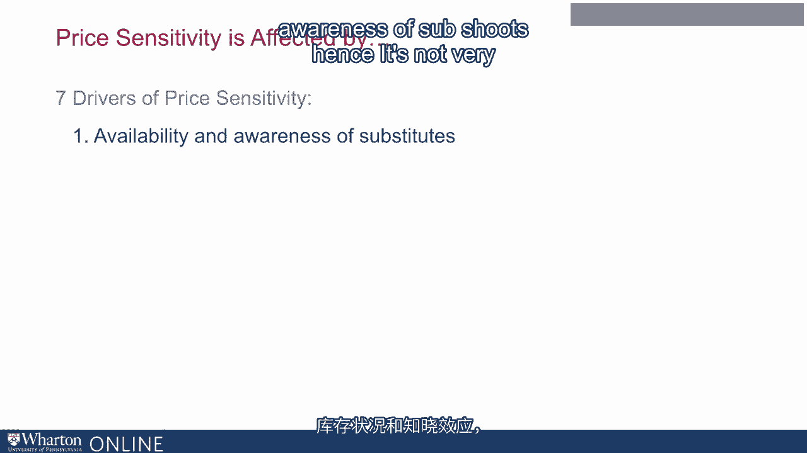
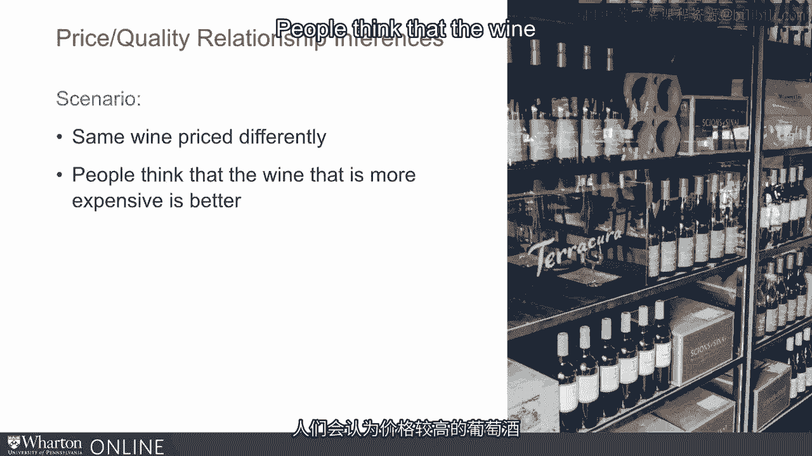
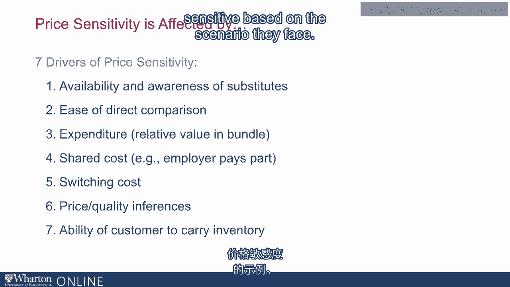

# 沃顿商学院《商务基础》课程｜第21讲：理解价格敏感性 📊

在本节课中，我们将深入探讨制定有效定价决策的关键：理解价格敏感性与价格弹性。我们将分两部分进行：首先分析影响价格敏感性的驱动因素，然后介绍衡量价格弹性的正式方法。

---

## 第一部分：价格敏感性的驱动因素 🧠

上一节我们提到了价格敏感性的重要性，本节中我们来看看具体有哪些因素会影响消费者对价格的敏感程度。以下是七个关键的驱动因素。



### 1. 替代品的可获得性与认知度 🔄

如果产品存在更多替代品，消费者对价格会更敏感。这不仅是替代品是否存在，还包括消费者是否知晓这些替代品。

**公式**：`价格敏感度 ∝ 替代品数量与认知度`

例如，在我熟悉的费城，我对餐厅价格更敏感，因为我知道很多选择。但在巴黎度假时，尽管餐厅更多，由于不熟悉，我的价格敏感度反而更低。


另一个关键点是**价格对比的便利性**。研究表明，当自有品牌产品与全国性品牌并排陈列时，其市场份额会显著提高，因为消费者能轻松进行价格比较。

### 2. 总支出与成本占比 💰

消费者在某一产品或服务上的总支出越大，或其占总支出的比例越高，价格敏感度就越高。

**公式**：`价格敏感度 ∝ (产品支出 / 总预算)`

例如，大家庭对食品杂货价格更敏感，因为这项支出占其预算比例更大。同样，对于钢铁家具制造商，钢材价格占其成本结构比例很高，因此他们对钢材价格极为敏感；而对于木制家具制造商，钢材（如钉子）成本占比很小，其敏感度就低得多。

### 3. 费用分摊机制 🤝

当费用由他人（如公司、保险公司）部分或全部承担时，消费者的价格敏感度会降低。

**应对策略**：为了激励消费者选择更便宜的产品，可以提供**直接面向消费者的折扣**，而不是单纯降低产品标价，这样消费者能更直接地感受到优惠。

### 4. 转换成本 🔧

如果更换现有产品或服务需要付出高昂成本（如金钱、时间、精力），消费者对价格变化的敏感度就会降低。

例如，我已经拥有一辆高油耗的SUV，即使汽油价格上涨，由于换车成本高，我短期内仍会继续购买汽油，行为不会立即改变。

### 5. 价格-质量关联认知 🏷️

在许多产品类别中，尤其是当消费者缺乏专业知识时，他们会将价格视为质量的信号。

**核心概念**：`感知质量 ∝ 价格`（对非专业消费者而言）

这在咨询服务、法律服务、选择医生或金融顾问等领域尤为明显。消费者缺乏判断质量的专业知识，因此倾向于认为“高价等于高质”，因为选择错误（如选到糟糕的律师）的代价很高。

即使是同一款葡萄酒，标价不同时，新手饮酒者也会认为更贵的那款更好。脑部扫描研究也证实了这一点在非专业人士中表现强烈。

### 6. 库存能力 📦

如果消费者能够为未来消费进行囤货（即具备库存能力），他们会对降价更敏感，从而在促销时购买更多。

例如，对于麦片等可长期储存的商品，促销会显著提升销量。而对于牛奶、新鲜蔬菜等不易储存的商品，消费者无法为下个月囤货，因此对促销的价格敏感度较低。

### 7. 情境因素 🎭

消费者的价格敏感度会因具体购买情境而异。例如，商务旅行（公司报销）与个人旅行、紧急购买与计划性购买，都会导致不同的价格敏感度。

---

## 第二部分：价格弹性的定义与衡量 📐

在了解了驱动因素后，我们需要一种更精确的方法来量化价格变化对需求的影响，这就是价格弹性。

### 什么是价格弹性？

价格弹性衡量的是产品需求量对其价格变动的反应程度。

**公式**：
`价格弹性 (E) = (需求量变化百分比) / (价格变化百分比)`

**代码表示**（Python伪代码）：
```python
def price_elasticity(percent_change_demand, percent_change_price):
    elasticity = percent_change_demand / percent_change_price
    return elasticity
```

### 如何衡量价格弹性？


以下是几种常见的衡量方法：



1.  **历史销售数据分析**：分析过去价格变动与销量变化的数据。
2.  **市场实验**：在部分市场或门店进行价格测试，观察需求反应。
3.  **消费者调研**：直接询问消费者在不同价格下的购买意愿。
4.  **联合分析**：通过让消费者在不同属性（包括价格）的产品组合中进行选择，来推断价格弹性。

理解并准确测量价格弹性，对于制定最优定价策略至关重要。


---

## 总结 📝

本节课中，我们一起学习了价格敏感性的核心概念。我们首先探讨了影响价格敏感性的七大驱动因素：**替代品的可获得性与认知度**、**总支出与成本占比**、**费用分摊**、**转换成本**、**价格-质量关联**、**库存能力**以及**情境因素**。理解这些因素能为我们提供何时定高价、何时定低价的方向性指导。




随后，我们引入了**价格弹性**这一正式概念，它通过`(需求量变化百分比)/(价格变化百分比)`的公式量化了价格变动的影响，并简要介绍了其衡量方法。掌握这些知识，是做出科学、有利可图的定价决策的基础。