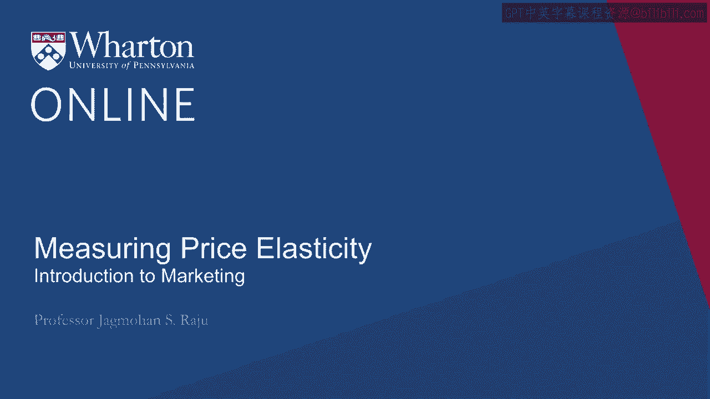

# 沃顿商学院《商务基础》｜第22课：测量价格弹性 📊

在本节课中，我们将学习如何正式地测量价格弹性。我们将从定义价格弹性开始，探讨其重要性，并详细介绍四种主要的测量方法。

---

## 概述

上一节我们讨论了影响价格敏感性的各种因素。本节中，我们将具体探讨如何正式地测量价格弹性。理解如何测量价格弹性，对于企业制定有效的定价策略至关重要。

---

## 什么是价格弹性？

价格弹性是一个特定的经济学概念，它衡量的是当价格变动**1%**时，需求量变动的百分比。

**公式**：`价格弹性 = 需求量变动百分比 / 价格变动百分比`

你可能会问，为什么我们不直接用需求量的变化除以价格的变化，而要使用百分比呢？这样做主要有两个好处：

1.  **消除单位影响**：无论需求是用“块”还是“吨”来衡量，价格是用“美元”还是“欧元”来标价，百分比都是无单位的。这使得测量结果标准化，不受具体计量单位的影响。
2.  **便于跨行业比较**：由于结果是无单位的，我们可以比较不同产品或行业的弹性。例如，我们可以说汽油的需求弹性是高于还是低于肥皂或橙汁。

---

## 弹性与无弹性

人们常说某种产品的需求是“弹性”或“无弹性”的。这具体是什么意思呢？这实际上指的是**价格变动对收入的影响**。

*   **弹性需求**：如果需求是弹性的，那么价格提高**1%**会导致需求量下降**超过1%**，最终导致总收入**下降**。
*   **无弹性需求**：如果需求是无弹性的，那么价格提高**1%**只会导致需求量下降**不到1%**，最终总收入会**上升**。

**关键分界点**是弹性系数**1**。如果需求量下降的百分比**恰好等于**价格上升的百分比（即弹性为1），那么总收入将保持不变。

---

## 如何测量价格弹性？

测量价格弹性的方法有很多。我们可以通过两个维度来构建一个清晰的框架：
1.  **测量内容**：是测量消费者的**实际购买行为**，还是他们的**购买意愿**？
2.  **测量条件**：是在**自然市场环境**下测量，还是在**受控的实验环境**下测量？

将这两个维度结合，我们得到四种主要的测量方法。

以下是四种测量价格弹性的方法：

1.  **自然环境下的实际购买数据（销售数据分析）**
    这种方法利用产品在市场上已有的销售和价格数据，通过统计分析（如回归分析）来估算价格弹性。优点是数据真实反映市场行为。

2.  **自然环境下的购买意愿调查（问卷调查）**
    通过向潜在消费者描述产品，并询问他们在不同价格下的购买意愿，来构建需求曲线并计算弹性。这种方法快速、成本较低，但缺点是消费者的“意愿”和“实际行为”可能存在差距。

3.  **实验环境下的实际购买数据（现场实验）**
    在真实市场中进行可控的价格实验。例如，将商店分为几组，对每组实施不同的价格变动，然后观察销售量的变化。这种方法能直接观察到价格变动的影响。

4.  **实验环境下的购买意愿分析（权衡分析/联合分析）**
    这是一种更高级的方法，通过让消费者在一系列具有不同属性（包括价格）的产品组合中进行选择，来分析他们如何权衡不同属性，从而量化价格弹性。沃顿商学院的保罗·格林教授是联合分析法的创始人之一。

---

## 方法详解与案例

### 1. 问卷调查法示例
假设我们推出一个新的在线新闻服务。我们可以将600名潜在用户分成6组，每组100人。向所有组描述相同的产品，但给每组报出不同的价格（如10美元、11美元……15美元）。然后统计每组中表示愿意购买的人数，绘制出价格与需求量的关系图，进而计算弹性。

**优点**：快速、成本低。
**缺点**：意愿不等于实际行为；未考虑竞争对手价格；对于重复购买的服务，未考虑用户使用时长和客户终身价值。

### 2. 现场实验法示例
沃顿商学院的史蒂夫·霍克教授曾在一家名为Dominick‘s的连锁超市进行实验。他将90多家门店分成三组：
*   **实验组A**：价格降低9%
*   **实验组B**：价格提高9%
*   **控制组**：价格不变

**结果**：
*   降价9%的门店，销量上升了3%。价格弹性 = 3% / 9% = 0.33（无弹性）。
*   涨价9%的门店，销量下降了4%。价格弹性 = 4% / 9% ≈ 0.44（无弹性）。

**结论**：在该案例中，需求是无弹性的，提高价格可以增加收入。但需要注意，如果竞争对手强调价格差异或消费者比价更容易，这种弹性可能会发生变化。

### 3. 权衡分析法概念
假设有六家餐厅（A到F），它们有两个属性：食物质量（优秀、好、一般）和氛围（私密烛光、明亮灯光）。通过让消费者对这些餐厅进行排序，我们可以分析出他们更看重食物质量还是氛围。如果将其中一个属性替换为“价格”，我们就能分析消费者如何在价格和其他属性之间进行权衡，从而测量价格敏感性。

---

## 总结

本节课我们一起学习了价格弹性的核心概念和测量方法。我们首先明确了价格弹性的定义及其在商业决策中的重要性，即它决定了价格变动对收入的影响。接着，我们通过一个2x2的框架，系统介绍了四种测量价格弹性的方法：销售数据分析、问卷调查、现场实验和权衡分析，并结合具体案例进行了说明。理解并选择合适的测量方法，是企业制定精准定价策略的基础。

---

