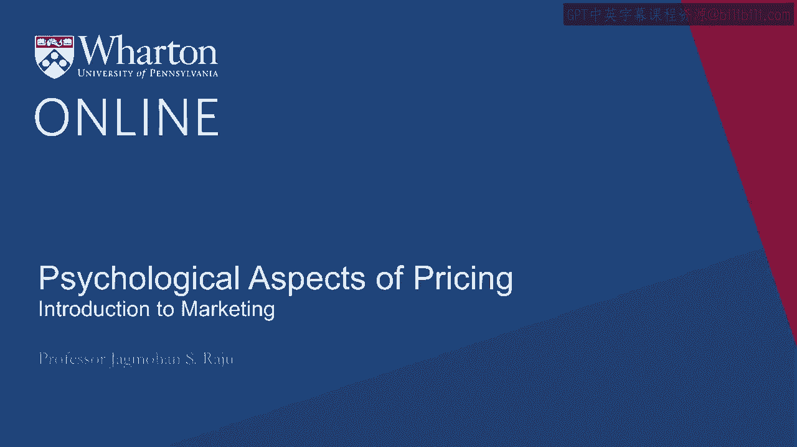
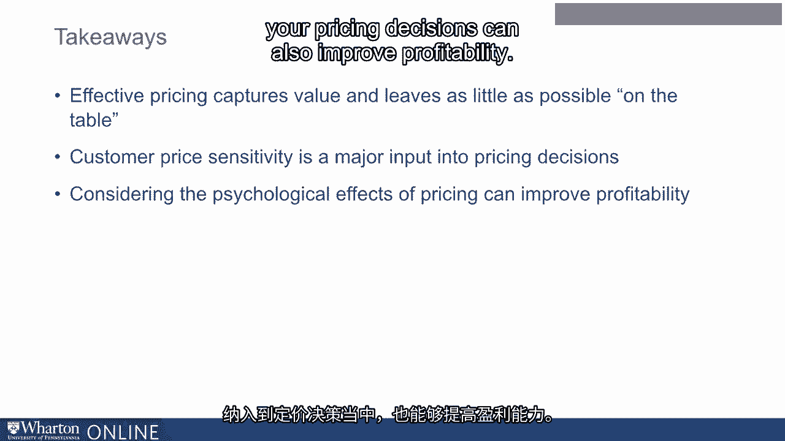

# 沃顿商学院《商务基础》第23课：定价的心理因素 🧠💰

在本节课中，我们将探讨定价决策中一个至关重要的维度：心理学。除了经济学和统计学，心理学同样是理解消费者如何感知和响应价格的关键。我们将学习几个核心的心理效应，了解它们如何影响消费者的购买决策，并最终影响企业的盈利能力。

---

## 概述：定价不仅仅是数字

定价决策不仅涉及成本与利润的计算，更与消费者的心理感知紧密相连。心理学家对定价进行了深入研究，揭示了多个影响消费者行为的关键发现。本节课程将逐一解析这些心理效应，并说明如何将其应用于实际的定价策略中。

---

## 1. 九数定价法 🛒

九数定价法是一种广泛使用的定价策略，指价格以数字9（或5）结尾。大量实验表明，这种定价方式能显著影响销售。

以下是两个经典研究案例：

*   **人造黄油实验**：当人造黄油价格从**83美分**降至**63美分**时，销量增长了**194%**。然而，当价格仅再降低**4美分**至**59美分**（一个九数结尾的价格）时，销量却激增了**400%**以上。这表明，较小的降价幅度因创造了“九数结尾”，反而带来了更大的销售提升。
*   **服装目录实验**：研究人员在商品目录中将同一件连衣裙标以不同价格：**34美元**、**39美元**和**44美元**。结果发现，销量最高的并非最低价（34美元），而是**39美元**。消费者将九数结尾的**39美元**感知为“促销价”，从而更愿意购买。

**核心要点**：九数结尾的价格常被消费者潜意识地认为是更优惠或正在促销的价格，从而能有效提升销量。尽管并非所有研究都支持这一效应，但由于缺乏强有力的反面证据，该实践在零售业中仍被广泛采用。

---

## 2. 韦伯-费希纳定律 ⚖️

上一节我们看到了价格尾数如何影响感知，本节我们来看看消费者对价格变化的反应模式。韦伯-费希纳定律（更准确地说是一种经验概括）指出：消费者对价格变化的反应更多地基于**百分比变化**，而非**绝对金额变化**。

**公式表达**：消费者的价格敏感度 ∝ (Δ价格 / 初始价格)

**一个简单例子**：
*   大多数消费者愿意为了在**10美元**的商品上节省**5美元**（50%的折扣），而驱车5英里。
*   但同样的消费者，通常不愿意为了在**1000美元**的商品上节省同样的**5美元**（仅0.5%的折扣），而驱车同样的5英里。

从理性角度看，节省的5美元是等值的。但实践中，消费者更关注**节省金额占原价的百分比**。您可以自省一下，自己的行为是否与此一致。

---

## 3. 禀赋效应 🏆

禀赋效应描述了一种简单的心理现象：**拥有感会提高消费者的支付意愿**。

**课堂实验**：
1.  告诉A组学生：“课程结束后你将获得一个马克杯（标价7.5美元）。你愿意以什么价格将它卖给没得到杯子的同学？”
2.  告诉B组学生：“你没有得到马克杯。你愿意出多少钱从其他同学那里购买这个杯子？”

**结果**：尽管杯子是虚拟拥有的，且双方都知道其标价，但**A组（拥有者）的卖出要价 consistently 高于 B组（购买者）的愿意支付价格**。

**商业启示**：让消费者在购买前就产生“拥有感”。例如，汽车试驾时，让顾客独自驾驶（而非销售陪同），能增强其对该车的拥有感和情感联系，从而提高成交几率和支付意愿。

---

## 4. 参考价格 📊

消费者很少孤立地看待一个价格。他们会在心中将其与某个**参考价格**进行比较，判断当前价格是“好”还是“坏”。这个参考价格通常基于过去观察到的价格历史。

**如何操纵参考价格？**
*   **标出“原价”**：将当前售价与一个更高的“原价”（制造商建议零售价）并列，创造折扣感。
*   **锚定高价**：在电视购物广告中，主持人常从一个极高的价格开始介绍，以此设定消费者的初始参考点，随后给出的“优惠价”就显得格外超值。

**代码示例（伪代码）**：
```python
reference_price = customer.memory.historical_prices.max()  # 参考价格可能是历史最高价
perceived_value = (reference_price - current_price) / reference_price  # 感知到的折扣比例
if perceived_value > threshold:
    customer.is_likely_to_buy = True
```

---

## 5. 情境效应（诱饵效应） 🎯

消费者的选择会受到**选项组合**的显著影响。这种效应是“好-更好-最好”产品线策略的心理学基础。

**研究场景**：
*   **情境A**：货架上只有两款相机，价格分别为 **169美元** 和 **239美元**。
*   **情境B**：货架上有三款相机，价格分别为 **169美元**、**239美元** 和 **469美元**。

**研究发现**：在情境B中，加入高价选项（469美元）后，消费者选择**中间价位（239美元）** 的比例显著增加。高价选项像一个“诱饵”，使得中间选项显得更具性价比，从而提升了其销量。

**商业策略**：这就是“好-更好-最好”策略。提供三个版本（而非两个）的产品，可以有效地将消费者需求引导至利润可能更高的**中间（“更好”）** 版本。

---

## 总结与回顾 🎓

本节课我们一起学习了定价中的关键心理因素。我们了解到：

1.  **九数定价法**能利用消费者的心理错觉提升销量。
2.  **韦伯-费希纳定律**解释了消费者为何更关注价格变化的百分比而非绝对值。
3.  **禀赋效应**表明，创造拥有感能直接提高支付意愿。
4.  **参考价格**是消费者评估交易价值的内心标尺，可以被巧妙设定。
5.  **情境效应（诱饵效应）** 揭示了选项设置如何影响消费者的最终选择，支持了“好-更好-最好”的产品线策略。




有效的定价不仅是价值的捕获，更是一场与消费者心理的对话。理解并整合这些心理学洞察，能够帮助企业在定价时“少留钱在桌上”，从而显著提升盈利能力和市场竞争力。