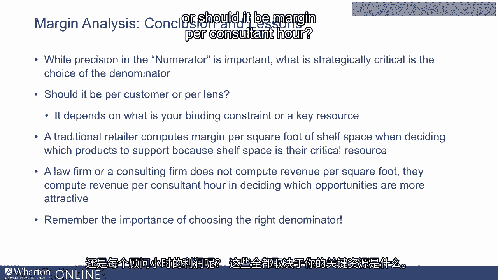
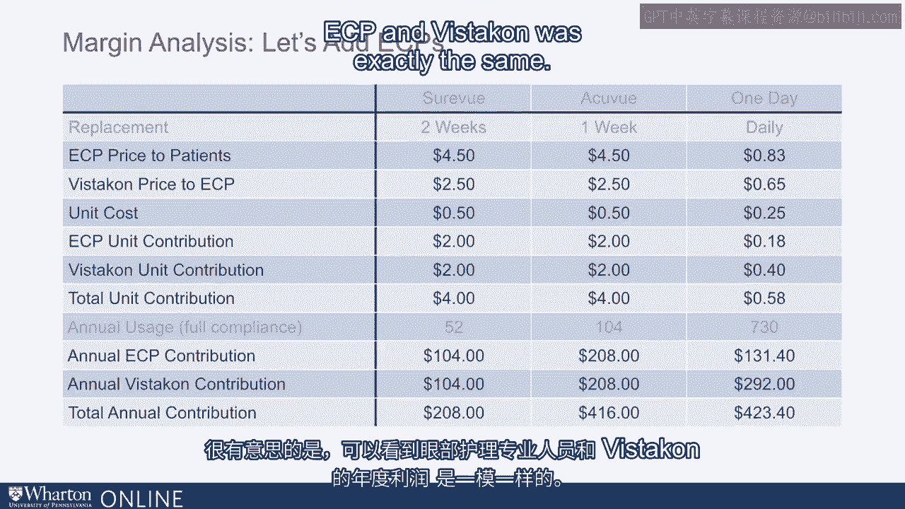
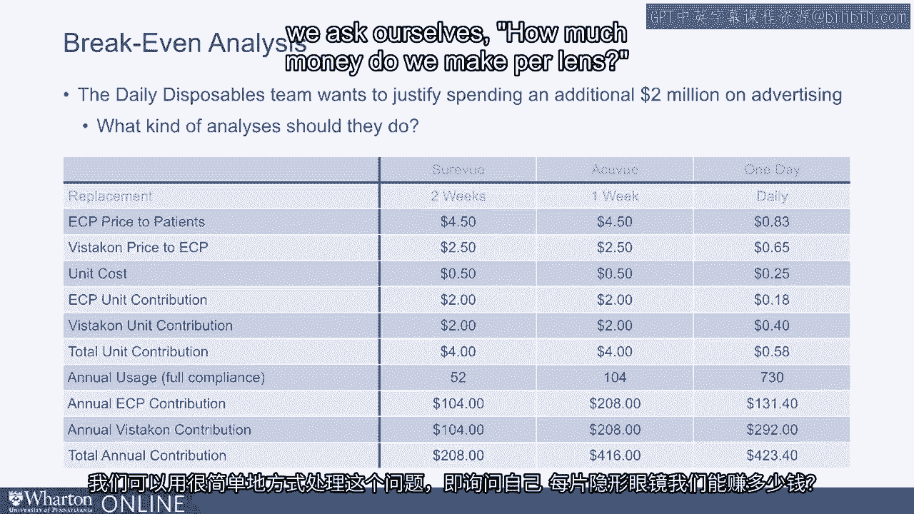
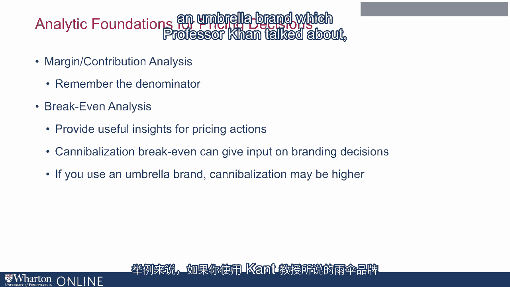

# 沃顿商学院《商务基础》课程 P24：定价的分析基础 📊

在本节课中，我们将讨论定价决策的一些基本分析基础。我们将聚焦于三个关键主题：**边际与贡献分析**、**盈亏平衡分析**以及**顾客经济价值**。这些分析工具能帮助我们更清晰地理解定价策略背后的逻辑与影响。

---

## 1. 边际与贡献分析 💰

上一节我们介绍了课程概述，本节中我们来看看第一个核心概念：边际与贡献分析。我们通过一个来自强生子公司Wistecon的隐形眼镜案例来理解这个概念。

Wistecon最初推出了名为AccuView的周抛型隐形眼镜，每片成本0.5美元，建议售价为患者4.5美元，视光师采购价2.5美元。随后，他们针对用户延长使用周期的行为，推出了双周抛型产品SureView，定价与AccuView相同。公司还计划推出日抛型产品“一日AccuView”，每片制造成本0.25美元，计划以0.65美元卖给视光师，最终患者支付0.83美元。

在计划推出新产品时，Wistecon需要思考几个问题：新产品会蚕食现有产品吗？消费者真的需要它吗？渠道伙伴（视光师）会支持吗？简单的边际分析可以帮助我们解答部分疑问。

以下是进行边际分析的步骤：

首先，我们计算每款产品的边际贡献（售价 - 单位成本）：
*   **SureView (双周抛)**： 患者价 $4.50 - 视光师价 $2.50 = **$2.00** (Wistecon边际)
*   **AccuView (周抛)**： 患者价 $4.50 - 视光师价 $2.50 = **$2.00** (Wistecon边际)
*   **一日AccuView (日抛)**： 患者价 $0.83 - 视光师价 $0.65 = **$0.40** (Wistecon边际)

仅看每片镜片的边际，似乎SureView和AccuView更赚钱。但我们需要考虑**每个客户每年的总贡献**。

以下是基于年使用量的客户贡献计算：
*   **SureView**： 每年52周 * 2只眼睛 = 104片？不，双周抛每只眼睛每年用26片，两只眼睛用52片。$2.00/片 * 52片 = **$104/客户/年**
*   **AccuView**： 每周更换，每年104片。$2.00/片 * 104片 = **$208/客户/年**
*   **一日AccuView**： 每天更换，每年730片。$0.40/片 * 730片 = **$292/客户/年**

从每个客户的角度看，日抛产品反而最有利可图。这个分析引出了一个关键点：**选择正确的分析分母至关重要**。

如果公司的关键约束资源是**生产能力**（例如，每年只能生产固定数量的镜片），那么应关注“**每片镜片的边际**”。如果关键约束是**客户数量**（市场有限），那么应关注“**每个客户的边际**”。零售商关注每平方英尺货架的利润，因为货架空间是他们的关键资源；而咨询公司关注每个咨询师工时的收入，因为咨询师时间是他们的关键资源。选择错误的分母会导致错误的决策。

在本案例中，我们假设Wistecon没有产能限制，关键约束是客户数量。因此，日抛产品更具吸引力。

接下来，我们还需要分析渠道伙伴（视光师）的动机。计算视光师从每个客户身上获得的年贡献：
*   **SureView**： ($4.50 - $2.50) * 52片 = **$104/客户/年**
*   **AccuView**： ($4.50 - $2.50) * 104片 = **$208/客户/年**
*   **一日AccuView**： ($0.83 - $0.65) * 730片 = **$131.40/客户/年**

对于视光师而言，推销日抛产品（$131.40）的收益低于推销周抛产品（$208），且可能需要更多库存管理和资金占用，因此他们可能缺乏推广动力。此外，在原有产品中，Wistecon和视光师的利润是均分的（各$104或$208），但在日抛产品计划中，这种均分被打破（Wistecon获$292，视光师获$131.40），可能引发公平性质疑。

**什么是边际分析？** 它本质上是为价值链上的每个成员（公司、渠道、用户）、产品线内的每个相关产品（通常也包括竞品）列出的成本与价格表格。它能揭示交易中各方的动机，通过仔细审视，我们可以发现潜在问题，如产品蚕食和渠道冲突，并为后续分析提供有用信息。

---

## 2. 盈亏平衡分析 ⚖️

上一节我们探讨了边际分析，本节中我们转向第二个实用工具：盈亏平衡分析。它在定价及其他商业决策中极为有用。我们将讨论三种类型。

### 类型一： justifying 营销支出

假设日抛产品团队计划投入200万美元广告预算。他们如何向管理层证明这笔开支的合理性？

分析思路是：我们需要卖出多少额外产品才能覆盖这笔成本。
*   每售出一片日抛镜片，Wistecon获利： `$0.65 - $0.25 = $0.40`
*   覆盖$2,000,000广告费需额外售出镜片数： `$2,000,000 / $0.40 = 5,000,000片`

但更好的表达方式是将其转化为**客户数**，因为广告影响的是用户而非镜片本身。
*   假设每个客户每年使用730片镜片。
*   需获得的新客户数： `5,000,000片 / 730片/客户 ≈ 6,849名客户`

因此，如果能通过广告获得至少6,849名新用户，这笔预算就是合理的。这再次强调了使用正确“分母”（客户而非镜片）来传达信息的重要性。

### 类型二：评估降价影响

之前提到，为使视光师与公司利润均等，Wistecon考虑将日抛产品的批发价从0.65美元降至0.54美元。降价后，公司每片边际变为： `$0.54 - $0.25 = $0.29`。

我们需要计算，在边际从0.40美元降至0.29美元后，需要增加多少销量才能保持总利润不变。

设原销量为Q，原总利润为 `Q * $0.40`。降价后，设新销量为Q‘，需满足 `Q' * $0.29 = Q * $0.40`。
因此， `Q' = Q * ($0.40 / $0.29) ≈ Q * 1.379`。

这意味着**销量需要增长约37.9%**才能盈亏平衡。公司可以通过小范围市场测试来验证这个增幅是否可能实现。如果计算出的所需增幅不切实际（例如200%），则可以提前否决该降价方案。

### 类型三：蚕食效应盈亏平衡分析

推出新产品时，蚕食现有产品销量是常见担忧。但在这个案例中，由于日抛产品每个客户贡献（$292）远高于周抛（$208）和双周抛（$104），我们甚至希望客户转向新产品，因此蚕食不是问题。

为了理解这个概念，我们以Wistecon历史上推出SureView（双周抛）时可能面临的情况为例。当时市场上已有AccuView（周抛）。

*   AccuView客户年贡献：**$208**
*   SureView客户年贡献：**$104**

我们想知道，在推出SureView时，能从AccuView那里承受多大程度的客户流失（蚕食）而不至于亏损。

假设我们获得了100名SureView新客户，他们为我们带来利润： `100 * $104 = $10,400`。
现在调查他们之前用什么产品。设其中有X人之前是AccuView用户。
那么，我们因蚕食而损失的AccuView利润为： `X * $208`。
要使SureView的推出不造成整体利润下降，需满足： `100 * $104 > X * $208`。
解得： `X < (100 * $104) / $208 = 50`。

这意味着，**蚕食率不能超过50%**。如果100个SureView客户中有超过50个来自AccuView，那么总利润就会下降。

更通用的蚕食盈亏平衡公式为：
**可容忍最大蚕食率 = 新产品边际 / 旧产品边际**
在本例中： `$104 / $208 = 50%`

如果现有产品不止一个，分母可以使用现有产品的加权平均边际。

---

## 总结 📝

本节课我们一起学习了定价决策的三个核心分析基础。

1.  **边际与贡献分析**：关键在于不仅精确计算分子（边际利润），更要**选择正确的分析分母**（如每片镜片、每个客户、每平方英尺货架、每个咨询师小时），这取决于企业的关键约束资源。错误的分母会导致完全相反的结论。
2.  **盈亏平衡分析**：我们探讨了三种应用：
    *   **justifying 投资**（如广告）：计算需要多少额外销量或客户来覆盖成本。
    *   **评估价格变动**：计算降价后需要多少销量增长才能维持利润。
    *   **评估新产品蚕食效应**：计算新产品可以承受多大程度的现有客户转移而不致亏损。通用公式为：**可容忍蚕食率 = 新产品边际 / 旧产品边际**。

这些分析工具不仅帮助我们做出更好的定价决策，更能辅助我们做出更明智的整体商业决策。记住，清晰的量化分析是剥离复杂表象、洞察问题核心的有效方法。