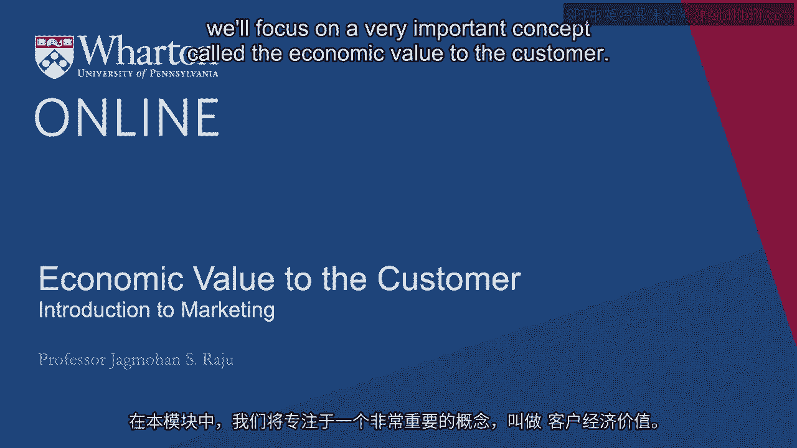

# 沃顿商学院《商务基础》课程 P25：客户的经济价值 💰

在本节课中，我们将聚焦于一个非常重要的概念——**客户的经济价值**。这个概念在多个商业决策中都非常有用，例如为新产品定价、评估创意的经济可行性、确定目标客户以及识别真正的竞争对手。

---

## 什么是客户的经济价值？

客户的经济价值，通常简称为 **EVC**，其核心含义是：**客户在现有解决方案与你的新方案之间感到无差异时，愿意为新方案支付的最高价格**。

为了理解这个概念，我们来看一个案例研究。

### 案例：泳池清洁难题

我曾在家中拥有一个约20，000加仑的泳池。每年冬天，池水都会变脏，春天需要花费大量时间和精力清理。我的旧方法是：在秋天将池水全部排干，春天再重新注满。

*   **排水成本**：市政卡车运走废水，费用约为 **1美元/千加仑**。20，000加仑就是 **20美元**。
*   **注水成本**：使用自来水，费用约为 **1美元/百加仑**。20，000加仑就是 **200美元**。

因此，我每年处理泳池的总成本是 **20美元 + 200美元 = 220美元**。

后来市场上出现了一种新药片，声称只需在秋天将其投入池中并盖上安全罩，来年春天池水就能清澈如初。这引出了核心问题：**我愿意为这个新药片支付多少钱？**

**EVC的计算**：
*   现有方法的总成本 = **$220**
*   如果药片价格 **高于 $220**，我会觉得旧方法更便宜，不感兴趣。
*   如果药片价格 **低于 $220**，我会产生兴趣。
*   如果药片价格 **等于 $220**，我对新旧方法感到无差异。

因此，在这个案例中，这个新药片对我的**经济价值就是220美元**。它代表了我愿意支付的最高价格，也是药片发明者能收取的最高价格。

---

## EVC的应用场景

理解了EVC的计算后，我们来看看它能如何指导实际商业决策。

### 1. 为新产品定价 💡

EVC直接为新产品的定价提供了上限。发明者可以根据成本和期望利润，在 **$0** 到 **$220** 之间设定价格。

如果产品的制造成本高于EVC（例如成本$240，EVC$220），那么这个创意可能在经济上不可行，需要重新评估或放弃。这帮助做出 **“继续/放弃”** 的决策。

### 2. 市场细分与目标客户选择 🎯

上一节我们介绍了EVC的基本概念，本节中我们来看看如何用它来识别最佳客户。

我们可以问：基于EVC分析，哪些客户会愿意为这个新药片支付更高的价格？

以下是可能的答案：

*   **拥有更大泳池的人**：如果药片也适用于30，000加仑的泳池，那么EVC会更高（例如$330）。**然而，在实践中很难识别谁拥有更大泳池**，因此这虽然是一个好的细分概念，但执行困难。
*   **居住在水处理或淡水成本更高地区的人**：这基于地理位置进行细分（例如按邮政编码）。某些地区处理废水的成本可能更高，甚至为零。**这种方法易于识别和实施**，是更有效的细分变量。
*   **环保意识更强的人**：他们可能愿意为省水而支付溢价。但**定义和识别这类人群非常困难**（他们是否住在特定类型的房子里？是否穿绿色T恤？），因此不是一个可操作的细分标准。

**总结**：EVC分析能为我们提供深刻的见解，告诉我们如何根据可观察、可操作的变量（如地理位置）来细分市场并选择目标客户。

### 3. 结合客户终身价值进行深度分析 🔍

我们可以将EVC与之前课程中提到的**客户终身价值**概念结合起来，形成一个强大的分析框架。

想象一个2x2矩阵：

| | **低客户经济价值 (EVC)** | **高客户经济价值 (EVC)** |
| :--- | :--- | :--- |
| **高客户终身价值 (CLV)** | **对我们感兴趣，但我们不感兴趣**   例如：泳池小、喜欢自己动手，但忠诚度高、购买频繁的客户。 | **最佳目标客户**   例如：泳池大、水费高，且忠诚、重复购买的客户。 |
| **低客户终身价值 (CLV)** | **应避免的客户**   例如：很少使用产品、也不看重其价值的客户。 | **对我们感兴趣，但维护成本高**   例如：看重产品但购买不频繁、需要大量支持的客户。 |

这个框架帮助我们超越单一维度，从 **“客户是否看重我们”** 和 **“我们是否看重客户”** 两个角度深度理解客户群，从而做出更精准的目标客户选择。

### 4. 识别真正的竞争对手 🥊

EVC还能帮助我们重新定义竞争。一个更广阔的视角是：**谁会在我们成功时遭受损失？**

对于泳池清洁药片：
*   **损失方1**：运走废水的公司（业务减少）。
*   **损失方2**：供应淡水的自来水公司（账单收入下降）。

因此，竞争不仅仅是其他药片制造商，**还包括那些价值会因我们产品成功而流出的行业**。理解这一点，有助于我们预测这些“隐形”竞争对手可能做出的反应（如降价、游说），从而制定更全面的市场进入策略。

---

## 定价：作为价值分享的规则 ⚖️

现在，让我们更详细地探讨如何利用EVC做出更优的定价决策。

我们可以将一次创新创造的总价值定义为：**EVC - 产品成本**。

以药片为例：
*   **EVC** = $220
*   **产品成本** = $20
*   **创造的总价值** = $220 - $20 = **$200**

这个200美元的价值需要在**企业**和**客户**之间进行分配。**价格本质上成为了一个价值分享规则**。

假设我们定价为 **$100**：
*   **客户获得的激励（节省）** = EVC - 价格 = $220 - $100 = **$120**
*   **企业获得的利润** = 价格 - 成本 = $100 - $20 = **$80**

如果我们提高价格到$140：
*   客户节省减少到$80。
*   企业利润增加到$120。

因此，定价决策就是在**激励客户转换**和**保障企业利润**之间寻找平衡点。

### 引入渠道合作伙伴

如果产品通过零售商（如泳池用品店）销售，我们需要考虑三方利益。

假设：
*   我们（制造商）以 **$70** 的价格卖给零售商。
*   零售商以 **$100** 的价格卖给最终客户。
*   那么，**零售商利润** = $100 - $70 = **$30**

我们需要评估：
1.  $30的利润对零售商是否有足够吸引力？（对比他销售其他产品的利润）
2.  $120的节省对客户是否有足够吸引力？
3.  $50的利润对我们自己（$70 - $20成本）是否足够？

**如果创造的总价值（$200）不够大，就很难同时让制造商、渠道商和客户都感到满意，创新也就难以成功。**

---

## 总结 📝

本节课我们一起学习了**客户的经济价值**这一核心概念及其广泛应用。

**EVC是客户为你的新方案愿意支付的最高价格，即令其新旧方案无差异的价格点。**

它的主要用途包括：
1.  **为新产品/服务定价**：提供价格上限，并帮助评估创意的经济可行性。
2.  **市场细分与目标客户选择**：帮助识别哪些客户群体对你的产品价值评估更高，并指导如何有效地找到他们。
3.  **深度客户分析**：结合客户终身价值，精准定位“既看重我们，我们也看重”的最佳客户群。
4.  **识别广义竞争对手**：找出那些会因你成功而价值受损的各方，预判竞争反应。
5.  **优化定价策略**：将定价视为企业与客户之间分享创新价值的规则，并在引入渠道时平衡各方利益。

无论是计划推出新品，还是重新思考现有产品的定价策略，EVC都是一个极其强大的分析工具。