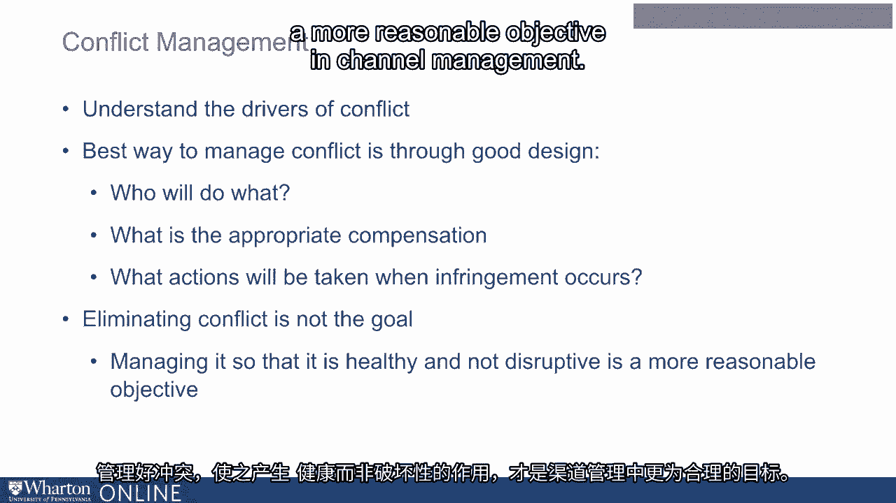

# 沃顿商学院《商务基础》课程 P28：管理渠道冲突 🛒

在本节课中，我们将聚焦于一个非常重要的概念：**管理渠道冲突**。当企业借助合作伙伴将产品或服务推向市场时，冲突就可能出现。理解冲突何时发生以及如何缓解它至关重要。

---

## 渠道冲突的类型

上一节我们引入了渠道冲突的概念，本节中我们来看看冲突的两种主要类型。

**1. 垂直冲突**
这是指企业与其渠道合作伙伴（如零售商、分销商）之间的冲突。一个经典案例是多年前好市多决定不在其店内销售可口可乐，这即是可口可乐公司与其零售商好市多之间的冲突。

**2. 水平冲突**
这是指不同渠道合作伙伴之间的冲突，它会扰乱整个渠道的运作。水平冲突有多种形式，但一个主要的表现是 **“搭便车”** 问题。

---

## 深入理解“搭便车”问题

“搭便车”通常发生在低服务、低价格的零售商损害了高服务、高价格的零售商利益时。

以下是“搭便车”的两种常见表现：

*   **展厅现象**：消费者前往提供高服务（如产品体验、专业咨询）的实体店了解产品，获取信息，然后转向低服务、低价格的线上或线下商店完成购买。例如，百思买曾声称自己成了亚马逊的“展厅”。
*   **网络展厅现象**：消费者在线上（如亚马逊）研究、比较产品信息，然后因为急需（例如第二天要看超级碗比赛），转而前往能立即提货的实体店购买。这是线上对线下的“搭便车”。

---

## 如何管理渠道冲突

了解了冲突的根源后，我们来看看管理策略。管理冲突的最佳方式在于渠道的良好设计。

管理渠道冲突的核心步骤如下：

1.  **明确职责**：清晰界定渠道中各方的角色与任务。例如，谁负责提供产品信息与体验，谁负责物流配送。
2.  **设计合理补偿**：根据各方承担的活动和提供的价值，设计公平的报酬或利润分配机制。
3.  **设定规则与后果**：预先明确当发生违规行为（如跨区销售、破坏定价策略）时将采取的措施。
4.  **确立管理目标**：完全消除冲突并非目标。**管理的目标是使冲突保持在健康、非破坏性的范围内**，以此促进渠道的整体效率。

---

## 总结

本节课中，我们一起学习了渠道冲突的管理。我们首先区分了 **垂直冲突**（企业与渠道伙伴之间）和 **水平冲突**（渠道伙伴之间）。接着，我们重点探讨了水平冲突中的核心问题——**“搭便车”**，并通过“展厅现象”和“网络展厅现象”两个实例加以说明。最后，我们明确了管理渠道冲突的关键在于良好的渠道设计，包括明确职责、合理补偿、设定规则，并以管理而非消除冲突为目标。