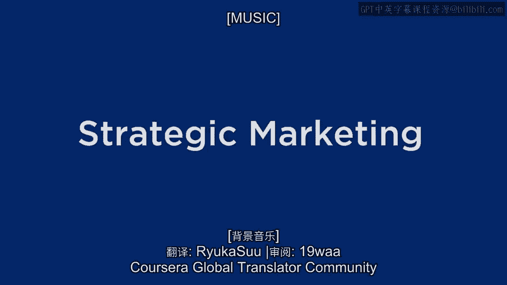
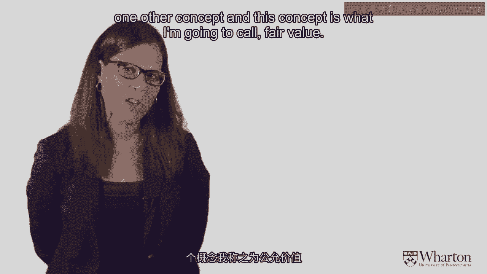
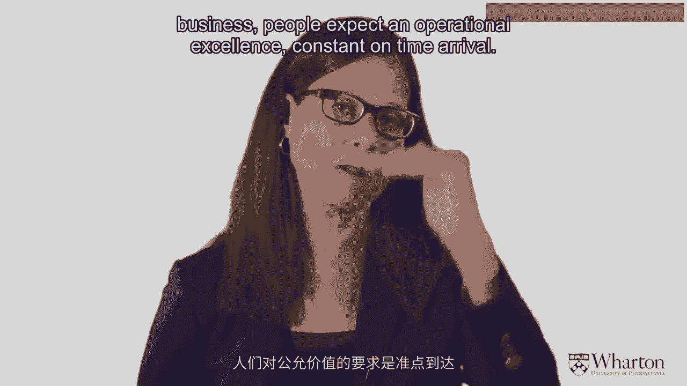
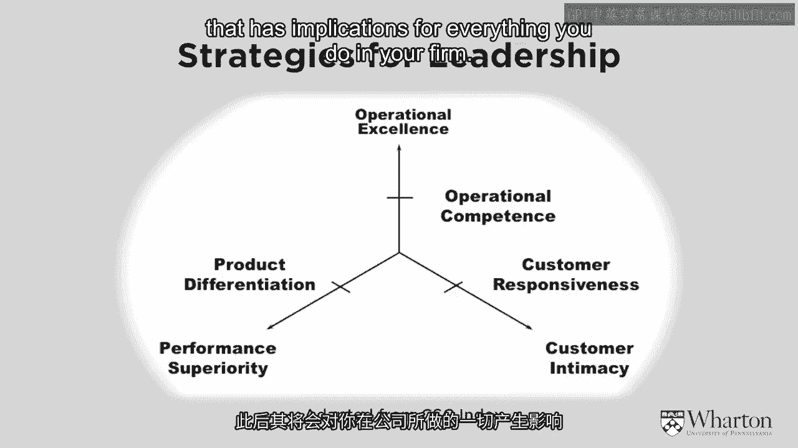
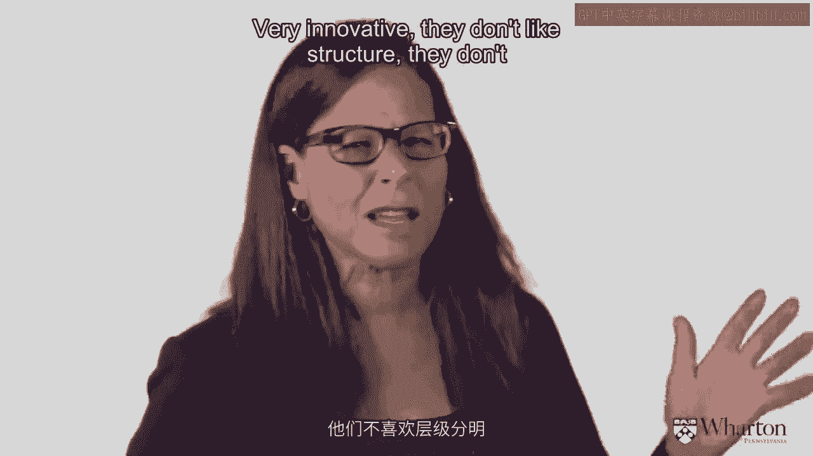
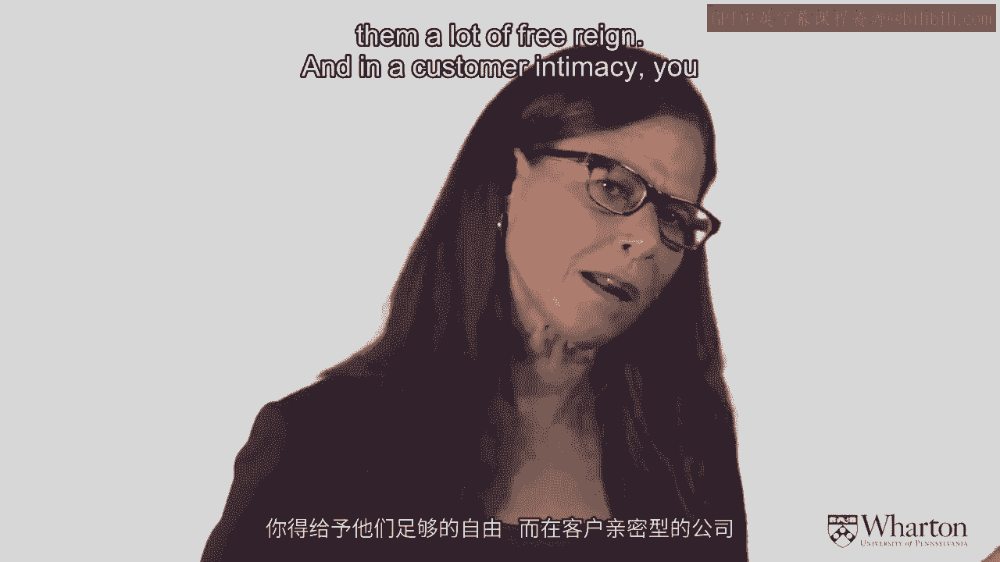
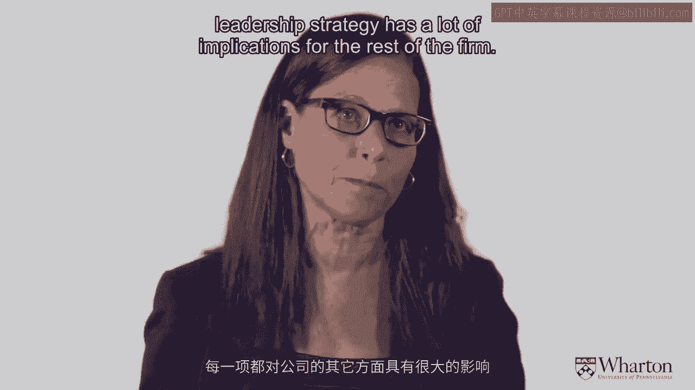

# 沃顿商学院《商务基础》课程 P3：战略营销框架 🧭

在本节课中，我们将学习一个用于思考市场竞争、并成为市场领导者的实用战略框架。该框架基于特雷西和维尔斯曼的著作《市场领导力》，并经过一定调整。我们将深入探讨其核心原则、价值地图概念以及如何应用该框架制定市场战略。

## 核心原则

为了使这个框架有效，我们必须接受并遵循两个核心原则。这些原则是框架运作的基础。

### 原则一：了解你的市场

当前，大多数企业都采用以客户为中心的营销模式。在竞争激烈、全球化的市场中，只有专注于客户需求才能获胜。因此，使用本框架的首要前提是：**你必须了解客户的需求，并预判竞争对手的反应**。这不能仅凭猜测，必须通过市场调研来实现。你的目标是找到一种比竞争对手更好地提供客户价值的方式，即实现**差异化**。

### 原则二：客户拥有最终决定权

这是一个非常明确的假设。它认为客户在决策时，面对海量信息，会将产品属性归纳为三个“价值束”进行评估：

1.  **运营卓越**：包括价格、成本、交付、服务、可靠性等因素。
2.  **产品领先**：包括产品特性、设计、风格、创新和技术。
3.  **客户亲密**：指产品满足客户个性化需求的程度。

客户会为每个价值束打分，然后选择**对他们最重要的那个价值束中表现最佳的产品**，同时要求该产品在其他两个价值束上达到“足够好”的水平。这意味着，企业若想成为市场领导者，必须在**某一项上做到最好**，并在其他两项上保持合格。

这个决策逻辑对企业的战略、组织结构、资源分配和人才招聘都有深远影响。

## 价值地图概念

在展示框架之前，需要引入“价值地图”的概念。

价值地图的纵轴是**客户的相对成本**（通常与价格相关），横轴是**客户的相对收益**。其核心思想是：提供更多收益，客户愿意支付更高价格；收取更低价格，客户会预期较少收益。市场中存在一条 **“公平价值线”**。

*   **公平价值线**：代表了客户感知中“价格与收益相匹配”的基准线。
*   如果你的产品落在公平价值线以下（即收益低但价格高），客户会认为不值，产品将被市场淘汰。
*   战略目标是：在你计划领先的那个价值束上，提供**超越公平价值**的收益；而在其他两个价值束上，至少达到公平价值。

但需要注意的是，公平价值线并非静止不变。在竞争市场中，一旦有竞争者（例如苹果公司通过卓越设计）提供了超越公平价值的产品，其他玩家便会效仿或削弱其优势，从而导致整个市场的公平价值线向右下方移动——客户对“物有所值”的期望会随时间不断提高。

## 市场领导力框架

基于以上原则和概念，我们来看具体的战略框架。该框架围绕三个核心价值束构建：

1.  **运营卓越**
2.  **产品领先**
3.  **客户亲密**

框架图中的三条阴影线分别代表这三个维度上的 **“公平价值线”**。

### 应用框架的步骤

以下是使用该框架制定战略的具体步骤：

**第一步：定义你所在市场的价值维度**
你需要针对自己的市场，具体定义每个价值束包含哪些产品属性。
*   `运营卓越` 在你的市场中指什么？（例如：准时交付、低成本、无差错）
*   `产品领先` 在你的市场中指什么？（例如：前沿科技、独特设计、强大功能）
*   `客户亲密` 在你的市场中指什么？（例如：高度定制、专属服务、快速响应）

**第二步：确定各维度的公平价值线位置**
这是最具挑战性的一步。你需要通过市场研究来判断客户对每个维度的期望基准在哪里。有时公平价值可能是市场平均水平，有时可能高于或低于现有玩家的普遍表现（例如，航空业中乘客期望的准点率可能高于大多数航空公司的实际表现）。

**第三步：绘制你公司与竞争对手的位置**
评估你的公司在三个维度上，相对于公平价值线，是处于**之上、持平还是之下**。同时对主要竞争对手进行同样的评估。

**第四步：制定市场战略**
基于以上分析，开始规划战略。
*   **长期战略**：目标是成为**某一个维度上的最佳者**，同时在另外两个维度上保持“足够好”（达到或超过公平价值）。
*   **短期战略**：可能是为实现长期目标而采取的过渡措施。例如，如果你的长期目标是成为客户亲密领域的领导者，但目前你在运营卓越维度上还未达到公平价值，那么短期战略可能就是先提升运营水平至公平价值。

### 战略选择对组织的影响

一旦确定了领导力战略，它将深刻影响公司的方方面面：

*   如果选择 **`运营卓越`** 战略，公司通常需要**层级分明、结构严谨**，资源优先投向信息技术和流程优化。
*   如果选择 **`产品领先`** 战略，公司需要更像一个**研发中心**，雇佣富有创新精神的人才，给予他们更多自由，而非自上而下的严格管控。
*   如果选择 **`客户亲密`** 战略，公司必须**优先进行市场研究和客户知识管理**，培养一种“客户至上”的咨询式或服务型文化。

## 总结

本节课我们一起学习了特雷西和维尔斯曼的市场领导力框架。我们首先理解了框架依赖的两大核心原则：深入了解市场，以及客户根据核心价值束做决策的假设。接着，我们引入了价值地图和动态公平价值线的概念。最后，我们详细拆解了应用该框架的四步法：定义维度、确定公平价值、评估位置、制定长短结合的战略，并了解了不同战略选择对组织结构的深远影响。这个工具能帮助你系统地思考如何在竞争市场中找准定位，并构建相应的能力以成为领导者。