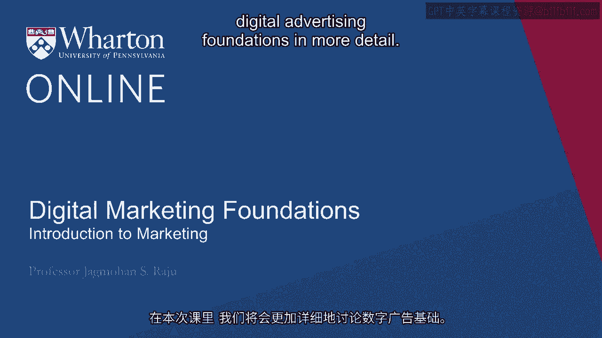
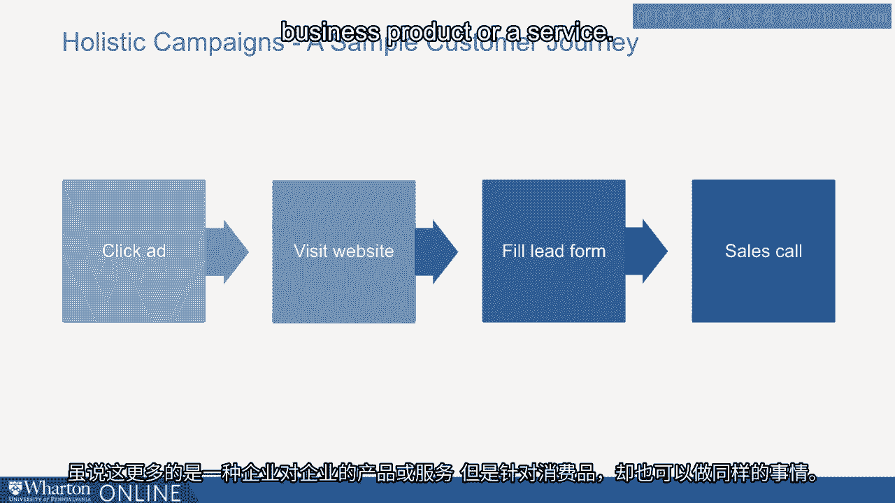
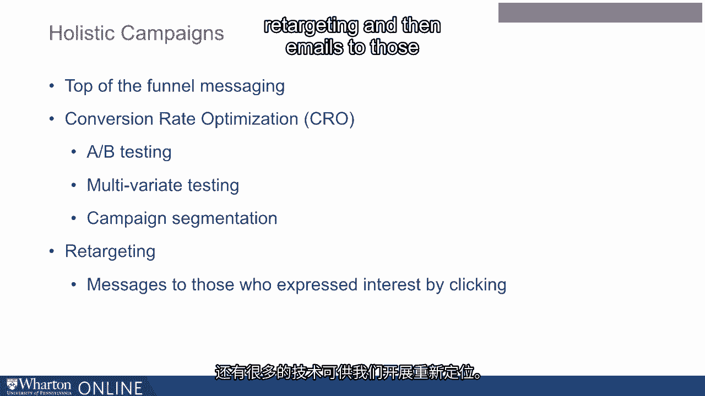

# 沃顿商学院《商务基础》｜第30课：数字营销基础 📊

在本节课中，我们将详细探讨数字广告的基础知识。我们将了解消费者决策过程的核心模型，并学习数字营销人员可使用的各种工具，分析它们在创造需求与捕获需求中的作用。

---

## 消费者决策过程：AIDA模型

无论你从事何种业务，数字广告对每家公司都至关重要。理解消费者是第一步。消费者在决定购买新产品或服务时，会经历一系列步骤，从非购买者转变为购买者。心理学家和营销专家对此过程进行了深入研究。

无论参考哪种模型，共识是消费者不会一步就从非购买者变成购买者。这个过程包含一系列步骤。

以下是消费者决策过程的四个关键阶段：

1.  **注意**：消费者首先注意到产品或服务。
2.  **兴趣**：消费者对产品或服务产生潜在兴趣。
3.  **欲望**：消费者产生购买该产品或服务的欲望。
4.  **行动**：消费者最终采取行动，决定购买或不购买。

这个模型通常被称为 **AIDA模型**。在任何一个阶段，你都可能失去消费者。因此，引导消费者完成决策过程的所有阶段至关重要。

---

## 创造需求 vs. 捕获需求

上一节我们介绍了AIDA模型，本节中我们来看看如何将其应用于营销策略。我们可以将这个过程分为两个关键部分。

*   前三个步骤（注意、兴趣、欲望）可归类为 **创造需求**。
*   最后一个步骤（行动）则可视为 **捕获需求**。

在传统营销中，需求通过电视广告、广告牌、报纸广告等方式创造，然后通过优惠券、店内陈列、销售人员说服等方式捕获。

数字营销则提供了一套不同的工具，旨在影响消费者的多项决策：**是否购买**、**购买哪个品牌**、**何时购买**以及**在哪里购买**。

---

## 数字营销工具一览

现在，让我们看看数字营销人员可支配的各种工具，并分析它们主要属于创造需求还是捕获需求。

以下是主要的数字营销工具及其简要说明：

*   **搜索广告**：当用户搜索“购买鞋子”时，出现在搜索结果中的付费广告。**（主要捕获需求）**
*   **搜索引擎优化**：优化网站以提高其在搜索引擎结果中的自然排名。**（主要捕获需求）**
*   **展示广告**：出现在网站或应用上的图片或横幅广告。**（主要捕获需求）**
*   **社交媒体广告**：在社交媒体平台上投放的广告。**（兼具两者，但更偏向捕获需求）**
*   **再营销广告**：向访问过你网站但未购买的用户展示的广告。**（主要捕获需求）**
*   **电子邮件营销**：向潜在或现有客户发送营销信息。**（兼具创造与捕获需求）**
*   **视频/博客/社交媒体帖子**：创建内容来吸引和教育受众。**（更偏向创造需求）**
*   **移动应用**：通过应用与用户互动并提供服务。**（兼具两者）**
*   **转化率优化**：通过测试和改进网站来提高访客转化为买家的比例。**（主要捕获需求）**

不难看出，**大部分数字营销工具都侧重于捕获需求**。

---

## 数字营销的利弊

专注于捕获需求有其优势。它聚焦于结果（即销售），这正是大多数公司关心的。它通常拥有更好的效果衡量指标，如果执行得当，可以具有很高的成本效益。

然而，它也存在一些缺点。它通常**不扩大整体市场规模**，在**品牌建设**方面可能较弱，可能**不影响客户忠诚度**，并且更像一种“等待游戏”——我们主要是在消费者决定购买后，才去影响他们的选择，而不是主动说服他们产生购买需求。

因此，数字广告面临的一个挑战是：**如何设计从始至终的整体营销活动，不仅专注于捕获需求，也适当关注创造需求。**

---

## 设计整体营销活动

一个完整的客户旅程可能从展示广告开始，用户点击广告后访问网站，可能填写潜在客户表单，随后我们进行销售跟进。这对于B2B产品或服务很常见，但消费品也同样适用。

一个**整体的营销活动**必须包含：

1.  **漏斗顶部的信息传递**：用于创造需求和吸引注意力。
2.  **转化率优化**：通过更好的A/B测试来提高转化。
    *   **A/B测试**：同时测试两种不同版本（如A版本和B版本），比较哪个效果更好。例如，测试情感化信息（“这双鞋让您光彩照人”）与理性化信息（“全网最低价”）。
    *   **多变量测试**：同时测试多个变量的不同组合。
    *   **活动细分**：针对不同的客户群体定制不同的营销信息。
3.  **再营销**：向那些已表达兴趣（如点击广告）但未转化的用户进行再次营销。
4.  **电子邮件跟进**：向提交了表单的用户发送后续邮件。

---

## 总结与目标

本节课中，我们一起学习了数字营销的基础。典型的数字广告设计偏向于捕获需求，这本身没有错，捕获需求非常重要。

但我们通过改进数字广告试图实现的目标是：**在创造需求和捕获需求之间取得更好的平衡**。这在传统营销中可能更容易实现，而我们的目标是在数字营销中也做到这一点。