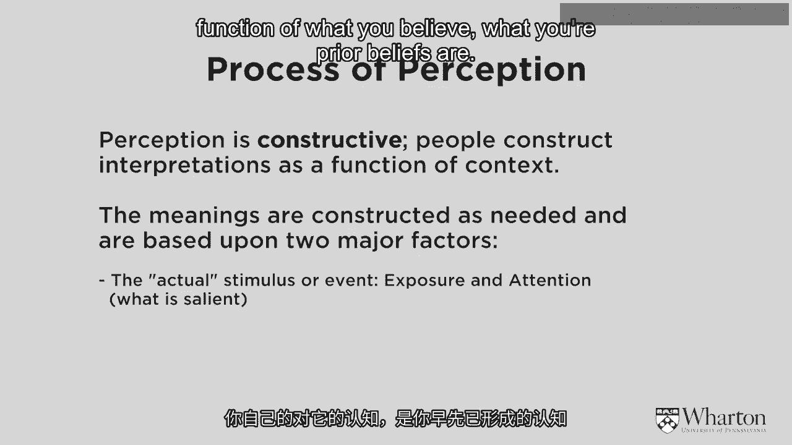
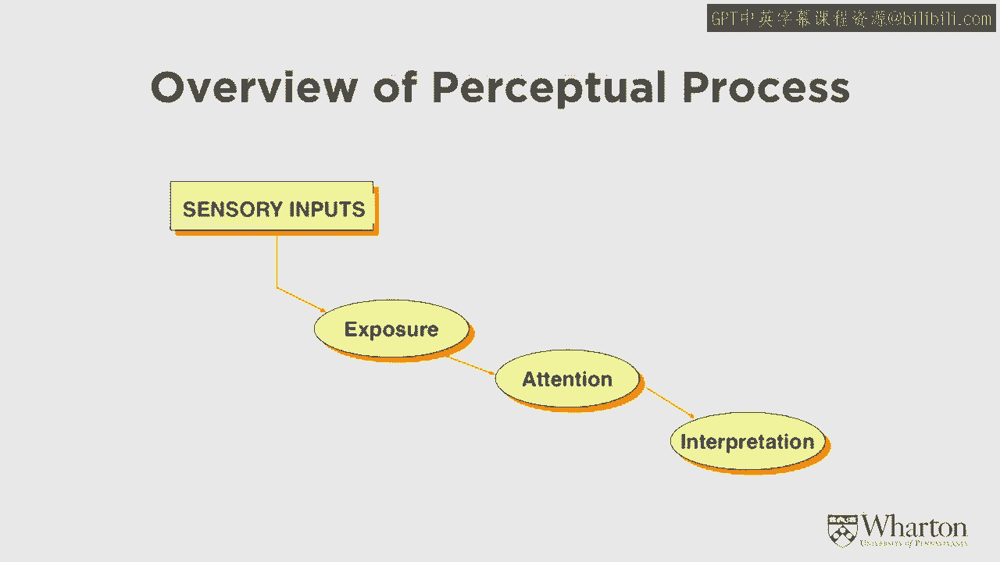
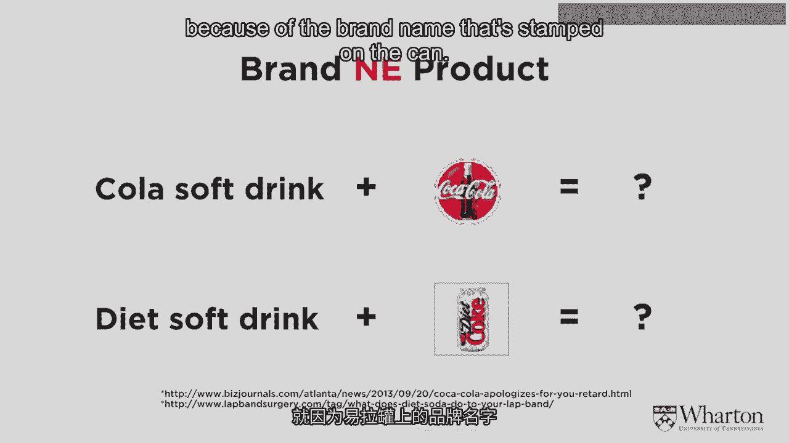

# 🧠 沃顿商学院《商务基础》课程 P32：品牌信息与沟通

在本节课中，我们将探讨品牌信息与沟通。我们将不局限于战略层面，而是深入到执行与战术层面，再次讨论消费者如何感知你的品牌信息和营销活动。

---

## 🔍 什么是感知？

感知是消费者行为中最重要的方面之一。**感知**是解读刺激的过程，即确定刺激的确切含义。它在消费者行为中至关重要，原因有二：第一，顾客的感知直接影响他们后续的行动和行为；第二，有趣的是，他们的感知未必是真实的。

为什么会出现这种情况？因为感知过程是**建构性**的。人们会即时构建自己的解读，这个过程本身带有偏见。感知过程包含几个不同阶段，前两个阶段是**注意**和**接触**。在形成任何感知之前，你需要先接触到刺激，并对其给予注意。我们知道这个过程充满偏见。

例如，如果你认为城市的某个区域不安全，你就不会去那里，从而无法收集新数据来改变对该区域的看法。因此，接触可能是选择性的。同样，即使你接触到了某些信息，如果不加以注意，它也不会影响你的感知。注意分为**自愿注意**和**非自愿注意**。非自愿注意类似于一声巨响，无论你是否愿意，你都会注意到它。而自愿注意同样是选择性的。

因此，我们存在选择性接触和选择性注意的可能性，这意味着你可能没有收集到能够改变你感知的数据。这是偏见的第一阶段。

---

## 🧩 偏见的第二阶段：解读

偏见的第二阶段发生在你接触并注意到某事物之后，即**解读**阶段。我们知道，你会根据已有的信念来解读数据。

例如，在观看总统辩论时，双方阵营的代表对辩论内容的解读往往不同，因为他们的解读会基于各自先前的信念。消费者行为也是如此。你接触并注意到某些刺激，但你会根据自己的先前期望来解读它。

因此，感知常常带有偏见，不一定代表真实情况。

---

## 📊 感知过程概述

营销人员会发出各种**感官输入**，例如广告、包装等。然后，消费者可能会接触或不会接触到这些输入。即使接触到了，每天有成千上万的营销线索，但有多少能引起你的注意呢？因此，首先是接触问题，其次是注意问题，最后是解读问题。

---

## 🧪 感知如何影响行为：斯特鲁普测试

你的感知会影响后续行为，这几乎是一种自动反应。即使你意识到自己的感知可能有偏见，并试图控制自己不要做出不恰当的反应，这些感知的影响也很难被阻断。

让我们通过一个心理学测试——**斯特鲁普测试**——来说明这一点。屏幕上会显示几个词语，你需要说出字体的颜色。

*   第一个词：`蓝色`（字体颜色为红色）
*   第二个词：`绿色`（字体颜色为蓝色）
*   第三个词：`红色`（字体颜色为绿色）
*   第四个词：`黄色`（字体颜色为红色）

到第四个词时，你可能已经明白了规律，但仍然很难不受词语本身含义的干扰。你无法阻止自己去读这个词，而读词会影响你后续的行为——它会让你变慢。这就是斯特鲁普测试的目的，它是一种压力操纵，因为这种不协调会让人感到不适。

如果词语含义与字体颜色匹配，任务就会简单得多。例如：
*   `红色`（字体颜色为红色）
*   `蓝色`（字体颜色为蓝色）
*   `绿色`（字体颜色为绿色）
*   `黄色`（字体颜色为黄色）

你可以看到，说出这些词会更快、更容易。

营销中也存在同样的现象。颜色、品牌名称等都会产生影响，而你无法阻断这种影响。它会自动影响你后续的感知和行为。

---

## 🍫 营销中的感知实例

例如，如果我告诉你这是“美味巧克力”，并给你看一张形状像牛粪的图片，你很难抑制最初那种“哦，我不想吃这个”的厌恶感。即使你知道它是好巧克力，形状也会对你产生非自愿的影响。理解这一点非常重要。

营销人员需要理解这些因素如何影响消费者的感知和后续行为，因为这些是自动反应。

还有一些视觉错觉的例子。例如，屏幕上这两条线，我可以告诉你，它们长度完全相同。然而，上面那条看起来更长，你无法阻止这种感觉。即使我向你证明它们一样长，你仍然会有那种感知。

另一个例子展示了先前期望如何影响你对刺激的感知。如果我问你屏幕上是什么，根据我展示方式的不同（例如，先展示局部再展示整体，或先展示整体再展示局部），你的答案会不同。这表明你对刺激的感知是你先前期望的函数。

---

## 🤔 常见的感知偏见

接下来，我们看看几种常见的感知偏见。

首先是**邻近性偏见**。邻近性偏见认为，彼此靠近的事物被认为更相似。例如，如果我问你哪些线条相似，大多数人会说聚集在一起的两条线相似。他们会将靠近的线条归为一组，而不是将两条粗线或两条细线归为一组，因为你推断靠近的事物必然属于一起。

在超市的沙拉区，商家可能会将沙拉酱放在沙拉旁边，就是利用了这种隐含的假设：如果产品靠近另一种产品，它们就属于一起。这是一种感知，即物理距离影响事物是否相似或属于一起。在商场里，靠近的商店似乎也更相似。这种偏见有很多应用。

另一种是**相似性偏见**。看起来相似的事物，人们会假设它们具有相同的质量。这是**商店品牌**背后的理论基础。如果一个商店品牌让自己看起来与全国性品牌非常相似，你会假设其质量相同，即使你没有测试过，也不知道是否真的如此。你基于这种相似性过程对感知质量做出了假设。

这些感知推断在影响你对质量的感知、消费产品的方式、体验产品的方式、愿意支付的价格等方面非常强大。对于营销人员来说，理解这个消费者过程非常重要。

---

## 🏷️ 品牌的力量

这在品牌塑造中尤为重要。我们知道，如果你拿一杯可乐或一瓶可乐，贴上**可口可乐**的品牌，人们对这个产品的感知会与没有品牌时不同。贴上可口可乐品牌后，人们会认为它味道更好，愿意支付更高的价格，并做出各种其他推断，即使产品完全相同。一旦我们贴上品牌，它就改变了产品的感知。

人们常认为：“我不受那个影响。我知道我能根据质量判断产品。我不受品牌名称影响。”然而，一个又一个实验证明，这并非事实。人们非常受产品上品牌名称的影响，这与产品质量无关。就像斯特鲁普测试一样，你无法阻止它。一旦你看到那个品牌名称，你就会产生某些感知，对该品牌做出某些推断，而这些感知会转移到产品上。

正如我们之前提到的，品牌的力量非常强大。据估计，**可口可乐**品牌作为一项资产价值700亿美元。仅仅将这个品牌名称贴在产品上，就会改变人们愿意支付的价格溢价、感知质量等。

当你知道一个品牌价值如此之高时，人们往往会寻找利用该品牌实现增长的方法。

---

## 🚀 品牌延伸：以可口可乐为例

例如，你知道可口可乐与可乐软饮料相关联。1982年，可口可乐将这个品牌名称用在了当时一个全新的、没人尝过的产品上——一种健怡软饮料。他们称之为**健怡可乐**。尽管该产品此前并未上市，但人们自动认为它味道更好、质量更高，并且再次愿意为其支付更高的溢价。这是一个全新的产品，但由于印在罐子上的品牌名称，人们对它的感知非常高。

---

## 📝 本节课总结

在本节课中，我们一起学习了：
1.  **感知**是消费者解读营销刺激的过程，它常常带有偏见。
2.  感知过程包括**接触**、**注意**和**解读**三个阶段，每个阶段都可能存在选择性或偏见。
3.  感知会**自动且强烈地影响**消费者的后续行为和判断，如同斯特鲁普测试所示。
4.  常见的感知偏见包括**邻近性偏见**和**相似性偏见**，它们被广泛应用于商品陈列和商店品牌策略中。
5.  **品牌**是一个极其强大的资产，它能显著改变消费者对产品质量、价值和体验的感知，独立于产品本身。
6.  企业可以通过**品牌延伸**（如可口可乐推出健怡可乐）来利用强势品牌的感知价值，推动新产品的成功。

理解消费者的感知过程，对于制定有效的品牌信息和营销沟通策略至关重要。