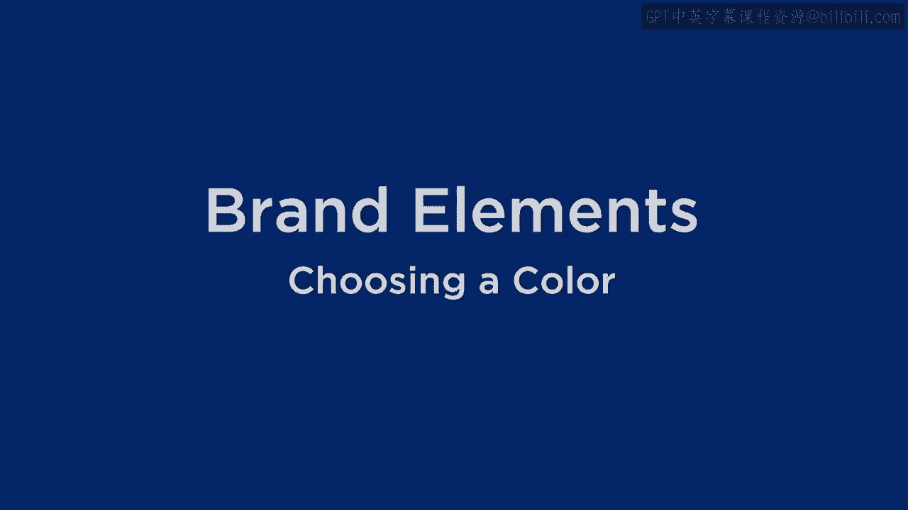
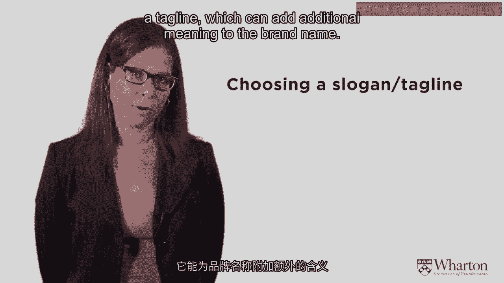
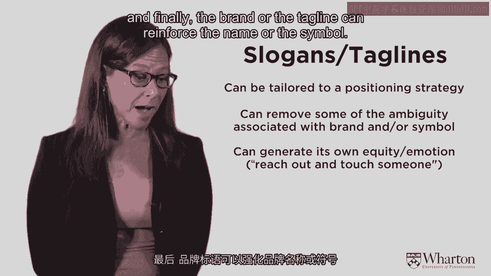
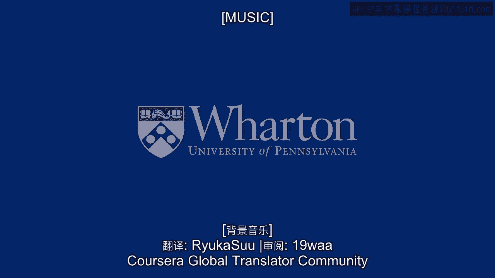
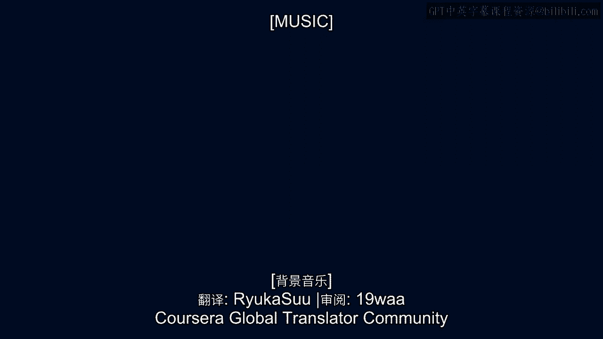

# 沃顿商学院《商务基础》｜第34课：品牌要素 - 颜色与标语 🎨📝

在本节课中，我们将学习品牌构建中的两个关键视觉与语言要素：**颜色**与**标语**。我们将探讨颜色如何影响消费者感知，以及标语如何强化品牌定位。理解这些要素，能帮助你更有效地塑造品牌形象。

---

## 颜色：无声的品牌语言 🌈

上一节我们讨论了品牌名称，本节中我们来看看围绕品牌名称的其他重要元素。颜色是其中极为重要的一环，它能传递强烈的感知信号。人们会将许多联想与不同颜色联系起来。

以下是关于颜色运用的一些核心规则：

*   **占据一种颜色**：最理想的情况是“拥有”一种颜色。这虽然困难，但一旦成功，力量巨大。例如，**Tiffany** 拥有其标志性的浅蓝色盒子，这已成为高品质的全球性象征。**Mary Kay** 则拥有粉色，成功塑造了其女性化妆品的品牌形象。
*   **区分产品线**：颜色可用于区分同一品牌下的不同产品线。例如，**American Express** 通过绿卡、黑卡、银卡等不同颜色，暗示了卡片的不同等级和品质。
*   **注意颜色的差异**：颜色在不同平台（如电脑、手机、实物）上的呈现可能略有不同。为确保品牌识别度，需保持颜色的一致性。
*   **颜色的感知暗示**：某些颜色能直接引发特定感知。例如，金色、银色、黑白色常暗示**奢华**与**高价**；蓝色和粉色则分别让人联想到**男性**与**女性**。

颜色理论主要基于两个维度：**唤醒度**（刺激 vs 平静）和**情感效价**（喜爱程度）。例如，红色和橙色属于高唤醒颜色，能吸引注意、激发兴奋；蓝色和绿色则更显平静。在美国，蓝色和绿色通常更受喜爱。

以下是常见颜色及其普遍联想：

*   **红色**：兴奋、注意力、爱情、激情。**能刺激食欲**，因此常见于餐饮品牌（如麦当劳、肯德基）。
*   **蓝色**：平静、信任。**会抑制食欲**，且更受男性偏爱。常见于科技、金融等需要建立可靠感的品牌（如IBM、美国运通）。
*   **绿色**：宁静、健康、金钱、自然、环保。常被环保或健康相关的公司使用（如星巴克）。
*   **棕色**：可靠、务实、大地。
*   **白色**：纯净、 innocence、高端设计（通过留白体现）。
*   **黑色**：有时象征邪恶或哀悼，但也常用于营造纤瘦、精致的感知。
*   **黄色**：明亮、充满能量。研究表明，黄色有时会**引起婴儿啼哭**。
*   **橙色**：兴奋、温暖、热情。
*   **紫色**：皇室、财富、智慧。
*   **粉色**：女性化、温暖、平静。

观察各大品牌的用色，可以验证这些联想。例如，耐克、壳牌使用亮黄色吸引注意；雅虎、芭比使用紫色体现创意；沃尔玛、辉瑞使用蓝色建立信任。

---

## 符号：品牌的视觉化身 🎭

符号能为品牌增添趣味和关注度。例如，**米老鼠**就是一个全球知名的符号。

符号能传达丰富的品牌联想：
*   **Mr. Clean（清洁先生）**：一个强壮的肌肉男形象，暗示产品具有强大的清洁力。
*   **Wells Fargo（富国银行）**：其马车符号让人联想到独立、西部拓荒和冒险精神。
*   **Charlie the Tuna（金枪鱼查理）** 或 **Pillsbury Doughboy（面团宝宝）**：这类符号能唤起积极、喜爱的情感。

然而，符号也可能**过时**，并与特定时代紧密绑定。因此，品牌需要适时对符号进行更新或重新定位。

---

## 标语：品牌的定位宣言 🗣️

标语或口号能有效辅助我们之前讨论的定位策略。它可以帮助消除品牌名或符号可能带来的模糊性，自身也能创造情感（如“Reach out and touch someone”），并强化品牌名或符号的形象。信息的重复出现能形成强大的品牌讯息。

以下是设计标语的基本原则：
*   **简短**：类似品牌箴言，必须精炼。
*   **差异化**：避免与竞争对手雷同或混淆。
*   **独特**：具有辨识度。
*   **易记易说**：便于传播。
*   **无负面解读**：需进行市场测试，尤其是在跨文化语境中。
*   **可注册商标**：优秀的标语（如“Just Do It”）应寻求法律保护。
*   **激发情感**：能引发情感的标语更具力量。

标语主要有以下几种类型：
*   **祈使型**：告诉消费者该做什么。例如：`Just Do It`（耐克）， `Think Different`（苹果）。
*   **描述型**：补充更多信息。例如：`Moving at the speed of business`（UPS）， `You‘re in good hands`（Allstate保险）。
*   ** superlative型**：使用最高级表述。例如：`The ultimate driving machine`（宝马）， `There‘s no better way to fly`（泛美航空）。
*   ** provocative型**：巧妙而 provocative。例如：`Got Milk?`（美国牛奶协会）， `Drivers Wanted`（大众汽车）。

---

## 总结 📚

本节课中，我们一起学习了品牌构建中两个至关重要的要素：**颜色**与**标语**。颜色通过无声的视觉语言影响消费者的感知、情感和品质判断；而标语则用精炼的语言明确品牌定位、激发情感共鸣并强化品牌核心信息。有效运用这两者，能够显著提升品牌的识别度、记忆度和情感联结。