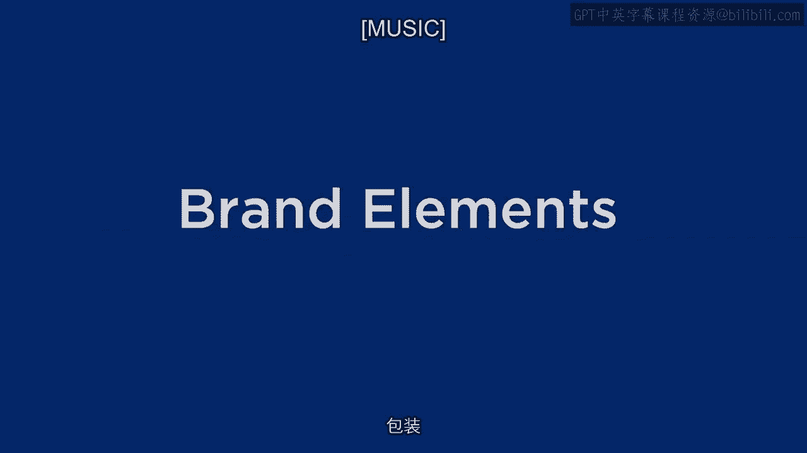
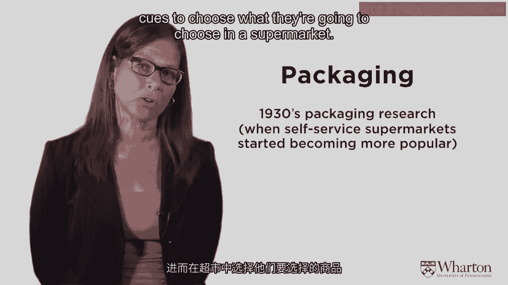
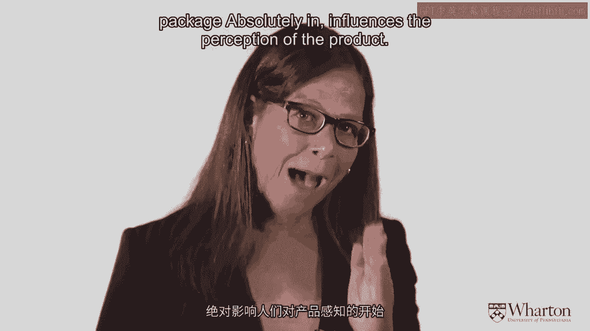
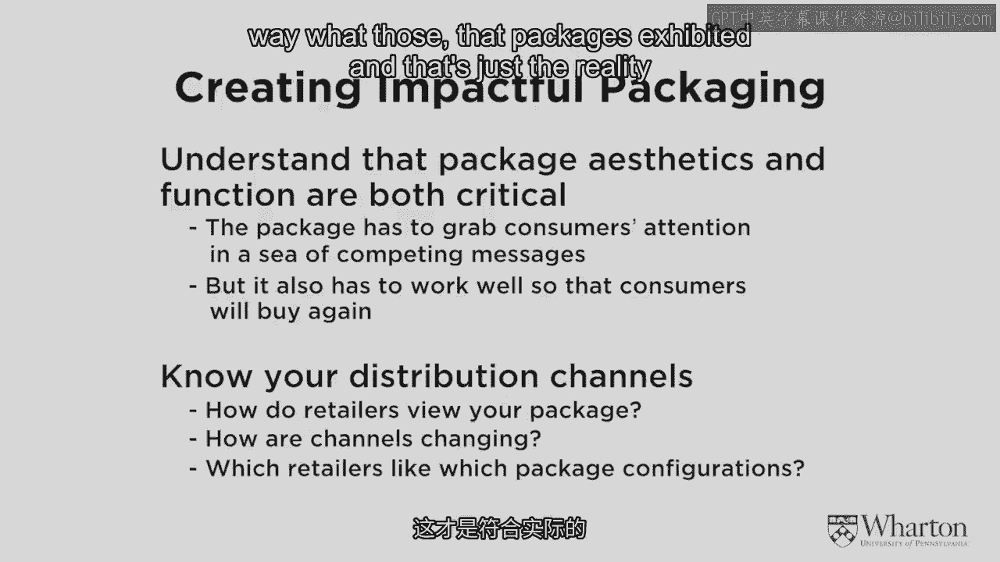
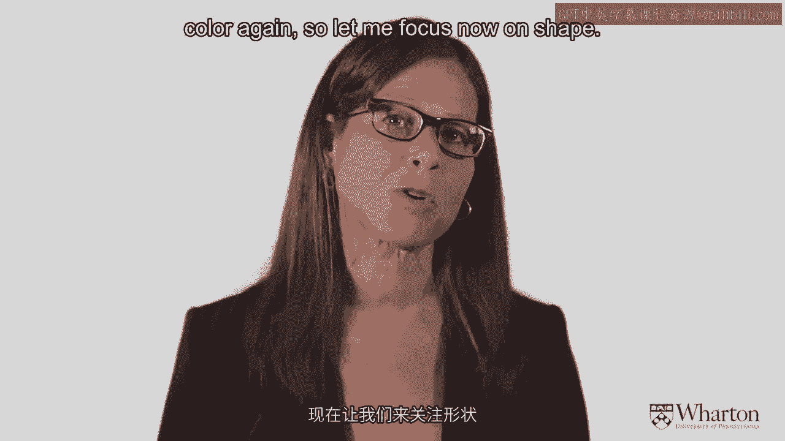
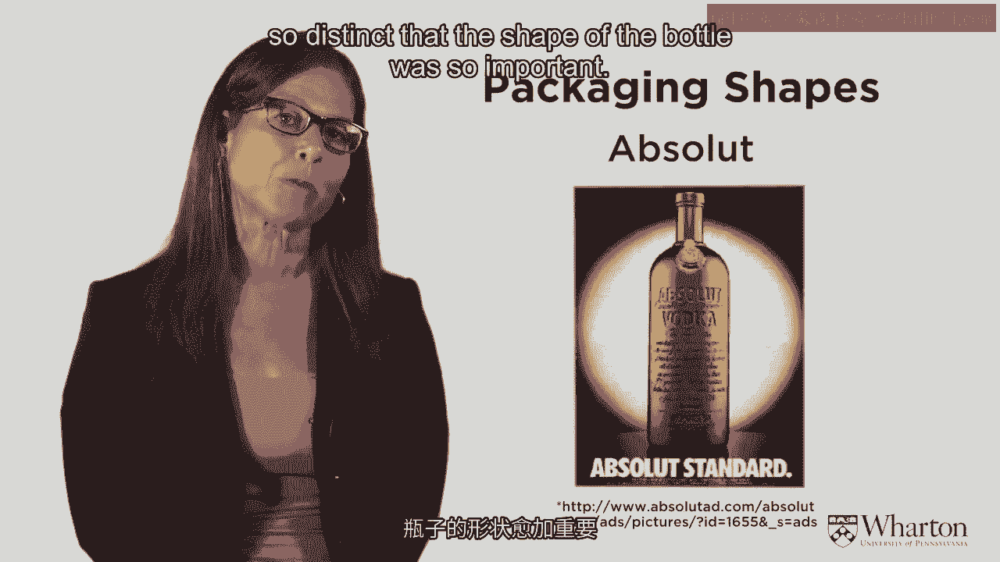
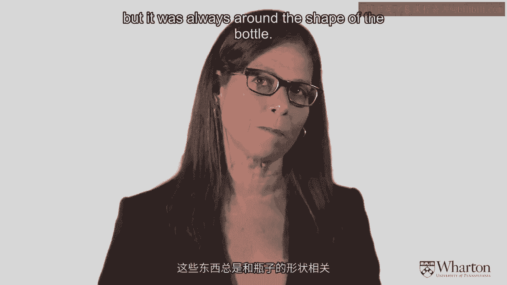
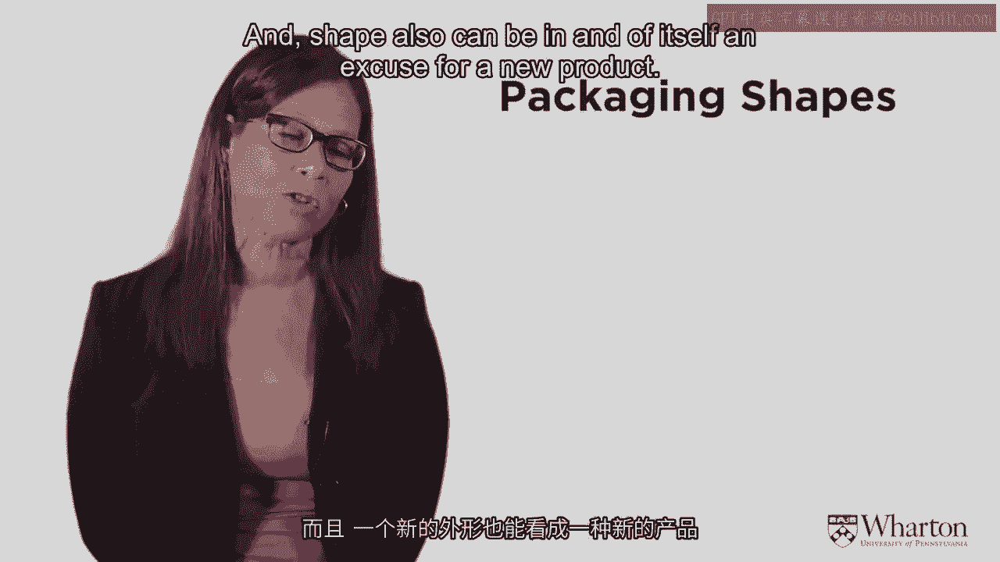
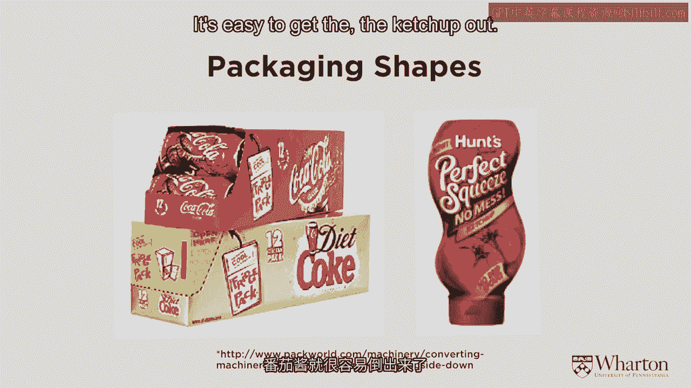
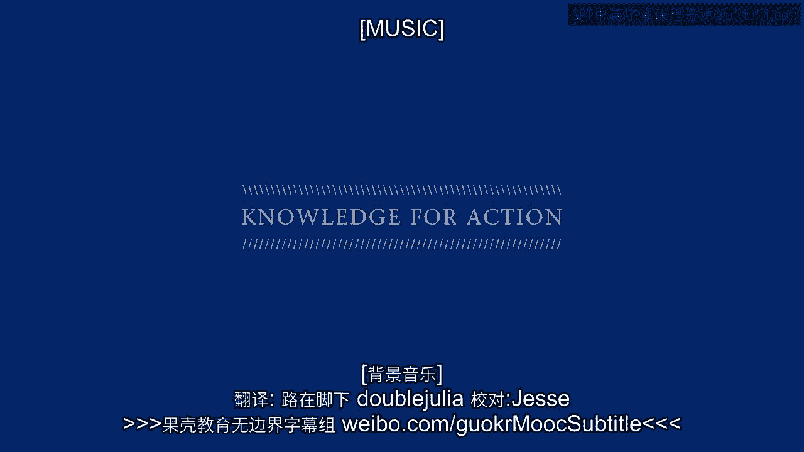

# 📦 沃顿商学院《商务基础》课程笔记｜第35讲：品牌要素 - 包装

在本节课中，我们将探讨包装作为品牌要素的重要性。包装不仅保护产品，更在消费者选择和产品感知中扮演着关键角色。我们将通过经典案例，了解包装设计如何影响购买决策和品牌形象。

---

## 包装的起源与早期发现

上一节我们讨论了品牌的其他要素，本节中我们来看看包装。包装对产品感知有强烈影响，这是一个非常有趣的领域。

关于包装的研究在美国始于20世纪30年代。当时，杂货店正从柜台服务模式转向自助超市模式。消费者开始在超市货架间自行挑选商品，无需店员帮助。这一转变使得产品包装变得至关重要。随之而来的问题是：消费者将如何利用包装线索来选择商品？

一项早期的著名实验以洗衣粉为对象展开。研究人员将相同的洗衣粉放入两个不同的包装盒中，以测试包装差异的影响。一个包装盒上印有圆形图案，另一个则印有三角形图案。实验目的是观察消费者会选择哪一个。

结果非常明确：消费者更偏爱印有圆形图案的包装盒。随后，研究人员让消费者将两种包装的洗衣粉带回家使用。需要记住的是，两个盒子里的洗衣粉是完全相同的。

消费者使用后，被问及更喜欢哪种洗衣粉。结果令人惊讶：他们不仅更喜欢圆形包装，而且坚信圆形包装盒里的洗衣粉效果更好。这在当时是令人震惊的发现，因为洗衣粉本身并无区别。研究经过多次重复和大样本测试，结果依然一致。

这标志着人们开始理解：包装绝对会影响对产品的感知。

---

## 包装的多重功能与设计考量

从上述实验可知，包装的影响力不仅存在于购买瞬间，也持续作用于消费体验。包装有多重目标。

以下是包装的主要功能：
*   **识别产品**：帮助消费者在货架上快速找到目标商品。
*   **传递信息**：展示产品成分、用途、使用方法等关键信息。
*   **保护产品**：确保产品在运输和储存过程中不受损坏。
*   **方便储存**：包装设计需便于消费者在家中存放产品。
*   **辅助消费**：包装结构可以方便产品的取出和使用。
*   **指导使用**：提供清晰的使用说明，确保正确消费。

包装不仅运用了颜色等感知线索，也承载了大量信息。包装的美学与功能都至关重要。颜色用于在众多竞争信息中吸引消费者注意力，但同时，设计必须能促使消费者反复购买。

因此，选择颜色和设计的变化，是为了打造具有冲击力的包装。但正如之前提到的，必须了解分销渠道，因为你可能无法完全控制包装在零售终端的最终陈列方式。零售商不一定按照品牌方期望的方式展示产品，这是在设计包装时必须考虑的现实。

---

## 经典包装案例分析：形状的力量

我们已经讨论了颜色，现在让我们聚焦于包装的形状。包装形状能极大地改变消费者感知并帮助建立市场份额。

以下是几个通过形状塑造品牌的经典案例：

**1. CK One香水**
多年前，Calvin Klein推出了一款旨在同时面向男性和消费者的香水，这在当时并不常见。其广告风格前卫，模特性别特征模糊。为了体现这种“前卫感”，CK One香水的包装瓶被设计成烧瓶形状，这并非香水的常规造型。其标志也采用了不对称设计，进一步强化了前卫的品牌形象。在选择香水时，许多消费者并非气味专家，因此包装和品牌名称对其选择影响巨大。

**2. 绝对伏特加**
绝对伏特加的瓶身形状是其品牌的核心。伏特加品类中，消费者有时难以区分不同品牌的口感差异。因此，瓶身形状和品牌名称对于建立品牌忠诚度至关重要。绝对伏特加的瓶形独特，与大多数细颈的烈酒瓶不同（细颈方便调酒师持握），它甚至在使用上并不算最方便。但正是其独特的形状使其脱颖而出。其长达十年的著名平面广告战役完全基于这个瓶形展开，广告中瓶形以各种创意形式出现，深入人心。

**3. 可口可乐**
可口可乐拥有强大的品牌力，其品牌形象不仅来自Logo、红色以及著名的北极熊广告，也来自其6.5盎司玻璃瓶的独特曲线形状。这是可口可乐最早的产品，其形状在当时的所有软饮中极具辨识度。当包装从玻璃瓶转向塑料瓶时，可口可乐最初失去了这一独特形状，这被视为一个明显的劣势。后来，公司成功地在塑料材质上复刻了这一标志性瓶形，并对此非常重视，因为他们深知这个形状的重要性。

**4. 亨氏番茄酱**
亨氏番茄酱的玻璃瓶本身就是一个标志。据说其瓶身已被史密森尼博物馆收藏。消费者通过这个瓶子的形状来感知番茄酱的品质。有趣的是，与绝对伏特加类似，这个玻璃瓶的形状实际上使得倒出番茄酱变得困难，它在一定程度上阻碍了产品的使用。然而，正是这个形状定义了亨氏番茄酱的品质。

综上所述，形状在创造品牌形象和身份认同上极其重要。形状本身甚至可以成为推出新产品的理由。

---

## 包装作为产品创新

形状本身可以成为产品创新的契机。包装创新有时能独立推动市场份额增长。

以下是两个成功的包装创新案例：

**1. 冰箱包装**
软饮行业最成功的新产品之一就是“冰箱包装”。市场调研发现，如果易拉罐放在冰箱后部，人们的消费量会减少。为了促进消费，需要一种机制将易拉罐带到冰箱前部。这种冰箱包装正是为此设计。仅凭这一包装设计，就为率先采用的公司带来了市场份额的显著增长。这是一次非常成功的新产品引入，而其创新与产品本身无关，完全在于包装。

**2. 亨氏倒立挤压瓶**
亨氏后来推出了一种更容易倒出番茄酱的包装——倒立挤压瓶。消费者只需将瓶子倒置，即可轻松挤出番茄酱。这同样是一次成功的包装创新。

---

## 总结

本节课中，我们一起学习了包装作为关键品牌要素的多重作用。我们了解到，包装始于自助购物时代，其设计能深刻影响消费者对产品功效的感知。包装不仅具有识别、保护、储存等基础功能，更能通过颜色和形状等元素塑造强大的品牌形象。从CK One的前卫烧瓶到绝对伏特加的独特瓶身，从可口可乐的经典曲线到亨氏番茄酱的标志玻璃瓶，我们看到形状如何成为品牌身份的核心。最后，通过冰箱包装和倒立挤压瓶的例子，我们认识到包装创新本身就能创造巨大的市场价值。包装是连接产品与消费者的无声推销员，其力量不容小觑。