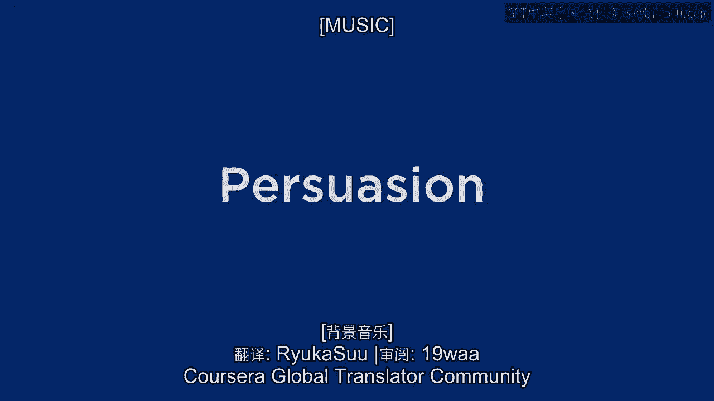
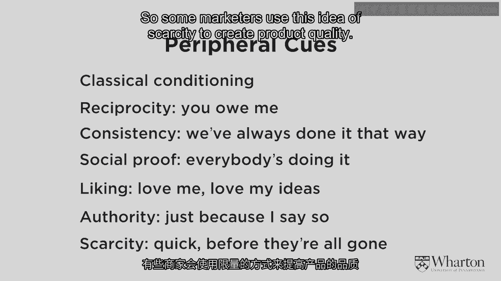
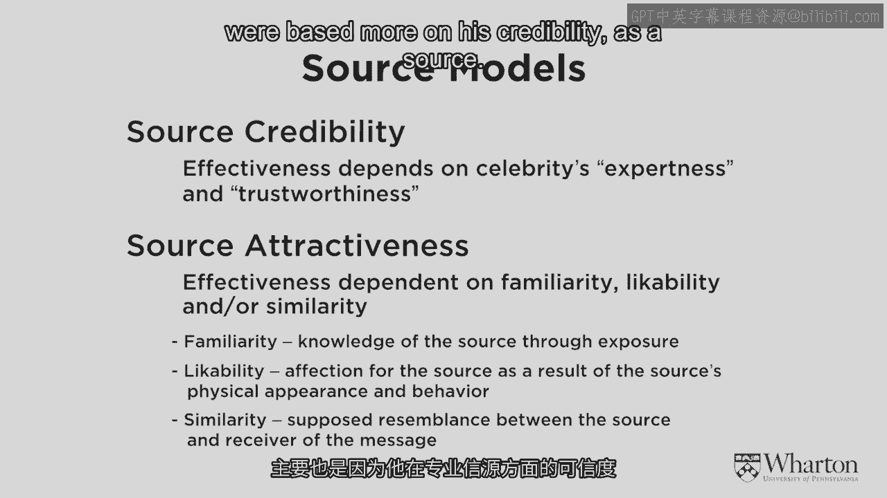
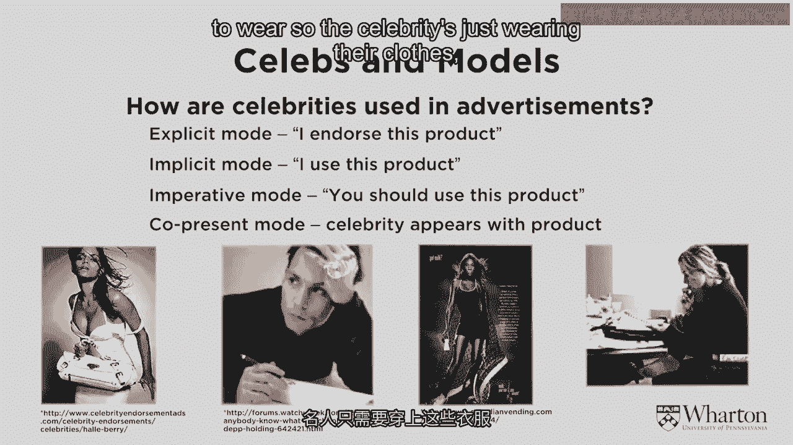
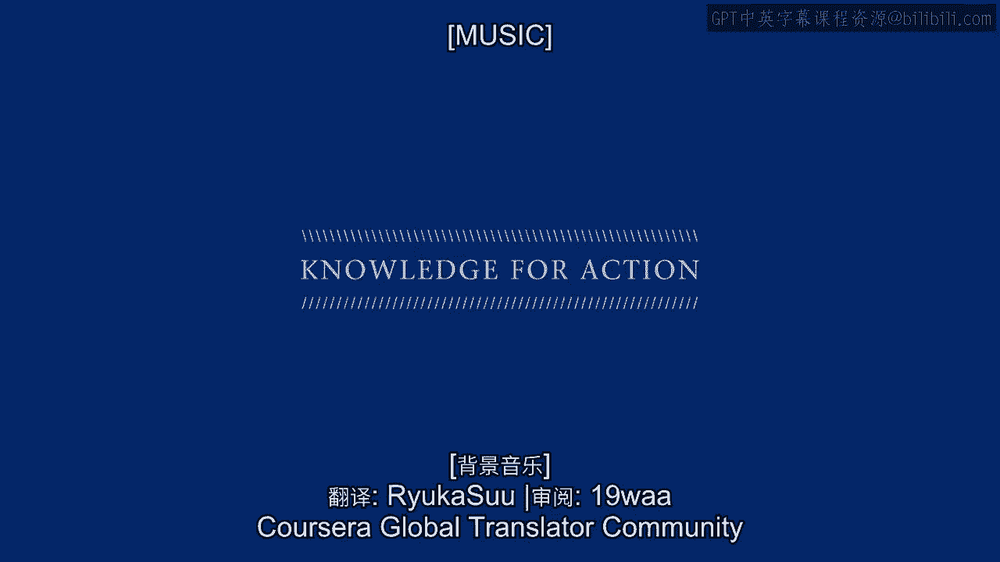

# 沃顿商学院《商务基础》课程｜第36讲：品牌要素 - 说服力 🎯

在本节课中，我们将学习营销中的“说服”过程，即如何改变消费者的信念与态度。我们将重点探讨说服的主导理论——精细加工可能性模型，并分析如何利用名人代言来有效地说服消费者。

---

## 说服的本质与挑战

上一节我们讨论了品牌形象与感知的构建。本节中，我们来看看品牌如何主动说服消费者。

说服是**主动尝试改变信念与态度的过程**。营销者试图说服消费者对其品牌和产品产生好感。

然而，说服是困难的。原因在于，人们倾向于接触、注意并解读那些**符合其已有信念**的信息。消费者并非科学地、均衡地采样所有信息，他们在接收刺激时存在偏见，这使得改变他们的想法颇具挑战性。

---

## 精细加工可能性模型：说服的两条路径

理解如何有效说服消费者的主导理论是**精细加工可能性模型**。该模型提出，说服有两条路径：**系统化（中心）路径**和**表层（边缘）路径**。

### 中心路径：深度处理

当消费者**动机强烈、高度参与**，并且**有机会、有能力**处理营销信息时，应采用中心路径。说服的关键在于信息中的**中心线索**，即需要消费者进行认知思考的论据。公式可以概括为：

**中心路径说服 = 高动机 + 高处理能力**

此时，营销者需要构建强有力的论点，吸引消费者深度思考。

### 边缘路径：启发式处理

然而，在许多营销情境中，消费者**缺乏深度处理的动机或能力**（例如，不感兴趣、感到疲倦）。此时，中心路径无效，必须转向边缘路径。

边缘路径依赖于**边缘线索**，这些线索能引发自动的、不经深入思考的反应。消费者使用“经验法则”或启发式方法来做决定。

---

## 常见的边缘说服线索

以下是几种关键的边缘说服线索，它们不依赖深度认知，而是利用心理捷径：

*   **经典条件反射**：通过反复将品牌与积极事物配对，建立自动联想。例如，汉堡常与可乐一同出现，久而久之，吃汉堡时就会自动想喝可乐。
*   **互惠原则**：给予消费者一点小恩惠（如赠品），使其产生回报义务感，从而更可能做出购买或捐赠行为。
*   **一致性**：人们倾向于坚持自己过去的行为或选择。例如，一直使用某品牌牙膏，只是因为习惯，而非经过系统的产品比较。
*   **社会认同**：“大家都喜欢，所以它一定好”。例如，选择排队最长的餐厅，或阅读被转发最多的文章。
*   **喜爱**：如果喜欢代言人，就更可能喜欢其推荐的产品。这对名人代言至关重要。
*   **权威**：仅仅因为权威人物或专家推荐，就选择相信或购买。
*   **稀缺性**：“物以稀为贵”。限量供应或容易售罄的产品，会被认为价值更高、质量更好。例如，露露乐檬（Lululemon）有意制造产品短缺，以提升其感知价值。

---

## 名人代言：中心与边缘路径的应用

了解了说服的两条路径后，我们来看看名人代言如何在这两种模式下发挥作用。

名人既可以作为**中心线索**，也可以作为**边缘线索**：
*   **中心路径（可信源）**：名人因其**专业性**和**可信度**而具有说服力。消费者认为其推荐是基于专业知识。
*   **边缘路径（吸引力源）**：名人因其**吸引力**和**受欢迎程度**而具有说服力。消费者因为喜欢这个人，而喜欢其推荐的产品。

### 选择名人代言人的考量因素

在选择名人代言时，品牌需要综合考虑以下几点：

1.  **目标受众匹配度**：目标客户群是否喜爱这位名人？
2.  **品牌信息一致性**：名人的公众形象与品牌的核心信息（品牌真言）是否契合？
3.  **名人吸引力**：名人是否具有广泛且正面的知名度？
4.  **成本效益**：代言费用是否物有所值？
5.  **社交网络影响力**：在现代营销中，名人在社交媒体上的粉丝数量和互动率（影响力得分）极为重要。

此外，业界常用 **Q值评分** 来量化名人的吸引力。Q值反映了在认识该名人的人群中，其受欢迎的比例，是评估名人商业价值的重要工具。

### 意义迁移模型

名人代言的有效性常通过 **“意义迁移模型”** 来解释。名人本身承载着强烈而特定的象征意义。营销的目标，就是将名人身上的这些意义**迁移到品牌或产品上**，从而塑造品牌形象。

研究表明，大脑对名人图像的反应与对普通人图像的反应不同，名人能引发更强烈的自动关注和情感反应。

### 案例分析：泰格·伍兹

以泰格·伍兹为耐克代言为例，他同时发挥了两种作用：
*   **可信源（中心路径）**：作为顶级高尔夫球手，他在推荐高尔夫产品时极具专业可信度。
*   **吸引力源（边缘路径）**：其个人魅力使他能代言与高尔夫无关的产品（如手表、汽车）。

当其个人丑闻削弱了“吸引力”时，基于边缘路径的代言合约纷纷终止；而基于其专业“可信度”的高尔夫相关代言则得以保留。这清晰地展示了两种说服路径的差异。

### 代言的表现形式

名人在广告中的代言方式有多种：
*   **明确模式**：“我认可此产品。”
*   **隐含模式**：“我使用此产品。”（展示使用场景）
*   **命令模式**：“你应该使用此产品。”
*   **共同呈现**：通过产品植入或名人公开穿着/使用，进行软性代言。

---

## 总结

本节课中，我们一起学习了营销说服的核心理论与应用。

我们首先明确了说服是改变消费者态度的主动过程，并面临固有偏见的挑战。接着，我们深入探讨了**精细加工可能性模型**，理解了说服的**中心路径**（依赖强论据，需高动机与能力）和**边缘路径**（依赖心理捷径线索）。

我们详细列举了多种**边缘说服线索**，如经典条件反射、社会认同、稀缺性等。最后，我们将理论应用于**名人代言**，分析了名人如何作为可信源或吸引力源发挥作用，以及选择代言人时的关键考量和“意义迁移”的原理。

掌握这些知识，有助于我们更有效地设计营销沟通策略，无论是通过理性的论证，还是感性的联结，最终成功地说服目标消费者。