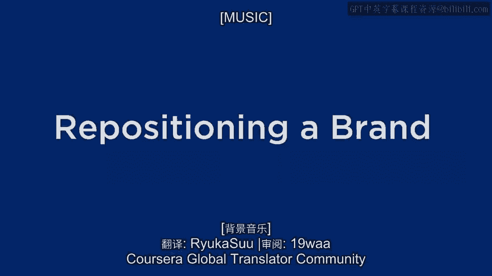
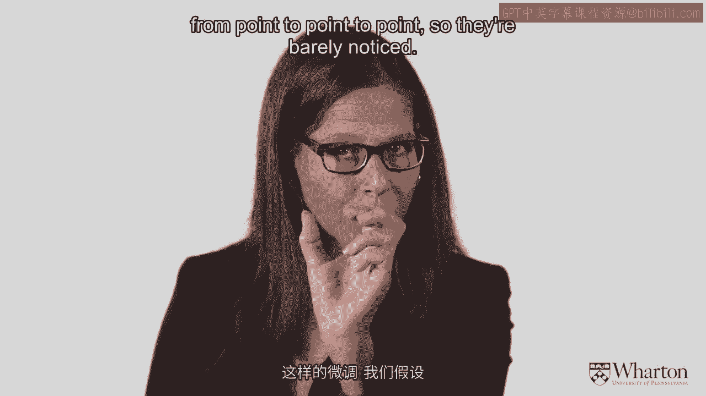
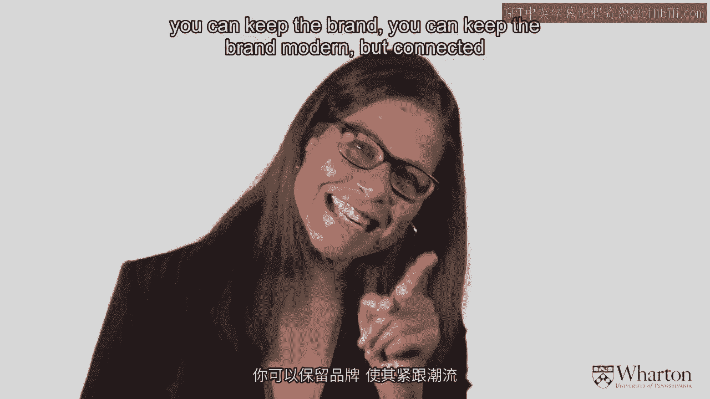
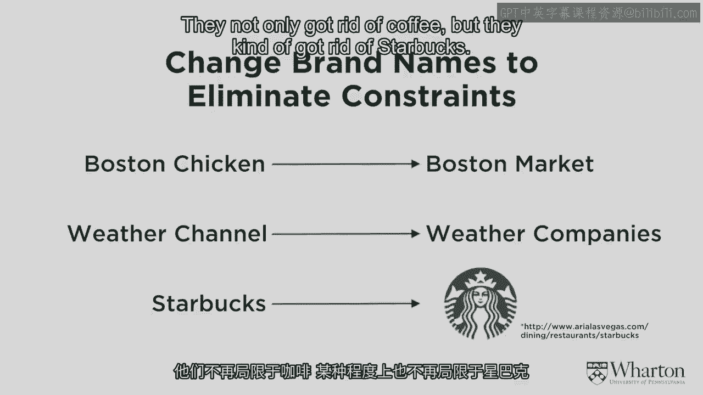
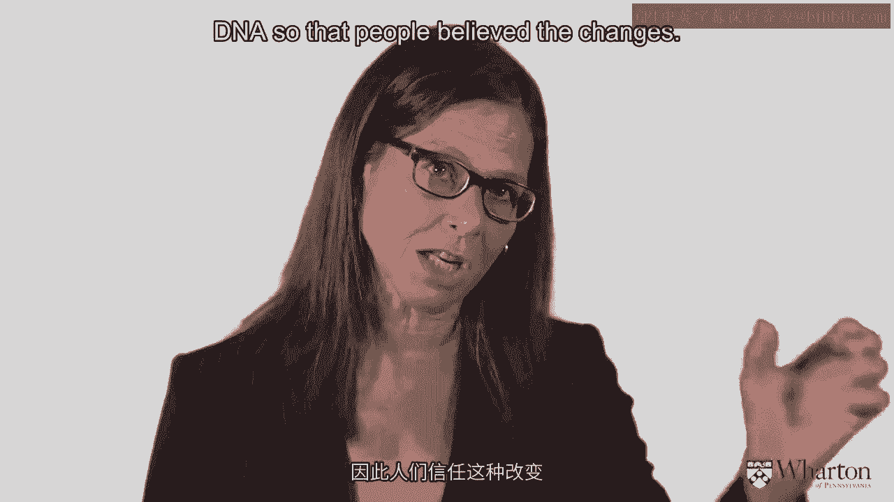
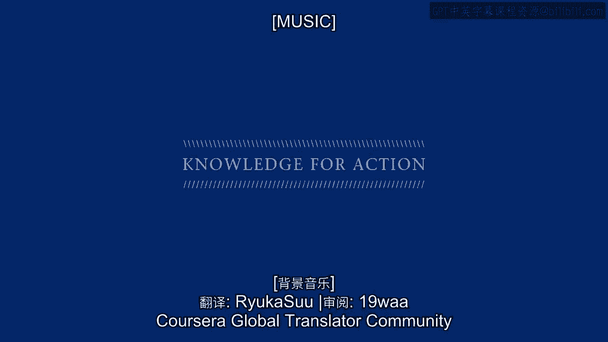

# 沃顿商学院《商务基础》第37课：品牌重新定位 🎯

在本节课中，我们将要学习品牌管理中的一个核心环节：**品牌重新定位**。我们将探讨为什么品牌需要更新、如何在不破坏品牌核心价值的前提下进行调整，以及具体的实施策略。

---

## 品牌需要与时俱进 🔄

上一节我们介绍了品牌定位和品牌元素的创建。本节中我们来看看，为什么一个成功的品牌不能一成不变。

品牌资产必须随着时间的推移而积极管理。等待品牌过时后再进行重新定位，远比持续微调要困难得多。理想情况下，保持品牌新鲜感的最佳方式是**持续思考并适时微调**。品牌含义必须得到强化，但有时也需要进行小幅调整，并识别出新的资产来源。

---

## 为何需要重新定位？ 🤔

品牌需要重新定位的原因多种多样。以下是五个主要原因：

1.  **初始定位错误**：最初的品牌定位构思不佳，未能吸引预期客户或达到预期销售额。
2.  **目标市场不盈利**：定位可能针对了一个难以触达或利润微薄的细分市场。
3.  **品牌形象过时**：营销方式或品牌形象变得陈旧，跟不上时代变化。
4.  **品牌失去优势**：品牌虽然没错，但显得老套、缺乏新意，无法激发消费者的购买欲望。
5.  **消费者追求新鲜感**：消费者有时购买新产品只是为了寻求“不同”和“新鲜”。

---

## 核心原则：一致性是关键 ⛓️

在考虑品牌重新定位时，最重要的原则是**保持一致性**。除了像谷歌那样刻意追求变化的特例外，大多数品牌在重新定位时，其新定位必须与旧定位保持一致或足够接近，以便消费者能够接受并相信这种转变。

这种对一致性的需求背后有心理学理论支撑，即**认知一致性理论**。人们倾向于调整自己的认知，以保持内在信念与行为的一致性。如果品牌传递的新信息与消费者原有的强烈认知不一致，消费者很可能会拒绝或曲解该信息。

一个著名的失败案例是奥兹莫比尔汽车。它曾与“父辈的汽车”形象紧密关联。当其试图通过广告宣称“这不是你父亲的奥兹莫比尔”来吸引年轻人时，反而强化了原有的陈旧形象。由于新旧认知冲突过大，消费者无法接受，最终导致该品牌退出市场。

这个案例的教训是：**最好通过渐进、小幅度的调整来更新品牌联想，而不是等到不得不进行颠覆性改变时再行动。**

---

## 两种重新定位策略 🦋

有两种主要的策略可以帮助品牌在保持认知一致性的前提下实现更新：

1.  **最小可觉差策略**
    这种方法是指进行一系列**极其细微、几乎不被察觉的渐进式调整**。每年进行微小改变，多年后回顾，品牌形象已发生巨大变化，但消费者始终感觉它是同一个品牌。许多快速消费品包装的更新就采用此策略。
    `公式：品牌形象(t+1) = 品牌形象(t) + Δ (微小增量)`

2.  **蝴蝶效应策略**
    这种方法是指进行**幅度较大、能够被明显察觉的跳跃式改变**。这种改变旨在让品牌看起来更现代、更时尚，尤其适用于化妆品、服装等需要彰显潮流的品类。改变虽然明显，但仍需保持在品牌核心DNA的可信范围之内。
    `公式：品牌形象(新) = 品牌形象(旧) + 显著创新 (但核心DNA不变)`

---

## 具体实施方法 🛠️

我们可以通过调整之前讨论过的各种品牌元素，来巧妙地实现重新定位：

*   **更新品牌符号**：例如，快乐绿巨人形象变得更健美、更高大；金枪鱼查理的形象和色彩变得更现代。
*   **调整品牌口号与字体**：温迪汉堡移除了“老式汉堡”的标语，并采用了更现代的字体。
*   **改变视觉动态**：温迪的头像从圆圈内变为“跳出”圆圈，显得更有活力、更开放。
*   **更新品牌名称以拓宽含义**：
    *   Boston Chicken（波士顿烤鸡）更名为 Boston Market（波士顿市场），以涵盖更丰富的餐食选择。
    *   The Weather Channel（天气频道）更名为 The Weather Company（天气公司），以反映其业务向APP等多平台拓展。
    *   星巴克逐步去掉了“Starbucks Coffee”文字，仅保留美人鱼图标，使品牌更具包容性。

---

## 成功案例：宝马与百威 🏆

一些品牌在保持现代感方面做得非常出色：

*   **宝马**：它本可能像奥兹莫比尔一样被视为“父辈的车”。但宝马通过强调“性能”这一永恒主题，更新汽车设计，并赞助高尔夫赛事、高性能自行车等与“年轻”、“强大”、“优质”形象相关的活动，成功保持了品牌的正面和现代联想。
*   **百威**：同样是历史悠久的品牌，它通过赞助体育赛事、制作巧妙的广告和更新口号，始终与年轻消费者保持联系，避免了品牌老化。

它们的共同点是：**在品牌核心DNA（如宝马的“驾驶乐趣”、百威的“大众欢聚”）保持一致的前提下，持续进行或细微或明显的现代化调整。**

---

## 总结与要点 📝

本节课中我们一起学习了品牌重新定位的核心要义：

*   **一致性极具价值**：在建立强大品牌的过程中，保持长期一致性至关重要。
*   **与时俱进是必须**：品牌需要保持现代感，但改变必须谨慎。如果改变威胁到品牌的认知一致性链条，消费者将难以接受。
*   **和谐传达品牌识别**：所有品牌元素应协同工作，共同传达品牌识别。必要时进行改变，但需确保改变是消费者能够接受的。
*   **深刻理解品牌内核**：成功的重新定位建立在深刻理解品牌口号、品牌DNA、品牌定位、目标客户、共同点与差异点的基础上。所有的调整都必须与品牌的核心形象保持一致。

通过持续而谨慎的管理，品牌可以在不丢失其核心价值与消费者信任的前提下，成功焕发新生，适应不断变化的市场环境。