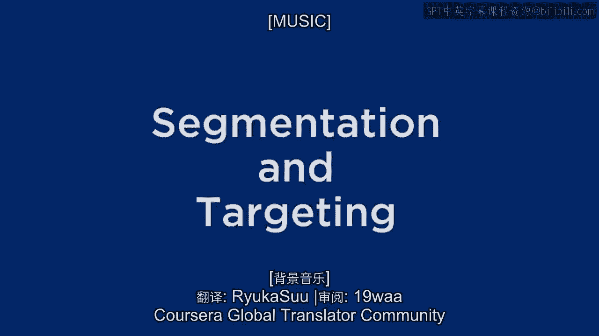
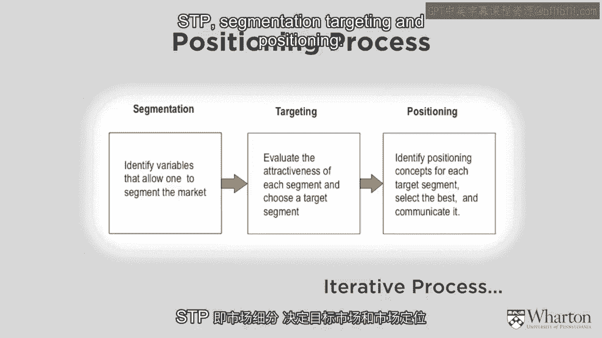
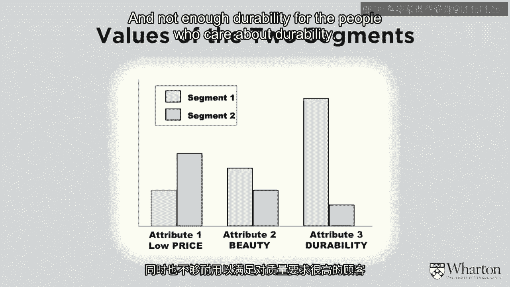
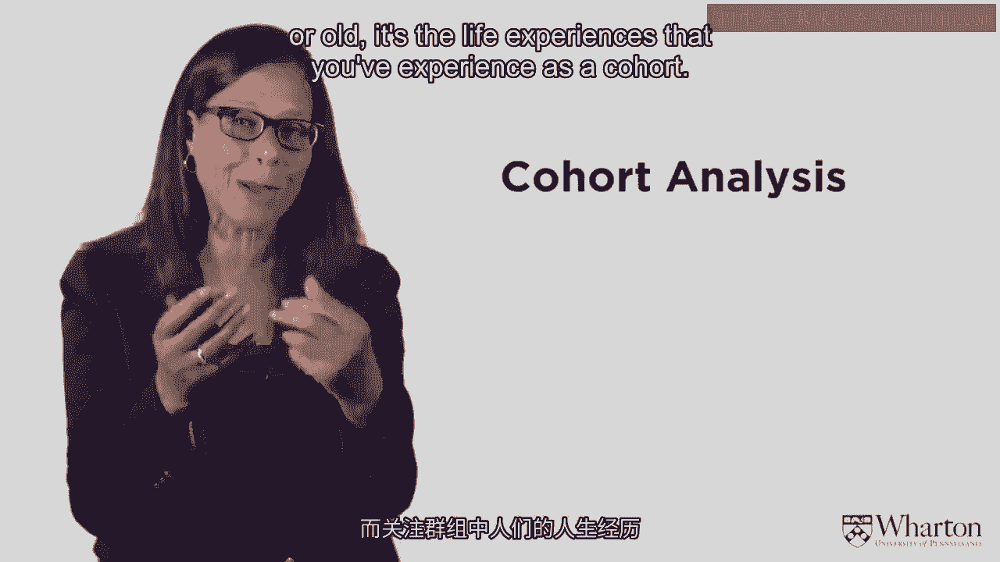
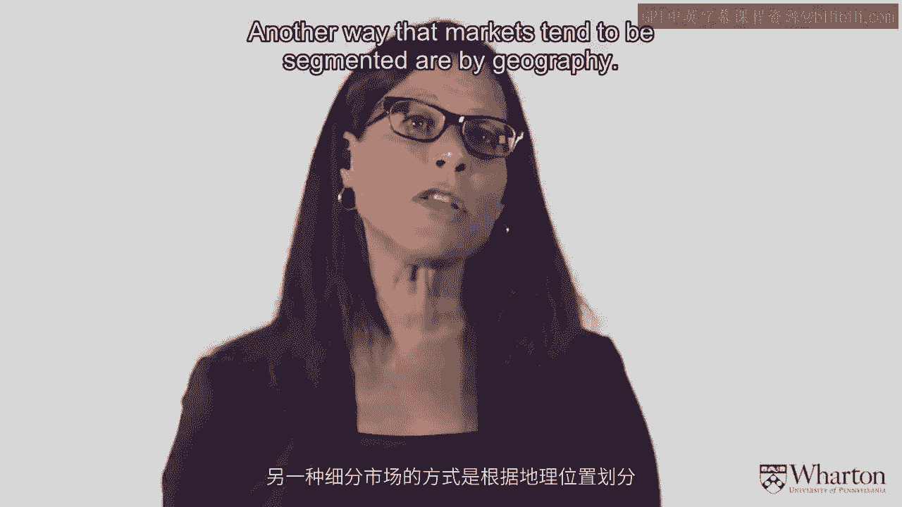
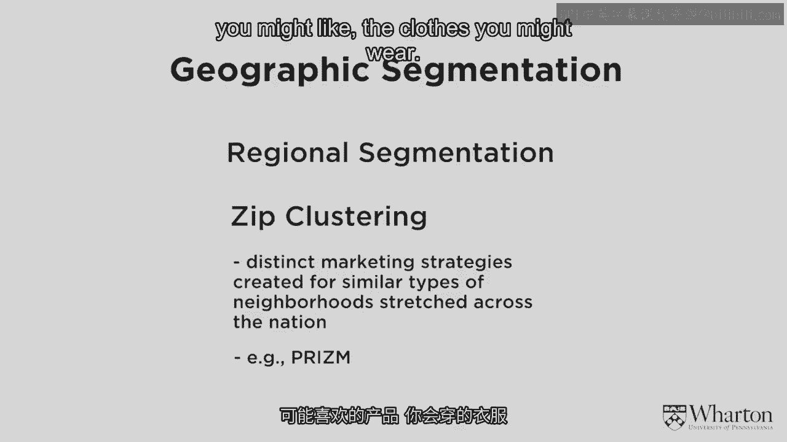
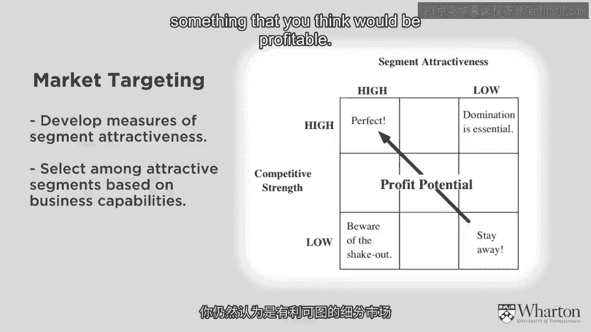
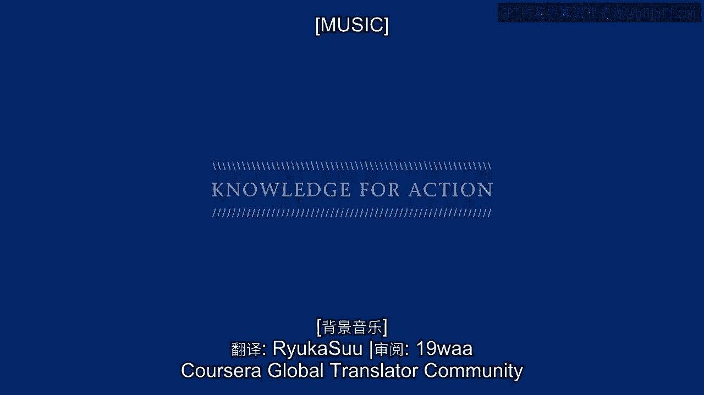

# 🎯 沃顿商学院《商务基础》课程 P4：市场细分与目标定向

在本节课中，我们将学习市场营销中一个至关重要的概念：**市场细分与目标定向**。这是STP框架（细分、目标定向、定位）的前两个环节，也是后续品牌定位的基础。我们将探讨如何将市场划分为不同的细分市场，并选择最具吸引力的目标市场。

---

## 📊 什么是市场细分与目标定向？

上一节我们提到了STP框架。本节中，我们来看看其中的**细分**与**目标定向**。

市场细分是指根据某些变量，将整体市场划分为若干个具有不同需求或特征的消费者群体。其核心公式可以概括为：

**STP = 细分 + 目标定向 + 定位**

目标定向则是在细分之后，评估各细分市场的吸引力，并选择一个或多个作为目标市场。

如果不进行市场细分，企业往往会提供“平均化”的产品或服务，就像一杯“温吞的茶”，既不能满足追求热茶的人，也无法满足喜欢冰茶的人，最终可能无法取悦任何一方。通过细分，企业可以精准满足特定群体的需求。

---

## 🔍 如何进行市场细分？

理解了细分市场的必要性后，接下来我们看看有哪些具体的细分方法。以下是几种常见的市场细分方式：

1.  **基于顾客特征细分**：这是最直观的方法，即根据消费者自身的特点进行划分。
    *   **人口统计细分**：如年龄、性别、收入、教育程度。
    *   **地理细分**：如国家、城市、社区。例如，PRISM等地理聚类系统可以根据邮政编码推断居民的生活方式和消费偏好。
    *   **世代/队列分析**：关注特定历史时期成长起来的人群（队列），如婴儿潮一代、X世代、千禧一代（Y世代）。他们的共同成长经历塑造了独特的价值观和消费习惯。

2.  **基于寻求的利益细分**：这种方法不关注消费者是谁，而关注他们从产品中希望获得什么。
    *   例如，购买跑鞋的消费者可能分别看重舒适性、外观设计或科技含量。

3.  **基于购买行为细分**：根据消费者的购买习惯进行划分。
    *   例如：购买频率（高频 vs 低频）、购买渠道（线上 vs 线下）、品牌忠诚度（忠诚者 vs 品牌转换者）。

---

## 🎯 如何选择目标市场？

在将市场划分为不同细分部分后，下一步就是评估并选择目标市场。以下是评估细分市场吸引力的几个关键维度：

*   **细分市场吸引力**：该市场有多大？增长潜力如何？消费者是否有购买力？市场是否稳定？
*   **企业自身能力**：我们是否有能力满足该细分市场的需求？我们目前在该市场处于什么位置？
*   **竞争状况**：有多少竞争对手在追逐这个市场？竞争对手的实力如何？是否有潜在进入者？

理想的目标市场是**吸引力高**且**自身竞争优势明显**的细分市场。企业需要在这两者间找到最佳平衡点。

---

## 📝 本节总结

本节课中，我们一起学习了市场营销的核心流程——STP框架的前两步：**市场细分**与**目标定向**。

我们首先明确了细分市场的重要性，即避免提供“平均化”价值，从而精准满足特定消费者群体的需求。接着，我们探讨了多种细分市场的方法，包括基于顾客特征、寻求的利益以及购买行为。最后，我们学习了如何评估各细分市场的吸引力，并结合企业自身能力与竞争状况，选择最合适的目标市场。

下一节，我们将进入STP的最后一个环节——**品牌定位**，探讨如何为目标市场塑造独特的品牌形象。