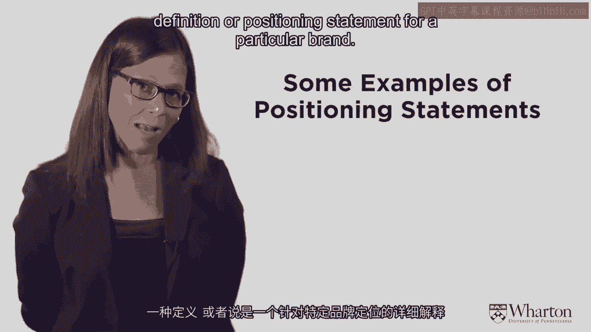
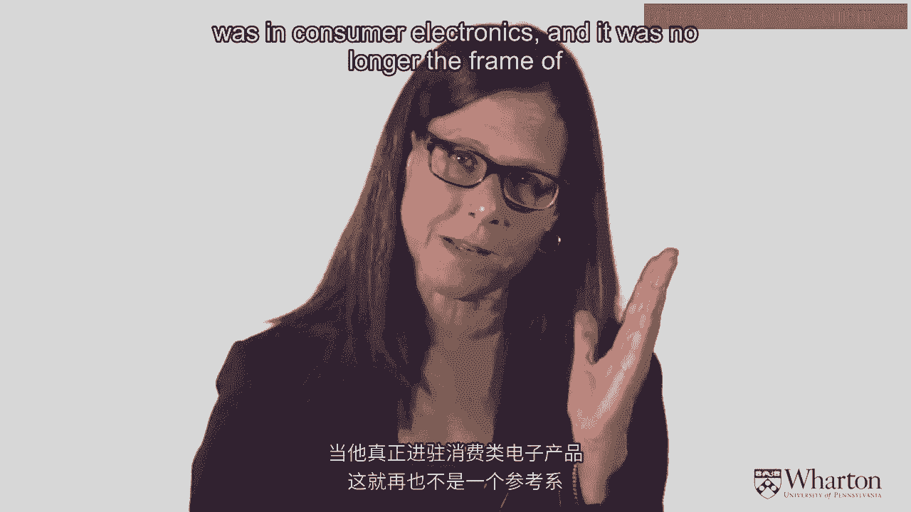
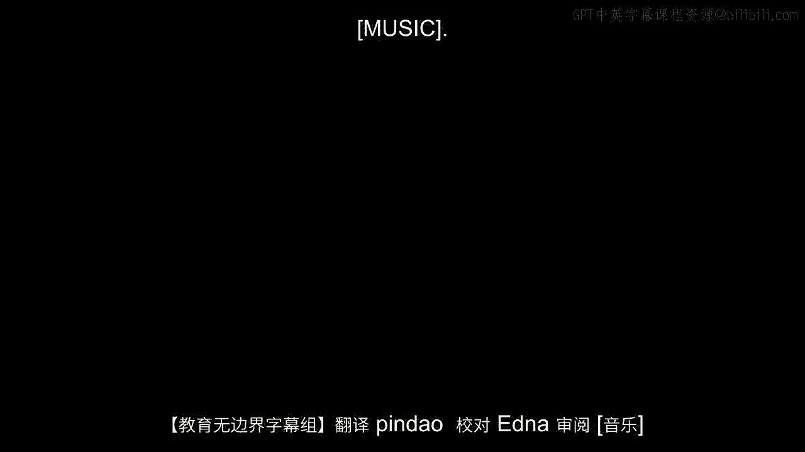

# 沃顿商学院《商务基础》课程 P5：品牌定位 🎯

在本节课中，我们将学习市场营销中一个核心的战略概念：品牌定位。我们将探讨什么是品牌，以及如何通过清晰的定位陈述来定义品牌，从而在目标客户心中占据独特的位置。

上一节我们介绍了市场细分与目标市场选择，本节中我们来看看如何为选定的目标市场进行品牌定位。

## 什么是品牌？🏷️

从法律角度看，品牌是一个受保护的**商标**。然而，对于营销人员而言，品牌的内涵远不止于此。传统上，品牌被视为一种**关系**或**契约**，是公司向顾客做出的关于特定利益的**承诺**。它代表着一致性、利益和顾客对品牌的期望。

在当今互联的世界里，品牌的真正定义是：**品牌是顾客心中所认为的一切**。无论公司试图传达什么信息，最终决定品牌形象的是顾客的认知。因此，市场营销和市场研究的一个重要部分，就是理解顾客如何看待你的品牌。

## 理解定位陈述 📝

定位陈述是对特定品牌的定义。它清晰地说明了品牌在市场竞争中的位置。以下是两个经典的定位陈述示例，分别来自苹果电脑和IBM（个人电脑时代）：

*   **苹果电脑**：苹果电脑通过其创新的硬件、软件和互联网产品，为全球的学生、教育工作者、创意专业人士和消费者提供最佳的个人计算体验。
*   **IBM**：IBM服务于需要计算机的企业。IBM是您可以信赖的公司，满足您的一切需求。

这两个陈述展示了截然不同的定位，它们针对不同的目标细分市场，价值主张也完全不同。

## 定位陈述的三要素 🔑

一个强有力的定位陈述包含三个核心部分：

1.  **目标市场**：品牌希望服务哪类顾客。
2.  **差异点**：品牌提供的、与竞争对手不同的独特价值或优势。
3.  **参照系**：品牌将自己与哪些竞争对手进行比较。

让我们以苹果的定位陈述为例进行分析：
*   **目标市场**：学生、教育工作者、创意专业人士。
*   **差异点**：创新（提供最先进的硬件、软件和互联网产品）。
*   **参照系**：其他个人电脑/个人计算体验。

这三个要素共同构成了品牌的**价值主张**。差异点是相对于参照系而言的。例如，如果佳洁士口香糖的参照系是“其他牙膏”，其差异点就是“牙膏形态的口香糖”；如果参照系是“其他口香糖”，差异点则变成了“含有牙膏成分的口香糖”。因此，构思定位的艺术在于选择正确的目标市场、参照系，并据此定义你的差异点。

## 有效定位的原则 ⚙️

一旦确定了定位陈述，就需要运用营销组合的所有元素——**产品、价格、促销、渠道**——来将产品定位以满足目标细分市场的需求。

有效的定位应遵循以下原则：
*   **清晰简洁**：聚焦于少数关键利益点，有时这被称为**独特销售主张**。
*   **具有防御性**：定位应该是你能占据且不易被竞争对手复制的。
*   **必须做出选择**：**你无法满足所有人**。试图面面俱到会导致品牌定位模糊，如同“温吞的茶”，缺乏吸引力。你必须选择目标市场、差异点和参照系。

定位是一个**战略性的**宏观构想，它决定了产品开发的方向。这与**信息传递**不同，后者是**战术性的**，涉及品牌颜色、标志等具体执行细节。

## 深入理解“共同点” 🤝

参照系或“共同点”是定位陈述中需要深入理解的部分。共同点是品牌与竞争对手共享的联想，是进入某个竞争领域所**必须满足的条件**。

例如，如果参照系是“杂货店”，那么“提供生鲜产品”可能就是一个共同点，没有它就无法被视为杂货店。

共同点也可以用来**抵消竞争对手的差异点**。例如，当某个牙膏品牌率先推出含氟防蛀牙膏作为差异点时，其他品牌纷纷跟进添加氟化物。于是，含氟从“差异点”变成了行业“共同点”，从而抵消了先行者的优势。

一个著名的例子是2007年1月9日，史蒂夫·乔布斯将公司名从“苹果电脑”改为“苹果”。这改变了哪个定位要素？目标市场（创意、年轻人）和差异点（创新）未变，改变的是**参照系**——从“个人电脑”扩展到了“消费电子产品”。这一定位调整与iPhone的发布同步，标志着苹果进入了更广阔的市场。

## 选择强有力的“差异点” ✨

差异点是强大、有利且独特的品牌联想，是顾客选择你而非竞争对手的理由。它可以是产品属性、性能、形象、利益或设计等任何你能占据并真正区分品牌的东西。

选择差异点时，必须确保：
*   **对顾客有吸引力**：相关且独特。
*   **品牌能够兑现**：可行且可持续，不要过度承诺。

## 总结 📚

本节课中我们一起学习了品牌定位的核心内容。我们了解到，品牌远不止是一个商标，它本质上是顾客心中的认知。我们学习了如何构建一个包含**目标市场、差异点和参照系**三要素的清晰定位陈述。有效的定位需要聚焦、具有防御性，并且必须做出战略选择。最后，我们探讨了共同点与差异点的作用，以及如何选择一个既对顾客有吸引力、品牌又能切实兑现的强有力的差异点。理解并应用这些概念，是打造成功品牌的基础。

---
*课程内容来源：沃顿商学院《商务基础》系列课程 - P5：品牌定位*