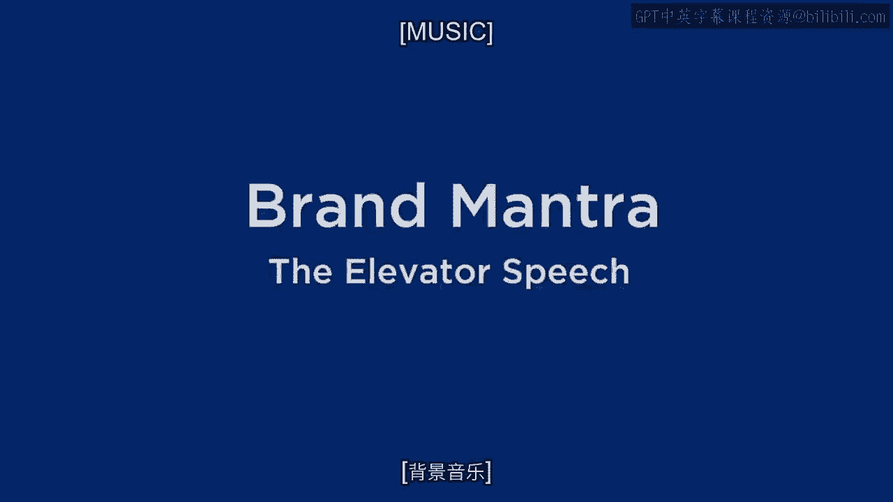
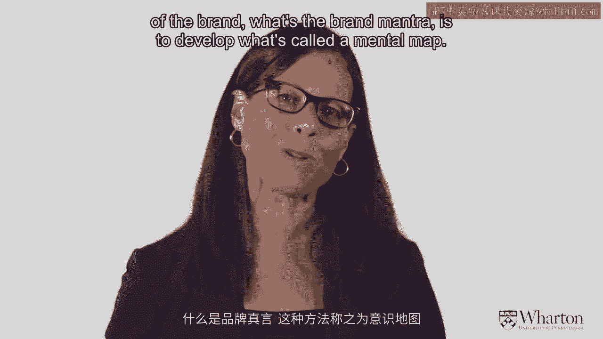
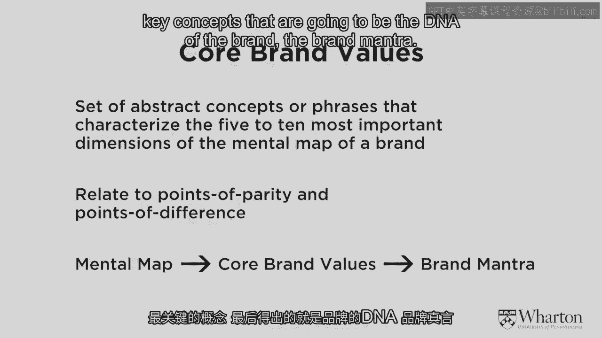
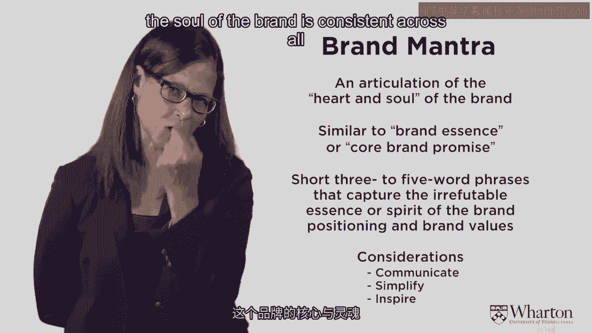
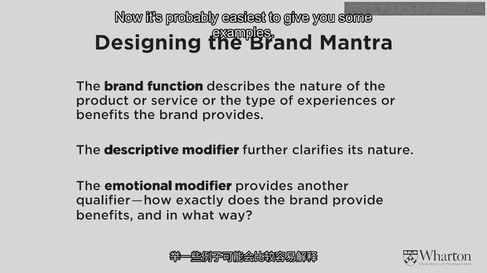
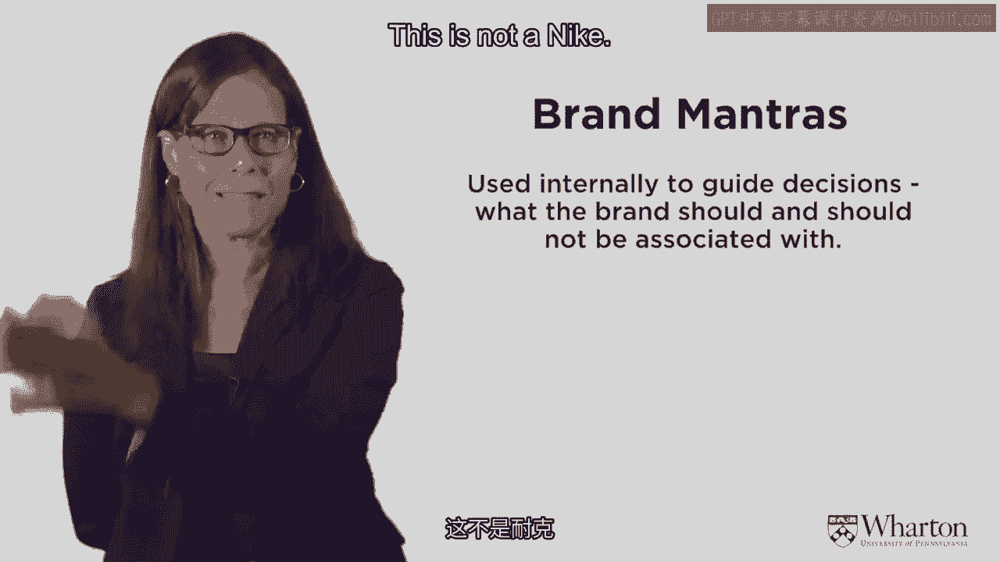
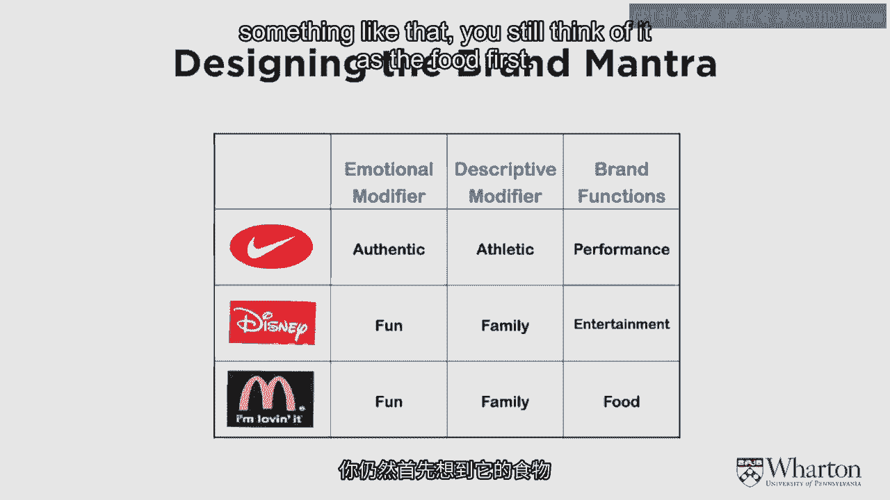
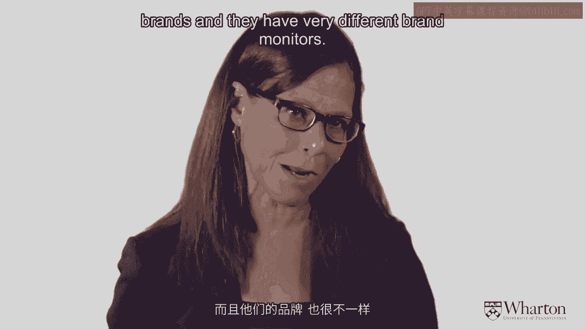
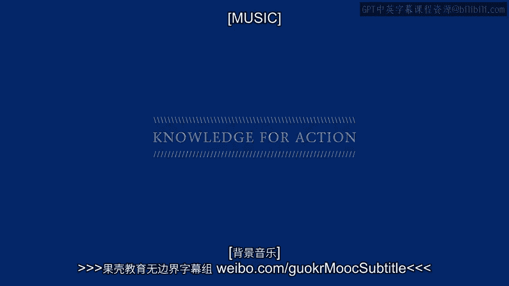

# 沃顿商学院《商务基础》课程 P6：品牌真言与电梯演讲 🎯

在本节课中，我们将学习品牌定位的战略延伸——品牌真言与电梯演讲。我们将探讨如何将复杂的品牌定位提炼成简短、有力的核心信息，并了解这一过程背后的思考工具。

上一节我们介绍了品牌定位的战略部分。品牌定位涉及众多选择，例如不同的目标细分市场、参照框架和利益点。虽然理解这些概念不难，但要做出精准的营销决策却极具挑战性。营销有许多错误的方式，而正确的路径却很少。

## 从心智地图到核心精髓 🧠

为了找到正确的品牌定位，我们需要一个工具来梳理思路。以下是一种常用的方法：构建心智地图。

心智地图是一种图形化的思考工具，它通过圆圈和箭头展示消费者对品牌的联想网络。这个过程本质上是思想关联的映射。你可以询问消费者：“当你想到这个品牌时，脑海中会出现什么？”然后记录下这些联想，并描绘它们之间的联系。

心智地图可以有多种呈现方式。例如，圆圈的大小可以代表该联想被提及的频率，连线的粗细可以表示联想之间的关联强度。其核心目标是描绘出与品牌相关的所有思想关联图景。

这里以麦当劳为例展示一张心智地图。中心是麦当劳的差异化要素，如金色拱门和品牌名。外围的红色圆圈代表该品类的共性特征，如提供餐食、服务、家庭食品与乐趣、高性价比。黄色的圆圈则代表与麦当劳每个共性点相关的独特联想，例如，在“餐食”下，会联想到汉堡、早餐、薯条，以及具体的产品品牌如巨无霸、麦满分。在“品质”下，会联想到始终如一、新鲜、美味。

通过市场调研，对多位消费者重复这一过程，你可以收集到大量抽象的短语和概念。接下来，目标是从这个庞大的联想网络中，提炼出最关键的五到十个核心品牌价值。

## 定义品牌真言 🧬

从核心品牌价值出发，我们需要进一步将其浓缩为品牌的DNA，即品牌真言。

品牌真言被定义为品牌的核心与灵魂，是品牌的精髓和承诺。它类似于“电梯演讲”——在30秒内清晰定义品牌。了解品牌真言至关重要，因为品牌旗下的所有产品、广告和行动都必须符合这一精髓。无论是顾客还是员工，都应当清楚品牌真言。一个强大的品牌，其内涵清晰明确，并能统御品牌名下的一切活动。在当今全渠道（线上、线下、网站、手机应用）的环境中，确保品牌核心在所有平台和产品上保持一致尤为重要。

品牌真言包含三个基本部分：
1.  **品牌功能**：描述产品或服务的性质，以及品牌提供的体验和利益。
2.  **描述性修饰语**：进一步分类或阐明品牌交付内容的具体性质。
3.  **情感限定词**：精确解释这些利益是什么，以及品牌以何种方式交付这些利益。

品牌真言主要用于内部决策指导。它不仅定义了品牌“是什么”，同样重要地，也明确了品牌“不是什么”。这个概念需要黑白分明。同时，它传达了品牌的边界，必须简短、简单且具有启发性。

## 经典案例解析 📚

以下是几个著名品牌的真言示例：

*   **Nike（耐克）**：**真实的运动表现**。耐克专注于运动领域，其真言强调真实性与高性能，这贯穿于其所有产品和“Just Do It”的广告语中。
*   **Disney（迪士尼）**：**有趣的家庭娱乐**。迪士尼的核心是娱乐。即使它也销售食品，但消费者首先联想到的是其提供的娱乐体验，食品服务也包含在这一真言之下。
*   **McDonald‘s（麦当劳）**：**有趣的家庭食品**。麦当劳虽然也提供游乐设施等家庭乐趣，但其真言以“食品”为首要核心。消费者首先将其视为餐饮品牌。

尽管迪士尼和麦当劳都瞄准家庭市场并提供情感利益，但由于品牌真言不同——一个核心是“娱乐”，一个核心是“食品”——它们依然是截然不同的品牌，消费者不会将二者混淆。

本节课中，我们一起学习了如何从复杂的心智地图出发，提炼出品牌的核心价值，并最终形成指导一切品牌活动的品牌真言或电梯演讲。掌握这一工具，能帮助你在纷繁的市场选择中，找到并坚守品牌最独特、最清晰的战略定位。