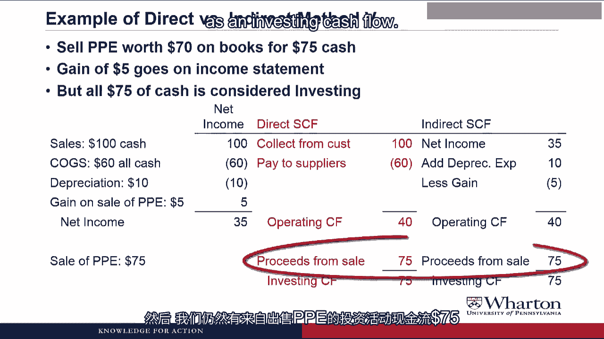
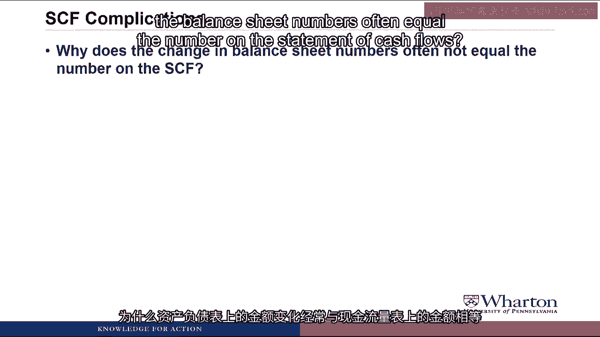
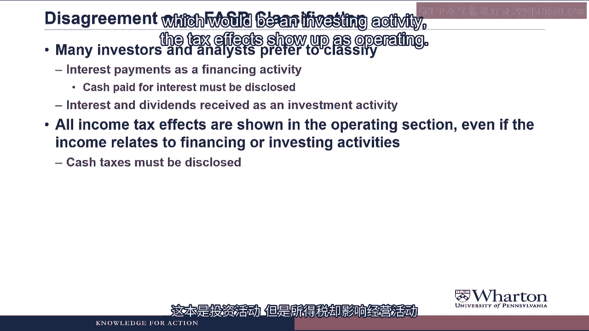

# 沃顿商学院《商务基础》课程 P69：更多现金流主题与 EBITDA 💰

在本节课中，我们将学习现金流量表中的几个补充主题。首先，我们将探讨如何处理固定资产出售的损益。接着，我们会了解现金流量表分类中的一些复杂情况。最后，我们将讨论净利润、现金流、EBITDA和自由现金流之间的区别与联系。这是一个内容丰富的议程，让我们开始吧。

## 固定资产出售损益的处理 🏢

上一节我们学习了现金流量表的基本编制方法，本节中我们来看看当公司出售固定资产并产生损益时，应如何在现金流量表中进行处理。

假设我们以75美元的现金，出售了一项账面价值为70美元的固定资产（Property, Plant, and Equipment, PPE）。这会产生5美元的收益。

**核心公式**：
`出售收益 = 出售所得现金 - 资产账面价值`
`$5 = $75 - $70`

这笔5美元的收益会出现在利润表上，增加净利润。但需要明确的是，这笔收益**不属于核心营业收入**，因为买卖固定资产并非公司的主营业务。因此，在现金流量表中，它不应计入经营活动现金流，而应计入投资活动现金流。

以下是处理示例。假设公司原有数据为：全部为现金的销售收入100美元，全部为现金的销售成本60美元，折旧费用10美元。加上这笔5美元的出售收益后，净利润为35美元。

**直接法**现金流量表处理如下：
*   从客户收取的现金：$100
*   支付给供应商的现金：$60
*   折旧费用（非现金）：忽略
*   固定资产出售收益（属于投资活动）：忽略
*   经营活动现金流 = $100 - $60 = **$40**
*   投资活动现金流（出售PPE所得）：**$75**

**间接法**现金流量表处理如下：
*   净利润起点：$35
*   加回：折旧费用 $10
*   减去：固定资产出售收益 $5 （因为该收益增加了净利润，但对应的现金流入属于投资活动，为避免重复计算，需从经营活动中剔除）
*   经营活动现金流 = $35 + $10 - $5 = **$40**
*   投资活动现金流（出售PPE所得）：**$75**

两种方法得出的经营活动现金流和投资活动现金流结果一致。

为了记住在间接法中如何处理这类投资活动损益，有一个简单的口诀：**“收益加进来，收益减出去”**（Put the gain in, take the gain out）。即，由于收益已包含在净利润中，在计算经营活动现金流时，需要将其减去。

## 现金流量表分类的复杂性 🔍

在之前的所有例子中，资产负债表科目（如应收账款）的变动额，与现金流量表经营部分对应的数字是完全一致的。但在实际的财务报表中，情况往往并非如此，主要由以下四个原因导致。

以下是导致差异的几种常见情况：

1.  **与非现金投融资活动相关的营运资本变动**：例如，客户无法支付现金，转而用一块土地抵偿应收账款。这会减少应收账款（资产负债表变动），但因为没有现金流入，所以不会体现在现金流量表的经营部分。
2.  **企业并购的影响**：公司收购另一家企业时支付的现金属于投资活动现金流。但被收购公司的营运资本（如应收账款、存货）也会并入收购方的资产负债表。这些营运资本的变动不会重复计入经营活动的现金流中。
3.  **外币折算调整**：对于跨国公司，汇率变动会影响以外币计价的应收/应付账款、存货的资产负债表金额。这些汇率影响会在现金流量表底部单独列示，而不计入经营部分，以确保经营部分只反映真实的业务活动变化。
4.  **多元化经营的子公司**：同一笔交易在不同类型的子公司中可能被分类不同。例如，一家制药公司购买土地属于投资活动，但其旗下专门从事房地产业务的子公司购买土地则属于经营活动。有些公司会为此编制分部的现金流量表。

## 关于分类的争议与EBITDA 💡

接下来，我们讨论分析师和投资者与美国财务会计准则委员会（FASB）在现金流量分类上的两点主要分歧。

首先，许多人倾向于将**利息支出**列为筹资活动，将**投资收益和股息收入**列为投资活动。但在美国通用会计准则（US GAAP）下，这些都被要求归为经营活动。FASB要求公司披露支付的利息总额，以便分析师可以自行调整。

其次，**所有所得税影响**都显示在经营部分，即使相关的收益源于投资或筹资活动（如出售固定资产的收益）。FASB同样要求披露支付的现金税款总额。

正因为这些分类争议，许多分析师使用**EBITDA**（息税折旧摊销前利润）作为经营现金流的替代指标。因为它排除了利息和税款的影响。

**核心公式**：
`EBITDA = 净利润 + 利息 + 税款 + 折旧 + 摊销`

然而，EBITDA并非衡量现金流的完美指标。如果营运资本（如应收账款、存货）发生大幅变动，EBITDA会严重失真。它和净利润一样，存在被操纵的可能。例如，公司可以通过“渠道压货”（在季度末向客户大量发货以确认收入）来虚增净利润和EBITDA，但此时并没有现金流入，只是应收账款增加。

那么，是现金流更重要还是净利润更重要？学术研究表明，**净利润比当期经营现金流更能预测未来的现金流**，因为净利润旨在衡量价值的创造。而经营现金流更容易受到时间性差异的影响。最好的预测方法是同时使用净利润和经营现金流两个指标。

## 关于自由现金流的注意事项 ⚠️

最后，我们简要谈谈自由现金流。这是一个金融领域常用的概念，通常指经营现金流减去资本支出。

**核心概念**：
`自由现金流 ≈ 经营现金流 - 资本性投资`

估值模型通过预测并折现自由现金流来估算公司价值。但问题在于，对于“经营现金流”并没有标准的定义。不同的教材、不同的公司可能使用不同的计算方法，例如：
*   现金流量表中的经营现金流 ± 利息
*   EBITDA
*   净利润 + 折旧 ± 营运资本变动

一些公司甚至会使用自定义的自由现金流定义，并且可能在不同年份改变其定义。

因此，最重要的原则是：**在使用任何现金流指标时，必须首先弄清楚它是如何被具体定义的**。两种相对可靠的计算经营现金流的方法是：
1.  采用现金流量表中的经营现金流（FASB分类），然后减去报表中披露的已付利息和已付税款。
2.  从EBITDA出发，像编制间接法现金流量表那样，根据资产负债表调整应收账款、存货、应付账款等营运资本的变动。

## 总结 📝

本节课我们一起学习了多个现金流相关的重要主题。我们掌握了如何在现金流量表中处理固定资产出售的损益，了解了实际编制中可能遇到的分类复杂性，并深入探讨了EBITDA的优缺点及其与净利润、现金流的关系。我们还认识到自由现金流缺乏统一定义，使用时需仔细甄别。在接下来的课程中，我们将通过案例来进一步巩固这些知识，并比较不同现金流衡量指标的优劣。