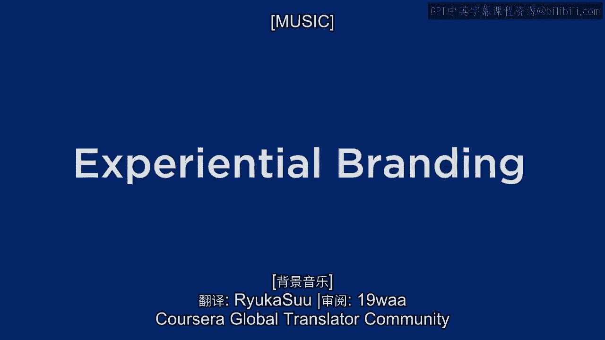
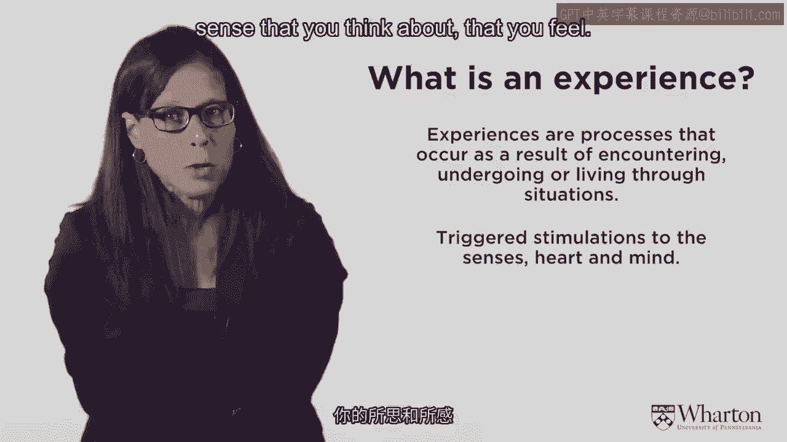
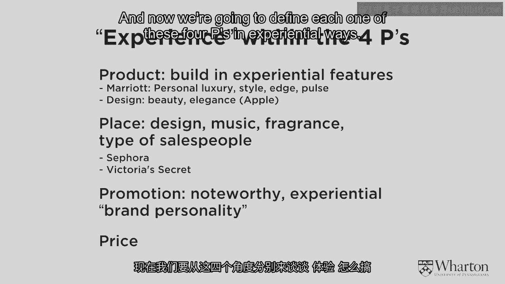
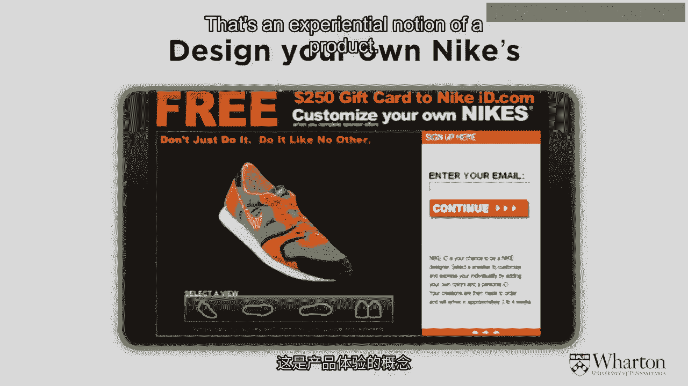
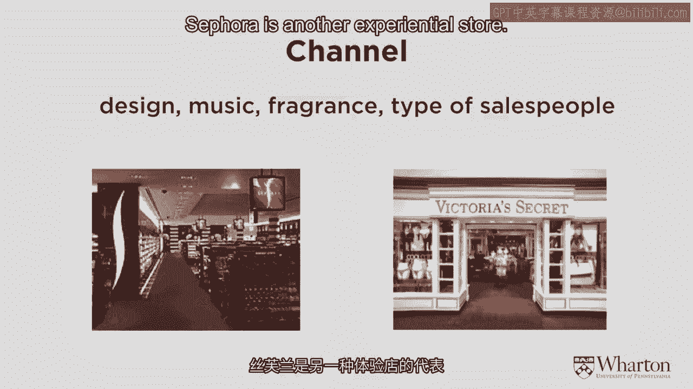
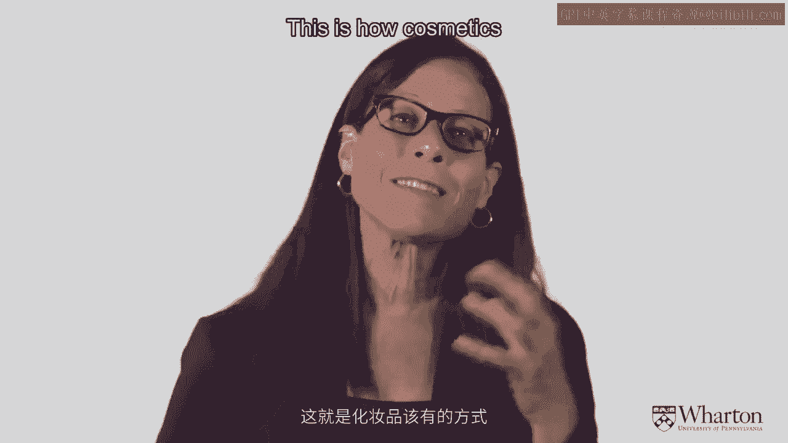
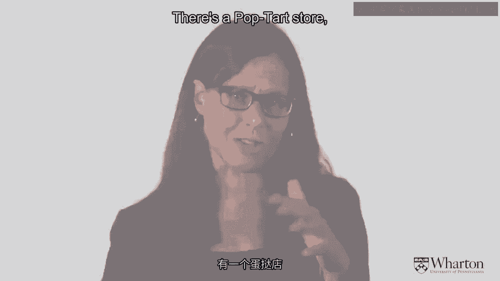
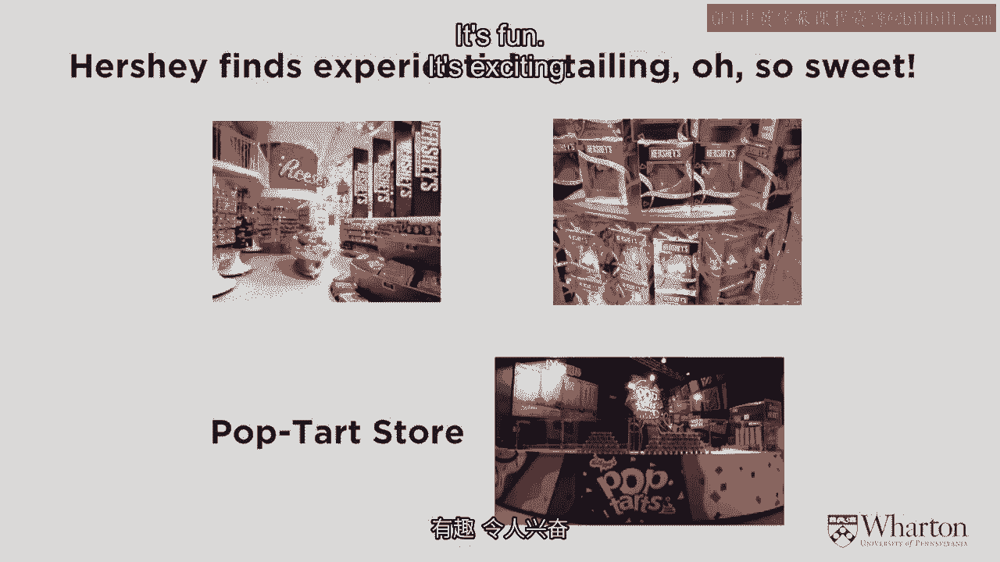
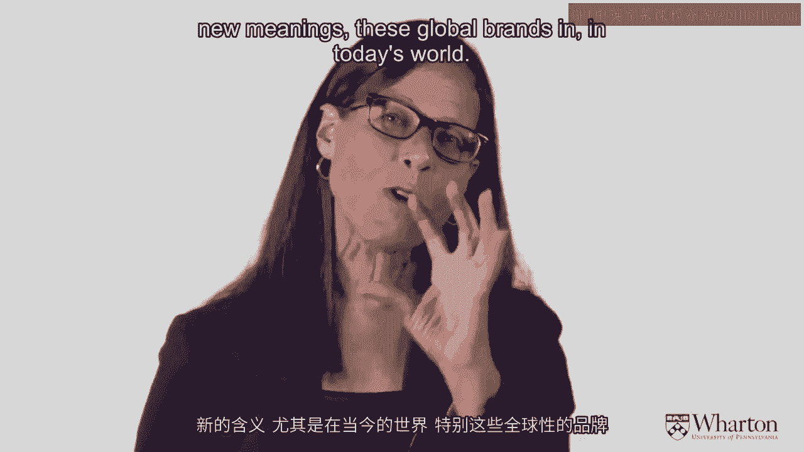

# 沃顿商学院《商务基础》课程 P7：体验品牌 🎯

在本节课中，我们将要学习品牌的核心概念，并深入探讨什么是“体验品牌”。我们将从传统的品牌定位出发，逐步理解在当今互联世界中，品牌如何通过多维度的感官与情感体验与顾客建立更深层次的联系。

---

## 什么是品牌？从定位到体验

在之前的课程中，我们讨论了市场营销的定义、营销策略、竞争分析、顾客价值，以及市场细分、目标市场选择与定位的核心概念。一个强大品牌的核心在于其**品牌定位**——一个尖锐到可以用三个词、三十秒说清的**品牌箴言**。

上一节我们介绍了如何精确定义品牌，本节中我们来看看品牌的另一个关键维度：体验。

在当今“互联社区”的时代，市场已从卖方市场、买方市场演进而来，顾客体验变得至关重要。市场与顾客的互动本身也变得极具体验性。因此，仅凭一个清晰、明确的品牌箴言和定位来定义品牌已经不够。我们必须定义围绕品牌存在的所有体验：品牌的气味是什么？品牌的触感如何？在我们所处的这个新体验世界中，所有这些都成为了品牌的一部分。

---

## 体验的定义与维度

那么，什么是体验？体验是经历某个情境后发生的过程，是动态的感知与感受。它不仅是一个时间点，更涉及所有感官，是社会性、行为性、认知性和情感性的综合。体验是触发你思考、感受的刺激，它将公司与品牌同顾客连接起来，并将顾客的个人行为置于更广阔的社会背景中。

到目前为止，我们所讨论的内容都相当理性。现在，我们将引入情感等其他维度。强大的品牌是情感化的、体验式的，而不仅仅是硬性的认知观点。这正是本节最后要强调的重点：**品牌是一种体验**。

因此，左侧图表中的传统要素（如差异化）固然重要，但它们都需要被扩展，以体现这种体验或情感部分。

以下是体验品牌与传统品牌观念的关键区别：

*   **差异化**：营销的原则是差异化，即寻找**独特卖点**。但在今天，丰富的品牌不仅是差异化的，更是**体验差异化**的。差异化也存在于品牌体验之中。
*   **承诺与关系**：品牌不再只是一个单一的承诺，而是一种**关系**。你对所爱的品牌（如苹果、Abercrombie）有一种随时间发展、并能定义你自身的关系。
*   **属性与个性**：品牌不仅仅是产品属性或性能属性这些认知层面的东西，它更是一种**个性**。你几乎可以把品牌当作一个朋友。
*   **静态与动态**：品牌不是静态的，而是动态的。它不再是大众化的，因为你正在与品牌**共同创造**，品牌变得非常个性化，与你高度相关。
*   **认知与融入**：你不仅仅是知道这个品牌，你更清楚这个品牌如何融入你的生活。

你可以看到，真正强大的品牌体现了所有这些情感体验。

---

## 构建体验品牌定位

因此，当你定义这些术语时，不要只考虑品牌定位，而要考虑**体验式品牌定位**。

*   **品牌代表什么？** 它应该是一个**多感官策略**。思考体验式品牌定位时，你不仅要思考品牌的DNA和箴言，还要思考：品牌的气味是什么？颜色是什么？想到这个品牌时你感受到什么情绪？
*   **品牌承诺**：品牌箴言不仅仅是三个认知层面的词，它还需要用体验性的术语来描述品牌承诺。

在这里，我需要明确“体验”的含义。它需要包含以下维度，我们可以用一个公式来概括完整的品牌体验：

**完整品牌体验 = 感官 + 情感 + 认知 + 行为 + 关联**

以下是每个维度的具体解释：

*   **感官**：涉及视觉、嗅觉、味觉、听觉、触觉这五种感官。你需要提供一致的感官体验。
*   **情感**：指内在感受。品牌应吸引顾客的内在情感，并与之建立强烈的情感联系。
*   **认知**：指智力、思考过程、好奇心、惊喜等思维活动。
*   **行为**：指人们围绕品牌的行为方式。品牌可以具有启发性，促使你以某种方式行动。
*   **关联**：指品牌所处的社会系统与文化背景。

---

## 通过营销组合传递体验

所有这些体验功能都需要通过经典的**4P营销组合**来传递。现在，我们将以体验式的方式重新定义每一个P。

### 1. 产品

产品不再仅仅是你购买的东西，而是你可以共同设计、共同创造的过程，这使其极具体验性。

**示例**：耐克的定制鞋服务。你不仅仅是购买一双鞋，而是参与设计过程，选择你想要的鞋款元素。

### 2. 促销（广告）

广告也可以是体验式的。它应该能让你感受到品牌。

**示例**：苹果公司早期的iPod广告。它结合了音乐、舞蹈，让你感受到产品的活力。白色的耳机成为一种颜色和设计的标志。如今的在线广告、移动广告也非常注重体验和互动。

### 3. 价格

即使是像价格这样认知性很强的要素，也可以是体验式的。

**示例**：eBay的拍卖模式，或“任意装袋享20%折扣”的促销活动，让价格成为由顾客参与创造的一部分。Priceline的“自主定价”模式也是价格体验化的体现。

### 4. 渠道（地点）

实体店和线上渠道都变得越来越具有体验性。

**示例**：
*   **拉夫·劳伦旗舰店**：它不仅仅是一个服装店，而是构建了一个完整的生活方式场景，展示了目标顾客可能居住的房屋和拥有的家具，体验感极强。
*   **丝芙兰**：店内充满灯光、色彩和香气，顾客可以随意试用产品，触摸、感受，这正是化妆品应有的体验式零售模式。
*   **时代广场的糖果店**：如M&M‘s世界，糖果和色彩无处不在，顾客可以品尝不同口味，整个购物过程如同游乐园般充满乐趣。

所有这些体验都严格遵循品牌的DNA，并非随机设计。每一个环节都通过这四个方面，以体验式的方式传递着品牌箴言。

---

## 强弱品牌的特征对比

作为本节的总结，我们来回顾一下强弱品牌的关键区别。

强大的品牌具有以下特征：
*   **清晰的承诺**：承诺明确、动态且始终如一。
*   **丰富的品牌资产**：拥有强烈的情感和认知关联。
*   **可靠的交付**：承诺被持续、稳定地兑现。
*   **忠诚的顾客**：拥有忠诚的顾客，他们乐于传播品牌信息。
*   **一致性**：每次的产品体验都符合预期，品质稳定。
*   **卓越性**：品牌产品往往是优质产品，能提供特定的顾客价值。
*   **独特性**：定位鲜明，不易与其他品牌混淆。
*   **内外一致**：外部形象与内部组织运作协调一致。
*   **持续相关性**：能够灵活适应市场、时代和顾客的变化。

而弱势品牌则表现为：
*   **定义模糊**：品牌形象不清晰，经常变化。
*   **缺乏一致性**：品质、价格或体验不稳定，声誉不佳。
*   **承诺缺失**：没有明确的承诺或承诺无法兑现，令人生疑。

---

本节课中，我们一起学习了品牌如何从传统的定位概念，演进为一种多维度的、情感化的**体验**。我们探讨了体验的五个维度（感官、情感、认知、行为、关联），并了解了如何通过营销组合（4P）来传递这种完整的品牌体验。最后，我们对比了强弱品牌的关键特征，认识到一个强大品牌的核心在于其**清晰、一致且能引发情感共鸣的体验承诺**。在当今市场，打造深刻的顾客体验已成为品牌建立持久优势的关键。