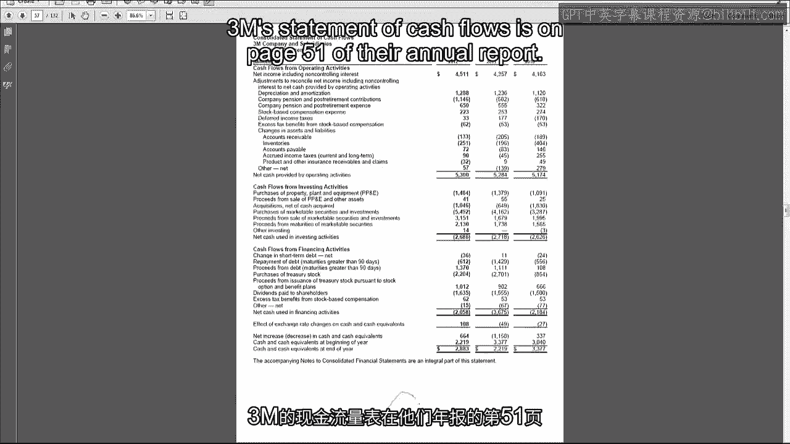
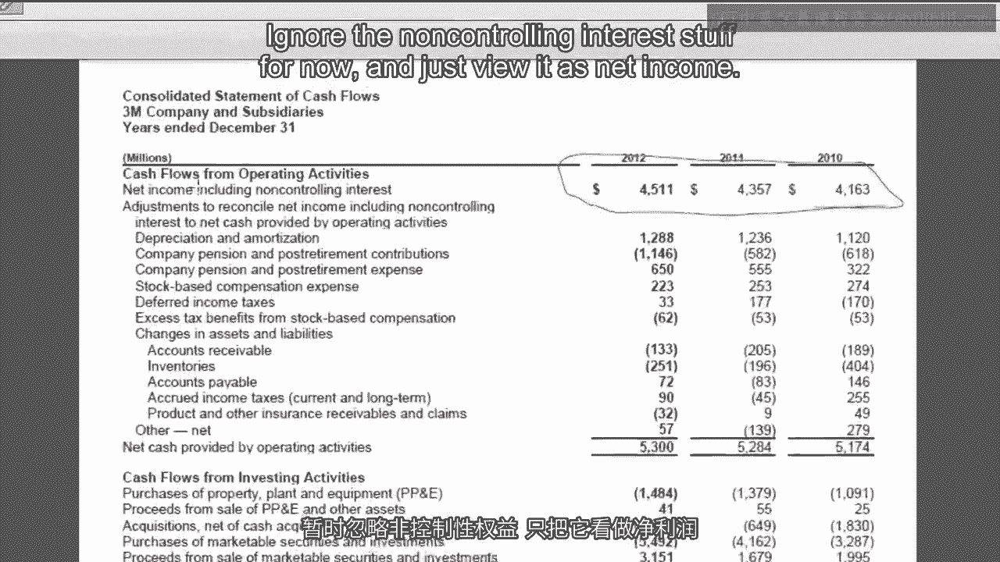
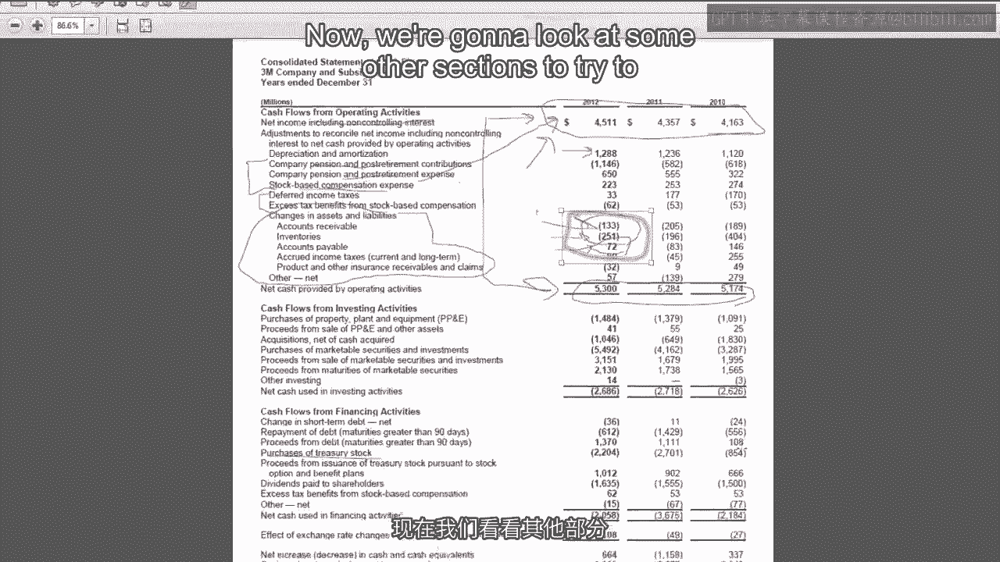
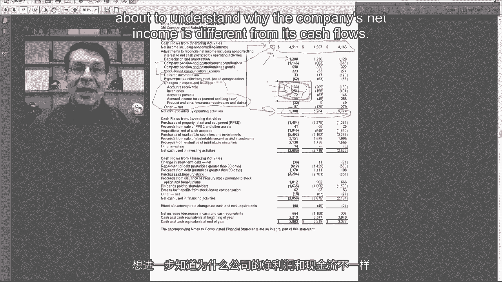
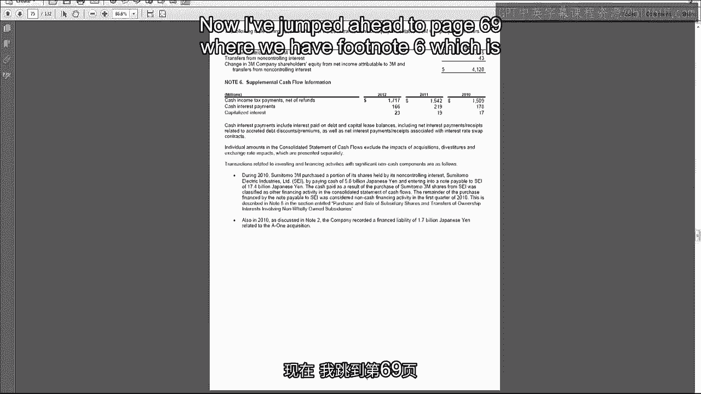
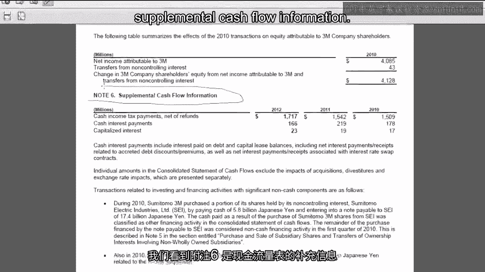
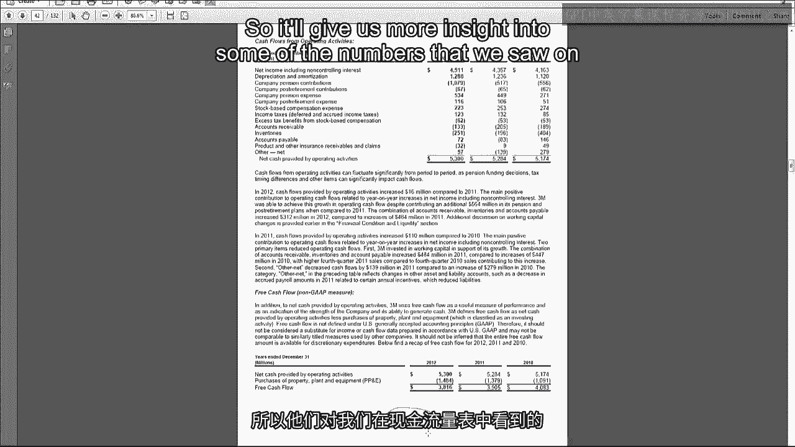
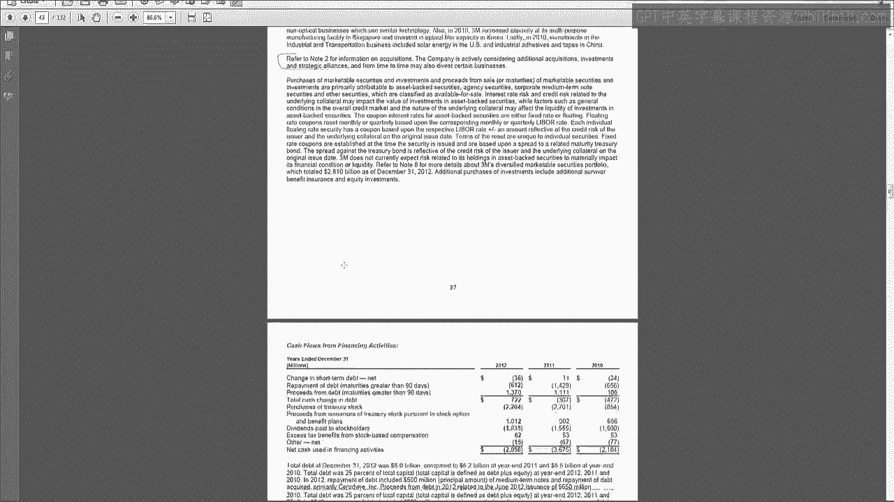
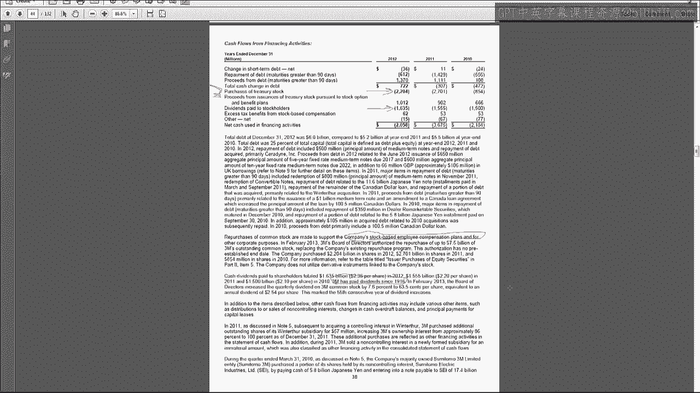

# 沃顿商学院《商务基础》课程 P71：3M公司现金流量表分析 📊

在本节课中，我们将通过分析3M公司的现金流量表，来结束本周关于现金流量的学习。我们将查看其实际的现金流量表、附注中的补充披露，以及管理层讨论与分析（MD&A）部分对现金流量的讨论。

---

## 公司生命周期与现金流模式 🔄

上一节我们介绍了现金流量表的基本结构，本节中我们来看看如何通过三大活动（经营、投资、融资）的现金流模式来判断公司所处的生命周期阶段。

3M公司的现金流量表位于其年报的第51页。首先，我喜欢观察经营、投资和融资活动的现金流分解，以判断公司处于哪个阶段或生命周期。

3M公司每年从经营活动中产生约50亿美元的现金流，相当稳定。其投资活动每年产生约26亿美元的现金流出。除了2011年有个小波动，其融资活动每年也产生约20亿美元的净现金流出。

这是典型的成熟公司特征。公司拥有像“现金牛”一样的产品（如报事贴和思高胶带），持续产生大量现金。公司仍在进行适度再投资，但其经营活动产生的现金足以覆盖所有投资活动，并有剩余现金用于偿还债务、回购股票或支付股息。

为了更深入了解，一个常用的方法是比较折旧与购置不动产、厂房和设备（PP&E）的支出。虽然粗略，但可以将折旧视为消耗固定资产，而资本支出则是购置新资产。3M的资本支出大约在重置水平，意味着其投资主要用于替换消耗的资产。公司还有一些活跃的收购活动，例如2012年约有10亿美元。此外，公司在有价证券上活动频繁，购入约54亿美元，但又在2012年几乎全部售出或到期。这表明3M将暂时闲置的现金投入有价证券获取收益，当出现收购或购置PP&E的机会时，再将其变现用于投资，这相当于公司自己在扮演银行的角色。

在融资活动部分，我们看到大量的现金流出用于购买库存股（主要用于股票期权计划），以及向股东支付大额股息。这再次印证了成熟公司的特点：当没有足够的再投资机会时，公司将现金返还给股东，由股东自行决定再投资。

以下是判断公司生命周期时可关注的几个现金流特征：
*   **经营活动现金流**：持续为正且稳定。
*   **投资活动现金流**：通常为负（进行投资），但规模适中。
*   **融资活动现金流**：通常为负（偿还债务、支付股息、回购股票）。

现在，你可以尝试自己进行这种生命周期或增长分析。视频结束后，请上网找一个你感兴趣的公司，查看其现金流量表，通过分析其经营、投资和融资现金流来了解公司状况。

---

## 深入剖析经营活动现金流 🔍

了解了整体模式后，让我们更深入地看看3M公司经营活动现金流的具体构成。

经营活动现金流从净利润开始（暂时忽略非控制性权益）。3M的净利润持续增长，表明其产品定价能够持续覆盖运营成本，这是成熟公司的典型特征。稳定的盈利能力转化为稳定的现金流。

净利润与经营活动现金流之间的一个主要差异项是折旧和摊销。请记住，这并非现金来源，尽管在报表上看起来是加回项。折旧减少了净利润，但它是非现金费用，因此我们必须将其加回以得到经营活动现金流。3M的折旧摊销金额较大，因为它是制造企业，这类公司通常有较高的折旧摊销。

还有其他一些非现金费用，例如养老金、基于股票的薪酬以及一些递延税款。养老金和退休后福利、股票薪酬等费用在当期确认为利润表费用（影响净利润），但现金可能在未来支付（如养老金）或根本不直接支付现金（如股票薪酬）。因此，这些项目在本期没有相应的现金流。递延税款我们将在课程后面详细讨论。

接下来是资产和负债变动部分，即营运资本的变化。我们看到，应收账款和存货的变动额为负数。在间接法下的现金流量表中，负数意味着这些资产在资产负债表上增加了。资产增加（非现金资产）会导致现金减少，因此在计算现金流时需要减去。应付账款则增加了，应付账款是负债，负债增加在现金流量表上需要加回。

这些变动可能代表好消息或坏消息。坏消息可能是客户不付款、存货滞销、不得不延长付款期。但考虑到3M良好的增长和盈利能力，更可能的情况是好消息：公司仍在增长。年末信用销售增加导致应收账款增加，为预期销售而备货导致存货增加，为预期生产而采购原材料导致应付账款增加。因此，这很可能代表了营运资本因业务增长而增加，而非回收或销售困难。

从报表表面看，3M像是一家仍有增长潜力的成熟公司。

---

## 补充信息与自愿披露 📑

为了更全面地了解现金流情况，我们还需要查看报表附注和管理层讨论与分析（MD&A）中的补充信息。

在年报第69页的附注6中，提供了补充现金流量信息。正如本周第一个视频提到的，公司必须披露支付的现金税费和现金利息。这个披露就在这里。如果你想在估值时使用经营活动现金流，但又希望剔除税费和利息的影响，可以利用这里的数字进行调整。

与现金流量相关的最后一个重要部分是管理层讨论与分析（MD&A），位于年报第36页。MD&A是3M管理层用来解释年度内发生事项的叙述性部分，能为我们提供现金流量表中数字背后的更多信息。

管理层重复了经营活动部分，并讨论了年度内现金流的变化。现金流逐年增长的主要原因是净利润增加。他们提到应收账款、存货和应付账款合计增加了3.12亿美元（去年增加4.84亿美元），但并未深入讨论具体原因。

在该页底部，公司披露了自由现金流。正如前几个视频所说，这是自愿披露。请注意它被标记为“非公认会计原则（Non-GAAP）指标”。这意味着美国证券交易委员会（SEC）或财务会计准则委员会（FASB）并不要求提供此指标，因此也没有标准化定义。公司可以自行定义，但必须提醒投资者和分析师这是非标准化指标。

自由现金流通常被认为是经营活动现金流减去对未来投资的支出。3M使用现金流量表中的经营活动现金流作为其经营现金流，然后使用购置PP&E的支出作为对未来投资的衡量标准，从而得出相当高的自由现金流。这里的定义相对清晰，但在使用这个数字前，你必须确认其定义并感到满意。

在下一页，公司讨论了投资活动现金流。他们将所有有价证券的交易净额合并成一个小数字显示，而不是在报表主体中分别显示购入的50亿和售出的近50亿。这突出了现金流出主要驱动因素是购置PP&E和收购。公司说明PP&E支出是为了在关键增长市场（尤其是中国、土耳其、波兰等国际市场）扩大产能，这表明公司仍有增长机会，且许多机会在国际市场。关于收购，公司指引我们查看附注2。

最后，管理层讨论了融资活动现金流。主要部分包括购买库存股（用于股票薪酬计划）和向股东支付股息。股票薪酬是指公司授予员工股票期权或股票奖励，大多数公司通过回购自家股票来满足这部分需求。3M自1916年以来一直支付股息，已近百年，这与成熟公司特征一致。股息具有“粘性”，一旦开始支付，市场会期望持续支付，削减股息通常被视为坏消息。

---

## 总结 📝

本节课中，我们一起学习了如何通过分析3M公司的现金流量表、附注和MD&A来全面评估一家公司的现金流状况。我们探讨了如何通过三大活动的现金流模式判断公司生命周期（成熟、增长等），深入剖析了经营活动现金流的调整项和营运资本变动的含义，并了解了补充披露（如现金税费、利息）和自愿披露（如自由现金流）的重要性。

现金流量表虽然初学时有难度，但它是一份非常重要的财务报表。随着我们在后续课程中接触更深入的话题，你会反复看到它，也会越来越熟练地掌握其分析方法。