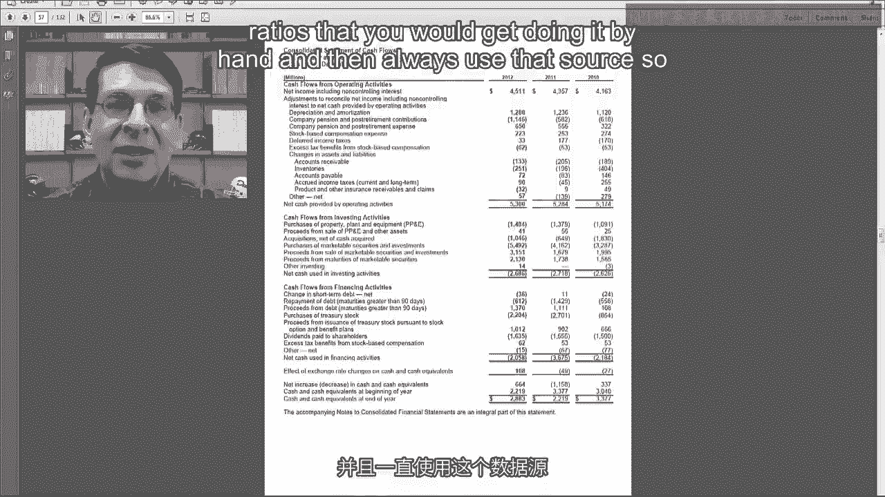
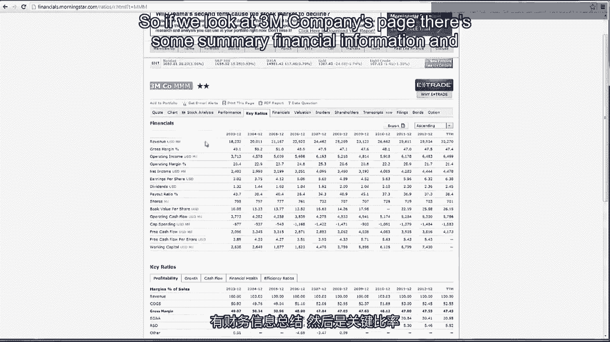
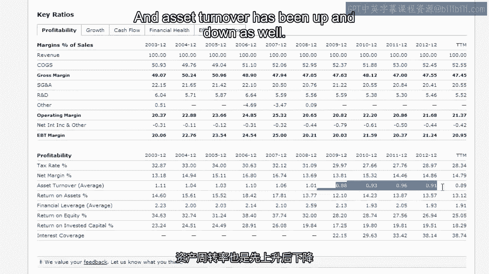
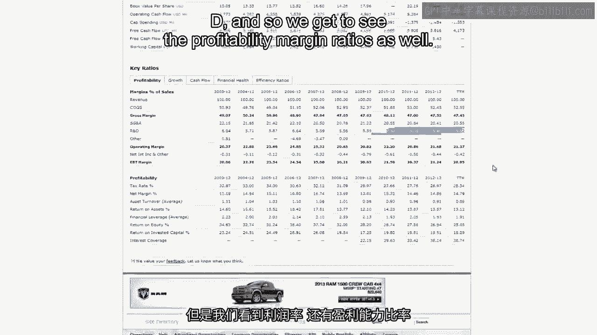
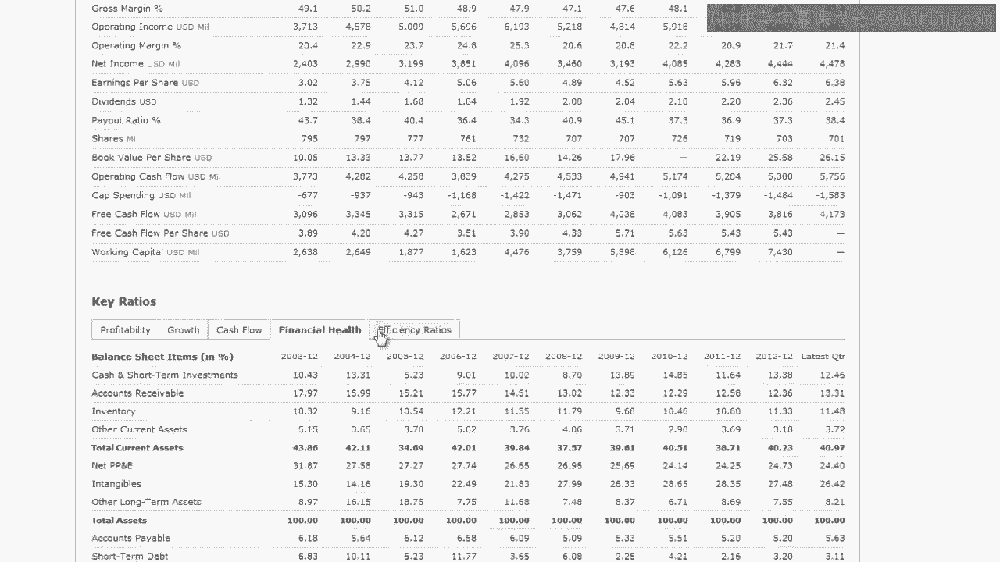
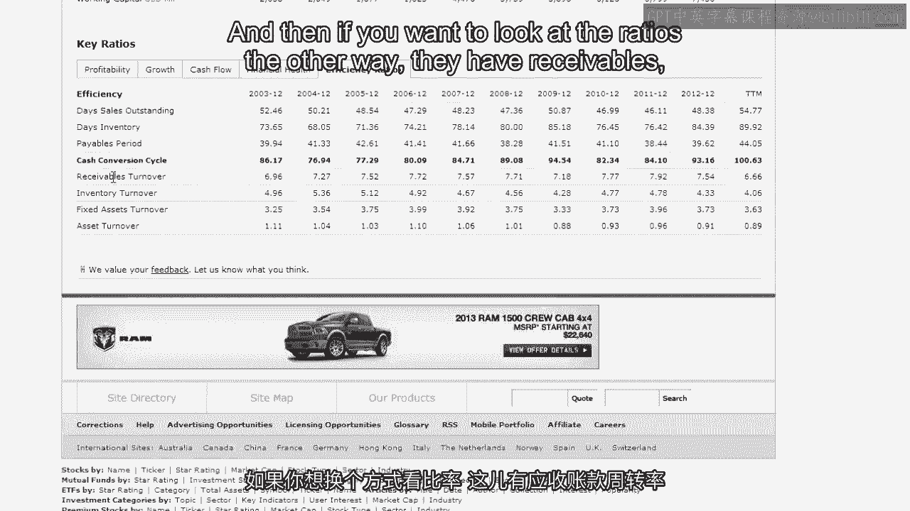
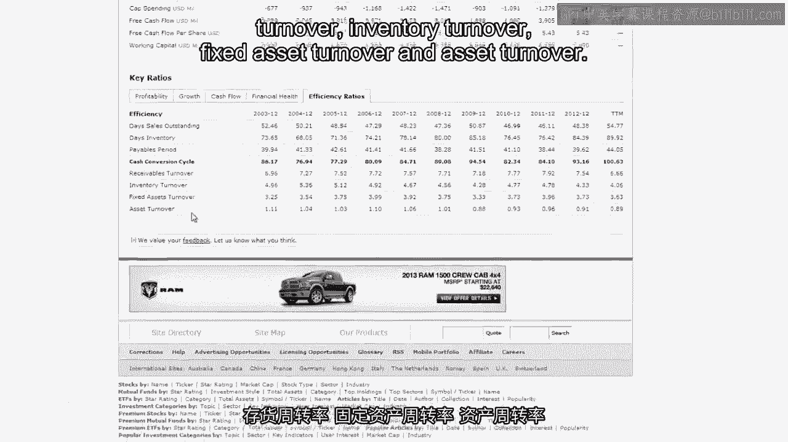

# 沃顿商学院《商务基础》课程 P76：3M公司财务比率分析 📊

在本节课中，我们将以3M公司为例，学习如何进行财务比率分析。我们将使用其财务报表数据，并借助外部资源来获取和解读关键比率。

---

## 概述

本节课我们将对贯穿本课程的3M公司进行比率分析。我们将学习如何获取比率数据、理解其含义，并了解在分析时需要注意的关键点。

## 比率分析的两种方法

进行比率分析主要有两种途径。

第一种方法是手动计算。我们可以从利润表、资产负债表和现金流量表中提取所需数字，放入电子表格或计算器中进行计算。

第二种方法是利用互联网资源直接查找已计算好的比率。本节课我们将采用第二种方法。

## 使用网络资源的注意事项

在从互联网获取比率数据前，有一个重要的警告：网络上的信息质量参差不齐。许多比率提供者不会给出具体的计算定义，你无法确知他们是如何计算这些比率的。

因此，我的建议是：找到一个你信任的数据源。确保它使用的比率定义与你手动计算时使用的一致，并始终使用这个数据源，以保证比率定义的一致性。

## 推荐的数据源：晨星（Morningstar）

我发现一个非常好的网络数据源是晨星（Morningstar）。它提供了长期的比率时间序列数据，非常适合分析。

以下是3M公司页面提供的一些关键信息。

**摘要财务信息与关键比率**

首先，我们看到**净资产收益率（ROE）**。这是我们杜邦分析公式的起点。可以看到，近几年来该比率略有下降。

我们可以进一步观察其组成部分：
*   **财务杠杆**在下降，表明公司的杠杆率随时间推移在降低。
*   **总资产收益率（ROA）** 先上升后下降，波动性稍大。

接着，我们可以将ROA分解为**资产周转率**和**净利率**（他们称为净边际百分比，我称之为销售回报率，即盈利能力）。可以看到，盈利能力先升后降，这与ROA的趋势一致；资产周转率也呈现上下波动。

然而，我们真正需要做的是找到三到四家3M最接近的竞争对手，然后将这些比率与竞争对手进行比较，以判断这些趋势是3M特有的，还是整个行业普遍存在的现象。

但根据我对该行业的了解，3M的ROE和ROA数据仍然相当健康。

**利润率细分**

上方还有利润率的细分数据：
*   **毛利率**非常高，接近50%。
*   **销售及管理费用占销售额比例**相对平稳。
*   **营业利润率**。
*   由于3M是一家研发型公司，我们还看到了**研发费用占销售额比例**。

**关于TTM列**

最右侧的“TTM”列代表“过去12个月”，即比率计算日期之前的12个月数据。

**增长百分比**

另一个标签页展示了一些增长百分比，包括收入、营业利润、净收入、每股收益的同比增长率、3年平均、5年平均和10年平均增长率。现金流增长也有类似数据。

**财务健康状况**

这部分本质上是3M的共同比资产负债表。

下方是我们熟悉的老朋友：
*   **速动比率和流动比率**：3M的财务状况非常好，流动比率高于2，速动比率在1.3到1.4之间。
*   **财务杠杆**（前面已看到）。
*   **更传统的负债权益比**：数据显示3M不是一家风险很高或杠杆率很高的公司。

**效率比率**

以下是效率比率：
*   **应收账款周转天数**：3M的该指标呈轻微下降趋势。
*   **存货周转天数**：相对稳定，在75至85天之间。
*   **应付账款周转天数**：情况类似。
*   **现金转换周期**：即我所称的净营业周期，基本上是你需要向银行借款的天数。

如果你想从另一个角度看这些比率，他们还提供了：
*   应收账款周转率
*   存货周转率
*   固定资产周转率
*   资产周转率

**晨星的术语表**

最后要说明的一点是，晨星网站有一个详尽的术语表。

如果你不清楚某些术语的含义，例如我们未讨论过的一个比率——**投入资本回报率（ROIC）**，其公式为：

`ROIC = 净收入 / (股东权益 + 长期债务和资本租赁 + 短期债务和资本租赁)`

本质上，它类似于ROE，但在分母中加入了债务。

因此，你可以直接从类似这样的数据源获取比率，再获取三到四家竞争对手的数据，然后进行比较，而无需使用自己的计算器或电子表格来计算所有这些比率。

---

## 总结

本节课我们一起完成了对3M公司的财务比率分析。我们学习了如何利用可靠的网络资源（如晨星）获取比率数据，解读了包括盈利能力、财务健康、运营效率在内的各类关键比率，并理解了在进行分析时与竞争对手比较的重要性。我们为期一周的比率分析专题至此结束。现在，是时候请你专注于考试了。祝你好运，我们考后再见。

[空白音频]