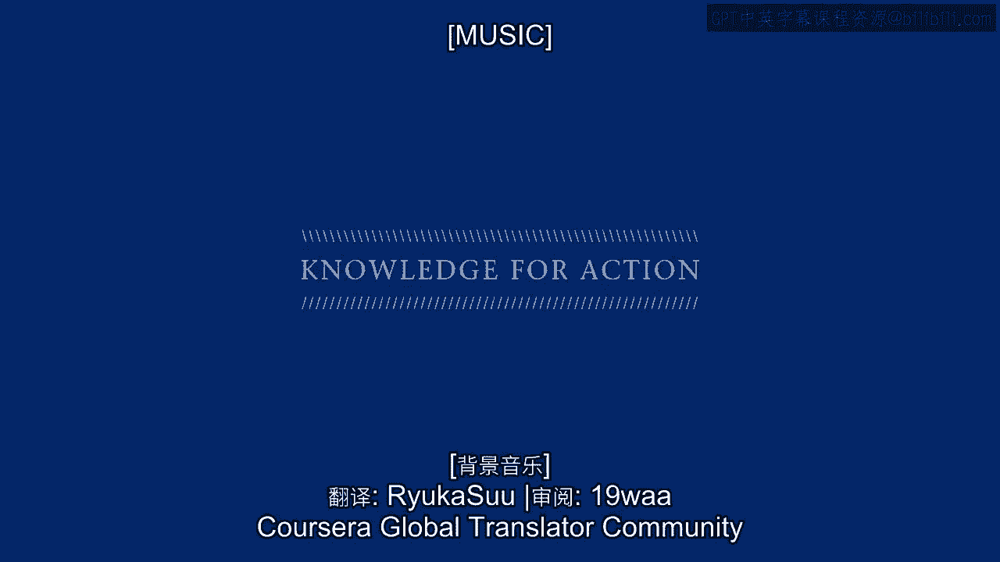

# 沃顿商学院《商务基础》课程 P8：从产品中心转向客户中心管理 🎯

在本节课中，我们将学习企业如何从传统的产品中心管理模式转向客户中心管理模式。我们将探讨这两种策略的核心区别，并理解为何客户中心策略在现代商业环境中变得日益重要。

---

我是皮特·费德。

我是沃顿商学院的Payone Chaw市场营销学教授，也是沃顿客户分析计划的联合主任。我很高兴能开始我的市场营销导论课程模块。

我负责一个名为“客户分析计划”的研究中心，这表明我是一个数据驱动的人。我喜欢研究客户数据，试图弄清楚哪些客户在做什么、持续多久、花费多少，以及公司可以使用哪些策略来创造并从客户身上获取更多价值。

对我来说，这一切都关乎客户行为、我们随时间观察到的模式，以及公司围绕这些模式可以建立的策略，以便为自身创造更好的业绩。

我想从回顾芭芭拉·卡恩在她的模块中使用的一个框架开始。你可能还记得这张幻灯片，她在上面列出了公司可以遵循的基本策略类型。

其中一些策略非常清晰。每个人都理解“性能卓越”意味着什么，即拥有市场上最好的产品。无论是苹果、宝马，还是路易威登或古驰这样的奢侈品，你都希望拥有最好的。

“运营卓越”也很清楚。你希望价格最低、运营效率最高，或为客户提供最高效的体验。无论是沃尔玛、宜家还是Zara，你真正感兴趣的是保持低成本、保持流程高效。这就是运营卓越。

但我们将花大量时间讨论的是这个图表的第三条腿，即“客户亲密”的理念。基本理念很合理：让我们关注客户。但这到底意味着什么？客户是谁？我们会以同样的方式关注所有客户吗？我们到底想达到多亲密？我们如何从这种实际上会增加成本的策略中赚取比性能卓越或运营卓越策略更多的钱？

这将成为我们工作的主要焦点。我们将深入探讨客户亲密，或者我更喜欢称之为“客户中心”的理念，真正理解它是什么，澄清它不是什么，阐明其重要性，并试图让公司做出明智的决定，决定是否要追求这种策略，以及何时、如何实际执行。

这就是我们工作的重点。我身处费城南街，这是费城一个受欢迎的购物区，我周围都是代表芭芭拉提到的不同策略类型的商店。

就在我的右肩后方，你会看到我最喜欢的披萨店之一。那是性能卓越。沿着街区往下走，有几家快餐店。那将是运营卓越。但客户亲密呢？什么样的商店才是真正客户亲密或客户中心的？是什么让它们与众不同？

让我们真正理解这些不同策略之间的比较，然后更深入地探讨客户中心。给我几分钟时间回顾一下经营企业的传统步骤，即以性能卓越或运营卓越的方式经营企业。

这将为我们奠定基础，以便我们真正理解客户中心有何不同、与之相关的一些挑战，以及客户中心可以提供的一些机会，这些机会可能是性能卓越或运营卓越策略无法实现的。

---

## 回顾传统商业模式 📈

上一节我们介绍了三种核心商业策略。本节中，我们来看看传统商业模式的运作步骤。

对于大多数商业企业来说，首要目标，超越一切战术和战略，就是赚钱。芭芭拉也回顾过这一点，你不需要被告知。这一切都是为了最大化整个公司的价值。

我们需要审视今天赚的钱、明天赚的钱、十年后赚的钱。当我们认识到金钱的时间价值——今天的钱比明天的钱更重要——并将公司利润的折现流加总，理论上就得到了公司的整体价值。

因此，作为管理者，我们的工作是最大化公司的价值，这意味着最大化公司带来的利润的净现值。这一点我们达成共识。

这部分在概念上相当简单，但问题是公司如何实现它？这又将我们带回到芭芭拉提出的那些核心策略。

当你想到其中最传统的策略，即性能卓越和运营卓越时，其核心是打造一个爆款产品或服务，想出一个超越所有竞争对手的绝妙主意，并找出将那个想法、产品或服务推向市场的方法。所以，它是概念化、开发、制造、分销、营销那个想法。这就是传统商业的全部。

因此，大多数公司赚钱的关键不仅在于想出那个主意，还在于找到大量生产它的方法。多年来我们发现，大量生产我们想要交付的产品或服务不仅有助于我们获得更大的收入，而且大量生产和分销的事实也会降低成本。

因此，大多数传统企业的核心焦点是**高产量、低成本**。同样，想出一个能让我们做到这一点的好主意。

许多公司都围绕这一点建立了自己的业务。即使在今天，我们经常问自己的一个常见问题，尤其是当我们有一项新业务时，是：它能规模化吗？我们能否规模化生产或交付这个产品或服务，以便我们能做这么多，从而带来收入并降低成本？

这就是大多数公司运营的基本方式。多年来，出现了许多不同的指标来帮助公司了解他们做得如何。

显然，他们可以查看交付的数量。显然，他们可以查看成本的变化。随着我们开发和交付越来越多的这种产品或服务，我们的成本是否在下降？

一些显示我们业务做得如何的指标相当清晰。有些则不那么清晰。例如，一个非常强大的指标是**市场份额**。

如今，许多公司痴迷于市场份额，因为它不仅表明他们在特定行业中相对于竞争对手的表现如何，而且还是未来表现如何的一个有趣的领先指标。追溯到20世纪60年代和70年代的大量研究表明，市场份额不仅是衡量你过去表现的良好后向指标，也是衡量你未来可能表现如何的领先指标。

因此，市场份额等许多其他指标是这种产品卓越或运营卓越策略的核心。

除了运营业务并衡量其表现外，公司不仅对微调这些指标感兴趣。事实上，他们被要求必须增长。仅仅更高效、更有效地做你正在做的事情是不够的。股东要求增长。他们想要更多。他们想要比你以前可能交付的更多。

那么，在一个以性能卓越或运营卓越为特征的世界里，增长从何而来？公司可以享受的主要增长来源是什么？

我们确实看到了两种不同的来源，起初听起来彼此截然不同。但当我们更仔细地思考时，它们实际上只是同一种增长的不同表现形式。

---

### 传统增长来源

以下是两种主要的传统增长来源：

1.  **市场拓展**：将我们已经提供的产品或服务带给新客户，无论是进入新的客户细分市场还是新的地理区域。这是将优秀的产品或服务带给新客户。这显然是一个增长来源。
2.  **产品创新**：除了生产和分销某一系列产品或服务，我们还能做什么？所以，让我们回到最初开发这些优秀产品或服务的人那里，说，给我们一些新的产品或服务。让我们回到研发人员那里说，好吧，你拥有一定程度的专业知识，使你能够为我们带来当前的产品。你还能做些什么来为我们带来该产品的变体或以前从未存在过的全新产品？因此，一个明显的增长来源将是新产品或现有产品的延伸。

起初，将我们当前的产品带给新客户与开发新的不同产品这两种想法似乎彼此相当不同。确实，与之相关的战术、公司内部的专长必须有所不同。

但当我们退一步进行战略思考时，两者实际上有很多共同点。它们都共享这个基本理念：我们拥有一定程度的**产品专业知识**。我们如何扩展它？我们如何将这种产品专业知识扩展到新客户或新产品？

因此，无论你追求增长的具体方式如何，增长的主要来源是扩展我们的整体产品或服务交付。这就是大多数公司必须真正擅长的。

我们擅长做某种事情。我们将尽可能高效或有效地去做。现在，我们如何将这种产品专业知识扩展到新的方向？

公司如何做到这一点？他们如何运营现有业务，并找出如何扩展产品？如果你看看地球上几乎任何公司的组织结构图，公司往往围绕其提供的不同种类的产品或服务来组织。

所以，你会有一个产品经理或品牌经理。但这一切都是围绕不同的产品或服务建立独立的“筒仓”，然后以这种方式组织所有活动。

因此，通常每个不同的“筒仓”不仅负责尽可能高效地运营自己的业务，还要思考自己扩展那种产品专业知识的方式。

如果我们总结大多数公司的运营方式，这一切都围绕着**产品或服务专业知识**的理念。这是许多管理者、学者、行业专家多年来关注的竞争优势。

我们最擅长概念化、开发、交付某种产品或服务，我们将通过提高效率、进入新市场、不断开发新产品或服务来保持领先于竞争对手，这就是产品专业知识。

我刚才向你描述的是相当标准的东西。对于你们大多数人来说，如果你回顾你作为消费者的经历或工作经验，你会意识到这就是大多数企业的运营方式。

我们不再仅仅称之为“商业”，现在可以给它贴上一个标签。我喜欢使用的标签是**产品中心**。

在过去，我们不需要一个特殊的标签，因为对大多数公司来说，这就是商业，商业就是我刚才向你描述的这套步骤。但今天，我们看到不同类型的商业模式正在出现。

因此，我们现在想要区分我刚才描述的那套做法。事实上，我喜欢用一个关于鱼在水里游的比喻。当鱼在水里时，它意识不到自己在水里，直到它跳入一个新环境。它跳出水面片刻，意识到：“哦，我现在在一个不同的环境里。我有点更喜欢旧环境。我要待在水里。”

这正是许多公司今天面临的问题。他们在自己的产品中心“水域”里游来游去。它有效。它让业务持续运转。它给他们带来了一些增长机会。对许多公司来说，这完全没问题。

但对其他公司来说，无论是出于绝望还是机会，他们正在寻找不同类型的环境。他们正在寻找不同类型的策略。我们看到越来越多的公司跳出水面说：“外面更好吗？我如何在外面运营？我应该在外面运营吗？”

这就是为什么我们现在要给旧的做事方式贴上一个具体的标签：**产品中心**。

同样，你们大多数人都理解这一点。这是常规业务。芭芭拉谈到的许多概念都隐含地指向了产品中心的方法。

在我们开始转向之前，为了总结产品中心的世界，我这里还有一张幻灯片，向你展示产品中心业务的许多经典特征。

如果你上下浏览这张幻灯片，你不会发现很多非常有洞察力的东西。这正是我想指出的：传统的产品中心商业方法，即专注于性能卓越或运营卓越，对大多数管理者来说已经是第二天性了。

所以，正如幻灯片所示，我们追求的客户类型、我们使用的指标、业务的整体重点和组织结构，都是相当标准的东西。

我只想提醒你注意幻灯片底部附近的这一点：**思维过程**的理念。我喜欢这种**发散性思维**的理念。它回到了我几分钟前提到的想法。我们拥有这种产品专业知识。我们能用它做什么？我们如何将它扩展到其他类型的客户和其他类型的业务？

同样，隐含地，这就是大多数企业的运营方式。我们雇佣能够进行发散性思考的人，他们能够抓住我们特定的核心业务，并思考将其扩展到新市场和新产品及服务的方法。

我想明确指出这一点，因为随着我们继续，我们将讨论一些非常不同的思维过程以及不同的指标。

这张幻灯片上的所有要点都将变得截然不同。

---

本节课中，我们一起学习了传统产品中心商业模式的核心特征，包括其高产量、低成本的焦点，以及通过市场拓展和产品创新实现增长的方式。我们引入了“产品中心”这一标签来描述这种常规商业方法，并理解了其背后的发散性思维模式。下一节，我们将深入探讨与之相对的“客户中心”策略，看看它如何挑战这些传统观念。