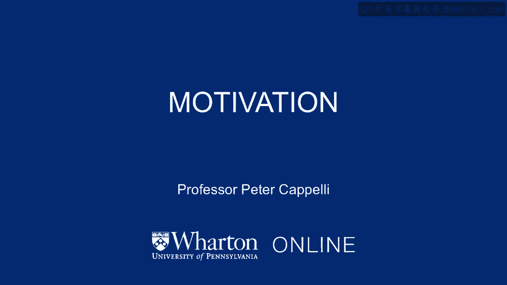

# 课程名称：沃顿商学院《商务基础》｜第80课：动机管理 🎯

## 概述

在本节课中，我们将要学习如何有效激励员工，确保他们按照组织的期望工作。我们将从简单的经济学模型开始，逐步探讨更复杂、更贴近现实的管理方法，并分析不同激励策略的优缺点。

---

## 如何让员工按照你的期望工作？

你如何让为你工作的人去做任何事情？

现在，这可能看起来很简单。

你只需雇佣员工并告诉他们该做什么，除非你曾经也是一名员工。

然后你会意识到，有时员工并不想做你希望他们做的事。

有时这是由于原则性原因，有时则是因为他们心情不好、感到疲倦或其他原因。

问题在于，你如何让员工去做你希望他们做的事？

我想用一个多年前在新奥尔良一家名为“Mothers”的餐厅亲眼所见的故事来说明。

在那家餐厅，我身处一个类似自助餐的队伍中，食物很棒。

餐厅停电了，但他们继续营业，这很酷，也令人钦佩。

但在取餐线的末端，你需要结账，他们计算账单、收钱并找零。

因此，有人用计算器计算你的账单，有人在收银台收银。

由于停电，收银机无法工作。计算器有电池，收银机没有，所以收银机无法使用。

收银机是一种控制设备，对吧？你输入食物信息，它显示金额。

一天结束时，你汇总这个数字，它必须与抽屉里的现金金额相符。如果少了，可能意味着有人偷窃或出了差错。

我们来到收银台，它是开着的。

有人在那里收钱找零，但他们只是用一个打开的现金抽屉操作。

在那个人身后，还有另一个人站在那里，只是看着收银员操作。

那个人在做什么？那个人只是在监视操作现金抽屉的人。

我猜测（我没有问他们），原因是为了确保收银员不会偷钱。

但你可能想知道，难道不应该有另一个人站在监视者身后，以确保他们不是串通一气的吗？

你开始思考这个问题，就会意识到管理的一个难题：你可以尝试通过让人站在旁边监视来管理员工。

但这效果不佳。首先，这样做成本非常高。其次，如果你不信任第一个人，又怎么能信任监视者呢？

这都围绕着动机问题。你如何激励员工按照你希望的方式工作？这可能包括不偷窃等行为。

总的来说，你可以这样思考。我常用这个测试：如果你的员工为你做正确的事，我们有时也谈论“敬业度”问题。

“敬业度”是一个常用短语，实际上指的是承诺，即他们是否关心你的利益？

假设在你的办公室，现在是下午五点下班时间，电话响了。

人们会回去接电话，还是继续走出门？

如果他们忠于组织，如果他们敬业并关心你的利益，他们可能会多花一分钟去接电话。

否则，他们很可能直接出门。

作为雇主，你希望确保人们会回去接电话。

你希望确保可以信任你的员工操作一个打开的现金抽屉，而不需要有人站在他们身后监视他们是否作弊。

因此，我们将讨论如何做到这一点，并了解一些公司如何以完全不同于我提到的餐厅例子的方式进行管理。

例如，有些公司谈论给员工每周10小时左右的时间（谷歌和3M都以此闻名），让他们从事自己想做的项目。

就他们的主管所知，他们可能只是在消磨时间，因为你给了他们自主权，并且没有监督他们。

你给予他们自主权去做他们认为符合公司利益的事情。所以你必须真正信任他们。

是什么使得在这些公司中信任员工成为可能，而在许多其他公司，你却需要摄像头监视和主管监督？

这两种运营方式有何不同？在本课程中，我们将讨论如何实现这一点。

---

## 最简单的管理模型：代理模型

让我们从讨论最简单的管理模型开始。

这是一个与经济学相关的模型，经济学家称之为“代理方法”或“代理模型”。

这里的想法是，你有一个代理人（员工就像为你工作的代理人），而你是委托人，即试图指导代理人的人。

实际上，雇佣关系根本不是这样运作的，但这是一个有用的抽象概念，可以帮助我们思考其运作方式。我们稍后会讨论更复杂、更现实的想法。

如果你有一个为你工作的代理人，你如何激励这个人做正确的事，而你不想站在旁边监视他们？

在沃顿商学院的课程中，我们教授一个关于“自动旅行系统”公司的案例。

这家公司创立于一段时间前，开发了驱动航班搜索引擎的软件。

在那家公司，他们曾经历一个特别困难的时期，软件工程师们挟持了公司。

我的意思是，这就像用枪指着某人。

他们使用的“枪”是：除非你给我们更多钱或股票期权，否则我们就辞职。

在这家公司，工程师们威胁要辞职，而公司面临非常紧迫的期限。

他们获得了投资，但资金并不充裕，他们必须在一个截止日期前完成任务以保持偿付能力。

工程师们挟持了他们，说除非给更多钱，否则就走人，项目就无法完成。

这就是这种基本模型的问题所在，一切都关乎金钱，我们可以挟持你以获取更多金钱，因为我们并不真正关心公司的使命，也不真正关心我们的工作，我们只是为了钱。

解决这个问题的基本方法，不幸的是，你无法通过简单的合同来实现，还需要做其他事情，我们将在几分钟后回到这一点。

但关于激励的基本思想，是解决代理问题的方案，通常描述为：你试图奖励人们做正确的事。

你希望他们完成这个项目，他们在完成项目时获得报酬。可以把它想象成承包商。

围绕这个简单模型，还有其他几个概念。

---

## 效率工资理论

其中之一是经济学家称之为“效率工资”的概念。

这里的想法是关于相对竞争：如果你支付的工资比竞争对手高，即使只高一点点，你首先会得到更好的工人，因为如果他们可以选择去哪里，最好的工人会来到你这里，如果你支付的工资比其他人略高。

第二个因素是，这些人辞职的可能性更低，因为如果你的工作比其他人的都好，他们还能去哪里？

第三，他们更可能表现良好，因为如果他们不这样做，可能会被解雇，从而失去一份比其他工作都好的工作。

所以，基本上，拥有一份总体上优于竞争对手的工作是有优势的。

有相当明确的证据支持这一点。我早些时候做过一项研究，显示在支付略高于市场工资的公司工厂里，违纪率实际上更低。

当然，你需要为此支付更多，但想法是，因为你支付得比别人好一点，你会获得很多好处。

一个明显的问题是，如果其他所有人都开始支付更高工资，那么这些好处就会消失，对吧？所以这完全是关于相对竞争。

---

## 锦标赛理论

作为一种构建薪酬方式的经济学论点，“锦标赛”思想是另一种关于相对薪酬的概念，它模仿了体育锦标赛的运作方式。

例如，如果你是一名高尔夫球手或从事个人运动，你会知道，如果你赢得锦标赛，你会获得大奖；第二名得到不错的奖励；第三名得到一个小奖杯；第四名可能只得到一个随身行李袋，以此类推。大奖是为获胜者准备的。

为什么这是一个好方法？因为可以让许多人参加锦标赛，所有人都被那一个奖项所激励，这使得它成为一种非常高效的做事方式。

当然，这也有缺点。缺点在于，这种模式在锦标赛中效果很好，因为没有人需要合作，每个人都在相互竞争。

但在组织内部，这些锦标赛模式通常被设置为晋升体系。

例如，如果你晋升为合伙人，你的收入将远高于普通员工。

如果你晋升到公司的下一个级别，特别是CEO级别，你的收入将远低于你一级的人。

这激励了许多人努力向上。但是，如果你希望公司或专业服务公司中的人们合作共事，这种模式就会产生反作用。

它创造了让你与他人争斗的激励，也创造了让你加入“弱旅锦标赛”的激励。

也就是说，你不一定想加入一个全是明星的锦标赛，因为很难获胜；你想加入一个有很多失败者的锦标赛，因为这样你更容易获胜。

所以它也影响了人们想去哪里。

效率工资有利有弊，锦标赛模式同样有利有弊。

---

## 总结

本节课中，我们一起学习了员工激励的核心挑战。

我们从简单的代理模型入手，探讨了通过金钱激励（如效率工资和锦标赛理论）来引导员工行为的方法。

这些经济学模型提供了基础见解，但也揭示了其局限性，例如可能阻碍合作或引发“挟持”问题。

关键在于认识到，有效的管理不能仅仅依赖监控或简单的金钱合同，还需要建立信任、承诺和共同的使命感。

在接下来的课程中，我们将继续探讨更复杂、更人性化的管理策略。