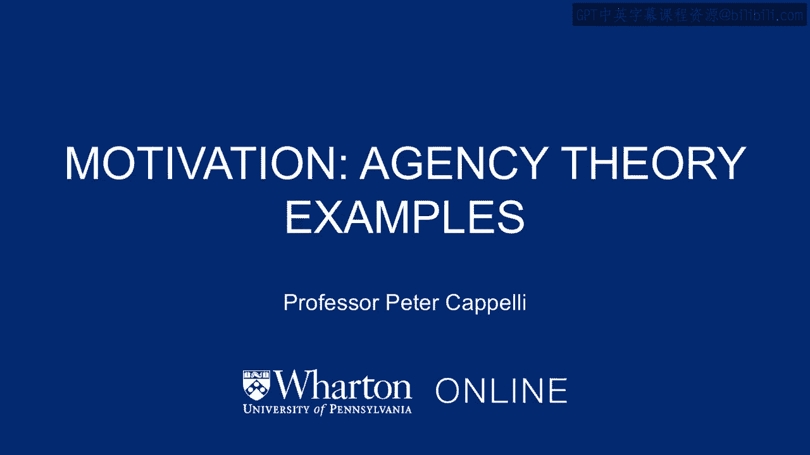
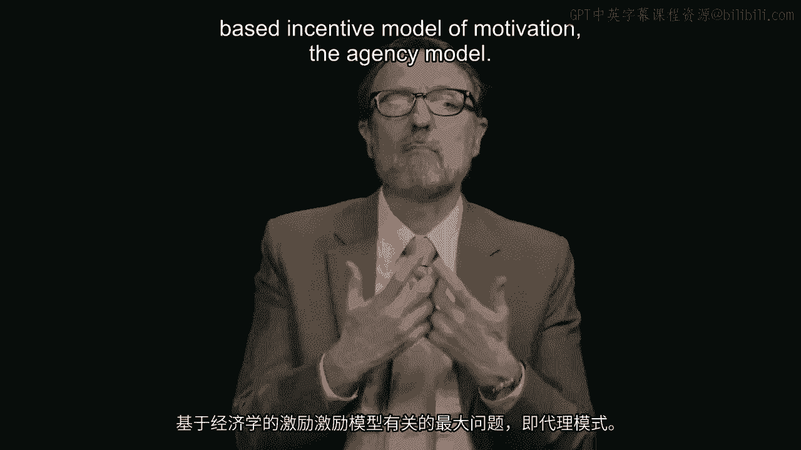
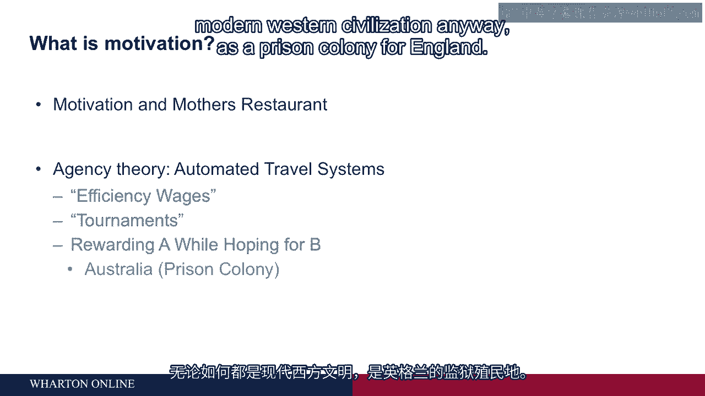
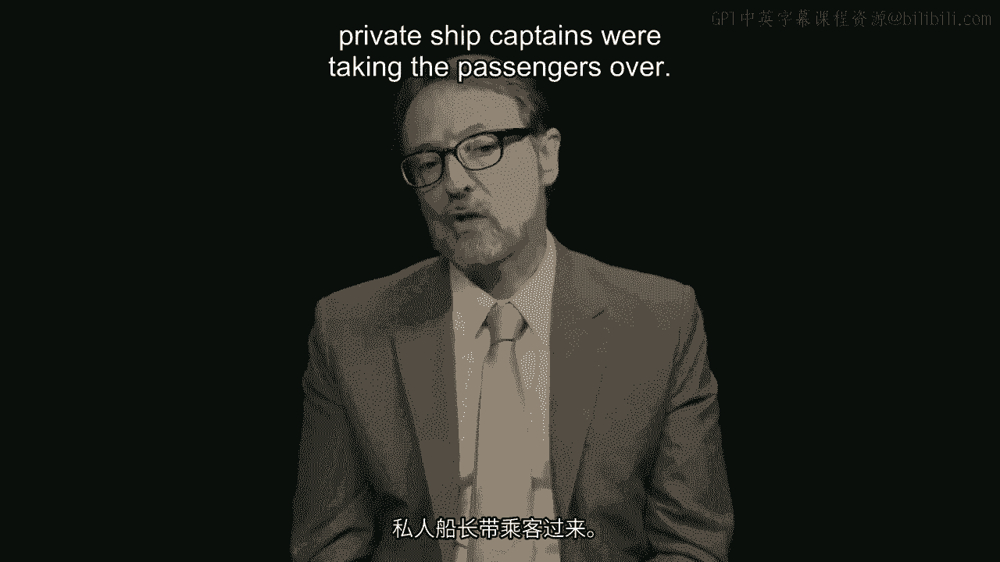

# 沃顿商学院《商务基础》｜第81课：代理理论的动机案例 🎯

在本节课中，我们将探讨基于经济学的激励模型（即代理模型）存在的一个核心问题：激励错位。我们将通过两个历史案例，分析当激励措施与预期目标不一致时，可能引发的严重后果。

---

基于经济学的激励模型（代理模型）最大的问题在于，激励措施很容易与目标发生错位。即使是很小的错位，也可能导致大量问题。

以下是两个著名的案例，它们清晰地展示了“奖励A行为，却希望得到B结果”这一困境。

## 案例一：澳大利亚囚犯运输 🚢

在18世纪，英国将澳大利亚作为流放囚犯的殖民地。当时，被流放到澳大利亚的囚犯死亡率极高，多数人在航行途中死亡。原因包括脱水、疾病和暴露，这些都是可以预防的。

英国皇家委员会调查后发现，政府将囚犯运输工作外包给了私人船长。支付方式是**按上船囚犯人数付费**。对于追求利润最大化且无道德顾忌的船长而言，克扣食物、饮水、毛毯等物资，甚至让囚犯死亡（减轻船重、节省开支）成了最有利可图的方式。

于是，皇家委员会改革了薪酬体系，新规则是：**按在悉尼港自行走下船的囚犯人数付费**。这一改变立竿见影，囚犯死亡率从多数下降到了约2%。

这个案例是“奖励A（装人上船），却希望得到B（囚犯健康抵达）”的典型。最初的激励措施导致了意想不到的灾难性后果。

## 案例二：和平号空间站对接 🛰️

上一节我们看到了激励错位在地球上引发的危机，本节中我们来看看它在太空中造成的问题。这个故事发生在苏联时代的和平号空间站。

和平号空间站每月由一艘名为“进步号”的货运飞船从西伯利亚发射进行补给。飞船会满载氧气、食物和水等物资，通过精密的计算机和雷达系统自动与空间站对接。卸货后，飞船会被垃圾填满并推回太空，最终在地球大气层中烧毁。

地面任务控制中心为了降低成本，决定进行一项实验：尝试在不使用昂贵的自动对接系统（航空电子设备）的情况下，让进步号飞船与和平号对接。他们让空间站上的宇航员手动操控飞船进行对接。

这就像在高速下进行没有保险杠的“平行泊车”，而“路缘”是布满脆弱天线和太阳能电池板的空间站。宇航员们几乎无法用肉眼或雷达清晰定位高速接近的飞船。在一次尝试中，飞船未能充分减速，与空间站擦肩而过，险些酿成巨大灾难。

宇航员们立即联系任务控制中心，表示这极其危险，不能再进行此类操作。那么，问题出在哪里？

以下是当时宇航员薪酬激励的核心：

*   **他们获得高额奖金的主要依据是“服从命令”**，而不是“成功完成任务”。
*   因此，即使手动对接任务风险极高、几乎失败，但只要他们执行了命令（A行为），就能获得奖励。而管理机构真正希望的是安全成功的任务（B结果）。

这再次印证了激励错位的危害：奖励了错误的行为（盲目服从），却期望得到理想的结果（安全高效）。

---

本节课中，我们一起学习了代理理论中激励错位的核心问题。通过澳大利亚囚犯运输和和平号空间站对接两个案例，我们看到了当激励措施（奖励A）与真正目标（希望B）不一致时，可能导致的效率低下甚至灾难性后果。设计激励体系时，确保其与最终目标精准对齐至关重要。