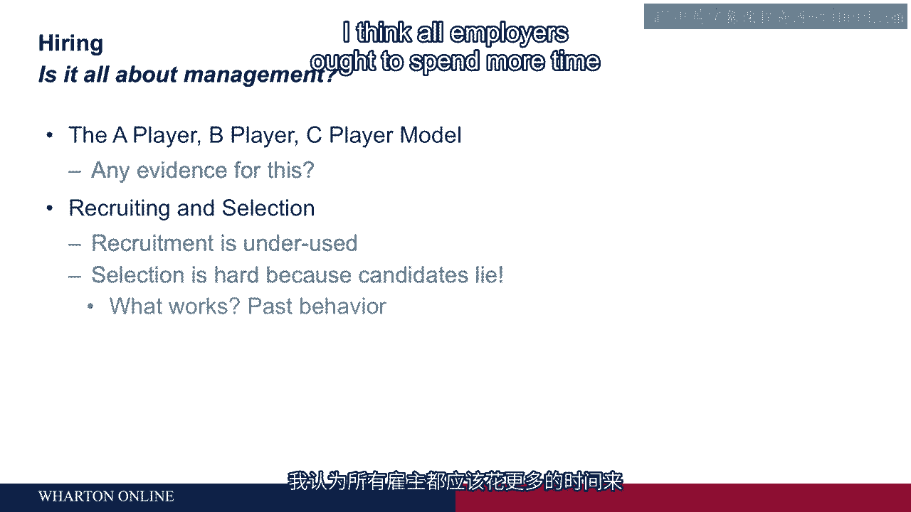
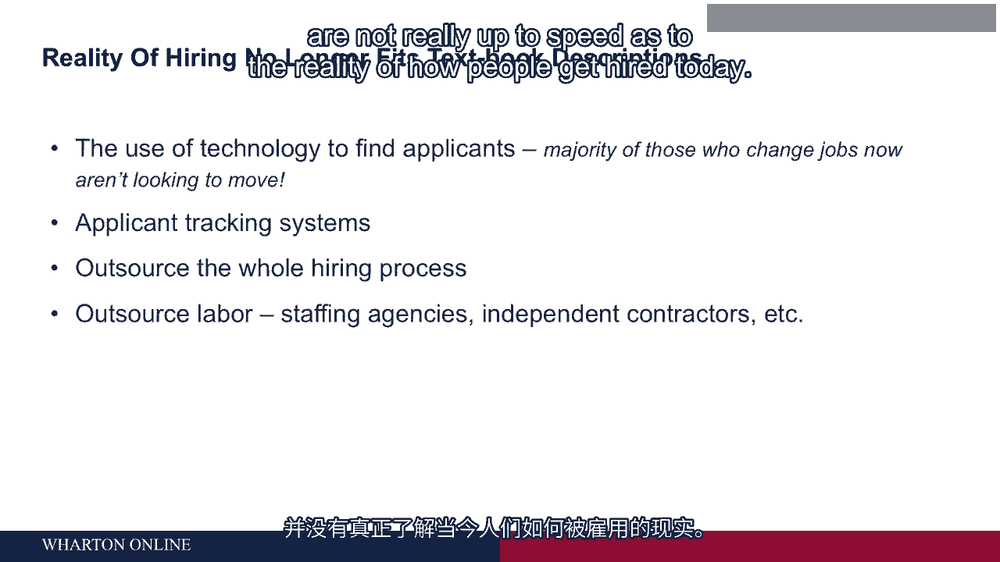

# 沃顿商学院《商务基础》课程｜第83讲：招聘管理 🧑💼

在本节课中，我们将探讨人员管理中的另一个关键议题——招聘。招聘之所以备受关注，部分原因在于如今有更多的招聘活动在进行，这主要是因为内部培养和晋升减少，更多职位需要从外部填补。

## 招聘的重要性与误区

上一节我们讨论了人员管理的其他方面，本节中我们来看看招聘。有人认为管理决定一切，因此招聘谁并不重要。这种观点并不正确。同样，另一种在二三十年前流行的理论认为，关键在于招聘到“A级”优秀人才，而“B级”是普通员工，“C级”是糟糕员工，一切都取决于招聘。这种观点也不完全正确。

**结论是：招聘很重要，但它并非唯一重要的事。管理同样至关重要。**

## 招聘的两个核心步骤

招聘过程包含两个主要步骤：**招募**与**筛选**。

*   **招募**：指吸引人才申请为你工作的过程。
*   **筛选**：指从申请者池中挑选合适人选的过程。

目前，人们往往过度关注筛选环节，而忽略了招募的重要性。如果最初的申请者池就不对，那么你根本无法从中选出合适的人。此外，筛选本身也非常困难，因为候选人可能会为了获得工作而提供不实信息。

## 招募环节：打造准确的工作描述

以下是关于改进招募环节的建议。

首先，所有雇主都应花更多时间，**准确描述工作的真实情况**。员工离职的一大原因是“我不知道自己将要面对什么”或“这不是我想要的”。这种情况完全可以预防。

雇主有时害怕向申请者展示工作的全貌，只希望他们看到好的一面。但这就像在婚前隐藏大量信息并希望婚后对方能接受一样，效果通常不佳。在招聘中也是如此。

你需要一份**准确**的工作描述，并且这份描述最好能**吓退那些不合适的人**。因为你不希望这些人申请。每一次不合适的申请都会增加你做出错误雇佣决定的可能性。

这种描述有时被称为**员工价值主张**，它需要说明为你公司工作与其他公司（甚至是同行业公司）相比，有何不同之处，包括优点和缺点。

**实现准确描述的一个有效方法是提供实习机会**。实习不仅让公司考察候选人，更重要的是让候选人了解公司。这样，当你发出工作邀请时，接受邀请的人清楚自己将面对什么。这实际上是一种**保留人才**的机制，确保你不会在刚雇佣某人后就失去他。

请记住，招不到人固然是问题，但招到人后对方很快离职可能是更糟糕的问题，因为你已经投入了所有招聘成本，而且不满离职的员工还会影响周围同事的士气，最终你还得重复整个招聘流程。

## 筛选环节：什么因素真正有效？

如果我们更严肃地对待招募，就会在筛选上投入更多时间。关于筛选有大量研究，以下是一个简要总结。

**最重要的因素是那些与过去行为相关的信息**，因为过去的行为往往是未来行为的最佳预测指标。如果你能了解候选人在之前类似工作中的表现，那将非常理想。这也是为什么内部调动通常比外部招聘效果更好，因为你已经掌握了该员工大量且准确的信息。

其他有效的方法包括：
*   **技能测试**：如果某项技能（如编程）很重要，就直接给出问题测试他们能否解决。但技能测试通常只适用于较简单的基础技能。
*   **尽责性**：在人格特质中，**尽责性**是唯一一个持续与工作表现相关的因素。
*   **智商**：智商似乎也有些作用。

但需要认识到这些因素的解释力有多强。例如，人格测试（尽责性）与工作表现的相关性可能为 **`r = 0.3`**。根据统计学，它能解释的变异量是相关系数的平方，即 **`R² = 0.09`**。这意味着人格测试只能解释**9%** 的工作表现差异。如果你已经掌握了过往工作表现等信息，再加入人格或智商等因素，其增加的预测力甚至更小。

**核心结论是：我们平均而言并不擅长精确预测特定候选人的未来表现。这也再次说明了招募环节为何如此重要。**

## 招聘如何塑造组织文化

关于招聘的最后一个议题是它如何驱动组织文化。这涉及一个被称为 **“吸引-选择- attrition”** 的理论。

其运作机制如下：
1.  **吸引**：公司拥有特定文化，候选人了解后开始自我选择。最终申请的人已经与公司的标准颇为相似。
2.  **选择**：组织从申请者池中挑选它喜欢、认为会成功的人。组织倾向于选择与自己相似的人，这并不奇怪，因为这些人已经成功了。
3.  ** attrition**：感觉最不适应、最不同的那些人会选择离开。

最终结果是，你得到了一群在规范和价值观上**非常相似**的人。这或许没问题，但也提醒我们为什么组织内部难以实现多样性，因为这个或多或少在所有地方发生的过程，倾向于**复制**你已有的组织类型。

**因此，其中一个启示是：如果你想要多样性，就必须将其作为优先事项来构建，因为这种自然的招聘过程往往会阻碍多样性的形成。**

## 招聘的现实与技术变革

不幸的是，现实中的招聘与教科书描述相去甚远。许多教科书描述了从编写职位描述、匹配组织层级和能力模型开始的复杂招聘模型。

但技术正在极大地改变现实。例如，去年美联储计算显示，美国大多数换工作的人**根本没有在找工作**，是别人主动找到了他们。这得益于领英等技术平台，雇主可以查看他人的工作记录并主动联系。

申请流程现在由计算机驱动，即**申请人跟踪系统**，计算机会筛选简历。为了通过筛选，你的简历必须包含正确的关键词，这增加了复杂性。

此外，你还可以将整个招聘流程外包给**招聘流程外包**公司。当然，你也可以完全不雇佣任何人，而是通过**人力资源公司**租赁员工，这样你并非直接雇佣或管理他们。

**如今，获取劳动力的方式多种多样，甚至完全无需雇佣。这增加了管理的复杂性，需要对所有选项进行更深入的研究。遗憾的是，标准资料和教科书尚未完全跟上当今人们如何被雇佣的现实。**

---

**本节课中我们一起学习了招聘管理的核心要点。** 我们明确了招聘与管理同样重要，并深入探讨了**招募**（重点是提供准确的工作描述）和**筛选**（利用过去行为、技能测试等有限但有效的方法）两个步骤。我们还了解了招聘如何通过“吸引-选择- attrition”过程塑造组织文化，并认识到技术正在深刻改变招聘的现实格局。