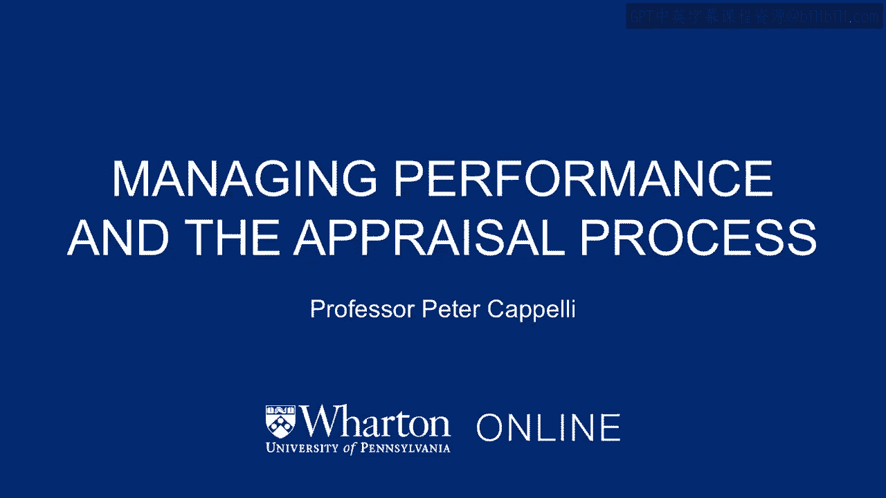
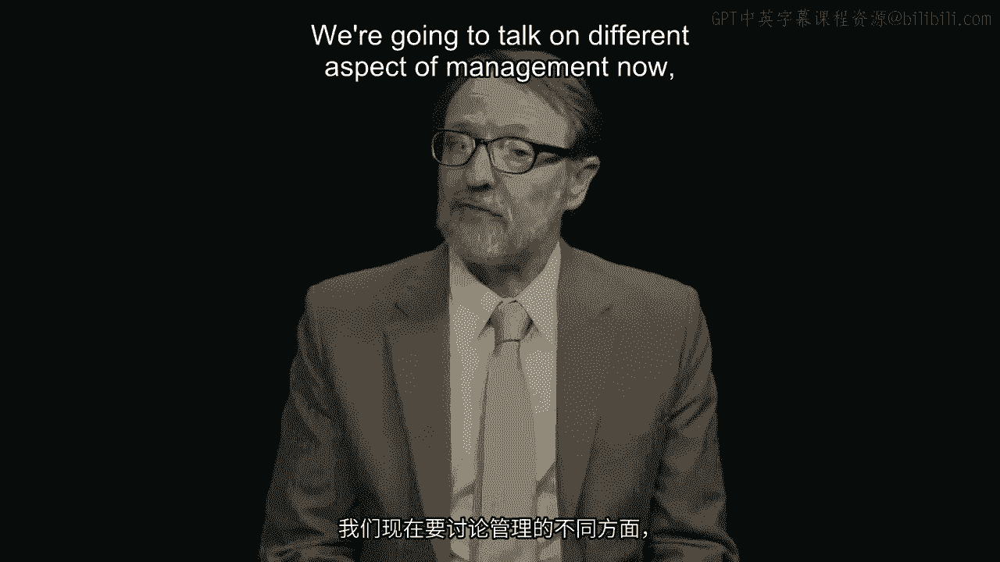
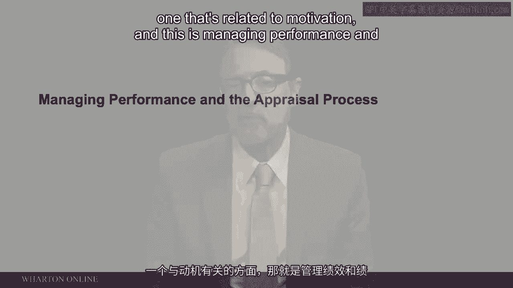
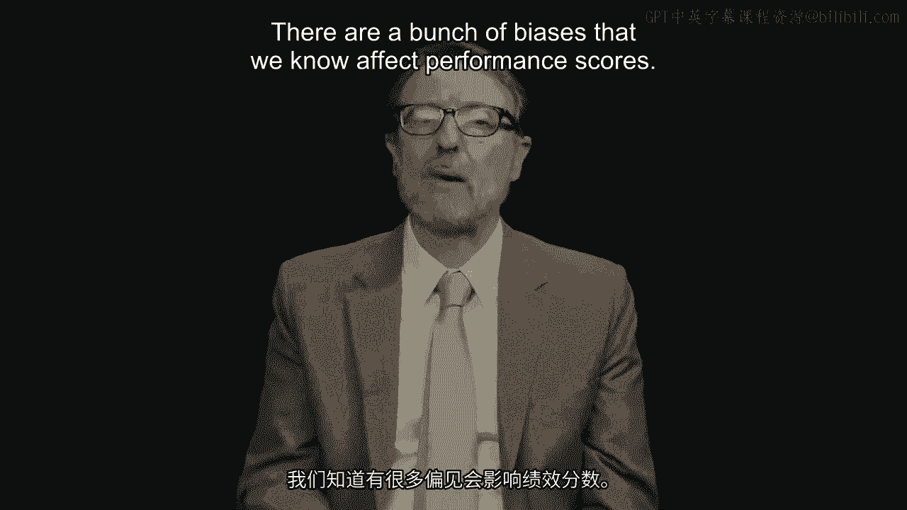
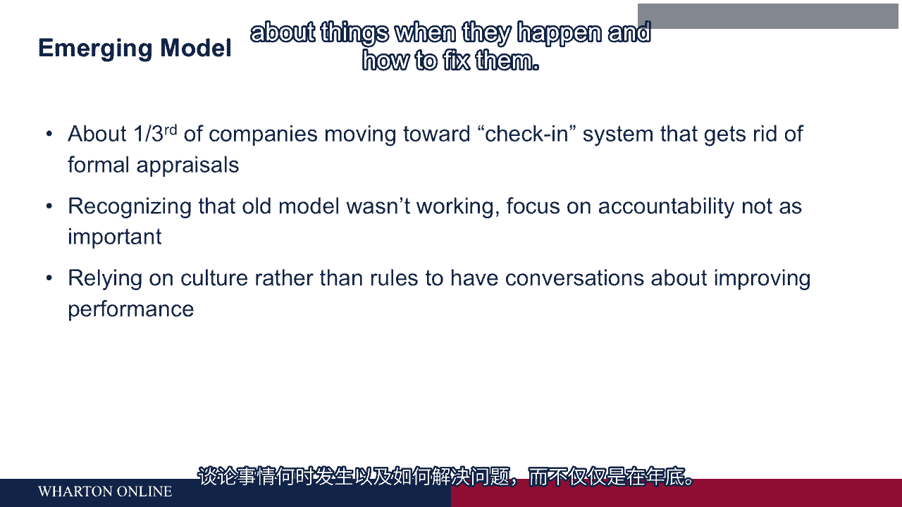
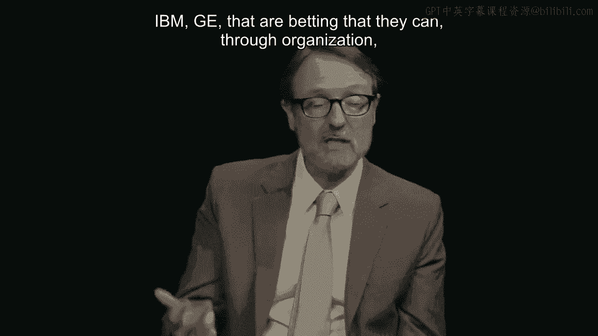
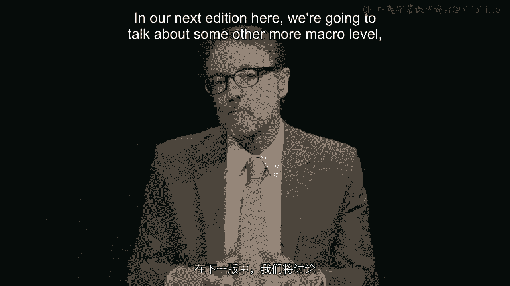

# 沃顿商学院《商务基础》课程｜第84讲：绩效管理 📊

在本节课中，我们将探讨管理的另一个重要方面——绩效管理，特别是绩效评估的过程。我们将了解其历史、面临的挑战、常见的偏见，以及一些公司正在采用的新型管理模式。

---

## 历史与演变 📜

上一节我们介绍了动机，本节中我们来看看绩效管理。绩效评估如今在世界大部分地区已非常普遍。在美国，它已存在很长时间。

其历史可追溯到19世纪的英格兰。当时，罗伯特·欧文的棉纺厂会给每台织布机前放置一个彩色纺锤，用以指示工人的绩效水平。路过的每个人都能通过纺锤的颜色了解你的表现。

在美国，绩效评估是二战时期的产物。随后，大量立法出台，要求联邦政府实施绩效评估，并确保其不构成歧视。

有充分证据表明，绩效评估确实有一定作用，并非完全偏颇，尽管其中存在许多偏见。然而，它非常不受欢迎。

---

## 为何绩效评估不受欢迎？🤔

接下来我们探讨一下它为何如此不受欢迎，尤其是在当下。主要原因在于，我们赋予它的任务太多了。

最初，绩效评估主要有三个目的：
1.  **评估过去表现并给予奖励**（类似于激励模型）。
2.  **帮助员工改进当前工作，提升绩效**。
3.  **在企业环境中，帮助员工规划职业路径，提升技能**，以便未来承担更重要的职责。

在20世纪50年代，重点主要放在发展规划上，对绩效本身关注不多。但随着时间的推移，重心转向了绩效评估。如今，教科书中的绩效管理模式已变得相当机械化。

以下是该模式通常的步骤：
1.  公司设定目标。
2.  目标分解到各个部门。
3.  部门目标再落实到个人，或由个人制定与公司年度目标相符的个人目标。

随后，出现了基于能力的绩效评估模型。主管不仅评估你的整体表现，还要评估你在特定能力或技能上的展现程度。此外，还引入了复杂的评分尺度和强制排名（一种基于锦标赛的系统），试图强制对人员进行分布，目的都是为了更好地评估过去表现。

---

## 绩效评估的缺陷列表 📋

以下是绩效评估效果不佳的诸多原因，你可以在幻灯片上看到这个列表：
*   **信息传递存在差距**：你所做的事情与主管对你的评价和结论之间存在差距。
*   **时间延迟严重**：尤其是年终评估时，信息传递像“传话游戏”，经过多人转述，且存在很大的时间延迟。
*   **记忆不准确**：主管很难准确记住你做的所有事情，更不用说就此给你反馈。
*   **引发冲突**：绩效评估会制造冲突，或者说，它只是将一种明显的冲突表面化。

人们如此不喜欢绩效评估，正是因为它制造了冲突。这种冲突源于一种认知偏差。

---

## 核心冲突：过度自信偏差 📈

我们可以用一个公式来描述典型的绩效认知分布：

**员工自评分布 ≠ 实际绩效分布**

如果绩效呈正态分布（钟形曲线），那么平均水平的员工定义上处于中间位置（第50百分位）。但**平均水平的员工认为自己处于第80百分位**，即他们认为自己远高于平均水平。

这是由于一种叫做“过度自信偏差”的心理现象。尤其在我们对所做之事知之甚少时，我们会过度自信。在实验室环境中，当人们执行一项看似有50%成功机会的任务时，他们相信自己有75%的胜算。我们系统性地过度自信，且对我们最不了解的事情最为过度自信。

因此，当主管（认为你表现平平）告诉你“你做得不错，是个普通员工”时，而你自认为是前20%的优秀员工，会发生什么？你的内心会产生认知失调，感到不悦。你更容易因此责怪主管，而不是调整自我认知。结果就是，接下来的一年你可能都对主管心怀不满。

主管也不喜欢这样做，员工则常常预期会听到不喜欢的评价。因此，这类谈话往往不愉快。没人愿意做，这就是为什么人力资源部门必须催促大家完成绩效评估。

这就是绩效评估令人不快且尴尬的本质。同时值得注意的是，主管对员工的评估也并非完全准确。

---

## 主管评估中的偏见 🎭

我们知道有许多偏见会影响绩效评分。也许最重要的是“基本归因错误”。

**基本归因错误**：当我们观察他人行为时，倾向于将行为归因于个人特质（ disposition ）。例如，如果有人做了坏事，我们会认为那是因为他是个坏人，而不是情境所迫。

经典例子：晚上开车遇到堵车，有人从路肩超车驶过。你的第一反应很可能是“这家伙真是个混蛋”，而不是“她可能正赶去医院，有紧急情况”。我们从不设想可能是环境原因，我们倾向于因为这个行为而否定这个人，将其（看似）不良行为归因于其人格。

在绩效评估中，这意味着主管倾向于将绩效不佳归因于员工本人是个差劲的执行者，从而不再认真管理他们，甚至可能放弃他们。

第二个同样重要的偏见是“自我实现预言”。

**自我实现预言**：如果我们认为新来的员工是优秀工作者（听到很多好评），我们就会以不同的方式管理他们：给予更多机会，不容忍低绩效，更努力推动他们提升。我们认为他们优秀，从而以使他们变得更好的方式管理他们。反之亦然：如果我们认为某人不太行（勉强通过招聘门槛或听到负面评价），我们的管理方式也会不同：对低绩效更宽容，推动力度较小，不给予展现机会，投入的关注也较少。这样，他们的表现反而真的会变差。**在这里，主管的行为导致了绩效差异**。

此外，还有许多与关系相关的偏见：我们给与自己更相似的人、外貌更有吸引力的人更高的分数。因此，主管在评估员工时远非完美，这也是问题的一部分。

---

## 新兴模式：持续对话 🔄

于是我们看到一种新兴模式出现，这与当代教科书中的模式大不相同。大约三分之一的公司（至少美国公司如此）正朝着彻底取消正式评估的方向发展。年终没有坐下来填表打分这回事。

取而代之的模式是，你和你的主管**频繁地、持续地进行对话**，讨论工作进展。公司采用这种模式，部分原因是“问责模型”不再那么重要——即追究人们过去一年的表现责任。部分原因是他们认识到激励模型效果并不太好，尤其是在过去几十年里，绩效加薪幅度很小（只有几个百分点）。同时，许多公司也认识到年度业务周期已不再适用，他们不再有重要的年度业务计划，也无法从中层层分解出个人目标。

**对话模型**则灵活得多，它帮助人们随时（而不仅仅是年终）就发生的问题及如何解决进行交流。这是一个有趣的尝试，结果如何尚待观察。许多大公司（如微软、IBM、通用电气）正在下注，他们相信能够通过组织文化，让管理者持续与下属进行这些对话，而过去那种年终一次谈话、一次评分、一次评估的规则似乎并无帮助。观察其发展会很有趣，但对于许多公司，尤其是领先的公司，他们已经完全放弃了传统的绩效评估模型。

---

## 反馈的艺术：心理安全与负面偏见 🛡️

无论是这种替代性的“定期沟通”模型，还是传统的绩效评估模型，都涉及给予反馈。这意味着主管需要向员工提供关于其表现的反馈，并以一种他们能够接受和倾听的方式帮助他们提升绩效。这里的一个关键概念是心理学家所说的“心理安全感”。

我们可以将其理解为常识：如果告诉你一些事情会导致你惩罚我，我就不会告诉你。年终时，你与我见面谈论我的绩效，并将在谈话后决定我的绩效加薪。此时你问我今年情况如何，我不会告诉你存在的问题。这就像和圣诞老人说话，他问你是否是个好孩子然后给你礼物，我不会告诉他我今年是个捣蛋鬼。因此，在这种情境下无法进行深入的对话。

那么，我们能否创造一个真正可以讨论的语境，让我能告诉你实话？这只有在我揭露问题不会带来不良后果时才会发生。这意味着**反馈不应与绩效加薪直接挂钩**。

此外，还有一种难以把握的“负面偏见”。这意味着人们确实非常担心负面反馈。如果我们收到一条关于自己的负面信息，我们会过度关注它——我们对一条负面信息的关注程度，是对同等正面反馈关注度的七倍甚至更多。

这意味着我们应该思考人们将如何解读我们告诉他们的内容，而不是直接给出反馈然后让他们自己去担心。因为我们知道，他们处理信息的方式会严重偏向我们所说的任何负面内容。因此，我们必须非常谨慎地组织并呈现这些信息。

---

## 总结与下节预告 🎯

本节课中我们一起学习了绩效管理的核心内容。作为主管，可能没有什么比给予员工反馈更重要了。这首先是帮助他们在当前工作中做得更好，这对组织至关重要；也是帮助他们构建职业生涯的方式；并且，对于相信激励重要性的企业而言，这是让他们了解自己表现如何的途径。

因此，如果你是一名主管，我认为最需要关注的事情就是**提升给予反馈的技巧**，以一种不具威胁性、能让对方真正听进去并因此改变行为的方式进行。

在讨论了管理的几个重要主题——动机和绩效管理之后，在下一讲中，我们将探讨一些更宏观的组织层面的人员管理问题，即如何将许多这类要素整合成与业务运营模式和业务战略相匹配的系统。