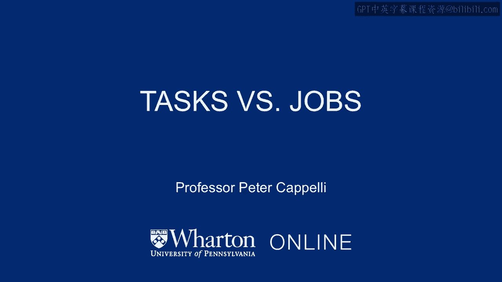
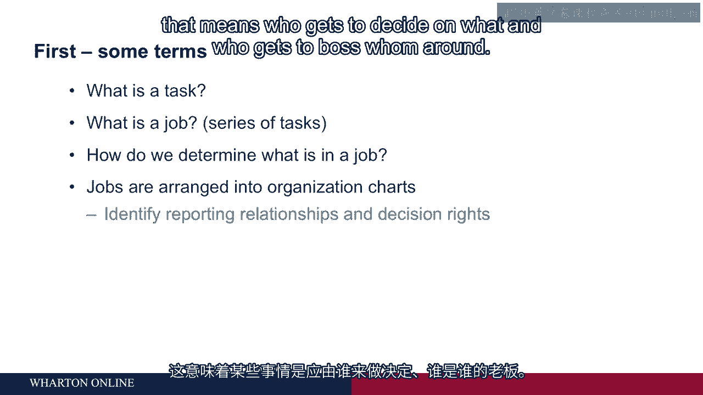

# 沃顿商学院《商务基础》课程笔记｜第85讲：任务与工作设计 🧩

在本节课中，我们将学习如何设计工作。我们将探讨如何构建岗位、确定岗位内容，以及我们希望员工在具体岗位上做什么。我们会从组织和企业的视角，特别是营利性企业的战略角度，来理解驱动工作设计的逻辑。

首先，我们需要明确一些术语和定义，以便更好地理解后续内容。

## 核心概念：任务与工作

我们首先从“任务”这个概念开始。在这个领域中，人们会经常谈论任务。**任务**指的是你正在做的具体事情。例如，木匠是一个**工作**。木匠会执行一系列任务，比如安装门框或贴石膏板。每一项任务都是独立的，可能需要不同的技能组合。这些任务捆绑在一起，就构成了一个**工作**。

因此，当有人问“什么是工作”时，它是由一系列独立的任务组织而成的。我们希望这些任务有某些共同点。如果任务之间真的毫不相关，工作就会变得有些古怪。这种情况下，很难找到合适的人来做这份工作，个人也可能因为需要处理差异过大的事情而难以表现出色。

## 如何确定工作内容？

过去，围绕这个话题有一整套理论，称为“工作分析”，即专家会进入你的工作场所进行研究。如今，大多数情况下，你只需要询问正在做这项工作的人即可。你可以问这个岗位的现任者：“你做什么？你的时间是如何分配的？”你也可以跟随他们进行观察。现在基本就是这样做的，它并不那么精确。

这可能也没那么重要，因为我们几年前看到的、稍后会谈到的那些严格的工作定义，现在基本上已经消失了。

## 组织结构图与工作

我们将工作组合在一起，形成**组织结构图**。组织结构图展示了工作之间的相互关系，它告诉你**汇报关系**，即哪个岗位的人向哪个其他岗位的人汇报。因此，它给出了组织内的**层级结构**。

层级结构告诉你一些关于**决策权**的信息。这意味着谁有权决定什么，以及谁可以指挥谁。这就是组织结构图告诉你的信息，它由工作组成，而工作又由任务组成。

在本节中，我们将重点讨论任务层面，即实际完成的工作，以及我们应该如何思考它。

---

**本节课总结**

本节课我们一起学习了工作设计的基础。我们明确了**任务**是具体的工作事项，而**工作**是相关任务的集合。我们了解到，现代确定工作内容的方法更倾向于询问在职者。最后，我们认识到工作组合成**组织结构图**，它定义了汇报关系和决策权，而这一切都始于对任务层面的理解。