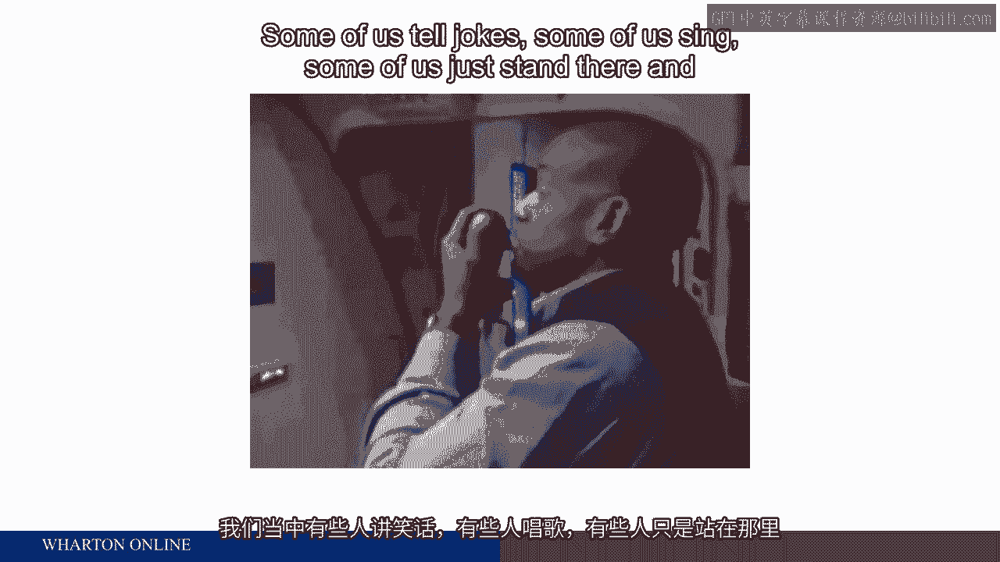
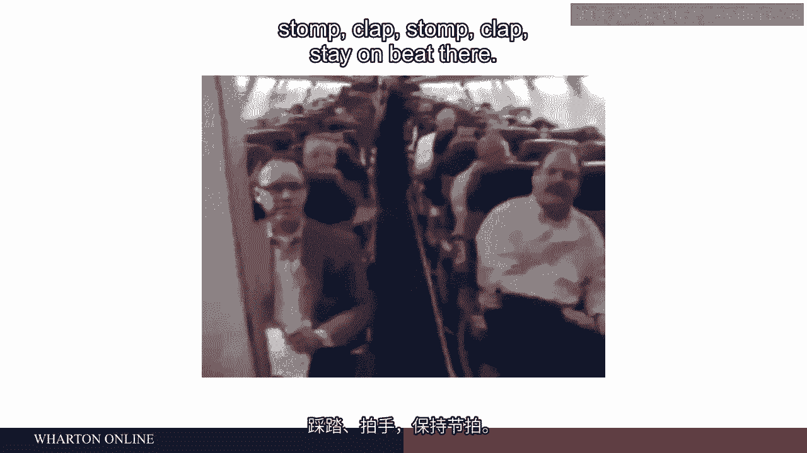
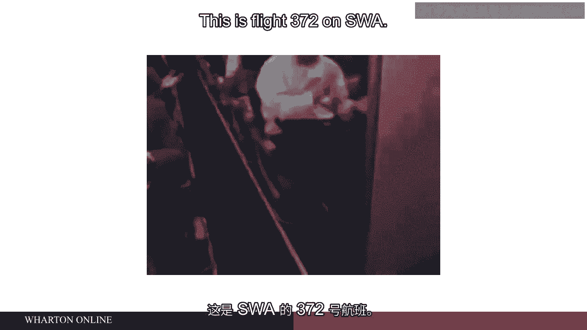
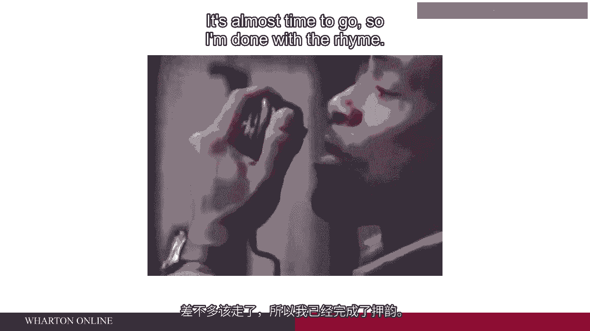
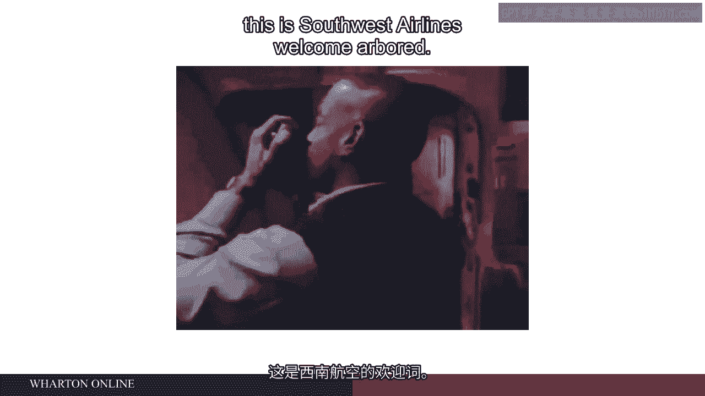

# 沃顿商学院《商务基础》课程｜第88讲：工程师与心理学家——工作设计的博弈 🧠⚙️

在本节课中，我们将探讨工作设计的具体案例，分析工程师与心理学家在设计工作方法上的不同理念，并理解如何通过改进工作设计来提升员工满意度与组织绩效。

---

## 工作设计实例：初级分析师的工作

上一节我们介绍了工作设计的基本概念，本节中我们来看看一个具体案例——投资银行初级分析师的工作。

初级分析师是大学毕业后进入投资银行工作的员工。在许多机构中，这些员工普遍感到工作体验不佳，其核心问题源于工作设计。

以下是他们日常工作的典型特征：

*   **工作内容单一**：他们每天进行电子表格分析，处理数据，在Excel中执行各种计算。一旦掌握方法，便日复一日重复相同类型的分析，缺乏多样性。
*   **缺乏自主权**：他们对工作方式和时间几乎没有控制权。任务通常被直接分配，要求“明早之前完成”，且执行方法已被规定。
*   **意义感缺失**：最令人惊讶的是，他们通常不知道自己正在处理什么项目。没有人告知他们数据的背景，他们可能正在处理涉及国家层面的重要事务，但对此一无所知。
*   **反馈匮乏**：他们往往不清楚自己的工作成果如何。只有当出现问题时才可能有人来指责，否则他们无从得知自己表现的好坏。

这种工作设计的后果是员工厌恶工作。为了吸引并留住员工，公司不得不支付高额薪酬。这形成了一种交易：你从事一份极其枯燥、辛苦、耗时且要求严格的工作，但我们为此支付丰厚的报酬。

---

## 如何改进工作设计

思考如何改进这类工作并不困难。以下是一些简单的改进方法：

*   **告知工作意义**：只需花费10秒告诉员工：“这是为约旦王国发行的债券项目。”让他们了解工作内容。在最终汇报时，或许可以让他们列席，亲身感受项目的重要性。
*   **提供反馈**：让他们了解客户对整个项目的评价是满意还是不满意。
*   **增加工作多样性**：至少可以让他们在一周内进行不同类型的分析，而非始终重复同一项任务。
*   **赋予一定自主权**：至少在时间安排上给予一些控制权，并在某种程度上允许他们决定工作方式。

通过这些并非难以实现的改进，可以显著提升员工对工作的喜爱程度。当员工更满意时，工作质量会提高，员工留存率会上升，整体绩效也会得到改善。

---

## 案例：西南航空的创新实践

接下来，我们通过一个在航空公司广为传播的视频案例，看看工作设计如何激发员工的创造力与热情。

在这个视频中，空乘人员完成了联邦航空管理局要求的全部安全信息传达工作，但他们以一种发挥个人创意的方式进行。这种方式让空乘人员自身更享受工作，乘客的体验也更好。

这体现了工作设计的灵活性：在满足既定要求和流程的前提下，赋予员工一定的发挥空间，能带来双赢的结果。

---

## 历史背景：工程师与心理学家的理念博弈

以上我们看到的改进思路，是自20世纪70年代起一系列课程与研究的成果。这背后是一场关于如何设计工作的博弈，博弈双方是工程师与心理学家。

在同一所大学里，你可以看到两种截然不同的理念：

*   **工业工程师**：他们设计工作的方式仿佛弗雷德里克·泰勒（科学管理之父）仍在指导他们。其核心是**时间和动作研究**，寻找完成任务的“最佳单一方法”，让人适应机器和生产流程的逻辑。
    *   **核心理念公式**：`效率最大化 = 标准化流程 + 最小化变异`
*   **心理学家**：他们会解释为何上述工作设计方法是灾难性的。他们强调工作意义、多样性、自主权、反馈和完整性对员工动机与福祉的重要性。

这两种理念长期博弈。坦率地说，在大多数时间里工程师占据上风，或许是因为他们的方法早已确立。

然而，随着美国俄亥俄州洛兹敦工厂等问题的出现，以及类似问题在美国乃至欧洲经济中蔓延，公司开始为此付出高昂代价——不仅是人员流失，更严重的是质量问题。弥补和解决质量问题的成本极高。

与此同时，来自国外竞争者（他们似乎没有这类问题）的压力，最终促使美国及欧洲公司开始更严肃地对待心理学家提出的工作设计理念。

---

## 总结

本节课中，我们一起学习了工作设计的具体案例与改进方法。我们分析了初级分析师工作中因设计不良导致的问题，探讨了通过增加意义感、反馈、多样性和自主权来改善的途径。通过西南航空的案例，我们看到了赋予员工创意空间的价值。最后，我们回顾了历史上工程师与心理学家在工作设计理念上的博弈，理解了外部竞争与质量压力如何促使企业采纳更关注员工心理需求的工作设计方法。