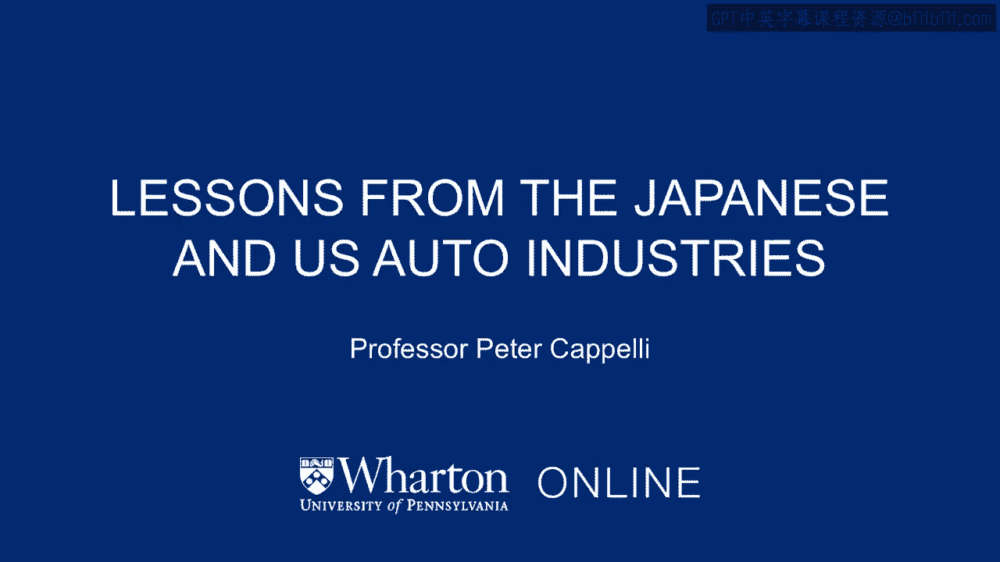
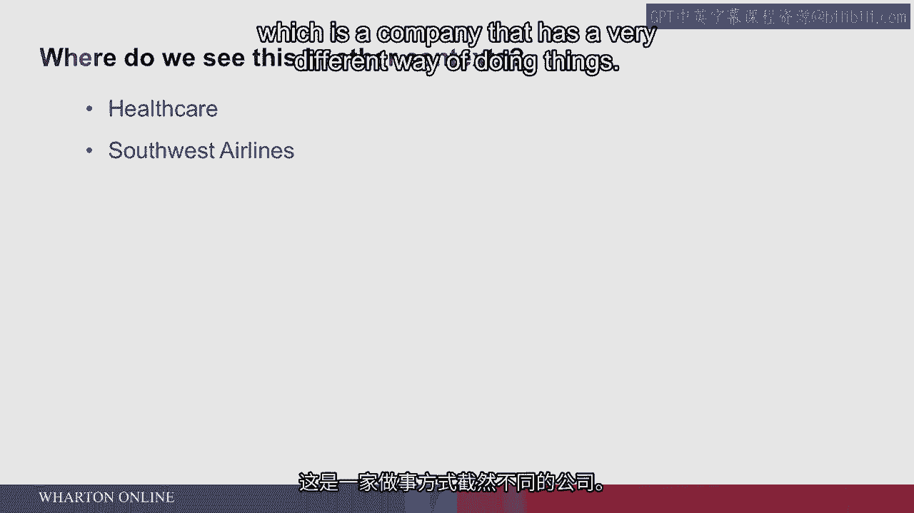
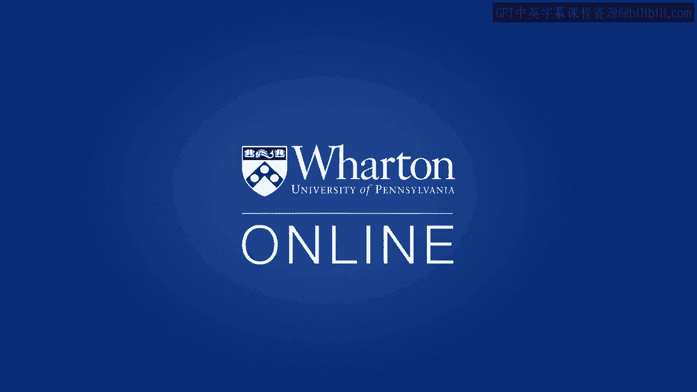

# 沃顿商学院《商务基础》课程｜第12讲：日本与美国汽车行业的教训 🚗

在本节课中，我们将探讨20世纪美国汽车行业如何应对日本竞争对手的崛起，以及这一过程带来的深刻管理启示。我们将通过具体案例，分析不同管理方式如何影响生产效率与产品质量。

---

## 概述

本节课程以20世纪70-80年代的汽车行业为背景，分析日本汽车制造商如何凭借高质量与高效率在美国市场取得优势。我们将重点研究通用汽车（GM）与丰田（Toyota）的管理实践对比，并总结出适用于现代组织的核心管理原则。

---

## 日本汽车行业的崛起

上一节我们介绍了管理理论的发展背景，本节中我们来看看日本汽车行业如何凭借独特的管理方式改变全球竞争格局。

20世纪70年代，石油价格冲击（OPEC在1973年和1979年大幅提高油价）改变了美国汽车市场。油耗高的汽车使用成本急剧上升，有时甚至出现汽油配给制度（例如，根据车牌单双号限制购买汽油的日期）。日本汽车因其体型更小、燃油效率更高而进入美国市场，并开始夺取美国大型汽车的市场份额。

美国消费者还发现，日本汽车不仅更省油，其制造质量也远胜于美国汽车。日本汽车更耐用，问题更少。当时美国汽车制造业存在一种普遍现象：消费者会指定在星期三生产他们订购的汽车。原因是星期四，尤其是星期五，工人们常因临近周末而心不在焉，甚至提前离岗，导致周五生产的汽车质量低下。而周一许多工人因宿醉状态不佳，因此周二生产的汽车质量也不稳定。但购买日本汽车则无需担心生产日期，因为其质量始终稳定。

---

## 通用汽车的应对：自动化实验

面对日本汽车的竞争压力，美国汽车行业开始反思。福特汽车陷入困境，克莱斯勒破产并由政府救助。通用汽车当时仍有资金，并试图找出应对日本竞争的方法。

通用汽车的管理层前往日本参观工厂，归来后深刻感受到日本工人的高度投入——他们与管理层协作生产高质量汽车，工作勤奋、专注，尤其重视质量。然而，通用汽车回看自己的员工后得出结论：美国工人无法与日本工人竞争，因此唯一的出路是**自动化**，即引入机器人尽可能替代工人。

通用汽车启动了一项大规模的工业实验，在工厂中投入机器人。据回忆，他们为此花费了约430亿美元，这笔金额甚至超过了当时丰田汽车公司的总市值。这意味着，通用汽车本可以用这笔钱直接收购丰田，但他们却选择投资机器人来取代工人。这项实验始于20世纪80年代初。

---

## 弗里蒙特工厂的对比实验

与此同时，一个奇特的机会出现了。通用汽车在加利福尼亚州弗里蒙特有一家闲置工厂。丰田由于面临贸易保护主义压力（美国汽车公司和工会游说国会限制日本汽车进口），需要在美国本土设厂生产。于是，双方达成协议：通用汽车将弗里蒙特工厂租赁给丰田。

丰田负责运营该工厂，生产一款通过雪佛兰渠道销售的汽车，即**Nova**。这款车本质上是贴牌生产的丰田卡罗拉（Toyota Corolla），采用丰田的设计和制造技术。丰田派遣管理人员重启工厂，使用的是通用汽车1970年代的旧设备，**没有机器人**。

关键的不同在于**管理员工的方式**。丰田重新雇用了原通用汽车的大部分工人，但雇佣过程缓慢而谨慎。公司投入大量时间培训员工，说服他们以新的方式运营工厂，甚至派遣部分工人前往日本参观学习，让他们亲眼目睹日本工厂的运作方式。

结果很快显现：这家名为新联合汽车制造公司（NUMMI）的工厂，在短时间内成为了通用汽车体系内**生产效率最高、产品质量最好**的工厂。

试想，如果你是通用汽车的财务负责人，刚刚投入430亿美元用机器人取代工人，却看到丰田用你原来的工人、原来的工厂，生产出比你的机器人生产线质量更高、效率更高的汽车——你不得不承认自己犯了一个根本性的错误。这一教训对美国工业界产生了深远影响。

---

## 日本管理方式的核心：工作视角的转变

那么，日本的管理方式究竟有何不同？本课程的其他部分会讨论丰田“精益生产”系统在库存和工厂组织方面的意义。但从**工作本身**的角度看，最大的变化是：

**工人及其团队获得了控制权**。过去由弗雷德里克·泰勒的工程师决定如何设计工作的权力，现在交给了工人。

以下是日本管理方式的具体做法：

*   **团队获得反馈**：工人（通常以5-6人的小组形式，负责装配线的某个环节）能获得关于其工作环节质量和生产效率的大量反馈。
*   **控制工作流程**：他们能够控制自身工作如何完成的大部分决策。
*   **监控输入与产出**：他们可以看到所接收零部件的质量，并了解自己环节的产出情况。
*   **重新设计工作**：他们被赋予权力，以能够提高质量和生产效率的方式重新设计自己的工作。

工人成为工作的“主人”。有趣的是，他们设计出的工作任务可能和泰勒设计的同样枯燥，但**关键区别在于控制权在他们手中**。为了在引入创新时能准确判断其是否有效，他们必须每次都以完全相同的方式执行标准化操作。但标准化流程是由他们自己控制和管理的。

此外，管理层将工人视为更平等的伙伴（例如，共用食堂、统一工装），这些因素共同使得员工**工作投入度**大幅提高。结果是：员工流失率低，产品质量显著提升，并且员工持续努力改进生产效率。

这一教训表明：弗雷德里克·泰勒的理论并非完全正确；试图让工程师为工人设计工作并非最优解；工人自己可能做得更好；至少，这种方式能让工人更加投入。

---

## 精益生产系统的代价与管理者的挑战

丰田精益生产系统也有其代价。对管理层而言，主要挑战在于**工人掌握了控制权**。工厂的设计和运营不再完全由管理层的工程师团队主导，而是由车间工人负责。

日本式管理有一个在装配线上非常显著的不同做法：**赋予单个工人停止生产线的权力**。如果发现质量问题，工人可以立即拉停生产线，以防止更多有缺陷的汽车下线。

对于美国管理者而言，让一个普通工人有权关闭每分钟价值约5万美元的装配线，这简直是疯狂的想法。但这就是**权衡所在**：如果你想激发员工的投入，就必须给予他们对工作的某些控制权。

这与本系列课程开头提到的“新奥尔良母亲餐厅”的例子（经理紧盯着收银员以防作弊）形成了鲜明对比。在丰田的精益生产系统中，主管并不在一旁监视工人，而是由员工自己做决定。如果员工决定搞破坏，管理层很难阻止。因此，美国管理者抵制日本管理实践的部分原因，除了“非我发明”的心态外，更深层的是**对工人的不信任**——他们不相信给予工人必要的控制权能换来更高效的工作表现。

---

## 精益生产模式在其他行业的应用

那么，还有哪些行业采用了类似精益生产的模式呢？

*   **医疗保健行业**：现在普遍认识到，工作团队（如护士、医生和技术人员）是重要的协作单元。他们需要相互沟通，并在患者床边共同决策最佳的护理方案。
*   **西南航空公司**：这是一个著名的例子。该公司运营方式独特。

西南航空的变革始于一个偶然的危机：公司早期濒临破产，不得不卖掉四架飞机中的一架。管理层对员工说：“我们必须找到一种方法，用三架飞机维持原有的航线班次。”唯一的办法就是**加快飞机在机场的周转速度**——减少飞机停靠登机口的时间，快速进出港。这样能大幅降低成本、提高效率，减少对昂贵飞机的需求。

于是，员工们共同想办法解决了这个问题。这本质上是一种**跨团队协作**。在泰勒制下从不交流的不同工作组（行李搬运工、登机口工作人员、飞行员），现在为了解决问题和协调工作而开始合作。

你会发现西南航空的一个特点（这在其他航空公司很少见）：飞机抵达登机口时，地勤人员很少会措手不及。而在其他航空公司，飞机提前到达时，常因各工作组遵循独立日程而无人接应。要实现顺畅衔接，就需要员工之间能够直接沟通，而这通常意味着不能有主管时刻在一旁指挥。

---

## 员工主导模式的内涵与要求

这同样意味着：如果员工负责并掌控工作，那么**确保他们满意就至关重要**。如果他们感到不满，就可能迅速导致运营瘫痪，造成巨大问题。

因此，西南航空投入大量精力确保员工满意，并让他们对公司感到满意，从而激发他们的**“自主努力”**——这是管理学的关键概念，指员工自愿去做那些他们可以做、但并非必须做、且很难被强制要求去做的事情。例如，主动解决眼前出现的问题，而无需主管过来指示。

但对管理层来说，这常常令人不安，因为这意味着**将控制权让渡给本应被监督的员工**。然而，如果能够成功实施，你将看到生产效率的巨大提升，其中一个好处就是**减少了对昂贵的主管人员的需求**。

---

## 总结

本节课我们一起学习了日本与美国汽车行业竞争带来的核心管理教训：

1.  **效率与质量的根源**：高质量和高效率并非完全依赖于自动化或昂贵设备，而更源于**员工参与度**和**管理方式**。
2.  **权力的转移**：泰勒式的、由工程师和管理层完全控制工作设计的方式并非最优。将**工作控制权和改进责任**赋予一线员工和团队，能显著提升质量与效率。
3.  **必要的权衡**：要获得员工的深度投入与“自主努力”，管理层必须**让渡部分控制权**，并建立**信任**。这要求管理层克服对员工的不信任感。
4.  **模式的普适性**：精益生产所体现的**团队协作、员工赋权、问题现场解决**等原则，已成功应用于医疗、航空等多个行业。
5.  **员工满意度的战略意义**：当员工掌握关键操作控制权时，他们的满意度直接关系到组织的稳定与效率，因此投资于员工满意度具有战略必要性。

这一历史案例深刻说明，管理思维的根本转变，有时比巨额的技术投资更能驱动组织的成功。