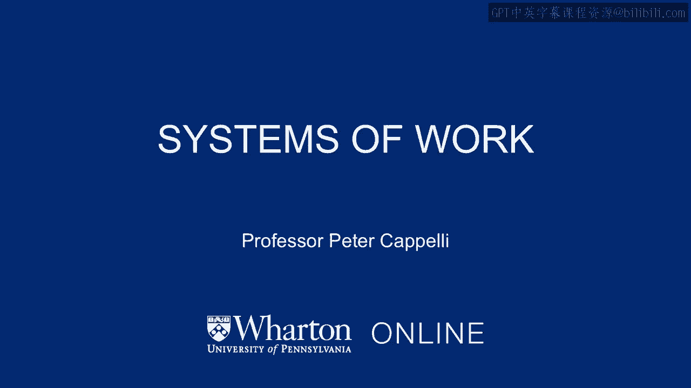
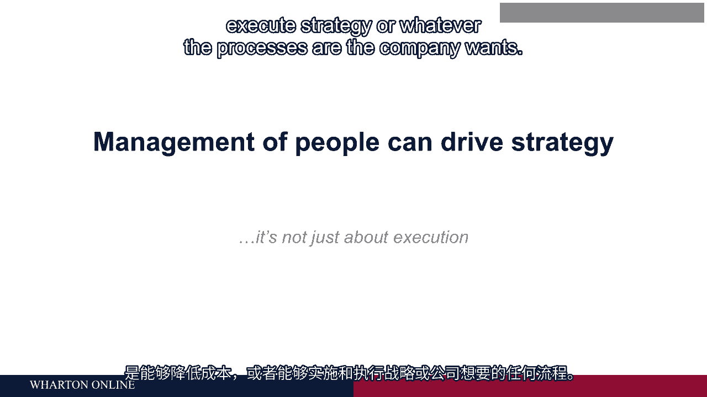

# 沃顿商学院《商务基础》课程｜第90讲：工作系统 🧩

在本节课中，我们将探讨“工作系统”这一概念。我们将了解，如何将不同的管理实践组合成一个协同运作的整体，从而为企业创造竞争优势。我们将通过具体案例，分析这些实践如何相互配合，以及当系统被打破时会发生什么。

---

上一节我们讨论了工作设计等个体实践，本节中我们来看看这些实践如何组合成一个系统。

工作系统是指一系列相互关联、相互强化的管理实践。当这些实践协同作用时，其产生的效果远大于各部分效果的简单相加。

一个简单的例子是利润分享与员工参与。我们知道，**广泛的利润分享或股票期权**本身对员工绩效影响甚微。但若将其与**员工参与决策**相结合，效果则会显著增强。原因在于，利润分享提供了帮助公司的动机，而员工参与则提供了行使这种动机的途径和自主权。两者结合，才能释放真正的能量。

---

以下是两个具体案例，展示了工作系统如何运作及其重要性。

**案例一：霍尔特化学公司（Holt Chemical）**

这是一家专注于特种化学品业务的公司，面临来自成本更低的大型企业的竞争。霍尔特的核心竞争优势是卓越的客户服务。

他们的工作系统包含以下关键实践：
*   **招聘与培训**：他们不招聘专业销售人员，而是招聘化学工程师。新员工首先在化工厂工作，深入了解产品及其制造过程。
*   **客户关系**：之后，这些工程师出外勤服务客户，并倾向于与客户建立长期关系。
*   **薪酬体系**：他们领取固定薪水，**没有销售佣金**。这消除了向客户推销不适用或高利润产品的动机，从而赢得了客户信任。
*   **角色定位**：他们是解决问题的顾问，而非推销员。

这套简单的实践组合，使客户愿意支付溢价来购买霍尔特的产品和服务。

然而，问题出现了。一家咨询公司建议霍尔特改变薪酬体系，为销售人员引入**销售高利润产品的激励**。这一单一改变破坏了原有工作系统的协同效应：
1.  部分销售人员因不认同新做法而离职。
2.  客户开始不信任销售人员的推荐，转而选择价格更低的竞争对手。

最终，霍尔特整个竞争战略因此瓦解。这个案例表明，改变系统中的一个关键环节，可能摧毁整个系统的效力。

**案例二：诺德斯特龙百货（Nordstrom）**

诺德斯特龙数十年来一直是坪效（每平方英尺销售额）最高的百货商店。他们销售的商品与其他百货店大同小异，其竞争优势在于个性化的客户服务体验。

他们的工作系统截然不同，包含以下实践：
*   **招聘与筛选**：他们招聘热情、有服务意识的人，而非进行大量培训。他们不希望员工有标准化的服务模式，而是鼓励“尽一切可能让客户满意”。
*   **薪酬激励**：销售人员有**高额的销售佣金**，这提供了强大的销售动机。
*   **自然淘汰**：公司人员流动率高，不适应者会很快被淘汰。由于在招聘和培训上投入不多，这种流失成本不高。
*   **客户关系**：留下的优秀销售会建立自己的客户群，并努力维护。

这套系统——**高激励、低培训、严筛选**——虽然不符合某些“最佳实践”，但完美契合了诺德斯特龙的业务模式（时尚零售、重个人服务），并为其创造了持续的竞争力。

---

从以上分析，我们可以得出本部分课程的核心结论。

正确地进行人员管理，其意义远不止于控制成本或执行战略。通过构建一个内部协调一致、并与业务战略相匹配的**工作系统**，企业能够创造出驱动业务战略的核心能力。

这将把我们关于人员管理的部分，与课程后续将要讨论的战略部分紧密联系起来。

---

**本节课总结**

本节课我们一起学习了“工作系统”的概念。我们明白了，管理实践的有效性往往取决于它们如何被组合成一个协同的整体。通过霍尔特化学和诺德斯特龙的两个案例，我们看到了不同的工作系统如何支撑企业的竞争优势，也看到了改变系统关键组件可能带来的风险。最终，一个设计精良的工作系统本身就能成为企业战略能力的源泉。