# 沃顿商学院《商务基础》课程 P91：及时而明智的决策 🎯

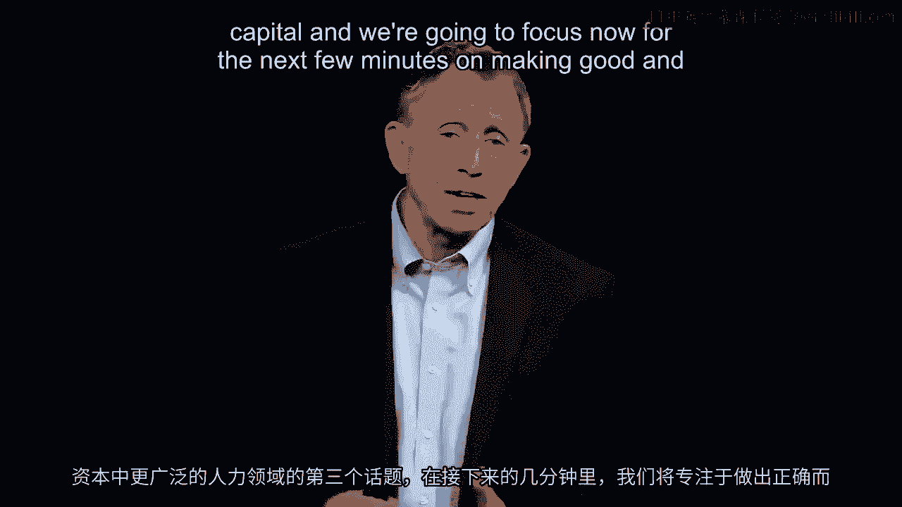

在本节课中，我们将要学习如何做出**及时而明智的决策**。这是人力与社会资本这一广阔领域中的第三个关键主题。我们将探讨在当今快速变化的市场环境中，为何决策的速度和质量同等重要，并学习来自硅谷企业和美国海军陆战队的实用决策框架。

---

欢迎回到人力与社会资本这一广阔领域的第三个主题。

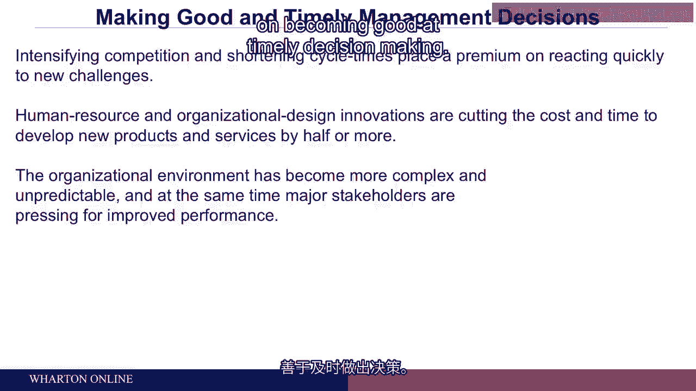

在接下来的时间里，我们将聚焦于如何做出**良好且及时**的决策。

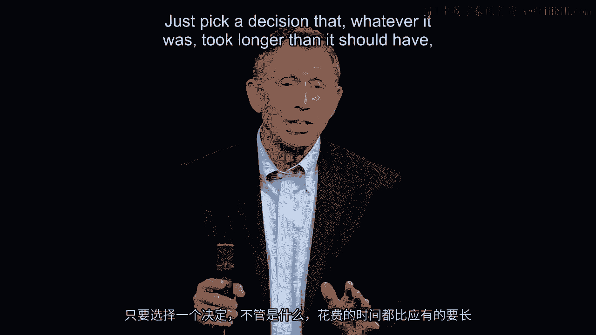

首先需要强调，我们追求的是**既好又及时**的决策。原因在于，我们估计有两个因素正在导致产品开发周期、产品市场寿命以及服务需求的存续时间都在缩短。

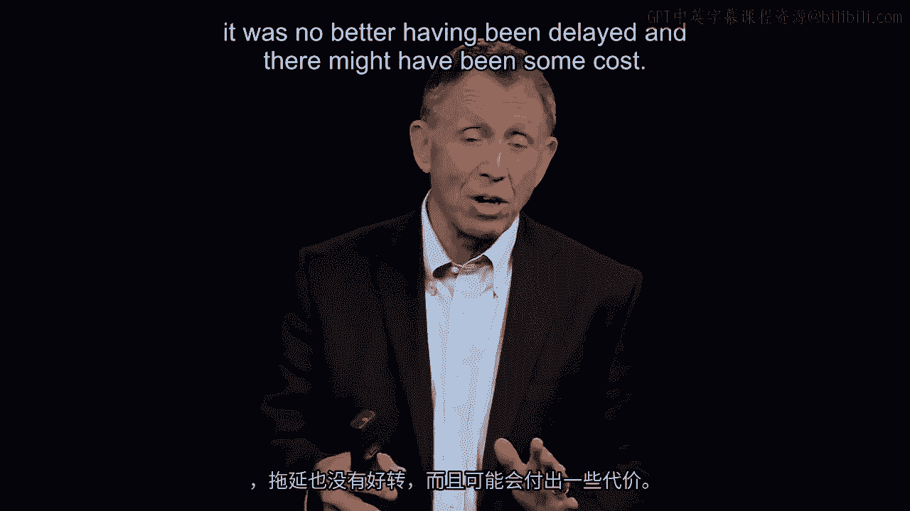

这使得像你这样的管理者，无论是在服务、产品还是工作方式上，都必须做出良好且及时的决策。

我们认为，推动对更多良好及时决策需求的两个因素如下：首先，许多组织自身进行了创新，找到了比过去更快推出产品的方法。因此，如果你的竞争对手擅长开发产品、将其推向市场或为患者提供医院服务，那么其他人也别无选择，只能开始匹配这个时间周期。

其次，更具挑战性的是，在许多市场中，复杂性增加了，例如产品种类更多，不确定性也更高。这部分源于监管，部分源于客户更加善变。综上所述，这凸显了在工作场所管理人力资源时，擅长及时决策作为第三个关键主题的重要性。

---

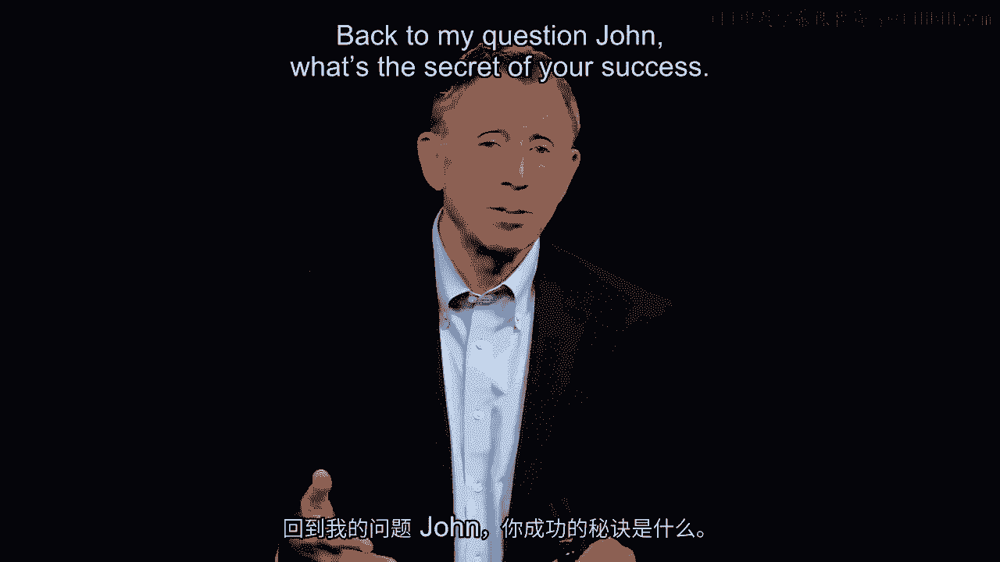

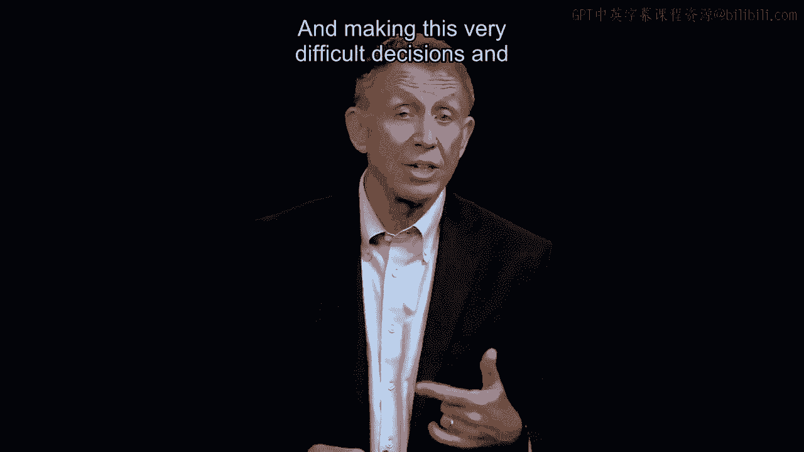

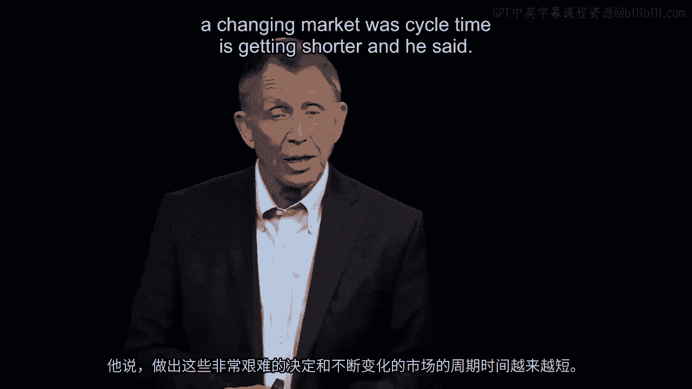

请花大约50秒时间，回想一下你在过去两年中，在自己的组织里看到的一个**决策耗时过长**的例子。你可能参与其中，也可能只是旁观，或者这就是你自己的决策。请选择一个无论内容如何，但耗时都比应有时间更长的决策。

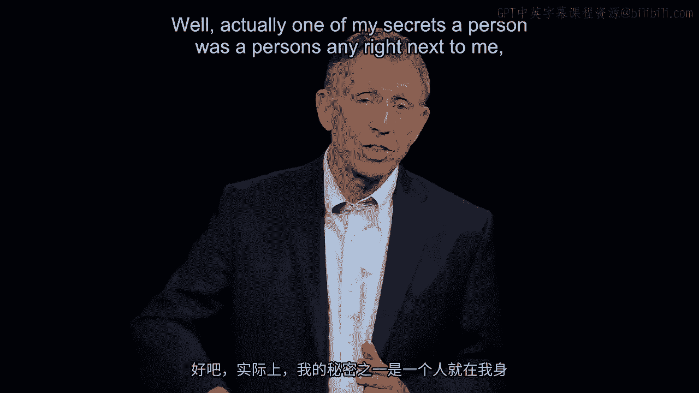

这个决策并没有因为延迟而变得更好，反而可能产生了一些成本。现在问问自己：是什么拖慢了那个决策？那些隐藏的原因是什么？通常，正如你现在可能想到的，原因可能是需要签字的人太多，或者有些人可能因为害怕决策错误会遭到严厉批评而不敢做决定。这些都是人性画卷的一部分。作为管理者，我们需要意识到这些因素，并设法规避。

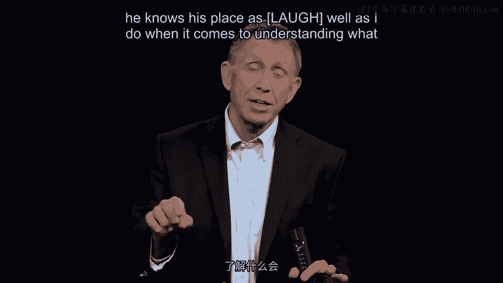

为了更直接地说明这一点，这里有一张约翰·钱伯斯的照片，他执掌思科系统公司20年，该公司是互联网硬件的制造商。我们都经历过数字信息中断的情况，而约翰·钱伯斯及其如今拥有超过3万名员工的大公司，为我们工作场所的互联网硬件骨干网络提供了支持。几年前我在一个活动上遇到了约翰·钱伯斯，他现在已经卸任，但当时仍是这家硅谷高科技公司思科系统的首席执行官。我说：“约翰，我的所有学术同事都说你在收购方面非常擅长做出良好且及时的决策。思科的成长，用这里的行话来说，部分是无机的，即通过收购；部分是有机的，即通过为现有产品增加更多客户和收入。然而，在无机增长方面，约翰·钱伯斯在挑选赢家、避免输家方面有着令人羡慕的记录，这在并购中很难做到。他的成功率远高于平均水平。”回到我的问题：“约翰，在这个周期时间越来越短的变化市场中，你做出这些艰难决策的成功秘诀是什么？”

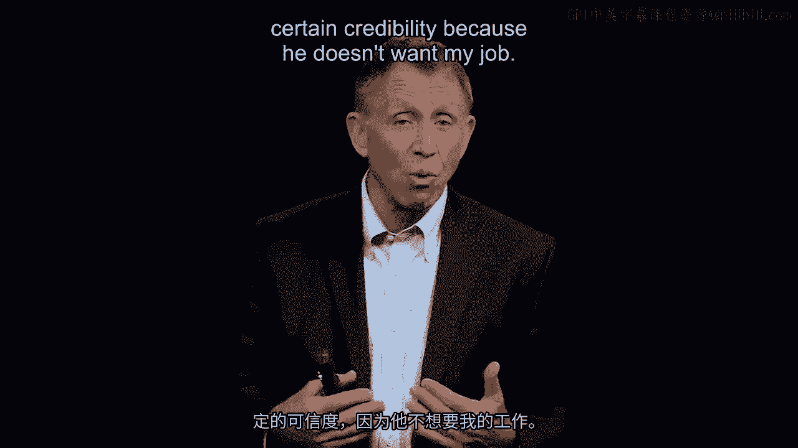

他说：“实际上，我的一个秘诀是一个人的手。”当时就在他旁边的，是思科的首席财务官拉里·卡特。我说：“哦，太好了。那么告诉我，为什么拉里·卡特是你的秘密武器？”约翰·钱伯斯解释如下：“拉里·卡特，作为首席财务官，在理解什么会破坏价值或增加价值方面，他对这里的了解和我一样深入。但同样重要的是，当我向他寻求建议时——我确实会在做出艰难的30亿美元收购的最终判断前，向他进行非正式的、非公开的咨询——我知道他给我的建议带有某种真实性和可信度，因为他**不想要我的工作**。”

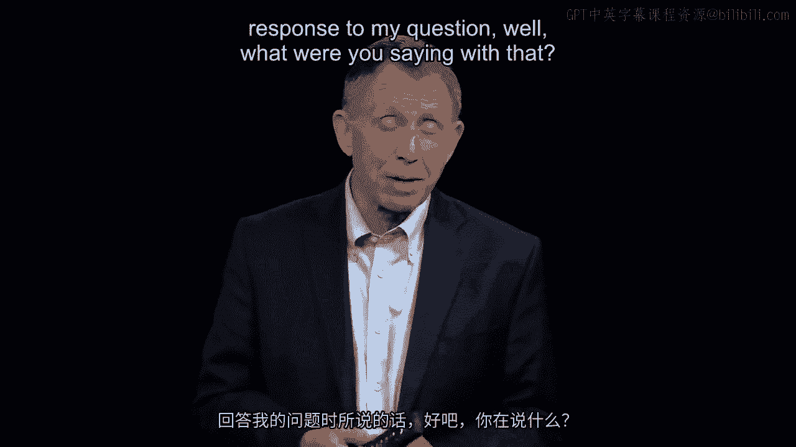

我实际上不得不说：“约翰，我不太明白这一点。你能详细解释一下吗？”约翰在回答我的问题时说：“嗯，人性使然，人们发誓要维护企业的目标或使命，这是当然的。但有时，隐藏的议程，甚至无意识的偏见，可能会影响他们的判断。既然他不想要我的工作，我几乎可以肯定，他给我的答案不会是那种可能不太好的答案，因为他不会指望如果我失手他就能得到我的工作。”说到这里，我开始寻找支持这一观点的证据，并发现了斯坦福大学教员凯瑟琳·艾森哈特的一项伟大研究。

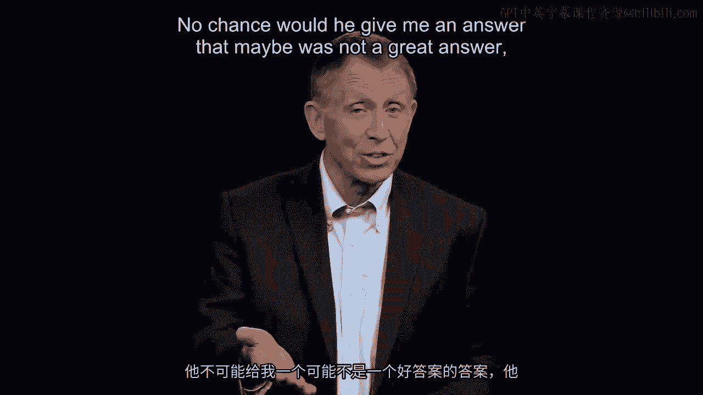

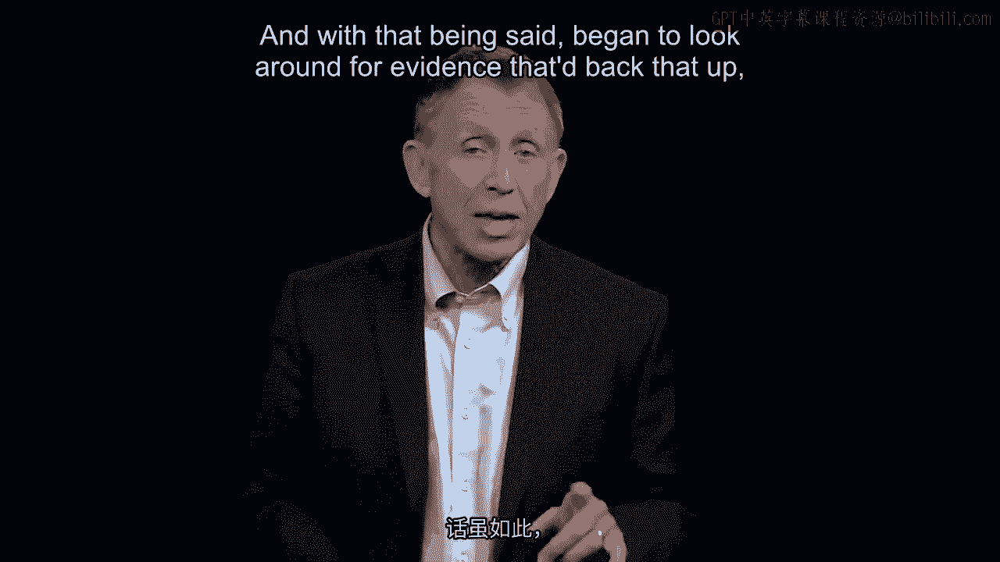

在屏幕左侧你可以看到，她研究了硅谷一组能快速将产品推向市场的公司。然后，她将这个“快速部落”（姑且这么说）与“慢速部落”——其他规模、产品非常相似，但通常需要两倍时间推出产品的公司——进行了比较。后者的产品并不更好，只是花了两倍时间。所以是快与慢的对比。然后她问：“那么，快速行动者和相对较慢者之间有什么区别？”当然，他们都很快，毕竟是在硅谷。她发现，快速行动者——看那里用红色高亮标出的一点——是那些像约翰·钱伯斯一样，拥有一位**内部经验丰富的顾问**的公司，这个人能够提供**无偏见、非利己**的建议。

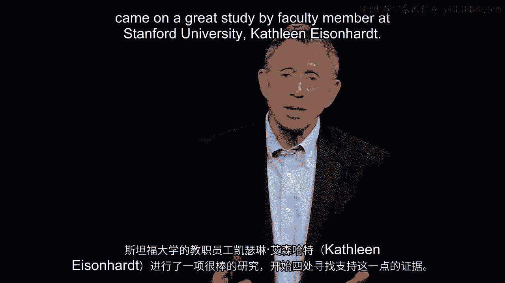

让我们以管理建议的形式更积极地表述这一点：**拥有一位与你关系密切的人（也许是曾经担任过你职位的人），愿意坐下来与你一起，就你面临且必须做出的决策进行头脑风暴，这是一个好主意**。约翰·钱伯斯提醒我们的问题，其解决方法之一就是拥有一位内部（或外部）顾问。请看列表顶部的第一个要点。我不会逐一讲解所有要点，只想让你注意这一点，那就是：**“收集主动的实时数据。”** 不要派人出去三周后才把数据带回来。要说：“看，我们现在就需要，今天就要。”这同样是那个快慢对比研究中的发现之一。

你需要记住那五个因素。请看一下，我马上会要求你应用它们。

---

现在，我将补充来自**美国海军陆战队**关于决策或决策指导的信息。美国海军陆战队的职责是进入、完成任务、然后撤离。值得赞赏的是，十多年来，我们每年都会带大约190名MBA学生去美国海军陆战队那里待一天半，学习及时且良好的决策。我们想知道海军陆战队如何看待这个问题，他们如何进行指导——这正是我们现在关注的主题。在向我们的学生传授时，出现了四个关键点。你可以在这里的照片中看到，例如中间那张照片里，我们的MBA学生正在看一位海军陆战队教官。

海军陆战队教官们提出了以下四个关键点。请将这些点与我们之前幻灯片上的五个关键点结合起来。

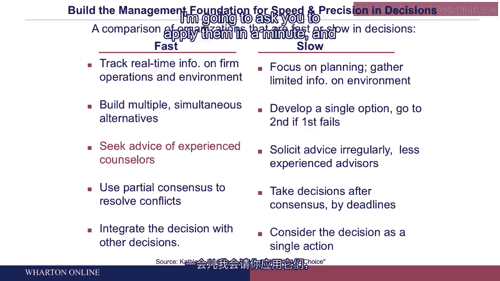

**第一点**：海军陆战队军官被教导，在战场上做出决策时，只需掌握所需信息的**70%**，拥有**70%**的把握，达成**70%**的共识。这是一个比喻，但要记住关键点是**超过50%**。不要草率行事（那及时但不好），反之，也不要等待**99%**的确定性，因为在你获得所有数据之前，别人可能已经占据了有利位置（无论是字面意义还是比喻意义上）。**70%**——完成分析、收集数据、建立共识，但不要等待完美的共识或完美的数据。

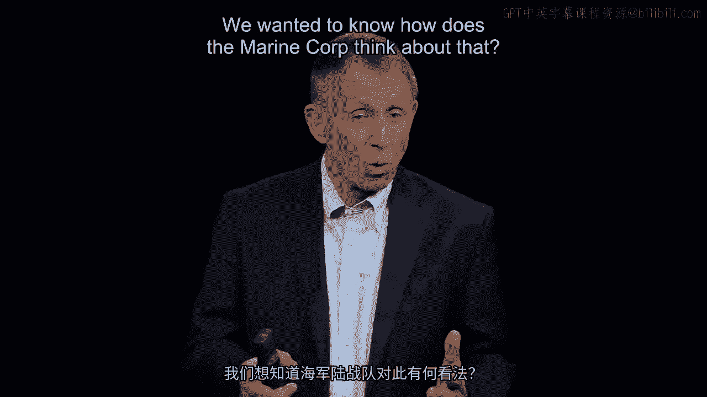

**第二点**：一个独立但非常重要的点。管理者（或海军陆战队军官）需要学会传达海军陆战队所谓的“指挥官意图”，在商业或其他组织中我们倾向于称之为“战略意图”。作为管理者，你要对周围的人说“这就是我想要的”，然后不要试图微观管理他们做什么。让你的下属去处理细节。有一个短语很好地概括了这一点：“**眼到，手不到**”。

这引出了**第三点**，同样是制定良好及时决策的一个准则：**培养一种容忍度，甚至是为第一次犯错的员工鼓掌**。他们会犯错，因为**70%**意味着他们对情况没有完美的理解。你已经告诉了他们你的意图，但没有告诉他们具体怎么做，作为他们的管理者，你定义上比他们更优秀。因此，他们必须通过犯错、学习和实践来成长。海军陆战队以及彼得·卡佩利和我合作的许多组织都有一句名言：**你必须容忍第一次错误，并进行事后回顾，分析发生了什么，如何确保不再发生**。当然，对于第二次犯同样的错误则零容忍。

**第四点**：我非常喜欢这句话——**优柔寡断是致命的缺陷**。对于美国海军陆战队来说，在作战区域这有字面意义；在我们今天讨论的组织中，可以将其视为一个比喻。也许总结一下，我要提出一个可能描述了正在听课的你们中一部分人的情况：如果你为一个就是无法做出决定、无法处理桌上文件的老板工作，你会开始发疯。你知道决策必须做出，而一个优柔寡断的管理者可能会断送他们的职业生涯，这对组织也非常不利。请记住美国海军陆战队的这四点。

---

请记住硅谷信息左侧的五个要点。

请记住约翰·钱伯斯所说的，拥有一位可以寻求指导的亲近之人。

现在，我将要求你根据面前的信息，计算珠宝商的总损失。请花60秒，并牢记那些因素。本课程的整个要点就是将一些因素放在我们脑海深处，以便应用。请花60秒。我会问你的答案是什么，请在你面前的纸上写下来。

---

**本节课总结**

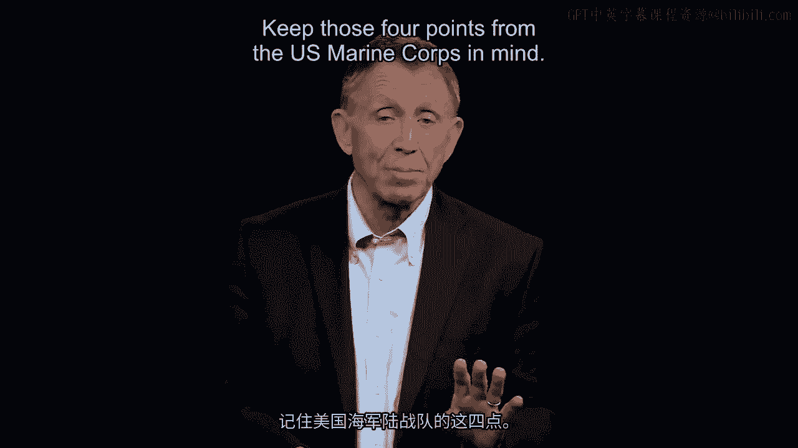

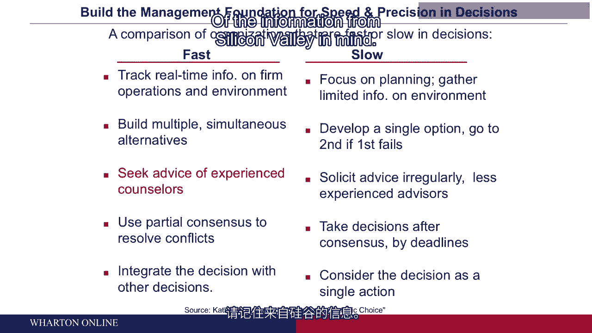

在本节课中，我们一起学习了做出**及时而明智决策**的重要性与方法。我们了解到，在当今产品周期缩短、市场复杂多变的环境下，决策的**速度**与**质量**必须兼顾。关键要点包括：
1.  **寻求无偏见的内部顾问**，如约翰·钱伯斯依赖其CFO那样，以获得真实可信的建议。
2.  **借鉴硅谷“快速部落”的经验**，例如**收集主动的实时数据**，避免因等待完美信息而延误时机。
3.  **应用美国海军陆战队的决策原则**：在拥有**70%** 信息和把握时果断行动；清晰传达“**指挥官意图**”（战略目标）而非微观管理；**容忍第一次错误**以鼓励学习和行动，但不容忍重复犯错；认识到**优柔寡断是致命缺陷**。

通过结合这些来自企业领导和军事组织的实践智慧，我们可以更好地构建自己的决策框架，在复杂和快节奏的工作环境中有效地推动事务前进。