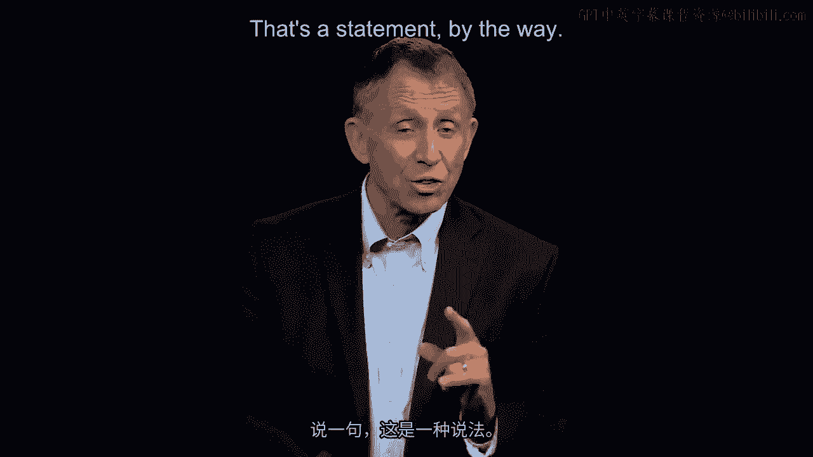
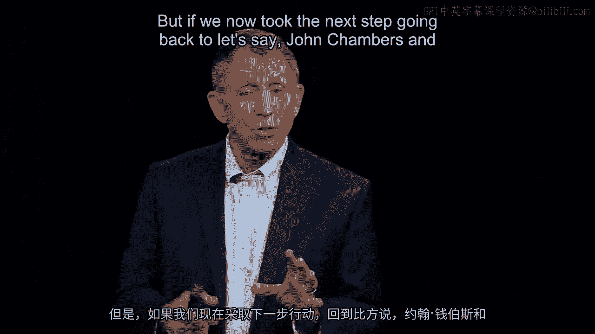
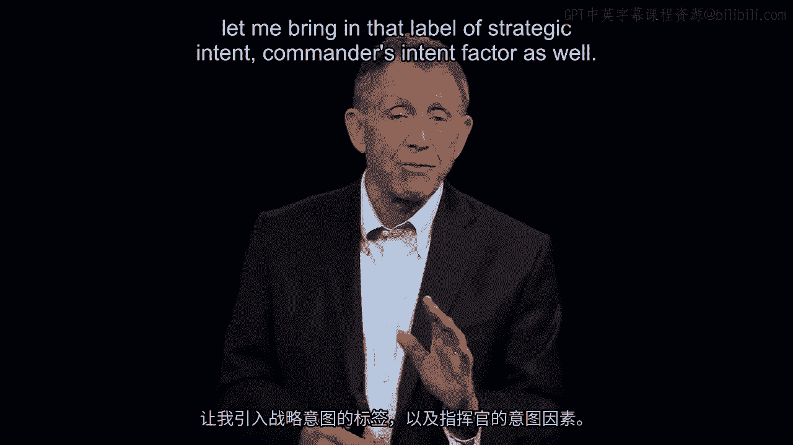
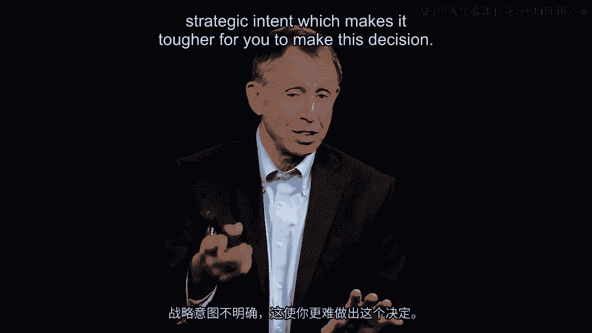
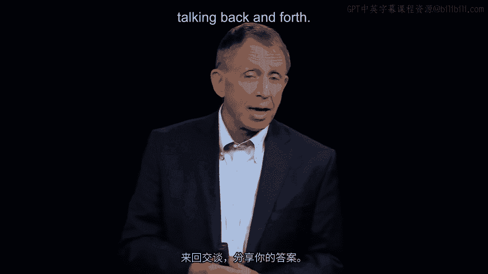
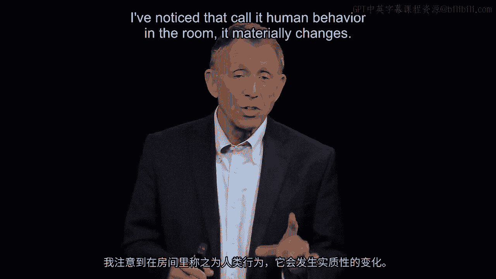
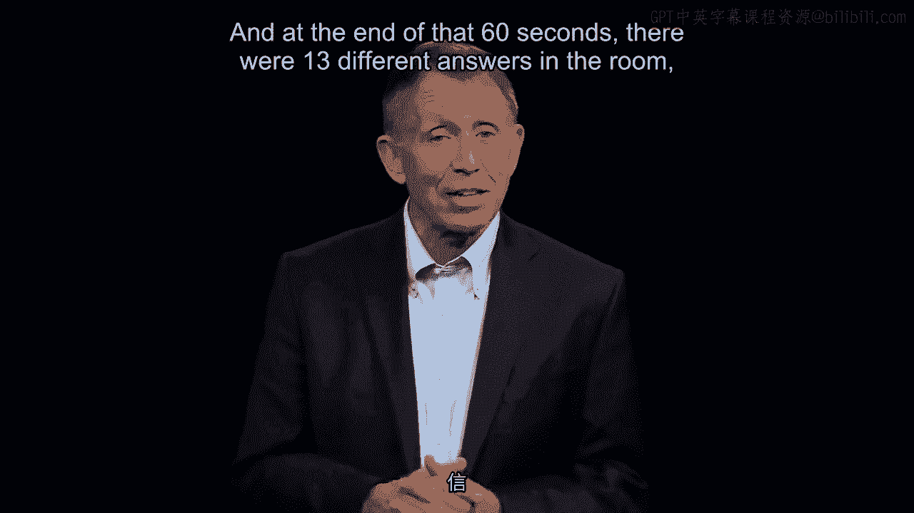
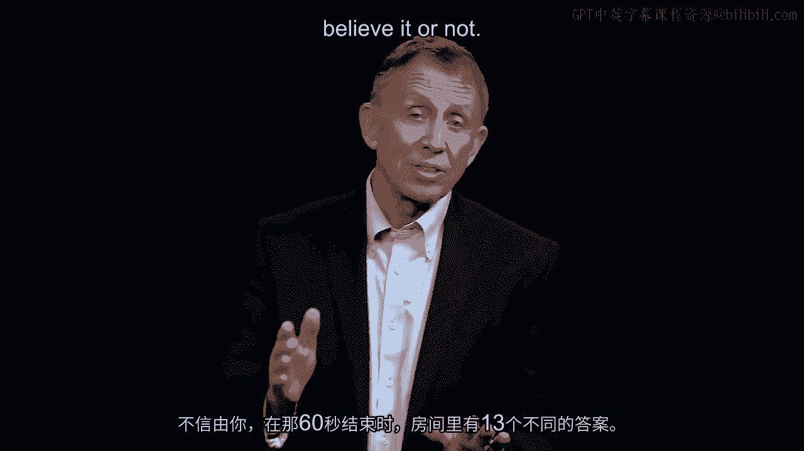
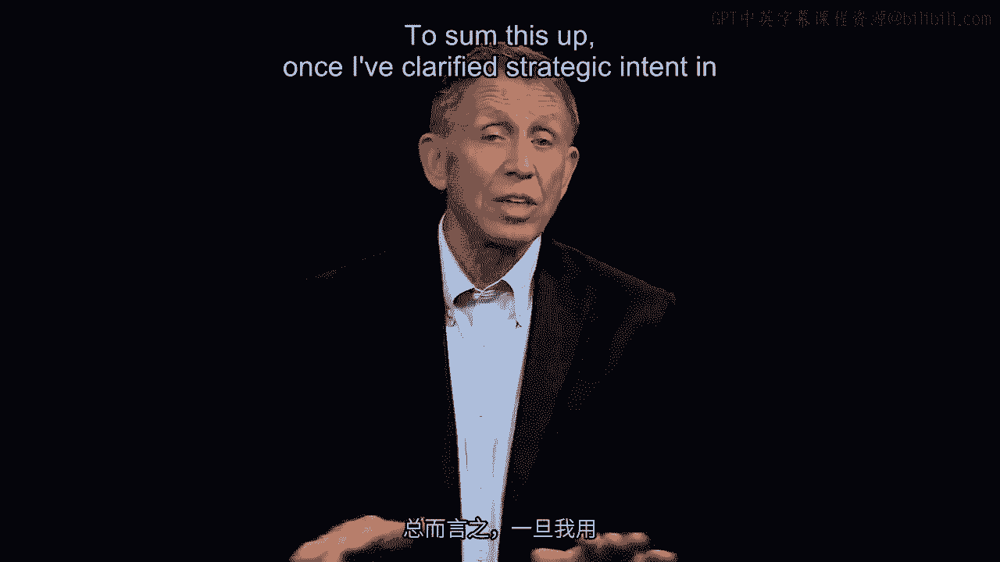
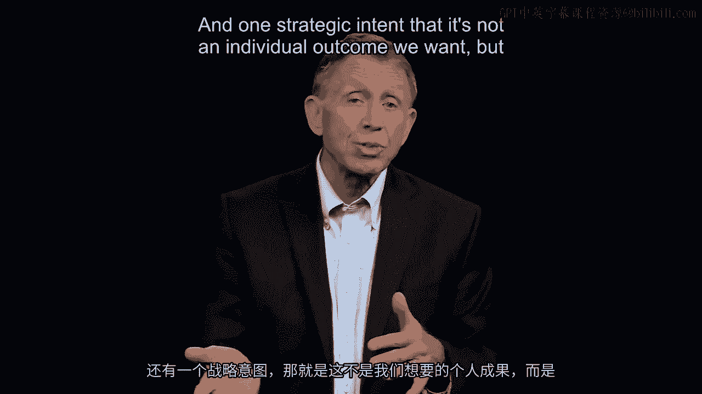

# 沃顿商学院《商务基础》｜第15课：做出及时而明智的决定 💡

在本节课中，我们将学习如何做出高质量的商业决策。我们将通过一个具体的财务谜题，来探讨决策过程中的关键因素，例如明确战略意图、寻求可信赖的建议以及团队协作的重要性。

---

现在你已经有机会快速思考了，我们这里的主题是“良好且及时”。

关于这个特定的决策，根据以往的经验，我知道你们中的一些人写下了 **$39**。少数人写了 **$22**。其他人，在其他场合，写了 **$83**。

我记得有人写 **$161**，并且根据以往经验，如果我们把25个人放在一个房间里，很可能至少有七八种不同的答案。顺便说一句，这本身就是一个说明。

这是一个非常棘手的问题。但如果我们现在采取下一步，回到约翰·钱伯斯和凯西·艾森哈特的研究工作，我们已经做出了自己的决定。我们写下了答案，但到目前为止，我们还没有沟通。我们没有与可信赖的顾问或参谋交谈。

所以我建议的做法——我们不会在这里做，但我通常建议你回到办公室后今天晚些时候做——是在你做出最终的判断性决定之前，转向另一个你确信其建议是明智且值得信赖的人，并和他们一起尝试解决这个问题。

我们在房间里很快就能做到这一点。讨论会迅速展开，例如，认为答案是 **$61** 的人会想知道为什么认为答案是 **$39** 或 **$161** 的人是错的。

但在这种咨询、讨论的过程中，你的想法会演变。让我引入那个被我标记为“战略意图”或“指挥官意图”的因素。

当我们审视这个问题时，我猜坐在办公室里看这个问题的你们，有些人可能想过：我是否应该考虑空头支票手续费？或者机会成本？声誉损害呢？那么，反问你们一句：这些因素应该纳入你的考虑范围，还是排除在外？

由于我一开始没有明确这一点，我在战略意图上表达得不够清晰，这使你们更难做出这个决定。

我本应更明确，现在我来澄清：除了现金流入和现金流出，其他一切因素都排除在外。不考虑声誉损害，不考虑其他任何东西。最后，我的战略意图还没有完全阐明，这是我的最终澄清：如果我们有时间，我会让你们进入一个房间，与其他人分享答案，来回讨论。

然后我会说，我做这个练习的目的，我的意图，并不是要你们每个人都得到正确答案。感觉上是这样，但实际上那不是我的意图。我的意图是让你们房间里的人，集体地、共同地得到正确答案。

我们只需要达到70%的共识，就可以引用海军陆战队的规定，称之为“完成”。一旦我们达到70%的一致意见，我们就完成了。有了这个声明——目标意图不是让你个人正确，而是让你所在的组织、社群、公司、医院或大学正确——我注意到房间里人们的行为发生了实质性的变化。

在此之前，人们基本上是在独自思考，独自琢磨。一旦我说，我的意图是让你们集体，或者至少70%的人，得到正确答案，人们就开始行动起来。有人会走到黑板或白板前，开始梳理思路。说到这里，请记住这一点，然后看看你写下的答案。

现在，我将带大家了解所谓的“正确答案”。这个问题如此棘手，以至于我们决定通过请专业人士来裁决，确定正确答案。我们邀请了30位注册会计师，他们职业生涯中都在审视公司和组织的现金流入和流出。

我们请他们看看这个问题，给他们一分钟时间写下他们的最佳答案，这30个人独立工作。在那60秒结束时，房间里出现了13种不同的答案，信不信由你。

有些是 **$22**，有几个是 **$39**，其他是 **$61**，有些是 **$161**，一个说是 **$0**，一个说超过 **$200**。我们或许可以认为这是对该行业的批评，因为专业人士之间存在分歧。但我们又给了他们几分钟时间，让他们集体解决这个问题。

他们确实坐下来开始交叉讨论。我鼓励那些与房间里其他人意见不同的人花时间进行跨房间交流。我们还明确表示，这里的议程是让这30位注册会计师得到正确答案，而不仅仅是每个人得出一个初步结论。

有了这些额外的时间，战略意图得以明确，加上与其他人的讨论——在某种意义上，比喻为可信赖的参谋——这些注册会计师在大约五六分钟后，确实表示，根据他们的专业判断，正确答案是 **$61**。

简单来说：**$39** 现金流出用于购买项链，**$22** 现金流入作为找零，珠宝店从邻居那里收到 **$100** 现金流入，归还邻居 **$100** 现金流出。把这四个数字放在一起，就是 **$61** 的损失。

现在，这一切都是为了强调硅谷研究中比较快慢速公司的五个要点。请记住美国海军陆战队的四个概念。请记住约翰·钱伯斯所说的，关于拥有可信赖顾问的观点。

我们在这里看到了其中几个因素在起作用。总结一下，一旦我以几种不同的方式澄清了战略意图——这是海军陆战队清单上的第二个重要概念——并且一旦我们与房间里我们非常信任、有信心的人交谈，并且战略意图明确为不是追求个人结果，而是追求对组织有益、对组织最优的结果，那么可以预见，像我刚才描述的团队几乎总是会得出 **$61** 的结论。

大多数人独自思考时并非如此。但如果有交叉协作，大多数团队，房间里优秀的人们，最终都会得出 **$61** 的结论。这增强了我们的信心，表明这些来自海军陆战队、硅谷和约翰·钱伯斯的因素确实是实用且有效的。

---

**本节课总结**

本节课中，我们一起学习了如何通过一个财务谜题来实践决策过程。我们认识到，明确的**战略意图**是决策的基石。同时，与**可信赖的顾问**进行咨询和**团队协作**，能够显著提高决策质量，帮助集体找到更优解。这些原则不仅适用于解决谜题，更是商业环境中做出及时而明智决定的关键。