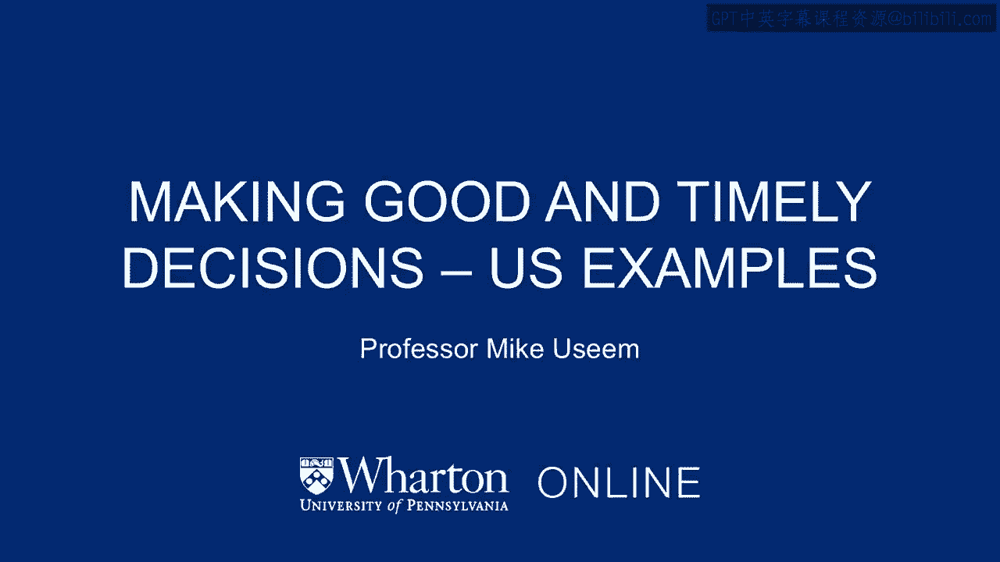
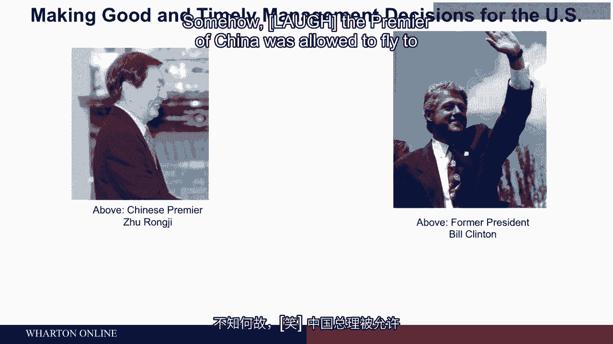
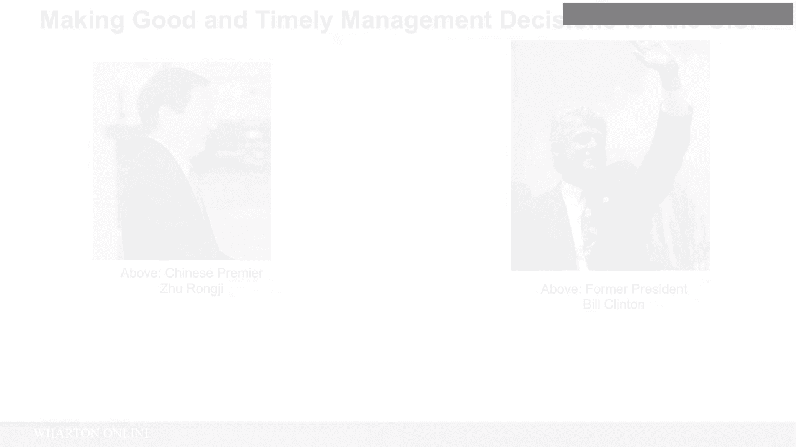
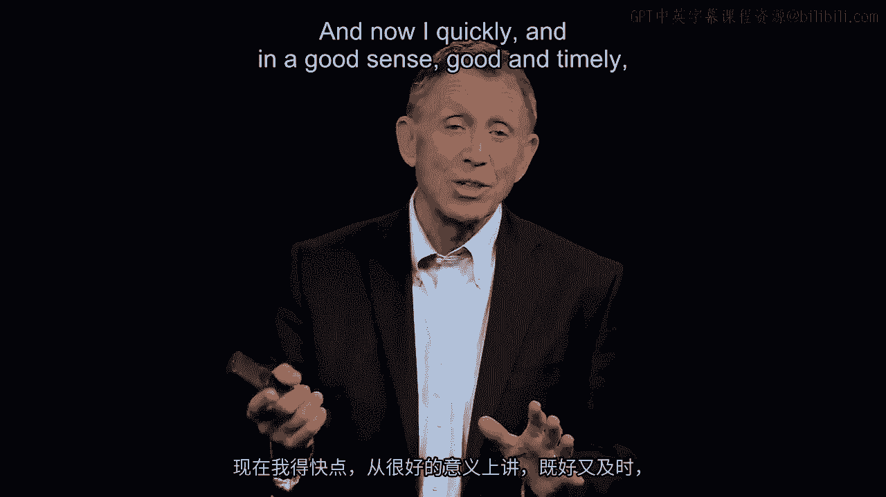
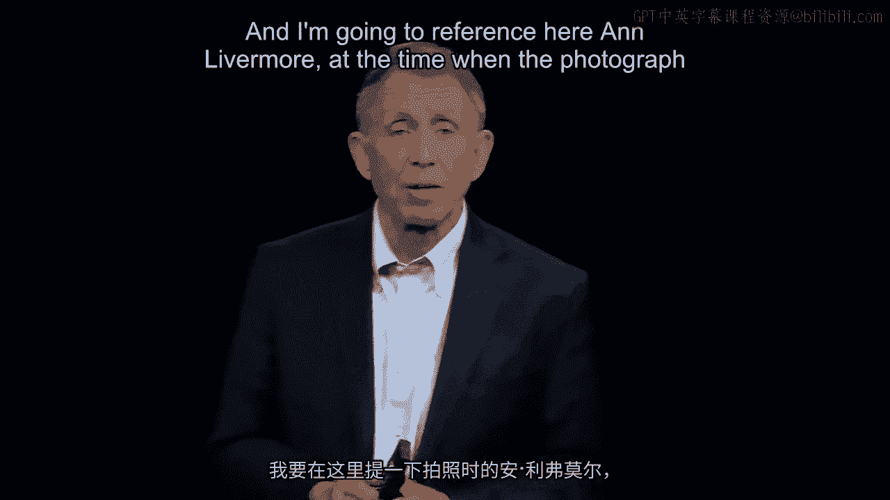
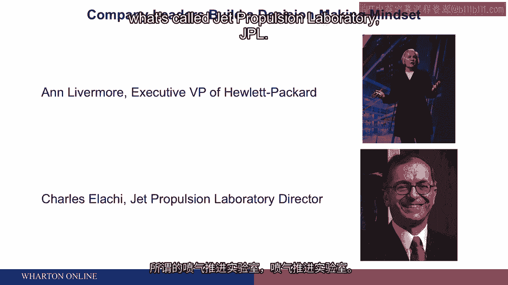
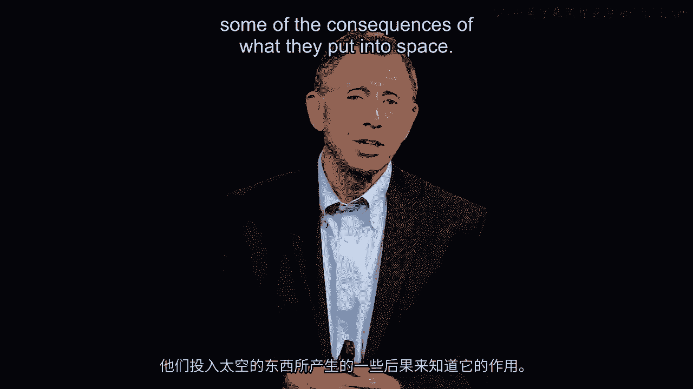

# 沃顿商学院《商务基础》课程｜第93讲：决策制定案例研究 🇺🇸

在本节课中，我们将通过两个具体的美国案例，深入探讨管理者如何在实际工作中做出**良好且及时**的决策。我们将看到，即使面对挫折和失败，坚持这一原则也能导向最终的成功。

上一节我们介绍了决策制定的基本框架，本节中我们来看看这些原则在真实商业与政治场景中的应用。

## 案例一：巴尔舍夫斯基与中美贸易协定

首先，我们将简要分析一个应用案例，然后我们将更深入地探讨一系列艰难的决策。

这个应用案例的主角是**查琳·巴尔舍夫斯基**。她是当时的美国贸易代表，属于总统内阁成员。她的职责是代表美国与其他国家（此案例中是中国）协商协议，特别是帮助中国加入世界贸易组织，并同时向美国产品开放中国市场，产品范围从好莱坞电影到波音飞机。

她与时任中国总理朱镕基进行了广泛谈判，主要在北京进行。他们两人，朱镕基从北京飞往华盛顿，去见当时的总统比尔·克林顿。尽管朱镕基经历了从北京到华盛顿长达14小时的不间断飞行，但当他抵达时，克林顿政府决定不签署该协议。这是一个相当不幸的时刻，在公众媒体上受到了很多批评。中国的总理被允许飞到华盛顿签署一项协议，但最终华盛顿方面却没有准备好签署。

以下是我们要关注的重点。查琳·巴尔舍夫斯基因这个问题在报纸等媒体上受到公开批评，她对自己说：“我相信我们正在努力做的事情，即与中国开展更多贸易。现在我需要迅速、良好且及时地振作起来，掸去灰尘，重新投入战斗。”在比尔·克林顿表示他不会遵守协议、尚未准备好签署的第二天，她打电话给朱镕基，重新展开讨论，并转而与国会两院的成员、大型劳工组织AFL-CIO以及全国各地的各类企业进行沟通，阐述为什么尽管存在许多已知的弊端，但总体而言，与中国进行自由贸易或开放贸易对这个国家是件好事。

六个月后，协议最终在北京签署。查琳·巴尔舍夫斯基（下图照片中）通过做出一系列良好且及时（此处尤其强调及时）的决策，结束了这场辩论和讨论。这帮助中国加入了世界贸易组织。当然，今天我们知道了后果，中美之间的贸易量从当年的涓涓细流变成了如今巨大的流量。

## 案例二：拉奇与NASA喷气推进实验室

让我再补充一点，这里我将提到**安·利弗莫尔**（拍照时是惠普公司的高级副总裁）和**查尔斯·E·拉奇**（拍照时负责运营喷气推进实验室，即JPL）。我们对JPL了解较少，但通过观察他们送入太空的成果，例如前往火星的任务或寻找海王星、观测木星卫星（无人任务）的成果，我们知道它的作用。正是喷气推进实验室组装硬件，并通过范登堡基地安排发射。所以，当执行无人任务时，例如将漫游车送往火星，就是这个组织负责。

查尔斯·E·拉奇，一位科学家、工程师或物理学家，非常关心在喷气推进实验室应具备何种**良好且及时**的决策心态。在一个他经常引用的著名例子中（外界也广为人知），他曾授权两位高级工程师分别执行两次火星任务。这两个任务将在不同时间着陆，但都因技术原因失败了。工程中存在一些问题，这两位工程师分别决定走进查尔斯·E·拉奇的办公室，承认犯了重大错误并提出辞职。

查尔斯·E·拉奇告诉他们（他曾多次重述这个故事，我亲眼见过他直接讲述），他说：“我们刚刚花了4亿美元让你们做出那个不太成功的决策。你们必须容忍第一次不那么完美的决策。既然你们已经从中学到了东西，你们不会辞职，你们将继续为我工作，我们将再执行两次火星任务。”正是这两位工程师完成了名为“勇气号”和“机遇号”的任务。这两个任务成功登陆火星，如果你看过火星表面的照片或近年关于此事的IMAX电影，那就是这两位工程师的成果。他们解决了问题。

查尔斯·E·拉奇反复对他4000名员工说：我希望你们做出严谨的决策。我希望你们及时做出决策，我在这里不追求完美。你们将从错误中学习。所以，这再次印证了海军陆战队的那套理念：达到70%的把握就行动，做出决策，及时行动。

而惠普的安·利弗莫尔则常说，她希望决策足够快，不必超级快，不要草率决定。我们会犯错，但我不希望它们因为追求完美而耗时过长。我要指出的重点是，在管理中，我们认识到人们都担心在快速变化的世界里犯错（周期时间更短），而管理的挑战在于认识到这一点并采取措施加以管理，以便你授权后，周围的人能够做出**良好且及时**的决策。

## 关于决策心态的深入思考

在我们进行更深入的探讨之前，还有几点想法，我也希望你们能吸收，关于如何准备好做出良好且及时的决策，尤其是当许多事情的成败都取决于决策的正确性和及时性时。

大量的行为心理学和行为经济学研究（很好地总结在《思考，快与慢》一书中）指出，许多因素会可预测地导致人们（尤其是该领域的新手）在判断时过度自信。想想你雇佣的一个人，工作六个月后，因为我们知道人们有这种可预测的过度自信倾向，这确实是我们作为管理者可以设法解决的问题。

顺便说一下，所有这些行为上的（可称之为）人类固有缺陷（我们不是计算机，不是自动机器）中，最令人担忧的是我在屏幕底部方框中捕捉到的那一点，几乎像外科医生的一般警告。这有点讽刺，因为它说：如果你度过了一个伟大的季度、辉煌的一年，要小心，因为一些行为缺陷（在这本我已经提到的书《思考，快与慢》中总结得很好，作者丹尼尔·卡尼曼）会变得更加严重。如果一切进展顺利，人们会变得过度自信，傲慢情绪滋生，认为我们做得很好，不需要做任何改变，而也许其中一些“伟大”纯粹是运气使然。

对我来说，那个方框中的最后一段是关于我们作为组织管理者（拥有良好战略）必须做的最深刻的陈述之一，那就是：**防范过度乐观**（顺便也防范过度悲观）。我们必须管理那种过度乐观。傲慢滋生，过度乐观导致我们无所作为。需要有一个中间立场。

为了让这一点更具体，可以通过一个例子来说明：伟大的日本汽车制造商丰田多年来一直秉持我们可能都知道的“持续改进”理念。他们经常在世界汽车工业的价格和质量方面占据主导地位，但不要因此躺在功劳簿上，我们必须思考还有哪些改进需要做。这就是一种被管理的文化。我曾去过丰田，与那里的人交谈，我对此提出质疑，他们说：“当然，我们度过了美好的一年，迈克，但实际上我们真的很担心四个新问题，而这就是我们关注的重点。”

---

本节课中我们一起学习了两个关键案例：查琳·巴尔舍夫斯基通过坚持与沟通，最终促成了中美贸易协定；查尔斯·E·拉奇在NASA喷气推进实验室倡导“从错误中学习”的文化，容忍不完美但及时的决策，最终取得了航天任务的成功。我们还探讨了人类在决策时的行为倾向，如过度自信，并强调了管理者需要培养“持续改进”的心态，在成功时防范自满，以做出真正良好且及时的决策。