# 沃顿商学院《商务基础》课程 P96：设计与变革组织架构 🏗️

在本节课中，我们将学习组织架构的设计与变革。组织架构决定了人员如何组织、分工以及汇报关系，它深刻影响着员工的工作意愿和组织的最终绩效。我们将通过一个食品公司的具体案例，探讨组织设计如何影响员工行为，以及当设计不当时，应如何进行变革。

---

我是迈克·库西马，沃顿商学院的教员。我们关于人力与社会资本的第四个，也是最后一个模块，将探讨如何设计并改变你周围工作人群的组织架构。

组织架构的设计与变革至关重要。我们首先思考设计，然后思考一个更困难的问题：如何在架构确立后进行变革。

我们将从设计开始。组织架构本质上就是思考人员如何组织、分工，以及他们如何向一位或几位上司汇报。我们不会深入探讨当前幻灯片上的所有概念，但其中标红的部分将在后续讨论中涉及。这些概念可以作为你思考组织架构或变革现有设计时的参考。

为了展开讨论，我将以一家名为“罗斯公司”的制造企业为例。该公司采用典型的**职能型组织**结构。例如，某个工厂的财务副总裁直接向总部的财务执行副总裁汇报。工厂经理对该地的财务副总裁有一定影响力，但并非完全控制。

由于这种结构，一些生产设施表现不佳。因此，公司决定改变组织设计，从顶部的图示转变为底部的图示。新的设计将所有职能（如会计、财务、营销、运营等技术技能领域）整合在一起，置于工厂经理的统一管理之下。

这是一个相当重大甚至激进的变革。工厂经理可以聘用或解雇自己的首席财务官（当然，总部的CFO会参与意见）。工厂经理被授予全面的责任，需要像**总经理**一样思考，管理其管辖范围内的所有事务。更具挑战性的是，他们现在也需要对业绩结果负责。

我们将重点关注一个名为杰克逊工厂的新任工厂经理。在做出这一变革时，假设其他条件不变：员工有动力、薪酬体系合理、决策良好及时、工作内容有趣。即便如此，人员如何组织、汇报关系如何设定，仍然会对人们全力以赴完成工作的意愿产生深远影响。

以此为序言，我们将进入一家加工食品制造商面临的特别困境。这家公司（为保护其身份而化名）生产婴儿食品，例如胡萝卜泥或土豆泥。

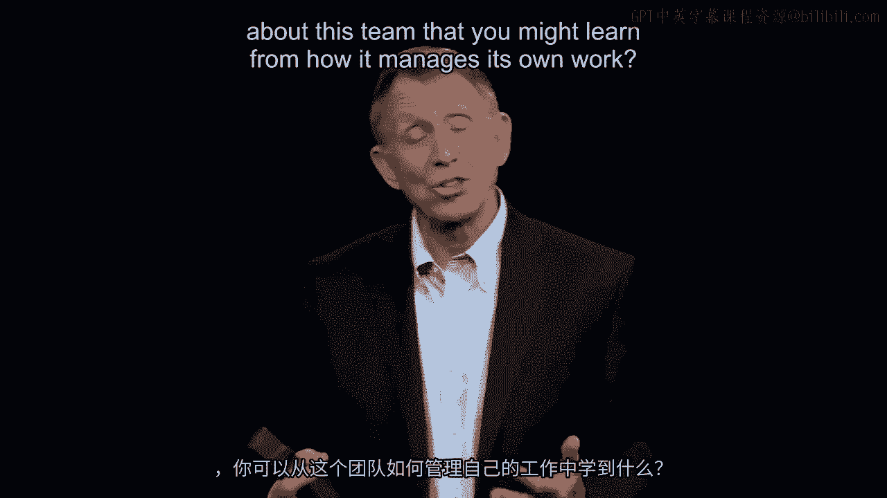

公司面临的核心问题是，这类婴儿食品的市场已经“成熟”，增长缓慢。投资者，尤其是那些青睐高增长公司的投资者，开始抛售股票。公司运营尚可，但年增长率仅为几个百分点，远低于那些年增长5%、8%或12%的公司。

因此，巨大的压力传递到了一位区域销售经理身上。她叫布伦达·库珀，在图表右侧的米色方框中。她刚接手这家食品公司东南区域的销售管理工作。这是一份好工作，她受过管理培训，虽是公司新人，但若表现出色，未来有望晋升、加薪并承担更大责任。

在她的运营区域内，组织设计是这样的：销售团队按州组织。例如，这里有佛罗里达销售团队。这种按地理区域划分的方式看似合理。每个销售团队负责特定区域的销售。布伦达的工作是确保她手下各州销售团队完成公司设定的年度目标（例如4%的增长）。

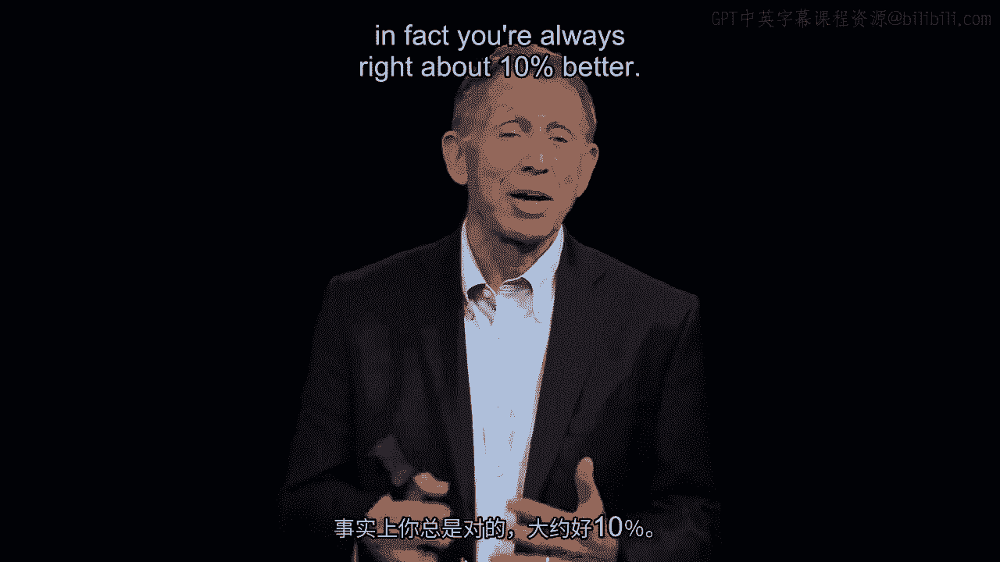

她在位于佐治亚州亚特兰大的区域总部查看各州销售数据时，惊讶地发现佛罗里达团队表现异常出色。过去几年，他们一直是销售冠军，因此每年都能获得公司奖励的拉斯维加斯免费旅行。

她还注意到一个有点奇怪的现象：这个团队总是能超出全国设定销售目标的10%，但奇怪的是，他们从不超过11%或12%。

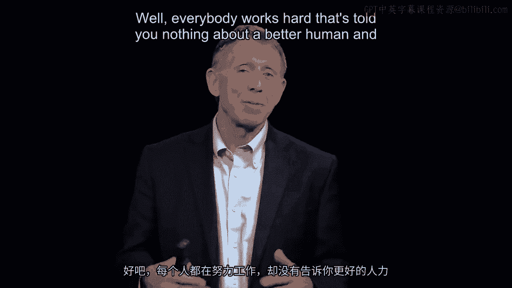

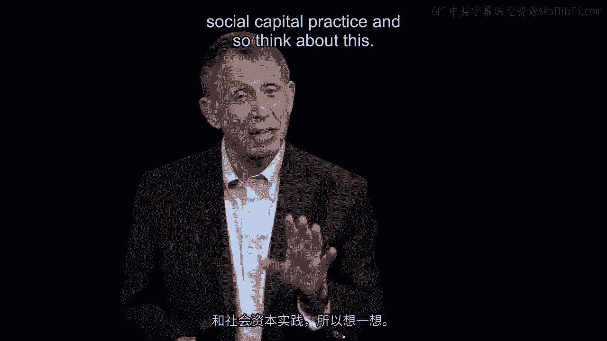

然而，她更大的担忧是：这个团队到底有什么秘诀？在**工作设计**、**绩效薪酬**等方面，是否存在某些做法，导致一些人比其他人表现更好？如果能找到佛罗里达销售团队成功的秘诀，就可以将其推广到南卡罗来纳州、路易斯安那州等地。这不仅对她的职业生涯有利，更重要的是，对公司股东、所有者和客户也大有裨益。

布伦达打电话给佛罗里达团队的负责人简·博耶尔，询问成功的秘诀。简在电话中只是敷衍地说：“布伦达，很高兴通过电话认识你。说实话，我们在佛罗里达是靠努力工作取得这些销售数字的。”但这并没有揭示任何更好的人力与社会资本管理实践。

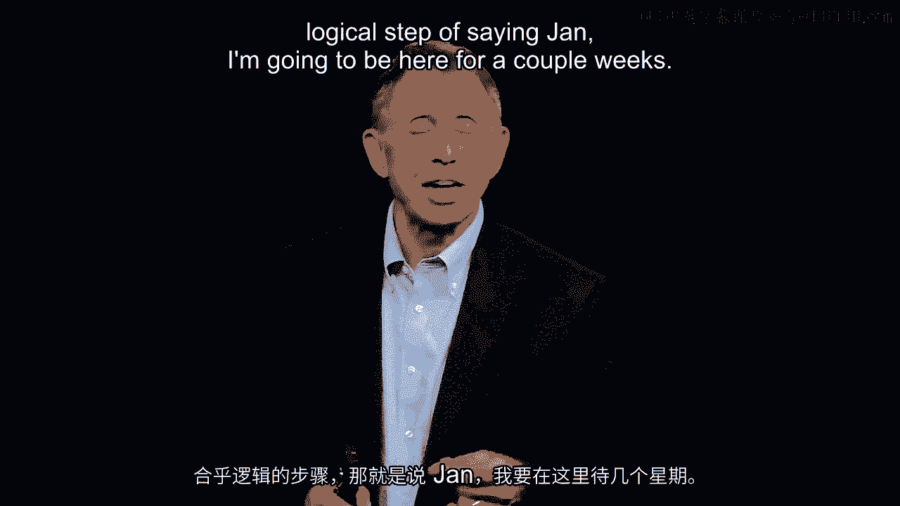

布伦达意识到，如果人们在电话里不愿说，甚至当面也不愿说，她就必须亲自去那里，花时间观察、交谈。原因很明显：他们可能不想透露秘诀；或者，很多人自己也不清楚秘诀是什么，他们只是按部就班地工作，并未意识到自己有一套激励团队、完成任务的巧妙方法。

于是，布伦达骑上她的哈雷戴维森摩托车，亲自前往佛罗里达。她当面问简：“简，我来了。我是新的区域销售经理。面对面告诉我，你们是怎么做到的？”然而，她再次被简搪塞过去。

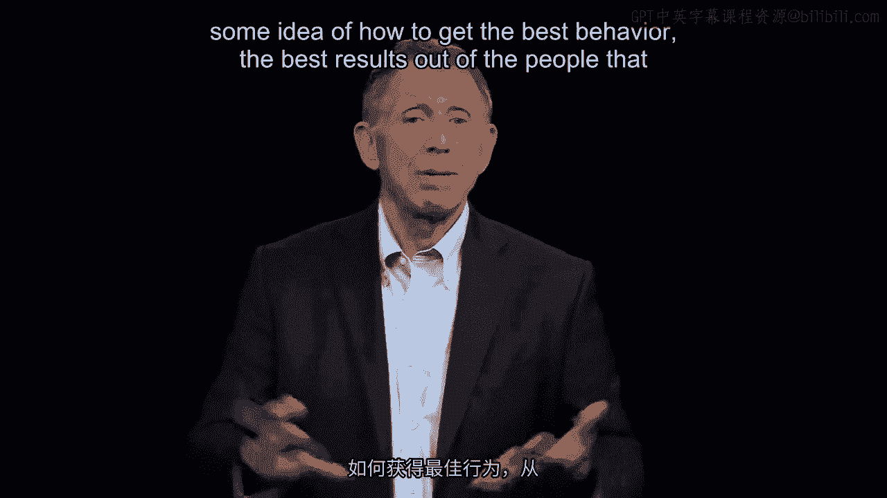

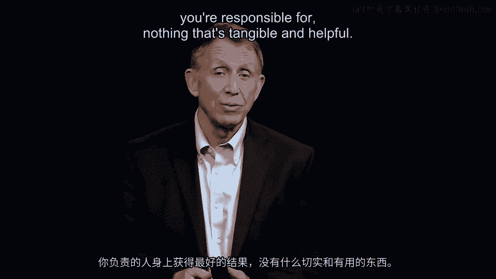

因此，布伦达采取了下一个合乎逻辑的步骤：“简，我打算在这里待几周。不如让我加入你和你的销售团队，一起去做销售拜访吧？”简同意了。

几周后，布伦达仍然没有发现任何关于人员管理、激励行为或取得最佳结果的具体且有帮助的实践。直到第三周周末的一个晚上，团队中资历最浅的玛丽转向布伦达说：“布伦达，你知道吗，你在这里有点徒劳。你得明白，我知道你想知道什么。努力工作当然是部分原因，但更重要的是以下这些。”

在玛丽解释之前，请思考一下她将如何解释这个州销售团队的超常表现。

玛丽说：“这里是佛罗里达。想想佛罗里达的人口结构。有很多婴儿，当然也有很多退休人员。我们发现，如果去养老院或辅助生活机构推销，说‘瞧，我们的食品非常适合牙齿不好的人’，我们可以向老年人大量销售，而不是婴儿。我们还发现，健美爱好者喜欢我们生产的纯净产品，所以我们去健身房推销。想家的大学学生，有时也会买婴儿食品，这或许能让他们想起家的味道。狗主人有时会为宠物购买婴儿食品。此外，一些五星级美食餐厅偶尔也会购买我们的产品，添加到他们的菜单菜肴中。”

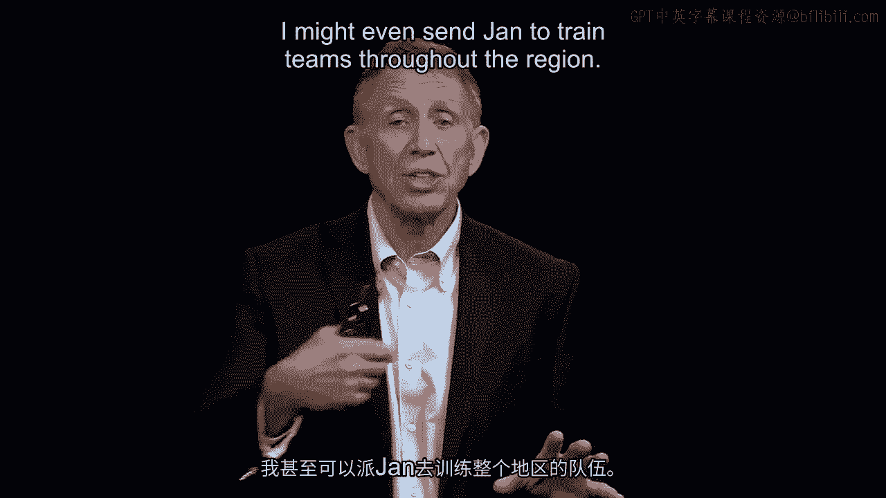

玛丽指出的关键是，她和她的团队在简的带领下，发现了婴儿食品的五个新市场，而这些市场在很大程度上与“婴儿食品”这个标签无关。

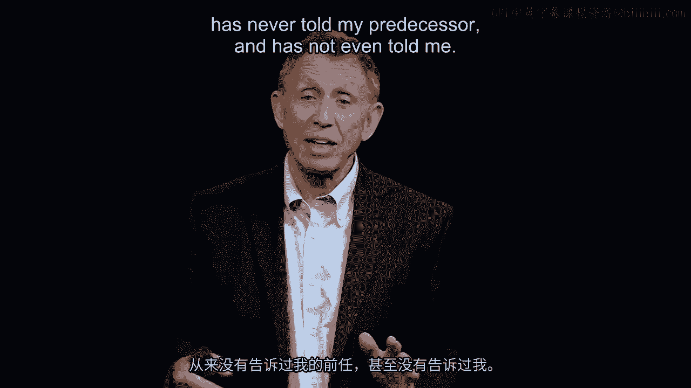

此时，布伦达产生了两种相互冲突的想法。第一种想法是：太棒了！我偶然发现了一个创新团队。他们开拓了新市场。这太好了。我要采纳他们的想法，甚至可能派简去培训区域内的其他团队。我找到了最佳实践。虽然还不知道他们是如何了解这些其他市场的，但我会弄清楚，因为在南卡罗来纳州，可能还有你想不到的其他客户。

但布伦达的第二个想法是：等等。简·博耶尔早就知道这些市场，却从未告诉我的前任，甚至也没告诉我。而且，简为谁工作？为我，而我为副总裁工作，副总裁最终为公司所有者和股东工作。因此，简·博耶尔的行为有点问题，她在隐瞒信息。

现在回到那个10%的问题。布伦达问：“为什么你们总是停在10%？”玛丽的回答是：“你看，如果我们今年达到12%，明年市场和销售的大副总裁就会要求我们做得更好。我们要更努力工作，却得不到更多回报。现在，如果我们达到10%，就知道会成为区域最佳，能获得免费的拉斯维加斯之旅，这很棒。所以我们有所保留。”

因此，布伦达的第二个想法更加尖锐：我不仅遇到了一个经理在隐瞒创新信息、与公司作对的销售团队，他们实际上还在抑制销售。

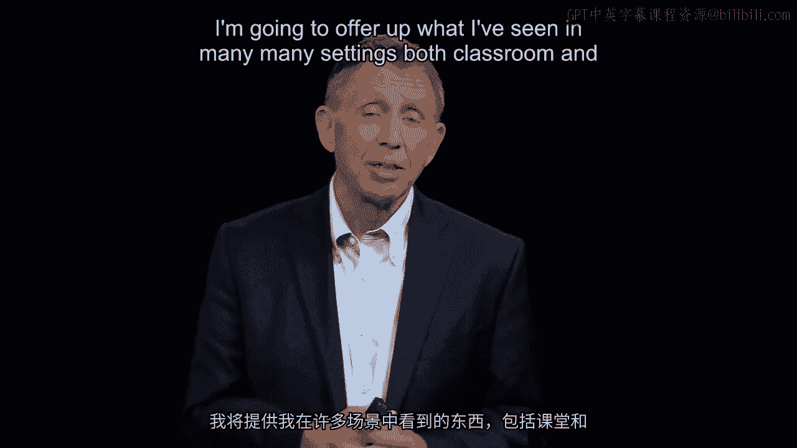

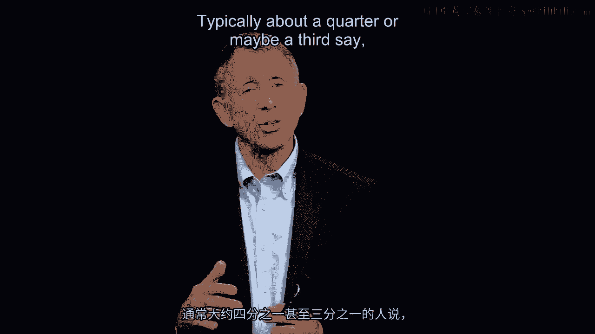

现在，请思考：如果你是布伦达·库珀，基于你思考背后的理论，你会留下简·博耶尔，还是解雇她？第一种观点认为她是惊人的创新者；第二种观点则认为她的行为不道德，应该被辞退。

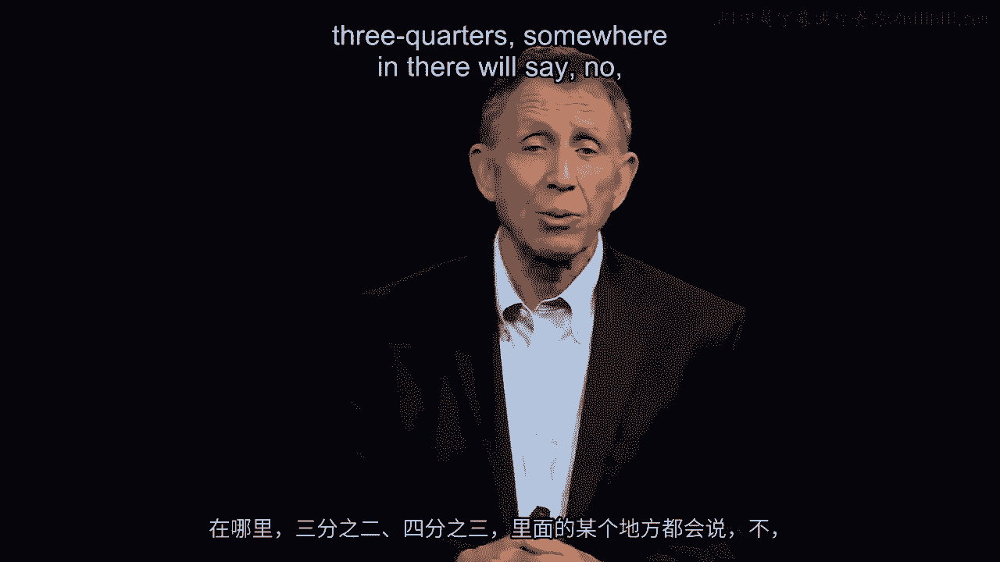

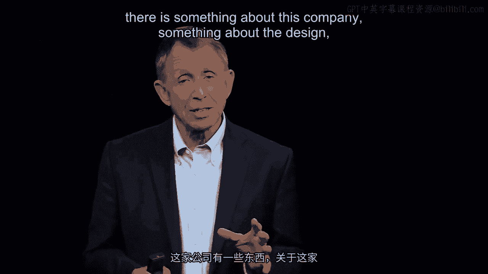

根据我在许多课堂和组织环境中的观察，通常约有四分之一或三分之一的人认为简·博耶尔的品性不适合公司，必须解雇她以传递信息。其余约三分之二或四分之三的人则认为，问题不在于简，而在于公司的某些方面，在于**组织架构的设计**，正是这些因素以合乎逻辑、几乎可预测的方式导致了简的行为。

布伦达·库珀站在了大多数人的一边，决定与简合作。这一决定基于本模块两个非常重要的前提：
1.  人们自带许多想法、道德准则和工作技能。
2.  一旦他们进入我们的**架构**、我们的**系统**（我们奖励和晋升的方式），就会独立地影响他们的行为。所以，我们入职时是什么样的人，但架构可以鼓励正确行为，也可以阻碍或误导行为（如本例所示）。因此，改变组织、改变设计、改变架构，就能改变人。

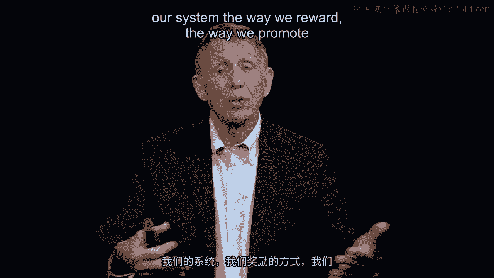

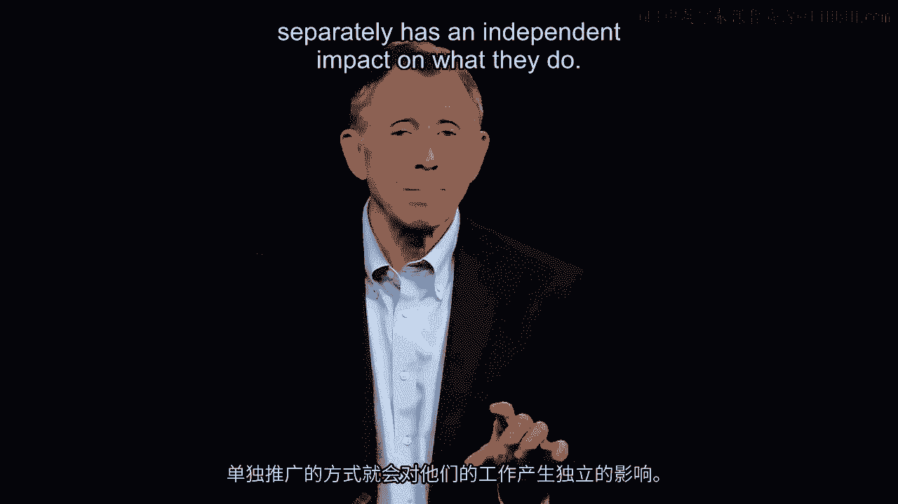

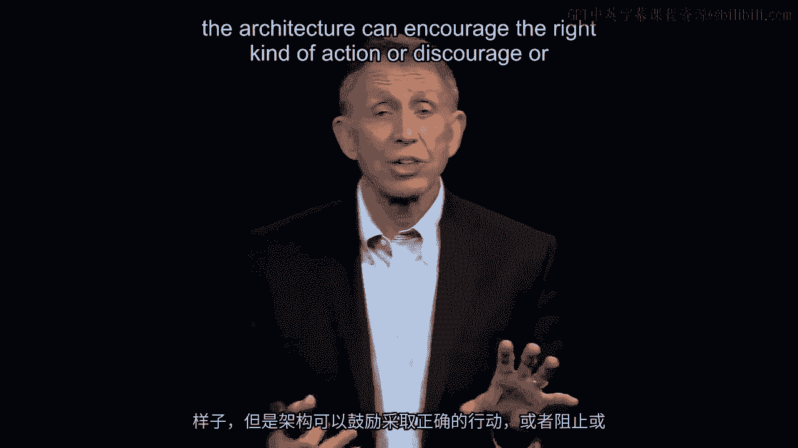

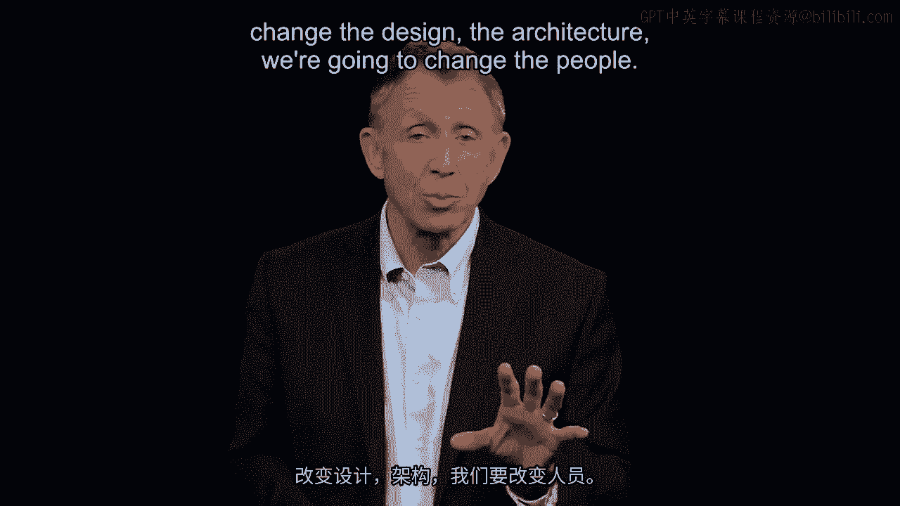

组织设计作为本课程的第四部分，关乎我们如何建立更好的安排，使人们努力工作、提出想法、不偷懒、不隐瞒，为公司做出最大贡献。

最后，再看一下这张图表。观察佛罗里达销售人员的教育背景，一个引人注目的点是：布伦达·库珀并非从最佳销售团队晋升上来，她实际上是横向招聘进来的，拥有商学院MBA学位，从未销售过婴儿食品。这本身没问题。

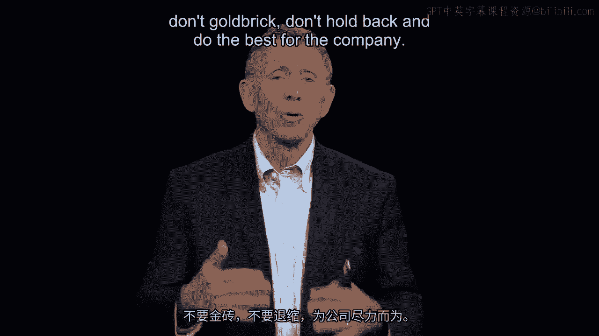

但更 striking 的是，看看“教育”列以及其左侧的“在公司年限”列。简·博耶尔在公司工作了30年，管理着公司（不仅是区域）最好的销售团队，却从未获得晋升。也许她不想升职，但表面上看，我们可能遇到了众所周知的“玻璃天花板”现象：人们可以向上看，但因为不是大学毕业生，就无法上升。这可能不是性别问题（尽管也可能是），也许公司存在其他人口统计方面的抑制因素。

因此，关于组织架构，我们应牢记的第一点是：我们建立**激励体系**的方式（本课程的第一个主题），以及我们**提拔人员**通过层级的方式，都能对他们的行为产生深远的独立影响。因此，组织设计的好坏，确实能影响他们为公司利益所采取的行动。

---

本节课中，我们一起学习了组织架构设计与变革的重要性。通过婴儿食品公司的案例，我们看到了不当的组织设计（如按州划分的销售团队、不合理的晋升与激励）如何导致员工隐瞒信息、抑制销售。核心在于理解：**组织架构独立于个人特质，能系统性地塑造员工行为**。有效的设计应能激励创新、促进信息共享，并将个人利益与组织目标对齐。变革组织架构，往往是改变人员行为、提升组织绩效的关键杠杆。