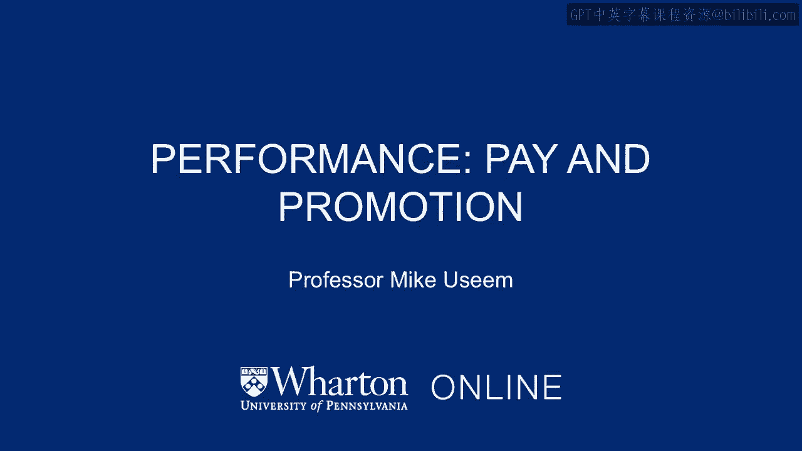
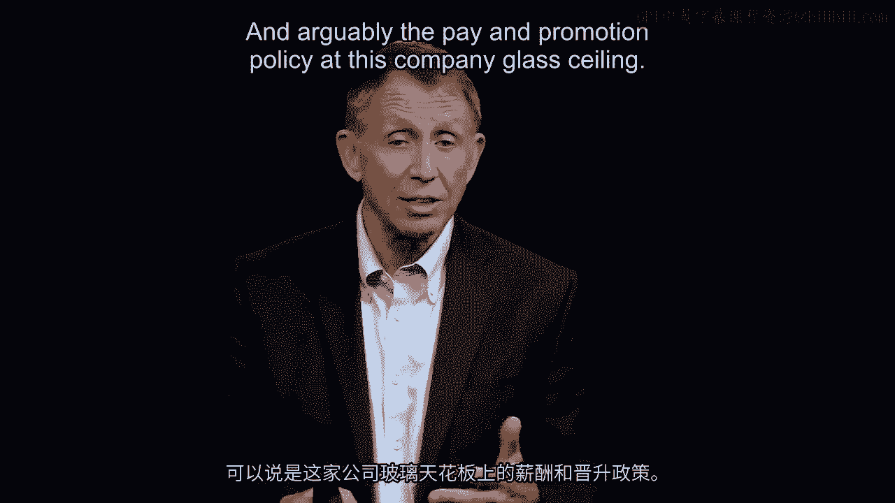
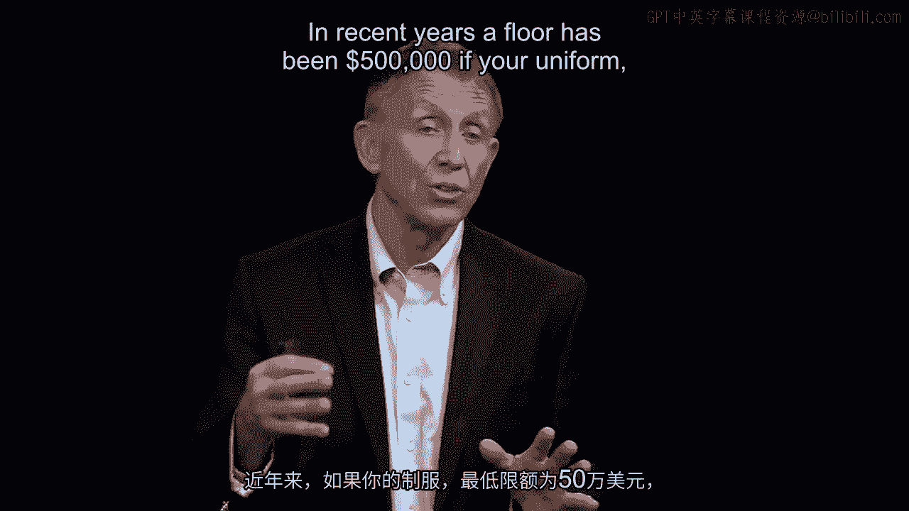
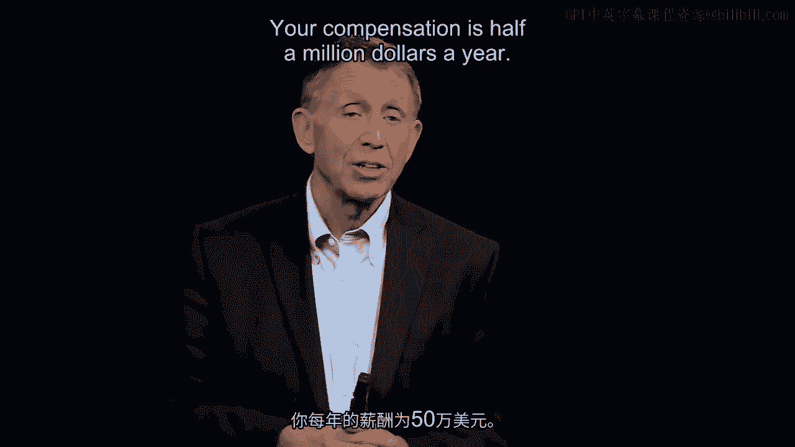
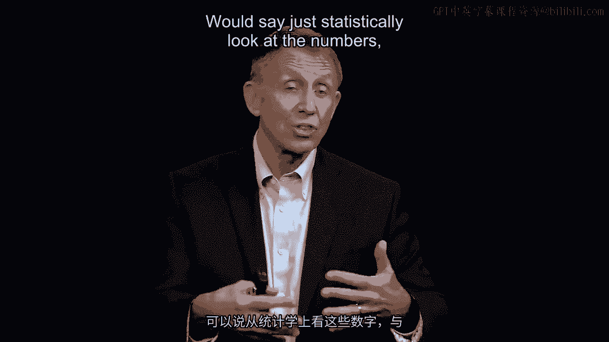
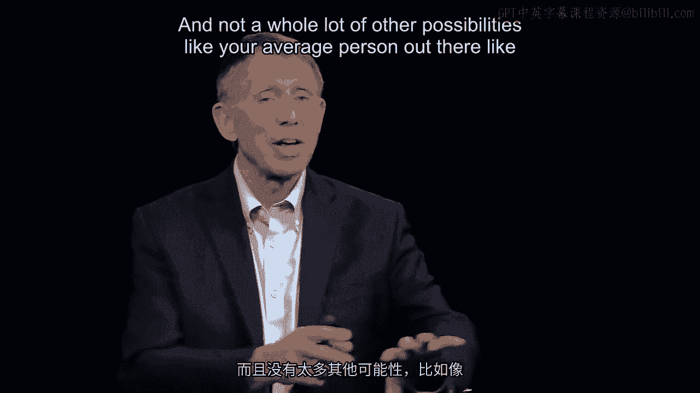
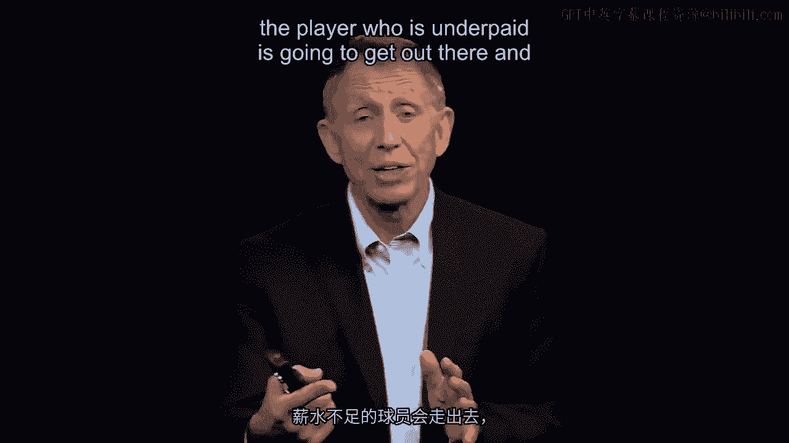
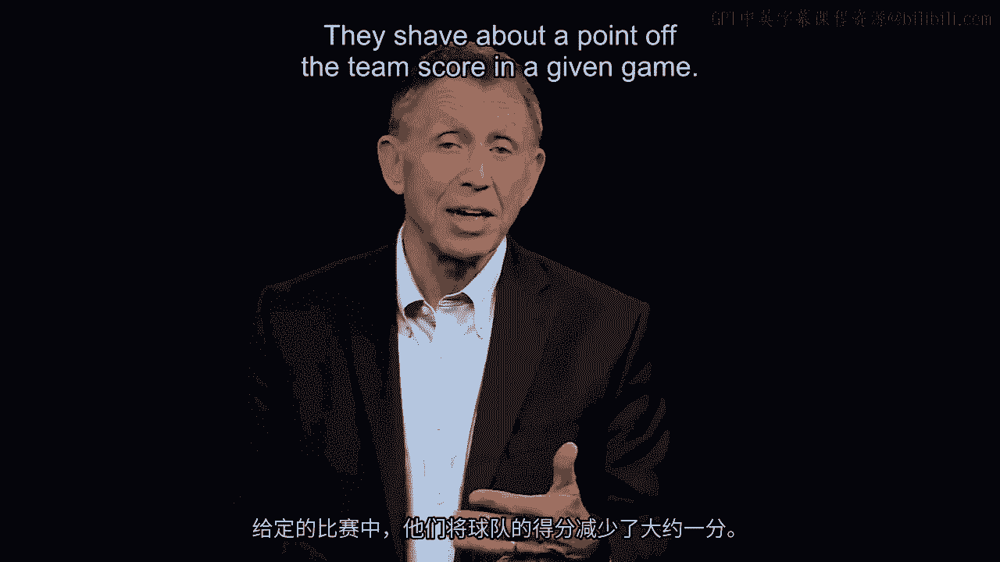
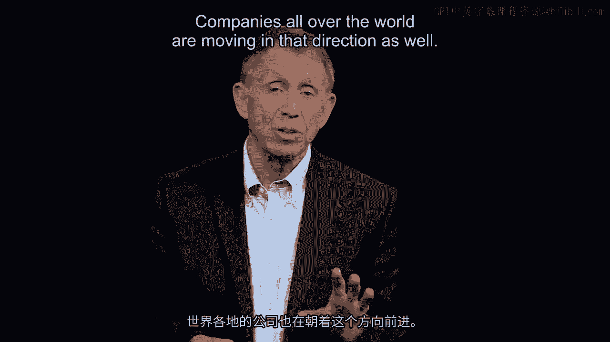
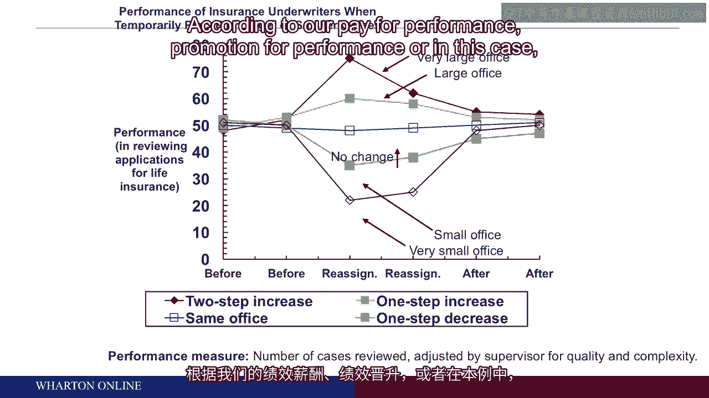

# 🏀 沃顿商学院《商务基础》课程笔记｜第20讲：绩效支付与晋升

在本节课中，我们将探讨组织设计中一个核心议题：如何通过薪酬与晋升制度来激励员工绩效。我们将看到，设计不当的激励措施不仅无法提升绩效，反而可能引发公平感问题，从而对团队整体表现产生负面影响。

---

## 绩效激励的设计初衷

在组织设计中，如果我们希望获得高绩效，就需要根据绩效来奖励员工。

我们不仅需要通过薪酬，还需要通过晋升来匹配我们所期望的绩效表现。可以说，之前案例中那家公司的薪酬与晋升政策——例如“玻璃天花板”和10%的配额限制——并非能促使佛罗里达销售团队或公司整体采取最优行动的设计要素。

然而，解决了旧问题，我们又会遇到新挑战，这也是管理者必须应对的。

---

## 公平感问题：以NBA为例

为了理解这个新问题，请大家思考一个场景。即使你从未看过NBA比赛，也可以想象一下在NBA球场（或你见过的大学、高中球队）上发生的情况。

让我们聚焦于NBA。如今我们关注绩效薪酬而非晋升，NBA球员的报酬普遍很高。近年来，球员的最低年薪是50万美元。即使你只是坐在替补席上、从未上场，只要在球队名单中，你一年的报酬就是50万美元。

虽然没人会认为NBA球员收入低，但有些球员仍觉得自己薪酬过低，可能是因为被一份长期合同锁定，或者经纪人不给力。当他们用评估绩效的指标（如得分、抢断、助攻）与队友或其他球员比较时，可能会得出结论：“从数据上看，我比那个经纪人更好的弗雷德·琼斯贡献大，但我薪水更低。”

这种“不公平感”源于我们倾向于与自己尊重的人进行比较，而不是与普通人（比如我自己）比较，来判断自己的薪酬是否合理。

---

## 不公平感如何影响行为

本节的核心议题是：组织架构如何驱动或误导行为。那么，如果一个自认为薪酬过低的NBA球员上场，他的行为会与那些薪酬与上赛季统计数据匹配的球员有何不同？

以下是两种可能的反应：

*   **努力证明自己**：球员可能想向球队管理层证明自己值得更高报酬。
*   **消极怠工**：球员可能认为“既然你少付我钱，我就少出力”。

无论哪种情况，都会带来问题。研究证据表明，在NBA中，那些自认为“薪酬过低”的球员，往往倾向于采取第一种行为：他们更频繁地持球和投篮，试图证明自己。然而，正因为这种超出合理范围的出手，统计上会导致球队在每场比赛中平均少得约1分。

---

## 组织设计的启示与延伸

当我们把绩效薪酬与晋升作为组织设计的特点时，我们希望激励所有人，无论其背景、性别、种族等与绩效无直接关系的因素。大量证据表明，这是一条正确的道路，全球公司也正朝此方向努力。

但这也打开了“潘多拉魔盒”，即**不公平感可能带来的消极动机**。这个问题是双向的。

另一个精彩的研究案例涉及一家公司的保险核保师。由于办公室装修，他们需要暂时搬离原本按绩效和资历分配的办公室。有些人暂时搬进了大办公室，有些人则搬进了小办公室。研究发现，那些突然得到“超额奖励”（大办公室）的核保师，后续绩效变得更好；而那些感到“奖励不足”（小办公室）的核保师，绩效则有所下降。值得注意的是，大多数人并未 consciously（有意识地）决定“因为办公室大我要好好干”或“因为办公室小我就偷懒”。

这让我们回归行为心理学和行为经济学（如丹尼尔·卡尼曼的著作）。它再次提醒我们，在设计组织架构时，必须意识到人们在面对绩效薪酬、绩效晋升，甚至办公室大小等安排时可能产生的行为反应，无论是其积极面还是缺陷。

---

## 📝 总结

本节课我们一起学习了绩效激励中的核心矛盾。我们了解到：

1.  **设计目标**：薪酬与晋升制度应旨在激励高绩效，并确保公平。
2.  **关键挑战**：**不公平感**是绩效激励设计中最主要的挑战之一。员工会通过社会比较来判断自身报酬是否合理。
3.  **行为影响**：不公平感会显著影响员工行为。研究显示，无论是NBA球员还是公司职员，当感到被“低估”或“过度奖赏”时，其绩效会发生非意识层面的变化，进而影响团队整体产出。
4.  **管理启示**：管理者在设计激励体系时，必须超越简单的“绩效换报酬”公式，要深刻理解并预见到公平感等心理因素对员工行为的复杂影响，从而构建更全面、有效的组织架构。

**核心公式/概念**：
*   **激励制度** = **绩效薪酬** + **绩效晋升**
*   **员工行为** ∝ **（实际报酬 / 感知的应得报酬）**
    *   当比值 < 1 时，可能产生消极行为或过度证明行为。
    *   当比值 > 1 时，可能产生积极强化行为。