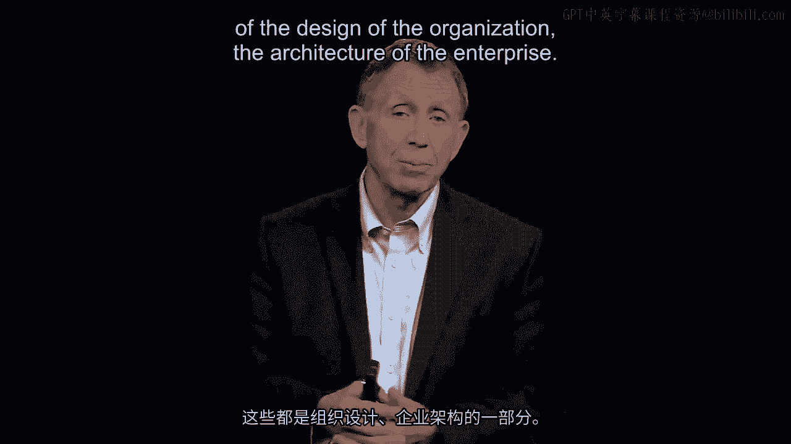

# 沃顿商学院《商务基础》课程 P98：组织设计 🏢

在本节课中，我们将学习组织设计的概念，并探讨一个核心挑战：当外部环境变化时，如何调整已建立的组织架构以适应新的需求。我们将分析组织惯性产生的原因，并了解阻碍组织变革的常见因素。

---

上一节我们探讨了组织设计如何通过整合岗位设置、激励机制和汇报关系来塑造企业架构。本节中，我们来看看一个经典的组织管理问题：组织惯性。

一个有效的组织设计，如同一个巨大的飞轮，一旦运转起来就拥有强大的惯性动量。这种惯性在稳定时期是优势，能让组织在管理者较少干预时仍能高效运行。然而，当市场环境、技术或客户需求发生变化时，这套为过去问题设计的架构就可能成为巨大的变革阻碍。

例如，一家原本只服务于美国市场的公司，当需要开拓印度或中国市场时，会发现现有的人员、架构和思维模式都难以适应新的任务。员工并非为此目标而招聘，组织流程也非为此而设计。这时，变革的阻力会迅速显现。

---

为了理解变革的阻碍，我们可以参考组织变革领域知名观察家与顾问约翰·卡特（John Carter）总结的八大障碍。以下是阻碍组织成功变革的常见因素：

1.  **未能提出令人信服的变革理由**：管理者没有清晰有力地说明为何必须改变。
2.  **缺乏变革的紧迫感**：员工未感受到不变革将带来的危机。
3.  **对未来愿景描绘不清**：员工不清楚变革后的组织会是什么样子。
4.  **沟通不足**：变革的信息需要反复、多次地传达，才能被真正理解和接受。初次宣布时，人们常持怀疑态度或直接忽略。
5.  **未能扫清障碍**：现有流程、制度或人员阻碍了新计划的实施。
6.  **没有规划短期胜利**：缺乏能让团队在短期内看到成效、提振信心的里程碑。
7.  **过早宣布胜利**：在变革尚未深入、成果尚未巩固时就放松努力。
8.  **未能将变革融入文化**：新的工作方式没有成为组织DNA的一部分，容易倒退。

---

本节课中我们一起学习了组织设计面临的动态挑战。我们认识到，一个成功的组织架构不仅需要解决当前问题，还需具备应对未来变化的灵活性。组织惯性是变革的主要敌人，而管理者的关键任务之一，就是识别并克服上述八大障碍，推动组织持续演进，以适应不断变化的世界。