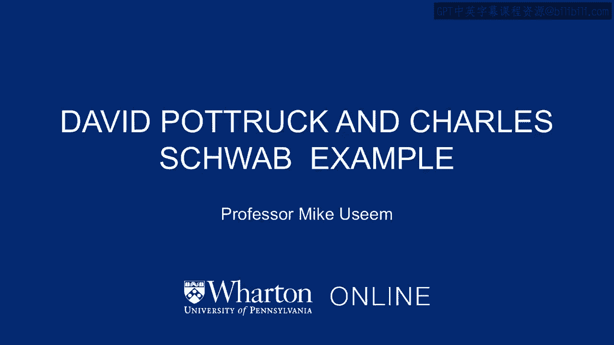

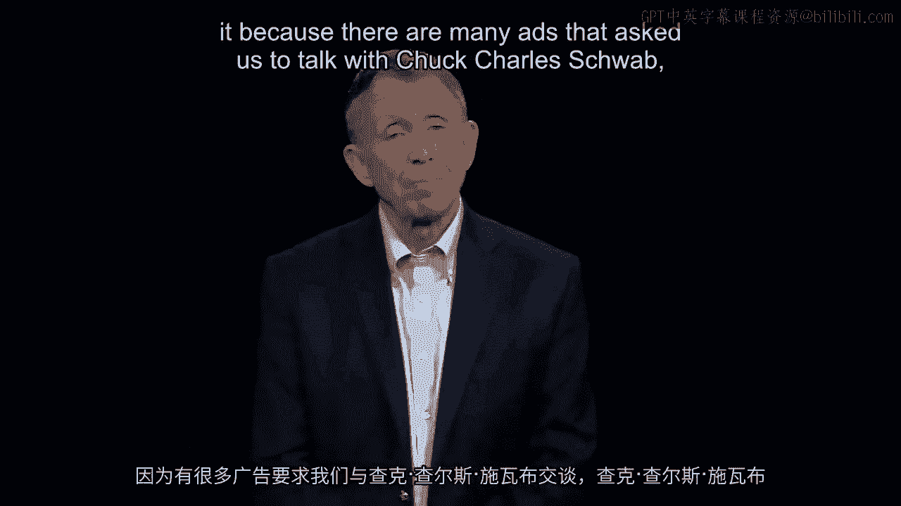

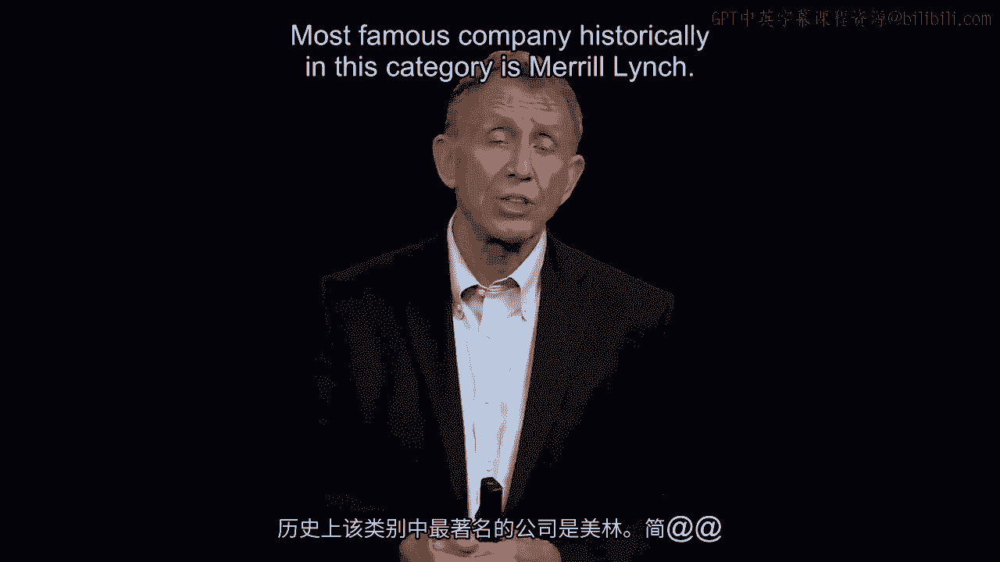

# 📘 沃顿商学院《商务基础》｜第99课：戴维·波特拉克与查尔斯·施瓦布案例

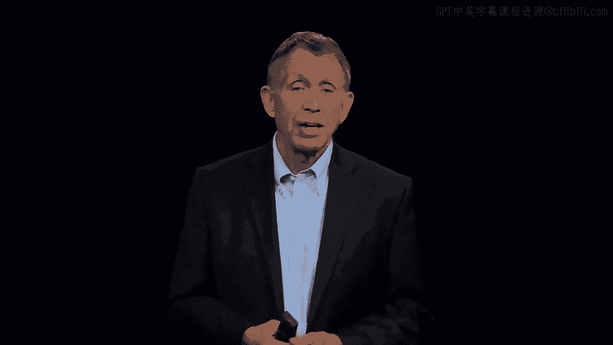

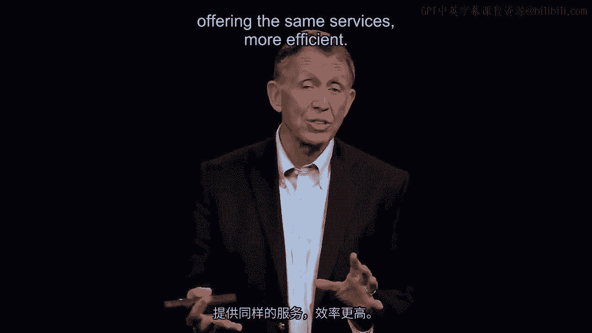

在本节课中，我们将通过嘉信理财公司的案例，探讨企业在面临内部竞争与市场变革时，如何做出艰难的战略决策。我们将重点关注其CEO戴维·波特拉克如何分析问题、预见风险并领导公司进行激进转型。

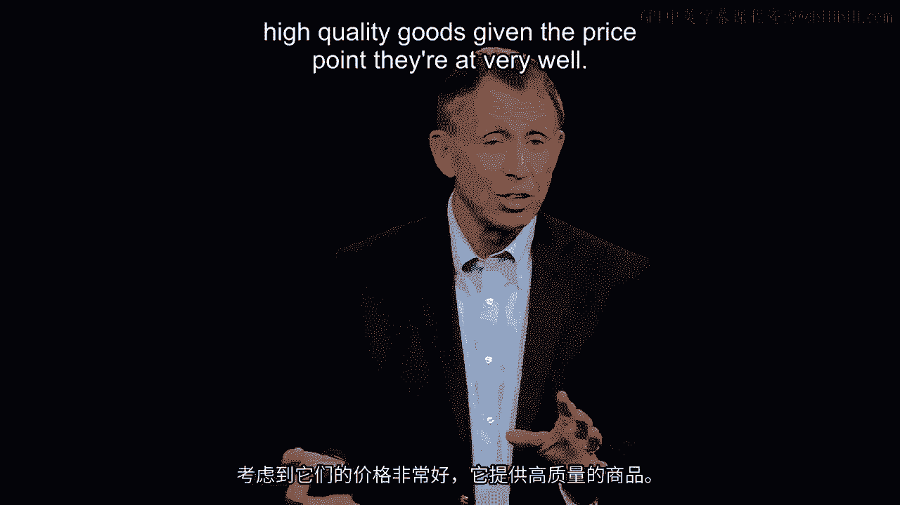

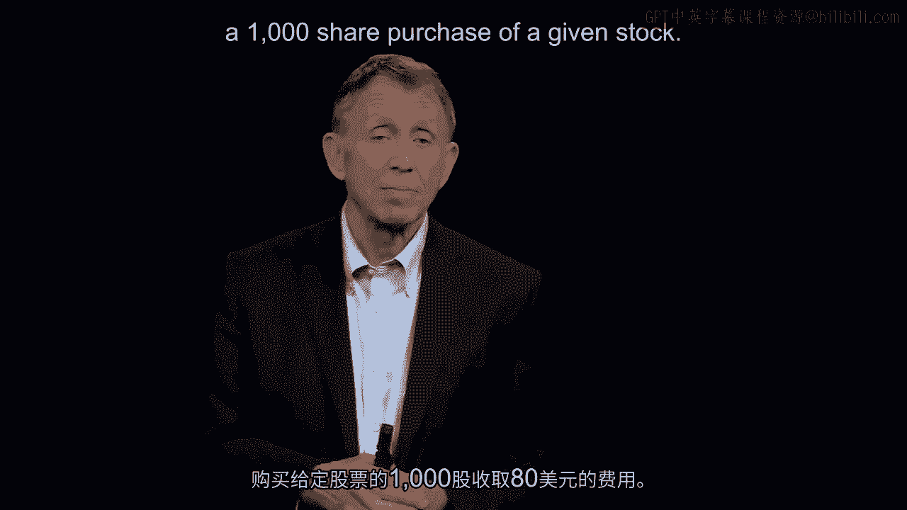

---

现在，让我们简要地来到旧金山。

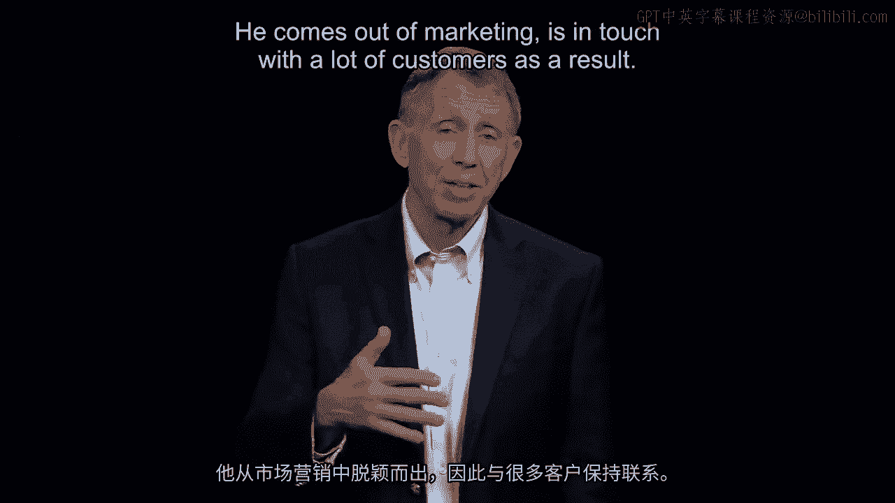

我们看到一家公司的首席执行官，我想我们都认识他，因为许多广告都邀请我们“与查克聊聊”。查尔斯·施瓦布，一家非常、非常大的所谓折扣零售经纪商。在这个类别中，历史上著名的公司是美林证券。

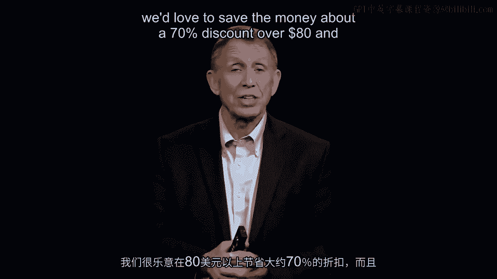

为了说得更直白，假设你想购买一千股……就以思科公司为例。你不能直接打电话给纽约证券交易所购买股票，你需要打电话给美林证券这样的经纪商来购买一千股。美林证券会说很好，当时的费用大约是**129美元**。查尔斯·施瓦布是一家折扣经纪商，提供相同的服务，但效率更高，有点像沃尔玛，在其价格点上提供高质量的商品，做得非常好，但它们不是高端零售店。它们做的事情不同。这就是这里的零售经纪业务。它们提供全面但更高效、因而更便宜的服务，使得施瓦布对给定股票的一千股购买只收取**80美元**。

当时，右边的这位先生，戴维·波特拉克，是首席执行官。查尔斯·施瓦布本人是执行主席，这意味着他每天上班，在决策中有很大的话语权，但涉及15000名员工的日常运营，大部分都经由我们看到的这位在旧金山办公室的经理——戴维·波特拉克处理。

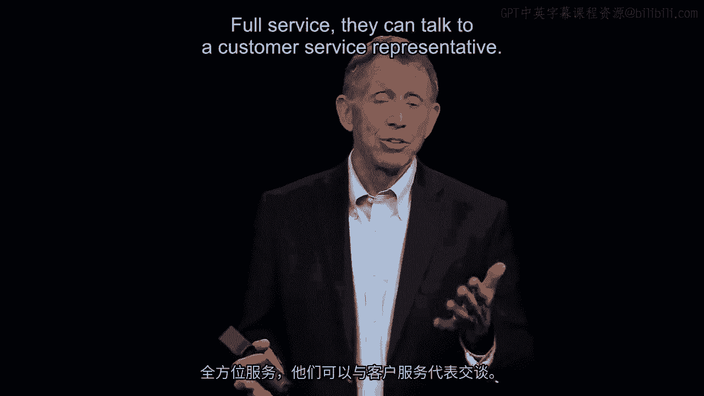

戴维开始反复思考一个事实，他曾主张施瓦布开发一项在当时非常简单的互联网服务，叫做“E-Schwab”。你上网，通过它订购一千股思科股票，因为是互联网交易，费用是**29美元**。当你可以只付29美元时，谁还想付80美元呢？当然，提供的服务也减少了，这就是其商业模式。如果你在“E-Schwab”购买股票，你每月只能与客户服务专家通话一次。但如果你是支付80美元的全服务客户，你今天可以给他们打八次电话，他们会接听并给你一些指导。所以，价格低了不少，服务也少了一些。这有其逻辑。

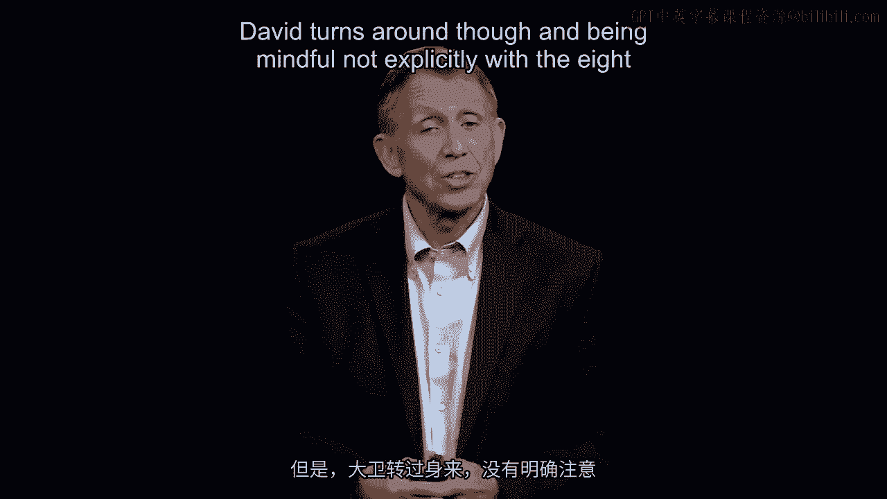

戴维·波特拉克作为一位出色的经理，对他过去履行的职能非常敏感。他出身于市场营销部门，与大量客户有过接触。因此，对任何人来说，无论身处何种组织，倾听客户声音总是一个好主意，而他正在倾听。客户们说：“戴维，我们有个问题。对于E-Schwab，我们喜欢省钱，相比80美元有大约70%的折扣，而且你在高端服务方面比一些竞争对手做得更好。”这是事实。“但既然你们的客户服务代表已经训练有素，他们是专家，还发布研究报告，‘为什么我们不能多和他们聊聊？或者至少为什么我们不能阅读他们的研究报告？’”戴维说：“听着，如果你想要全服务，你得付80美元。这是我们的商业模式。”然而，一些客户说：“但两个项目都叫施瓦布，你们不是一家公司吗？”

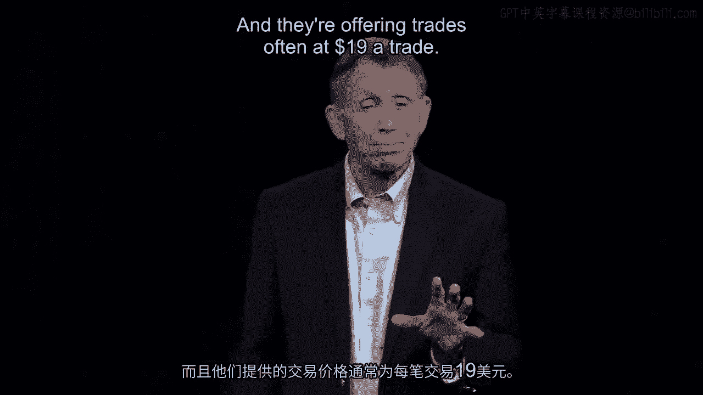

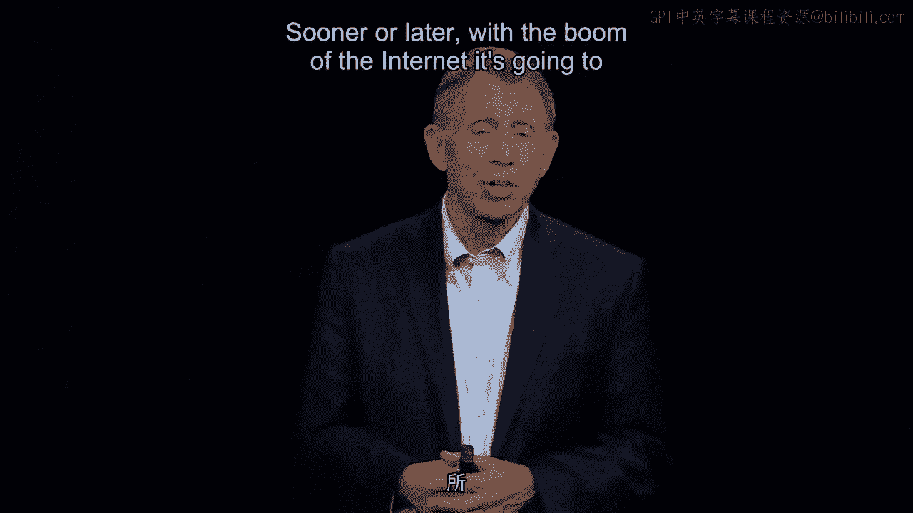

更令人担忧的是这一点，大多数人没有看到。戴维已经发现了，因为他是一个非常善于分析的人。他研究数据。他看到一些客户，他们很聪明，保留着一个全服务账户，里面只留几美元，然后把99.5万美元转移到E-Schwab账户，在那里进行活跃交易。他们两头都占了。全服务账户让他们可以与客户服务代表交谈，获取所有报告，然后他们利用这些信息以29美元的费用进行活跃交易。借用一句众所周知的话：我们遇到了“自噬”现象，但这次是内部的。并不是外部有人在吞噬我们，就像eBay在中国被阿里巴巴直接攻击那样。在这种情况下，我们内部出了问题，我们在吞噬自己。

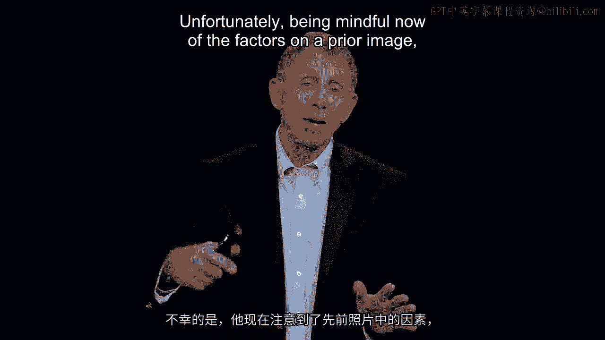

然而，戴维回过头来，虽然没有明确对照之前提到的八个组织重组障碍因素，但他知道或得出结论：这家公司必须进行激进变革，否则别人就会改变这家公司。具体来说，他现在担心一群年轻的挑战者，那些名字像E-Trade的公司，它们是纯粹的在线交易商。没有实体门店与之配套，它们通常提供每笔交易**19美元**的费用。没有多少研究报告，背后支持也不多，但对于那些考虑只在施瓦布账户留几美元的人来说，迟早可能完全转向E-Trade。随着互联网的繁荣，正如我们所熟知的那样，它将改变一切。戴维认为，这样下去我们将倒闭。

不幸的是，考虑到之前提到的因素，他也在想，哇，这里没人会想改变，因为我看了过去四年的数据，我们一直表现得非常好。这回到了我们早期关于良好和及时决策的观点：当我们做得好的时候，我们在决策思考上往往会变得不那么优化。戴维说，我们现在就有这个问题。我们的收入和客户资产年增长率分别达到24%和40%。每个人都认为我们有一个伟大的商业模式，别搞砸了。他们私下可能会这么说，但因为戴维是首席执行官，他们可能不会当面对他说。

话虽如此，让我们继续。现在我要请你非常简要地思考一下，在你决定了之后——假设你是屏幕中间的戴维·波特拉克先生，查克·施瓦布（查尔斯·施瓦布）是你的老板，他在右边，两人都在微笑——在你即将说出你的决定之前。查克微笑是因为你决定这家公司必须在一夜之间，从80美元的全服务，降到29美元的全服务。你必须将你正在销售的产品大幅降价。现在想象一下，一家航空公司将纽约到洛杉矶的机票价格打三折。这对客户来说将是一个巨大的吸引，但就收入而言，也将造成巨大的失血。记住这一点。

戴维·波特拉克实际上是在他办公室的私密空间里做出了决定。他与直接向他汇报的十几个人进行了交谈。作为首席执行官，他决定了并告诉他们，当然也征求他们关于如何执行该决定的指导。他说，好吧各位，明年1月15日，我们必须降低服务成本。我们必须将服务价格降低70%，显然也必须降低成本。想象一下，如果美国航空公司将纽约到洛杉矶的座位成本降低70%。那么航空旅客将会激增。当然，每个人都能看到那是一个巨大的吸引力。另一方面，你的收入减少了70%，却还要雇佣飞行员和给飞机加油，所以你必须从两方面考虑这个问题。

更糟糕的是，就这个世界的运作方式而言，如果你是一家上市公司（即使不是上市公司，也有公众需要担心），上市公司在纽约证券交易所或其他地方上市，我有一个特别的问题：投资者投资你是基于你过去的表现，而不一定是你想去的地方。因此，戴维得出结论，当他们转向对所有服务交易实行70%折扣（即每笔交易29美元）时，从明年1月15日开始，那些评估公司的股票分析师、一些投资公司的大型养老基金等投资者，将不会对戴维此举能弥补这70%的收入损失抱有任何信心。因此，戴维·波特拉克预测，税前利润的下降将至少达到**20%**。

所以，假设是苹果公司，如果苹果的税后盈利能力突然下降20%，市场将对此产生很多负面反应。戴维预测，事实证明在这里是正确的，下降幅度大约在20%到25%。在他宣布1月15日全面降价的当天，将会有大量卖单涌出，投资者将蜂拥抛售该股票。

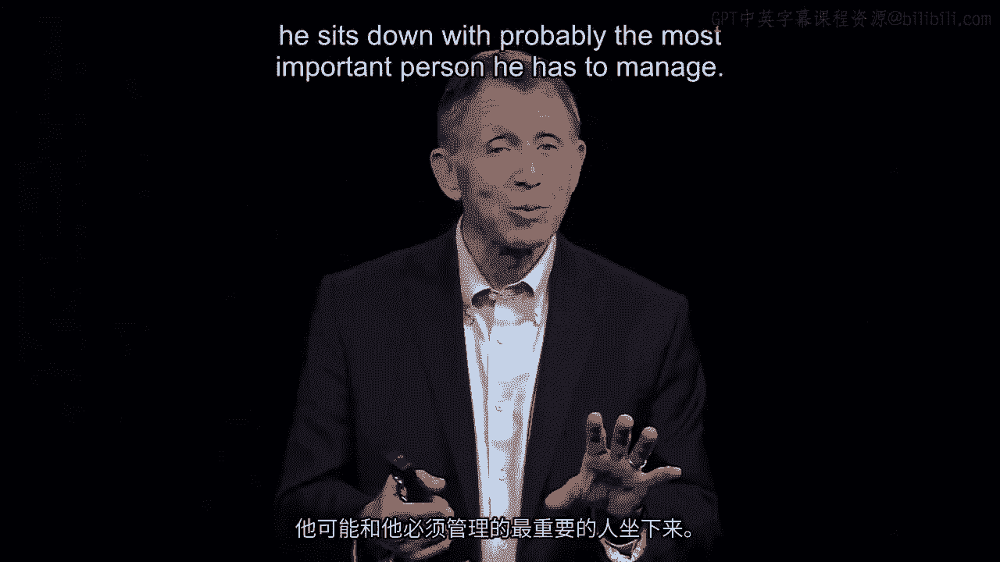

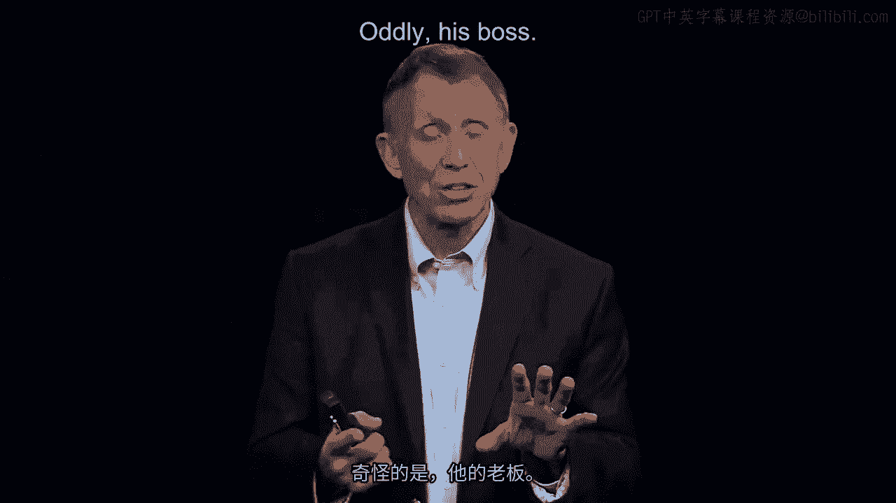

所以他坐下来，现在让我们思考管理的艺术——这是我们的话题，管理人——他坐下来，可能需要与他必须管理的最重要的人进行沟通。奇怪的是，这个人就是他的老板。