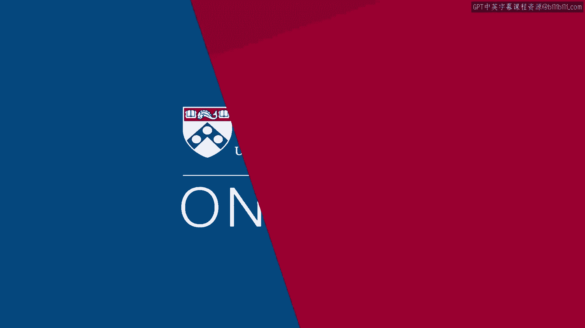

# 沃顿商学院《实现个人和职业成功》课程 - P1：课程简介 🎯

在本节课中，我们将一起了解沃顿商学院《实现个人和职业成功》这门课程的核心内容与目标。课程由资深教授理查德·谢尔主讲，旨在引导每位学员探索“成功”对自身的独特含义，并提供实用的工具与框架。

大家好，欢迎来到成功学课程。

我的名字是理查德·谢尔。我是沃顿商学院的一名资深教授。

我在这里任教已有数十年。我教授过许多课程。

我最广为人知的可能是关于谈判与说服力的课程。

我也教授一门关于责任的课程。但我们将要共同学习的这门课程，是一门我已教授了十年的课程，名为“成功的文献”。

这门课程的核心，是探讨“成功”对于每一位选修它的学生而言意味着什么。

我们创建这个在线体验，是为了让你有机会在沃顿的环境中与我们一同学习。

我将把这次授课当作是你们来到了我的办公室答疑时间。

我们将探讨成功的各个不同层面，以及我们如何探索它。

你们将获得一些评估工具。你们将获得一些自我分析工具，这些工具将帮助你们更深入地理解“成功”这个宏大的词汇对你们个人的意义。

在我们共同学习这门课程的过程中，我认为你们会发现，我将要求你们挑战自我，思考你们真正秉持的价值观，思考那些影响你们成为今日之我的家庭与环境因素。

并希望你们能开始收集一些想法，关于“成功”这个词对你们而言真实、发自内心的含义是什么，然后，作为个体，你们如何才能以最适合自己的最佳方式去实现它。

我们将通过一系列不同主题的课程来完成这个目标。

你们将进行一些关于价值观的练习。你们将进行一些关于自身能力和独特天赋的探索。

我们将深入审视人们如何取得成就，以及“成就”的实际含义。

我们将深入探讨一个我们身处的文化非常重视但了解并不深入的词汇，那就是“幸福”。

然后，我将尽我所能，帮助你们将我们所讨论的内容置于一个可操作的背景中，让你们能够运用、采取行动，并在课程结束时开始制定具体的目标。

这样，你们就能开始对自己是谁、擅长什么，以及在当前人生阶段希望采取的方向，形成一些清晰的认识。

我期待与你们一同学习。正如我所说，我们现在正坐在我的办公室里，这里将是我们完成整个课程的地方。

祝你们好运。系好安全带。我相信你们会发现这门课程充满乐趣，也颇具挑战性。

我对此充满期待。谢谢。

---

**本节课总结**

在本节课中，我们一起了解了《实现个人和职业成功》这门课程的概貌。理查德·谢尔教授介绍了这门为期十年的“成功的文献”课程，其核心目标是引导每位学员进行自我探索，定义属于自己的成功。课程将通过价值观分析、能力评估、成就与幸福探讨等模块，辅以实用工具，帮助学员在课程结束时形成清晰的自我认知与行动目标。我们即将开启一段兼具趣味与挑战的自我发现之旅。