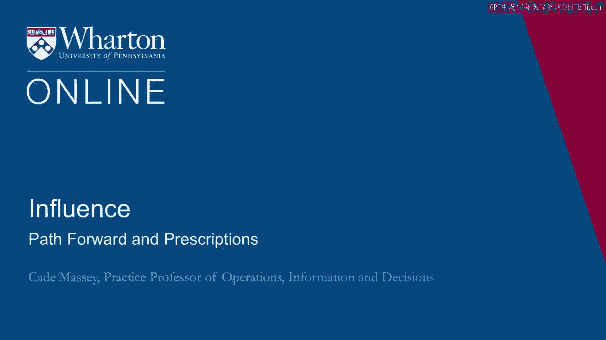
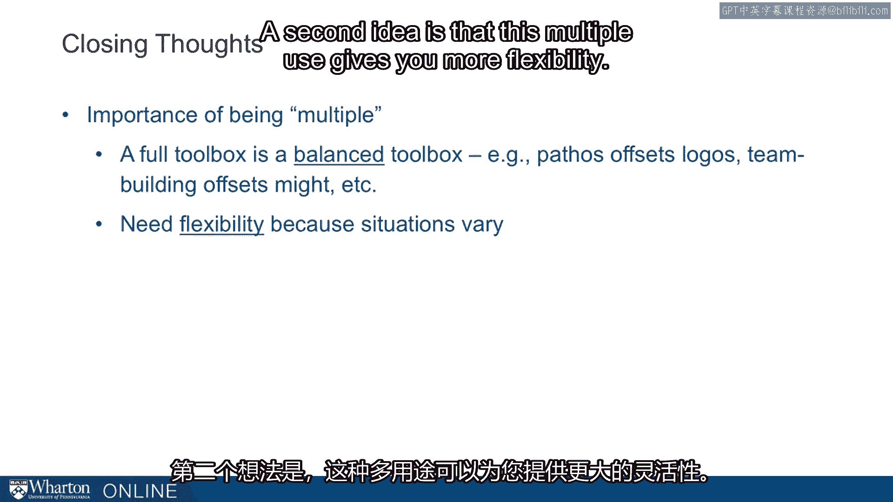

# 课程 P103：前进之路与行动处方 🧭

在本节课中，我们将基于影响力测评结果，探讨如何将理论转化为个人发展的具体行动。我们将学习如何通过反思与计划，将影响力工具箱中的策略应用到实际生活和职业场景中，从而实现持续成长与提升。

---

此刻，你应该对自己的测评结果、其含义以及它们如何融入更广泛样本数据中，有了更深入的理解。

我们强烈建议你对这些结果对你个人的意义以及你希望如何运用它们，进行一些反思。

以下是几项用于复盘的问题。

**第一个问题是：你可以着力发展的优势是什么？**

每个人都有自己的惯用工具。至少，你会有一个比其他工具运用得更得心应手的策略。这个优势是什么？它是你在影响力工具箱中可以立足并进一步发展的基石吗？

**接下来，我们也要审视问题的另一面，而这正是需要投入最多努力的地方。**

**你希望更多运用哪一种策略？**

可能有很多策略你都希望加强，但数十年的心理学研究表明，如果试图同时改变所有事情，最终将一事无成。因此，让我们聚焦于**你希望更多运用的一种策略**。这种专注将切实有助于你做出改变。

关于这一点，有几个后续问题需要思考。

如果你想更多地运用这个策略，**为什么你之前没有这样做？**

在真正做出改变之前，获得这个问题的答案至关重要。是什么阻碍了你？你需要解决的根本原因是什么？对此进行反思非常重要。

**最后，你可以采取什么具体步骤来更多地运用这个策略？计划是什么？**

仅仅说“我想更有意识”或“我想更有效地运用权威”是不够的。那么，明天具体要怎么做？**你可以采取的一个具体步骤**是什么？再次强调，这是在改变之路上可以迈出的一个具体步伐。

这套复盘问题对于让测评结果在你的生活中变得真实可感，并以此为基础持续发展至关重要。

---

为了总结，这里有几个结束性的思考。

**首先，是“多元化”的重要性。**

这基本上是这半个模块的核心主题之一，也是我们开展这项研究、开发这个工具的初始动机之一：强调运用你所能支配的全部工具。一个完整的工具箱是一个平衡的工具箱。

例如，**情感诉求（Pathos）** 可以平衡**逻辑说服（Logos）**，**团队建设**可以平衡**权威运用（Might）**，等等。如果你的工具箱中已经备有制衡的策略，你就不太可能过度依赖某一种方法。

**第二个观点是，这种多元化运用能带给你更大的灵活性。**

情境千变万化，因此你需要广泛的工具。事实上，你的职责越多，职业生涯走得越远，遇到的情境差异就越大。

指挥家小泽征尔在《绝对音乐》一书中有句精彩的引述，虽然谈论的是音乐家，但对我们理解权力的运作方式是一个很好的类比：

> “一位杰出的音乐家会有很多‘口袋’可以从中取用。他会观察指挥，心想：‘哦，原来他希望我们这样处理这部分’，然后从这边的口袋里掏出些东西。而一位年轻的音乐家可能没有那么多‘口袋’可以取用。”

我们希望你们拥有许多可以取用的“口袋”。责任越大，抱负越高，挑战越艰巨，你就越需要从多个“口袋”中汲取资源。

**第二个结束性思考是：影响力是逐渐积累的。**

它关乎习惯和层层叠加。这不是一个重大的决定，本质上是你每天所做的事情。

杰弗瑞·菲佛有几句话与此相关：
> “建立权力基础是一个随时间推移逐步积累影响力和资源控制的过程。”
> “要想在建立权力和运用影响力方面变得更有效，只有一种方法，那就是**练习**。”

最后，就像复利原则一样，在每种情境下都变得稍微更有效一些，随着时间的推移，会让你处于一个截然不同且好得多的位置。

---

我以这样一个想法和提醒作为结束：这些行为是可塑的。

这项测评触及的是行为，是你当前正在采取的行动，共有**67**种。我敢断言，如果你想改变其中任何一种，你都可以做到。我不相信有人无法改变这67种行为中的任何一种。这种可塑性至关重要。

正因为它们是可塑的，我们从经验中学习才显得尤为重要。菲佛再次为我们提供了一句精彩的结束语：

> “许多认为自己拥有20年经验的人，其实并没有。他们只是将一年的经验重复了20次。”

我们不要成为那样的人。现在，我们已经为你打下了一个良好的基础。接下来，由你决定要将其带向何方。

---

**本节课总结**

在本节课中，我们一起学习了如何将影响力测评结果转化为个人发展的具体行动计划。我们强调了通过反思优势与待改进策略来聚焦目标，并制定了可执行的具体步骤。课程重申了运用多元化影响力工具的重要性，以及通过日常练习和积累来逐步提升影响力的理念。记住，影响力的提升是一个持续、可塑的过程，关键在于有意识的实践与从经验中学习。