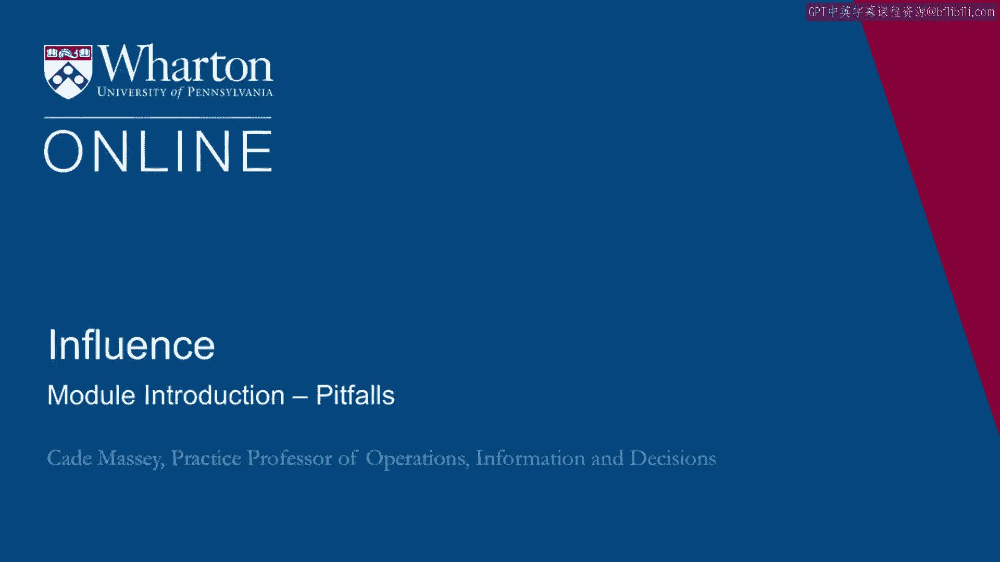

# 沃顿商学院课程《实现个人和职业成功》第40讲：陷阱模块简介 🧭

在本节课中，我们将进入影响力课程的第四周，也是最后一周的学习。本周内容将有所不同，我们将从两个关键角度对您发起挑战：**伦理道德**与**地位权力**。课程旨在为您提供思考框架，并警示伴随影响力增长可能出现的风险。

---

欢迎回到影响力课程的第四周，也是最后一周。

本周的内容有些特别。我们必须在几个方面对您提出挑战。

您可能已经注意到，伦理道德问题自第一周起就不断出现。我们触及了它，提出了问题，并进行了初步探讨，但尚未深入。在本周的前半部分，我们将重点讨论**伦理道德**。

我们希望为您提供一些思考框架，分享一些数据，并更系统性地推动您思考自己的伦理准则。

---

上一节我们预告了本周的独特结构，本节中我们来看看本周后半部分的主题。

在第二部分，我们将讨论**地位**。您可以将此视为对整个课程的**警告标签**。我们已经花费了四周（实为三周）的时间，帮助您构建影响力工具箱，旨在培养您的权力和影响力。

现在我们需要指出：“请稍等，变得有影响力存在一些危险。当人们拥有权力时，他们的行为方式会发生某些改变。”

因此，让我们尝试理解这一点，以此作为一种“预防接种”，或至少降低构建权力所带来的风险。

---

最后，我们将有一个简短的结束模块来总结全部内容。

希望您能享受本周的学习。

（静音），[空白音频]。

---

本节课中，我们一起学习了第四周课程的安排。我们了解到本周将深入探讨**伦理道德框架**，并审视伴随**地位与权力**提升可能产生的陷阱。这些内容旨在完善您对影响力的理解，确保您能负责任且清醒地运用所学技能。